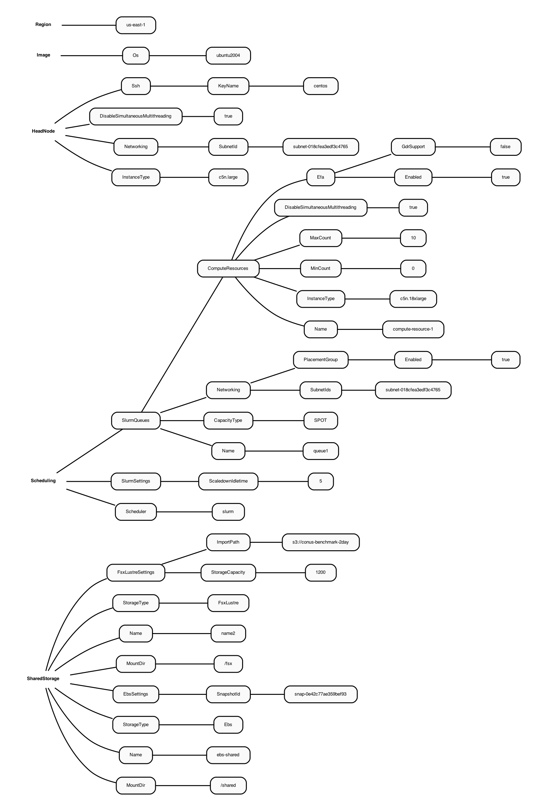

# Use Lustre File System and Import S3 Bucket that contains input data 

1. Saves storage cost
2. Removes need to copy data from S3 bucket to Lustre file system
     a. FSx for Lustre integrates natively with Amazon S3, making it easy for you to process HPC data sets stored in Amazon S3
3. simplifies running HPC workloads on AWS
4. Amazon FSx for Lustre uses parallel data transfer techniques to transfer data to and from S3 at up to hundreds of GBs/s.


<a href="https://www.amazonaws.cn/en/fsx/lustre/faqs/">Lustre FAQs</a>

<a href="https://docs.amazonaws.cn/en_us/fsx/latest/LustreGuide/performance.html">Lustre Performance Documentation</a>

To find the default settings for Lustre see:
<a href="https://docs.aws.amazon.com/parallelcluster/latest/ug/SharedStorage-v3.html#SharedStorage-v3-FsxLustreSettings>Lustre Settings for Parallel Cluster</a>

### Diagram of the YAML file that contains a Snapshot ID to pre-install the software, and the path to an S3 Bucket for importing the data to the Lustre Filesystem

Figure 1. Diagram of YAML file used to configure a Parallel Cluster with a c5n.large head node and c5n.18xlarge compute nodes with Software and Data Pre-installed



### Create cluster using ebs /shared directory with CMAQv5.3.3 and libraries installed, and the input data imported from an S3 bucket to the /fsx lustre file system

```
pcluster create-cluster --cluster-configuration c5n-18xlarge.ebs_shared.yaml --cluster-name cmaq --region us-east-1
```

output:

```
{
  "cluster": {
    "clusterName": "cmaq",
    "cloudformationStackStatus": "CREATE_IN_PROGRESS",
    "cloudformationStackArn": "arn:aws:cloudformation:us-east-1:440858712842:stack/cmaq/6cfb1a50-6e99-11ec-8af1-0ea2256597e5",
    "region": "us-east-1",
    "version": "3.0.2",
    "clusterStatus": "CREATE_IN_PROGRESS"
  }
}

 ```

Check status again

```
pcluster describe-cluster --region=us-east-1 --cluster-name cmaq
```
output:

```
{
  "creationTime": "2022-01-06T02:36:18.119Z",
  "version": "3.0.2",
  "clusterConfiguration": {
    "url": "https://parallelcluster-92e22c6ec33aa106-v1-do-not-delete.s3.amazonaws.com/parallelcluster/3.0.2/clusters/cmaq-h466ns1cchvrf3wd/configs/cluster-config.yaml?versionId=3F5xBNZqTGz5UDMBvk8Dj27JDaBlfQwQ&"
  },
  "tags": [
    {
      "value": "3.0.2",
      "key": "parallelcluster:version"
    }
  ],
  "cloudFormationStackStatus": "CREATE_IN_PROGRESS",
  "clusterName": "cmaq",
  "computeFleetStatus": "UNKNOWN",
  "cloudformationStackArn": "arn:aws:cloudformation:us-east-1:440858712842:stack/cmaq/6cfb1a50-6e99-11ec-8af1-0ea2256597e5",
  "lastUpdatedTime": "2022-01-06T02:36:18.119Z",
  "region": "us-east-1",
  "clusterStatus": "CREATE_IN_PROGRESS"
}
```

Start the compute nodes
```
pcluster update-compute-fleet --region us-east-1 --cluster-name cmaq --status START_REQUESTED
```

log into the new cluster
(note replace centos.pem with your Key)

```
pcluster ssh -v -Y -i ~/centos.pem --cluster-name cmaq
```

### Verified that starting the Parallel Cluster with the /shared volume from the EBS drive snapshot

```
ls /shared/build
```
### The .cshrc file wasn't saved, so I copied it

```
cp /shared/pcluster-cmaq/dot.cshrc ~/.cshrc
```

### Source shell

```
csh
```

### Load the modules


### change shell and submit job

```
module avail
------------------------------------------------------------ /usr/share/modules/modulefiles -------------------------------------------------------------
dot  libfabric-aws/1.13.2amzn1.0  module-git  module-info  modules  null  openmpi/4.1.1  use.own
```

```
module load openmpi/4.1.1
module load libfabric-aws/1.13.2amzn1.0
```

Change directories
```
cd /shared/build/openmpi_gcc/CMAQ_v533/CCTM/scripts/
```
### Verify that the input data was imported from the S3 bucket

```
cd /fsx/12US2
```

Notice that the data doesn't take up much space, it must be linked, rather than copied.

```
du -h
```

output

```
27K     ./land
33K     ./MCIP
28K     ./emissions/ptegu
55K     ./emissions/ptagfire
27K     ./emissions/ptnonipm
55K     ./emissions/ptfire_othna
27K     ./emissions/pt_oilgas
26K     ./emissions/inln_point/stack_groups
51K     ./emissions/inln_point
28K     ./emissions/cmv_c1c2_12
28K     ./emissions/cmv_c3_12
28K     ./emissions/othpt
55K     ./emissions/ptfire
407K    ./emissions
27K     ./icbc
518K    .
```

The run scripts are expecting the data to be located under
/fsx/data/CONUS/12US2

Need to make this directory and then link it to the path created when the data was imported by the parallel cluster

```
mkdir -p /fsx/data/CONUS
cd /fsx/data/CONUS
ln -s /fsx/12US2 .
```
Also may need to create the output directory

```
mkdir -p /fsx/data/output
```

### Submit the job to the slurm queue

```
cd /shared/build/openmpi_gcc/CMAQ_v533/CCTM/scripts/
sbatch run_cctm_2016_12US2.256pe.csh
```

### Results from the Parallel Cluster Started with the EBS Volume software from input data copied to /fsx from S3 Bucket

```
==================================
  ***** CMAQ TIMING REPORT *****
==================================
Start Day: 2015-12-22
End Day:   2015-12-23
Number of Simulation Days: 2
Domain Name:               12US2
Number of Grid Cells:      3409560  (ROW x COL x LAY)
Number of Layers:          35
Number of Processes:       256
   All times are in seconds.

Num  Day        Wall Time
01   2015-12-22   1305.99
02   2015-12-23   1165.30
     Total Time = 2471.29
      Avg. Time = 1235.64
```


Information in the log file:

```
Start Model Run At  Thu Jan 6 03:07:08 UTC 2022
information about processor including whether using hyperthreading
Architecture:                    x86_64
CPU op-mode(s):                  32-bit, 64-bit
Byte Order:                      Little Endian
Address sizes:                   46 bits physical, 48 bits virtual
CPU(s):                          36
On-line CPU(s) list:             0-35
Thread(s) per core:              1
Core(s) per socket:              18
Socket(s):                       2
NUMA node(s):                    2
Vendor ID:                       GenuineIntel
CPU family:                      6
Model:                           85
Model name:                      Intel(R) Xeon(R) Platinum 8124M CPU @ 3.00GHz
Stepping:                        4
CPU MHz:                         2999.996
BogoMIPS:                        5999.99
Hypervisor vendor:               KVM
Virtualization type:             full
L1d cache:                       1.1 MiB
L1i cache:                       1.1 MiB
L2 cache:                        36 MiB
L3 cache:                        49.5 MiB
NUMA node0 CPU(s):               0-17
NUMA node1 CPU(s):               18-35
Vulnerability Itlb multihit:     KVM: Mitigation: VMX unsupported
Vulnerability L1tf:              Mitigation; PTE Inversion
Vulnerability Mds:               Vulnerable: Clear CPU buffers attempted, no microcode; SMT Host state unknown
Vulnerability Meltdown:          Mitigation; PTI
Vulnerability Spec store bypass: Vulnerable
Vulnerability Spectre v1:        Mitigation; usercopy/swapgs barriers and __user pointer sanitization
Vulnerability Spectre v2:        Mitigation; Full generic retpoline, STIBP disabled, RSB filling
Vulnerability Srbds:             Not affected
Vulnerability Tsx async abort:   Vulnerable: Clear CPU buffers attempted, no microcode; SMT Host state unknown
Flags:                           fpu vme de pse tsc msr pae mce cx8 apic sep mtrr pge mca cmov pat pse36 clflush mmx fxsr sse sse2 ss ht syscall nx pdpe1gb rdtscp lm constant_tsc arch_perfmon rep_good nopl xtopology nonstop_tsc cpuid aperfmperf tsc_known_freq pni pclmulqdq monitor ssse3 fma cx16 pcid sse4_1 sse4_2 x2apic movbe popcnt tsc_deadline_timer aes xsave avx f16c rdrand hypervisor lahf_lm abm 3dnowprefetch invpcid_single pti fsgsbase tsc_adjust bmi1 hle avx2 smep bmi2 erms invpcid rtm mpx avx512f avx512dq rdseed adx smap clflushopt clwb avx512cd avx512bw avx512vl xsaveopt xsavec xgetbv1 xsaves ida arat pku ospke
information about cluster
PARTITION AVAIL  TIMELIMIT  NODES  STATE NODELIST
queue1*      up   infinite      2  idle~ queue1-dy-computeresource1-[9-10]
queue1*      up   infinite      8  alloc queue1-dy-computeresource1-[1-8]
information about filesystem
Filesystem             Size  Used Avail Use% Mounted on
/dev/root               34G   17G   18G  48% /
devtmpfs                93G     0   93G   0% /dev
tmpfs                   93G     0   93G   0% /dev/shm
tmpfs                   19G  1.1M   19G   1% /run
tmpfs                  5.0M     0  5.0M   0% /run/lock
tmpfs                   93G     0   93G   0% /sys/fs/cgroup
/dev/loop0              25M   25M     0 100% /snap/amazon-ssm-agent/4046
/dev/loop2              56M   56M     0 100% /snap/core18/2246
/dev/loop5              68M   68M     0 100% /snap/lxd/21545
/dev/loop3              33M   33M     0 100% /snap/snapd/13640
/dev/loop4              62M   62M     0 100% /snap/core20/1169
/dev/loop6              44M   44M     0 100% /snap/snapd/14295
10.0.5.119:/home        34G   17G   18G  48% /home
10.0.5.119:/opt/intel   34G   17G   18G  48% /opt/intel
10.0.5.119:/shared      35G  1.5G   31G   5% /shared
/dev/loop7              56M   56M     0 100% /snap/core18/2253
/dev/loop8              62M   62M     0 100% /snap/core20/1270
10.0.12.184@tcp:/fsx   1.1T   44G  1.1T   4% /fsx
10.0.5.119:/opt/slurm   34G   17G   18G  48% /opt/slurm
/dev/loop1              68M   68M     0 100% /snap/lxd/21835
list the mounted volumes
Export list for localhost:
Compiler is set to gcc

Working Directory is /shared/build/openmpi_gcc/CMAQ_v533/CCTM/scripts
Build Directory is /shared/build/openmpi_gcc/CMAQ_v533/CCTM/scripts/BLD_CCTM_v533_gcc
Output Directory is /fsx/data/output/output_CCTM_v533_gcc_2016_CONUS_16x16pe
Log Directory is /fsx/data/output/output_CCTM_v533_gcc_2016_CONUS_16x16pe/LOGS
Executable Name is CCTM_v533.exe

---CMAQ EXECUTION ID: CMAQ_CCTMv533_ubuntu_20220106_030708_720705625 ---

Set up input and output files for Day 2015-12-22.

Existing Logs and Output Files for Day 2015-12-22 Will Be Deleted
/bin/rm: No match.

CMAQ Processing of Day 20151222 Began at Thu Jan  6 03:07:09 UTC 2022

        CTM_APPL  |  v533_gcc_2016_CONUS_16x16pe_20151222
================================================================================
|                                                                              |
|               The Community Multiscale Air Quality (CMAQ) Model              |
|                                   Version 5.3.3                              |
|                                                                              |
|                          Built and Maintained by the                         |
|                        Office of Research and Development                    |
|                   United States Environmental Protection Agency              |
|                                                                              |
|                            https://www.epa.gov/cmaq                          |
|                                                                              |
|       Source Code:   https://www.github.com/USEPA/cmaq/tree/main             |
|       Documentation: https://www.github.com/USEPA/cmaq/tree/main/DOCS        |
|                                                                              |
|         The CMAQ Model is tested and released with cooperation from          |
|         the Community Modeling and Analysis System (CMAS) Center via         |
|         contract support. CMAS is managed by the Institute for the           |
|         Environment, University of North Carolina at Chapel Hill.            |
|         CMAS URL: (https://www.cmascenter.org)                               |
|                                                                              |
================================================================================

     This program uses the EPA-AREAL/MCNC-EnvPgms/BAMS Models-3
     I/O Applications Programming Interface, [I/O API] which is
     built on top of the netCDF I/O library (Copyright 1993, 1996
     University Corporation for Atmospheric Research/Unidata
     Program) and the PVM parallel-programming library (from
     Oak Ridge National Laboratory).
     Copyright (C) 1992-2002 MCNC,
     (C) 1992-2018 Carlie J. Coats, Jr.,
     (C) 2003-2012 Baron Advanced Meteorological Systems, LLC, and
    (C) 2014-2021 UNC Institute for the Environment.
     Released under the GNU LGPL  License, version 2.1.  See URL

         https://www.gnu.org/licenses/old-licenses/lgpl-2.1.html

     for conditions of use.

     ioapi-3.2: $Id: init3.F90 200 2021-05-10 14:06:20Z coats $
     netCDF version 4.7.1 of Jan  5 2022 16:32:07 $

### Results from Parallel Cluster Started with the EBS Volume software with data imported from S3 Bucket

This seems a bit slower than when the data is copied from the S3 Bucket to /fsx

```
==================================
  ***** CMAQ TIMING REPORT *****
==================================
Start Day: 2015-12-22
End Day:   2015-12-23
Number of Simulation Days: 2
Domain Name:               12US2
Number of Grid Cells:      3409560  (ROW x COL x LAY)
Number of Layers:          35
Number of Processes:       256
   All times are in seconds.

Num  Day        Wall Time
01   2015-12-22   1564.90
02   2015-12-23   1381.80
     Total Time = 2946.70
      Avg. Time = 1473.35
```
Timing for a 288 pe run

```
tail -n 18 run_cctmv5.3.3_Bench_2016_12US2.16x18pe.2day.log
```

Output:

```

==================================
  ***** CMAQ TIMING REPORT *****
==================================
Start Day: 2015-12-22
End Day:   2015-12-23
Number of Simulation Days: 2
Domain Name:               12US2
Number of Grid Cells:      3409560  (ROW x COL x LAY)
Number of Layers:          35
Number of Processes:       288
   All times are in seconds.

Num  Day        Wall Time
01   2015-12-22   1197.19
02   2015-12-23   1090.45
     Total Time = 2287.64
      Avg. Time = 1143.82
```

Note this performance seems better than earlier runs..
I've added the #SBATCH --exclusive option.  Perhaps that made a difference.


```
tail -n 18 run_cctmv5.3.3_Bench_2016_12US2.10x18pe.2day.log
```
```
==================================
  ***** CMAQ TIMING REPORT *****
==================================
Start Day: 2015-12-22
End Day:   2015-12-23
Number of Simulation Days: 2
Domain Name:               12US2
Number of Grid Cells:      3409560  (ROW x COL x LAY)
Number of Layers:          35
Number of Processes:       180
   All times are in seconds.

Num  Day        Wall Time
01   2015-12-22   1585.67
02   2015-12-23   1394.52
     Total Time = 2980.19
      Avg. Time = 1490.09
```

