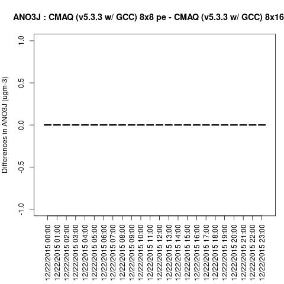
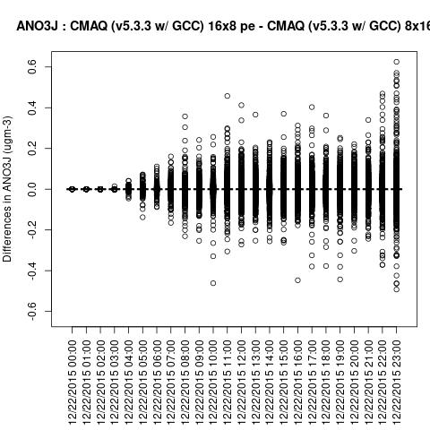
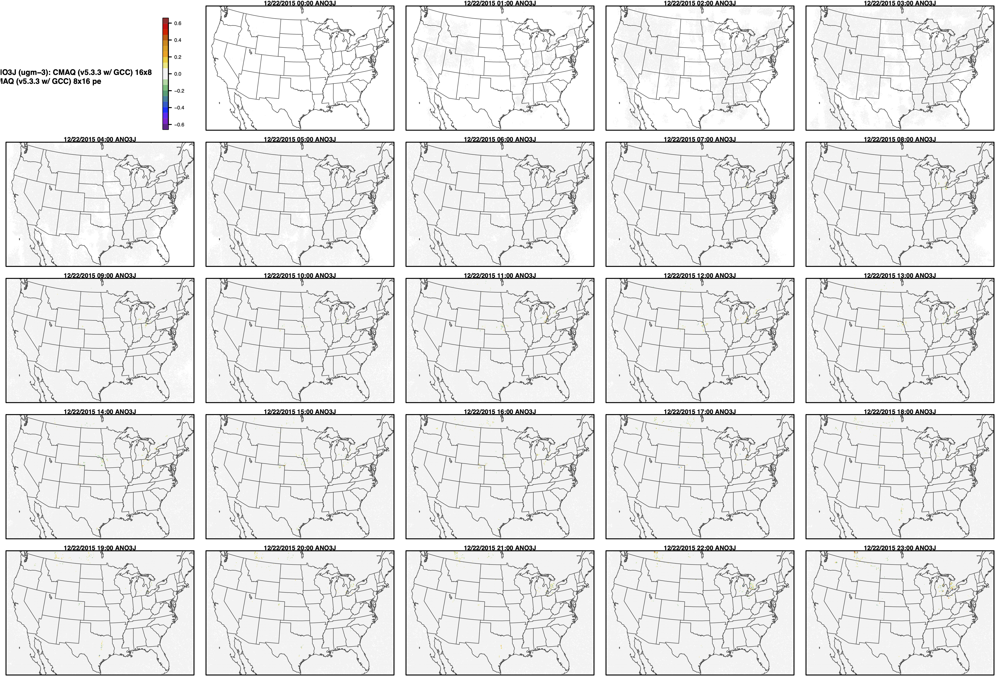

## Quality Assurance Checks for Successful CMAQ Run on Parallel Cluster


### run m3diff to compare the output data for two runs that have different values for NPCOL

```
cd /fsx/data/output
ls */*CONC*
```
```
setenv AFILE output_CCTM_v533_gcc_2016_CONUS_10x18pe_full/CCTM_ACONC_v533_gcc_2016_CONUS_10x18pe_full_20151222.nc
setenv BFILE output_CCTM_v533_gcc_2016_CONUS_16x18pe_full/CCTM_ACONC_v533_gcc_2016_CONUS_16x18pe_full_20151222.nc
```

```
m3diff
```
hit return several times to accept the default options

```
grep A:B REPORT
```

Should see all zeros. There are some non-zero values. TO DO: need to investigate to determine if this is sensitive to the compiler version.
It appears to have all zeros if the domain decomposition  is the same NPCOL, here, NPCOL differes (10 vs 16)

```
NPCOL  =  10; @ NPROW = 18
NPCOL  =  16; @ NPROW = 18
```

```
grep A:B REPORT
```

output

```
 A:B  4.54485E-07@(316, 27, 1) -3.09199E-07@(318, 25, 1)  1.42188E-11  2.71295E-09
 A:B  4.73112E-07@(274,169, 1) -2.36556E-07@(200,113, 1)  3.53046E-11  3.63506E-09
 A:B  7.37607E-07@(226,151, 1) -2.98955E-07@(274,170, 1)  3.68974E-11  5.29013E-09
 A:B  3.15718E-07@(227,150, 1) -2.07219E-07@(273,170, 1)  2.52149E-11  3.60005E-09
 A:B  2.65893E-07@(299,154, 1) -2.90573E-07@(201,117, 1)  1.78237E-12  4.15726E-09
 A:B  3.11527E-07@(300,156, 1) -7.43195E-07@(202,118, 1) -9.04127E-12  6.38413E-09
 A:B  4.59142E-07@(306,160, 1) -7.46921E-07@(203,119, 1) -2.57731E-11  8.06486E-09
 A:B  5.25266E-07@(316,189, 1) -5.90459E-07@(291,151, 1) -2.67232E-11  9.36312E-09
 A:B  5.31785E-07@(294,156, 1) -6.33299E-07@(339,201, 1)  3.01644E-11  1.12862E-08
 A:B  1.01421E-06@(297,168, 1) -5.08502E-07@(317,190, 1)  9.97206E-11  1.35965E-08
 A:B  1.28523E-06@(297,168, 1) -2.96347E-06@(295,160, 1)  1.57728E-10  1.88143E-08
 A:B  1.69873E-06@(298,169, 1) -6.47269E-07@(343,205, 1)  1.99673E-10  1.96824E-08
 A:B  2.10665E-06@(298,170, 1) -8.53091E-07@(290,133, 1)  2.75009E-10  2.38824E-08
 A:B  2.77534E-06@(298,166, 1) -1.38395E-06@(339,201, 1)  4.32676E-10  3.19499E-08
 A:B  4.05498E-06@(298,166, 1) -2.29478E-06@(292,134, 1)  5.94668E-10  4.56470E-08
 A:B  1.64844E-06@(380,195, 1) -1.24970E-05@(312,119, 1)  2.99392E-10  6.27748E-08
 A:B  2.40747E-06@(350,207, 1) -2.38372E-06@(313,120, 1) -1.23841E-11  4.06153E-08
 A:B  2.54810E-06@(353,207, 1) -1.68476E-06@(258,179, 1)  4.69896E-10  4.00601E-08
 A:B  2.92342E-06@(259,180, 1) -1.84122E-06@(258,180, 1)  3.00556E-10  3.75263E-08
 A:B  4.37256E-06@(259,180, 1) -1.51433E-06@(258,180, 1)  3.44610E-10  4.03537E-08
 A:B  5.51227E-06@(313,160, 1) -1.60793E-06@(312,160, 1)  6.49188E-10  4.60905E-08
 A:B  5.58607E-06@(259,182, 1) -6.47921E-06@(278,186, 1)  3.40245E-11  4.89799E-08
 A:B  3.61912E-06@(259,183, 1) -4.28502E-06@(278,187, 1)  2.10923E-10  4.86613E-08
 A:B  2.02795E-06@(278,185, 1) -3.63495E-06@(278,187, 1)  5.26566E-10  5.32271E-08
 A:B  1.25729E-07@(225,183, 1) -8.38190E-08@(200,114, 1)  2.04043E-12  7.34096E-10
 A:B  9.66247E-08@(225,151, 1) -4.09782E-07@(225,182, 1) -6.33767E-12  1.73157E-09
 A:B  2.10712E-07@(225,151, 1) -2.71946E-07@(200,114, 1) -5.41618E-12  1.65727E-09
 A:B  5.45755E-07@(225,182, 1) -1.04494E-06@(200,115, 1) -1.47753E-11  4.57864E-09
 A:B  4.30271E-07@(200,114, 1) -7.39470E-07@(200,116, 1) -3.24581E-11  5.33182E-09
 A:B  7.71135E-07@(225,181, 1) -7.92556E-07@(201,117, 1) -2.74377E-11  6.31589E-09
 A:B  6.33299E-07@(225,182, 1) -6.53090E-07@(202,118, 1) -2.86715E-11  4.42746E-09
 A:B  6.25849E-07@(225,182, 1) -2.21189E-07@(225,184, 1) -5.32567E-12  2.66906E-09
 A:B  3.64147E-07@(306,158, 1) -3.12924E-07@(175,  2, 1)  3.15538E-12  2.74893E-09
```

### Use m3diff to compare two runs that have the same NPCOL

```
setenv AFILE /fsx/data/output/output_CCTM_v533_gcc_2016_CONUS_16x16pe/CCTM_ACONC_v533_gcc_2016_CONUS_16x16pe_20151222.nc
setenv BFILE /fsx/data/output/output_CCTM_v533_gcc_2016_CONUS_16x18pe/CCTM_ACONC_v533_gcc_2016_CONUS_16x18pe_20151222.nc
m3diff
```

```
grep A:B REPORT
```

```
NPCOL  =  16; @ NPROW = 16
NPCOL  =  16; @ NPROW = 18
```

NPCOL was the same for both runs

Resulted in zero differences in the output

```
 A:B  0.00000E+00@(  1,  0, 0)  0.00000E+00@(  1,  0, 0)  0.00000E+00  0.00000E+00
 A:B  0.00000E+00@(  1,  0, 0)  0.00000E+00@(  1,  0, 0)  0.00000E+00  0.00000E+00
 A:B  0.00000E+00@(  1,  0, 0)  0.00000E+00@(  1,  0, 0)  0.00000E+00  0.00000E+00
 A:B  0.00000E+00@(  1,  0, 0)  0.00000E+00@(  1,  0, 0)  0.00000E+00  0.00000E+00
 A:B  0.00000E+00@(  1,  0, 0)  0.00000E+00@(  1,  0, 0)  0.00000E+00  0.00000E+00
 A:B  0.00000E+00@(  1,  0, 0)  0.00000E+00@(  1,  0, 0)  0.00000E+00  0.00000E+00
 A:B  0.00000E+00@(  1,  0, 0)  0.00000E+00@(  1,  0, 0)  0.00000E+00  0.00000E+00
 A:B  0.00000E+00@(  1,  0, 0)  0.00000E+00@(  1,  0, 0)  0.00000E+00  0.00000E+00
 A:B  0.00000E+00@(  1,  0, 0)  0.00000E+00@(  1,  0, 0)  0.00000E+00  0.00000E+00
 A:B  0.00000E+00@(  1,  0, 0)  0.00000E+00@(  1,  0, 0)  0.00000E+00  0.00000E+00
 A:B  0.00000E+00@(  1,  0, 0)  0.00000E+00@(  1,  0, 0)  0.00000E+00  0.00000E+00
 A:B  0.00000E+00@(  1,  0, 0)  0.00000E+00@(  1,  0, 0)  0.00000E+00  0.00000E+00
 A:B  0.00000E+00@(  1,  0, 0)  0.00000E+00@(  1,  0, 0)  0.00000E+00  0.00000E+00
 A:B  0.00000E+00@(  1,  0, 0)  0.00000E+00@(  1,  0, 0)  0.00000E+00  0.00000E+00
 A:B  0.00000E+00@(  1,  0, 0)  0.00000E+00@(  1,  0, 0)  0.00000E+00  0.00000E+00
 A:B  0.00000E+00@(  1,  0, 0)  0.00000E+00@(  1,  0, 0)  0.00000E+00  0.00000E+00
 A:B  0.00000E+00@(  1,  0, 0)  0.00000E+00@(  1,  0, 0)  0.00000E+00  0.00000E+00
 A:B  0.00000E+00@(  1,  0, 0)  0.00000E+00@(  1,  0, 0)  0.00000E+00  0.00000E+00
 A:B  0.00000E+00@(  1,  0, 0)  0.00000E+00@(  1,  0, 0)  0.00000E+00  0.00000E+00
```


### Run the following R script that was provided by Kristen Foley

load the R module (may need to install R - need to check if additional R libraries need to be installed)

```
cd qa_scripts
./compare_EQUATES_benchmark_output_CMAS.r
```


Example output plots are available for the CONUS Benchmark in the following directory

When NPCOL is fixed, we are seeing no difference in the answers.

Example comparsion was done on dogwood using: 8x8 compared to 8x16

```
cd ../qa_plots/

cd box_plots

cd 8x8_vs_8x16

```
Box Plot for ANO3J when NPCOL is identical 



Box plot shows no difference between ACONC output for a CMAQv5.3.3 run using different PE configurations as long as NPCOL is fixed

```
cd 16x8_vs_8x16

```

Box plot shows a difference betweeen ACONC output for a CMAQv5.3.3 run using different PE configurations when NPCOL is different



```
cd spatial_plots

cd 16x8_vs_8x16
```

Spatial Plot for ANO3J when NPCOL is different




