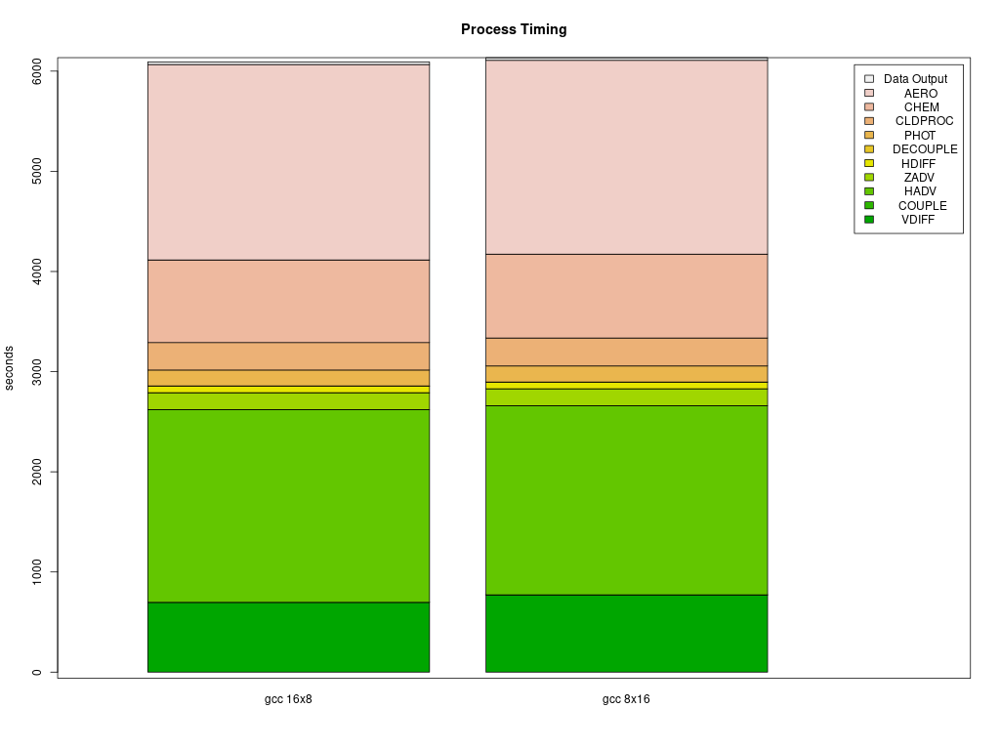
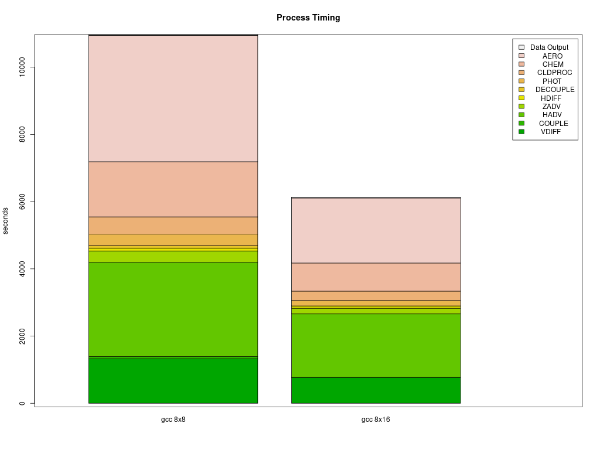

# Parse timings from the log file 

## Compare CONUS Parallel Cluster Runs

### For different PE configurations, using DisableSimultaneousMultithreading: true in yaml file, using 36 cpus - no virtual cpus
         
         NPCOL x NPROW    
   - [ ] 8x8     
   - [ ] 8x16
   - [ ] 10x18   #SBATCH --nodes=5, #SBATCH --ntasks-per-node=36
   - [ ] 16x16   #SBATCH --nodes=8, #SBATCH --ntasks-per-node=36
   - [ ] 16x18   #SBATCH --nodes=8, #SBATCH --ntasks-per-node=36

### For different compute nodes   

   - [ ] c5n.18xlarge  (72 virtual cpus, 36 cpus) - with Elastic Fabric Adapter
   - [ ] c5n.9xlarge   (36 virtual cpus, 18 cpus) - 

### For with and without SBATCH --exclusive

### For with and without Elastic Fabric and Elastic Netaork Adapter 

### For with and without network placement 

### For lustre

   - [ ] input data imported from S3 bucket to lustre
   - [ ] input data copied from S3 bucket to lustre
   - [ ] input data on EBS volume vs Lustre

### For different yaml settings for slurm  

   - [ ] DisableSimultaneousMultithreading= true
   - [ ] DisableSimultaneousMultithreading= false

### Use parse_timing.r script by Jesse Bash to examine timings of each process in CMAQ

```
cd qa_scripts
Rscript parse_timing.r
```

Timing Plot Comparing GCC run on 16 x 8 pe versus 8 x 16 pe on Dogwood



Timing Plot Comparing GCC run on 8 x 8 pe versus 8 x 16 pe on Dogwood


