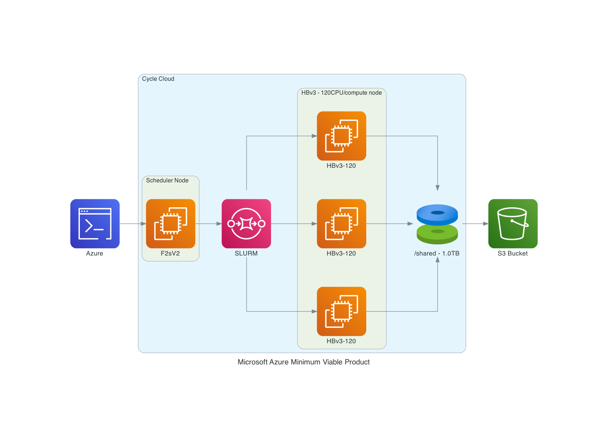

## System Requirements for Cycle Cloud

### Please set up a alarm on Azure 
Set alarm to receive an email alert if you exceed $100 per month (or what ever monthly spending limit you need).
It may be possible to set up daily or weekly spending alarms as well.

### Software Requirements for CMAQ on CycleCloud

* Tcsh shell
* Centos7  (tried ubuntu but the module command did not provide updated compilers and openmpi)
* Git
* Compilers (C, C++, and Fortran) - GNU compilers version ≥ 9.2
* MPI (Message Passing Interface) -  OpenMPI ≥ 4.1.0
* NetCDF (with C, C++, and Fortran support)
* I/O API
* Slurm Scheduler

### Hardware Requirements

#### Recommended Minimum Requirements

The size of hardware depends on the domain size and resolution for  your CMAQ case, and how quickly your turn-around requirements are.
Larger hardware and memory configurations are also required for instrumented versions of CMAQ incuding CMAQ-ISAM and CMAQ-DDM3D.

### Azure CycleCloud

Azure CycleCloud Provides the simplest way to manage HPC workloads using any scheduler (like Slurm, Grid Engine, HPC Pack, HTCondor, LSF, PBS Pro, or Symphony), on Azure

CycleCloud allows you to:

* Deploy full clusters and other resources, including scheduler, compute VMs, storage, networking, and cache
* Orchestrate job, data, and cloud workflows
* Give admins full control over which users can run jobs, as well as where and at what cost
* Customize and optimize clusters through advanced policy and governance features, including cost controls, Active Directory integration, monitoring, and reporting
* Use your current job scheduler and applications without modification
* Take advantage of built-in autoscaling and battle-tested reference architectures for a wide range of HPC workloads and industries

<a href="https://docs.microsoft.com/en-us/azure/architecture/topics/high-performance-computing#azure-cyclecloud">High Performance Computing on Azure CycleCloud</a>

<a href="https://docs.microsoft.com/en-us/azure/cyclecloud/?view=cyclecloud-8">Azure CycleCloud</a>

### Ensure your vCPU quota has been increased before attempting to run large-scale workloads.

<a href="https://docs.microsoft.com/en-us/azure/virtual-machines/linux/quotas">Azure VM Quotas</a>

#### Recommended Cycle Cloud Configuration for CONUS Domain

Scheduler node:

* D12v2

Compute Node for HTC Queue - used for Post-Processing (combine, etc):

* F2sV2

Compute Node for HPC Queue - used to run CMAQ:

*  HBv3-120 instance running Centos7 

<a href="https://docs.microsoft.com/en-us/azure/virtual-machines/workloads/hpc/hbv3-series-overview#software-specifications">HBv3-series Software Specification</a>

448 GB of RAM, and no hyperthreading with 350 GB/sec of memory bandwidth, up to 32 MB of L3 cache per core, up to 7 GB/s of block device SSD performance, and clock frequencies up to 3.675 GHz.

Figure 1. Cycle Cloud Recommended Cluster Configuration (Number of compute nodes depends on setting for NPCOLxNPROW and #SBATCH --nodes=XX #SBATCH --ntasks-per-node=YY )

#### Azure CycleCloud specifies what resource to use for disks, scheduler node, and compute nodes. 
Cycle Cloud simply tries to schedule the job according to the slurm scheduler instructions. Slurm controls the launch, terminate, and maintain resources.
If you try to allocate more nodes than are available in the Cycle Cloud Configuration, then you will need to 
edit the HPC config in the cyclecloud web interface to set the CPUs to 480 or more and then run the following on the scheduler node the changes should get picked up:

`cd /opt/cycle/slurm`

`sudo ./cyclecloud_slurm.sh scale`

Number of compute nodes dispatched by the slurm scheduler is specified in the run script using #SBATCH --nodes=XX #SBATCH --ntasks-per-node=YY where the maximum value of tasks per node or YY limited by many CPUs are on the compute node.  

For HBv3-120, there are 120 CPUs, so maximum value of YY is 120 or --ntask-per-node=120.  

If running a job with 180 processors, this would require the --nodes=XX or XX to be set to 2 compute nodes, as 90x2=180.  

The setting for NPCOLxNPROW must also be a maximum of 180, ie. 18 x 10 or 10 x 18 to use all of the CPUs in the parallel cluster.

<a href="https://docs.microsoft.com/en-us/azure/virtual-machines/hbv3-series">HBv3-120 instance </a>

Software: 

* Centos7
* Spot or OnDemand Pricing 
* /shared/build volume install software from git repo
* 1. TB Shared file system 
* Slurm Placement Group enabled
* Elastic Fabric Adapter Enabled on HBv3-120

<a href="https://azure.com/e/a5d6f8654d634e8b93973574cbda428d">Azure HBv3-120 Pricing</a>

Table 1. Azure Instance On-Demand versus Spot Pricing (price is subject to change)

| Instance Name	| CPUs |  RAM      |  Memory Bandwidth	| Network Bandwidth | Linux On-Demand Price | Linux Spot Price | 
| ------------  | ----- | --------  | ---------------   | ---------------   | --------------------  | ---------------  |
| HBv3-120	| 120	|  448 GiB   |	 350 Gbps	        | 200 Gbps(Infiniband)          |   $3.6/hour         | $1.4/hour     |

Table 2. Timing Results for CMAQv5.3.3 2 Day CONUS2 Run on Cycle Cloud with D12v2 schedulare node and HBv3-120 Compute Nodes

| Number of PEs | #Nodesx#CPU | NPCOLxNPROW | Day1 Timing (sec) | Day2 Timing (sec) | Total Time(2days)(sec) | SBATCH --exclusive | Data Imported or Copied | DisableSimultaneousMultithreading| Answers Matched | Cost using Spot Pricing | Cost using On Demand Pricing | compiler flag | 
| ------------- | -----------    | -----------   | ----------------     | ---------------      | -------------------        | ------------------ | --------------          | ---------                              |   -------- | --------- | ------ | ---------------      |
| 90           |   1x90     |    9x10            |   3153.33            |  2758.12             |   5911.45                  |  no                | copied                  |  false                                 |             | $1.4/hr * 2 nodes * 1.642 hr = $4.59             |  $3.6/hr * 1 nodes * 1.642 hr = $ $5.911           |  without -march=native compiler flag |
| 120          |   1x120    |    10x12           | 2829.84              |  2516.07             |   5345.91                  |  no                | copied                  |  false                                 |            | $1.4/hr * 2 nodes * 1.484 hr = $4.15           | $3.6/hr * 1 nodes * 1.484 hr = $5.34                     | without -march=native compiler flag            |
| 180           |  2x90          | 10x18         | 2097.37              | 1809.84              |    3907.21                 |  no                | copied                  |  false                                 |            | $1.4/hr * 2 nodes * 1.08 hr = $3.03 | $3.6/hr * 2 nodes * 1.08 hr = $7.81 | with -march=native compiler flag |
| 180          |   2x90     |    10 x 18         | 1954.20              | 1773.86              |    3728.06                 |  no                | copied                  |  false                                 |             | $1.4/hr * 2 nodes * 1.036 hr = $2.9 | $3.6/hr * 2 nodes * 1.036 hr = $7.46 | without -march=native compiler flag |
| 240          |   2x120    |   20x12            |  1856.50             | 1667.68                     |    3524.18                |  no                | copied                  |  false                            |             |   $1.4/hr * 2 nodes * .97 hr = $2.716           |  $3.6/hr * 2 nodes * .97 hr = $6.984   | without -march=native compiler flag |  
| 270           |  3x90          | 15x18         | 1703.19              | 1494.17              |    3197.36                 |  no                | copied                  |  false                   |  | $1.4/hr * 3 nodes * .888hr = $3.72 | 3.6/hr * 3 nodes * .888 = $9.59  | with -march=native compiler flag |
| 360           |  3x120     |  20x18             | 1520.29              |  1375.54             |    2895.83                 |  no                | copied                  |  false                  |   | $1.4/hr * 3 nodes * .804 = $3.38 | 3.6/hr * 3 nodes * .804 = $8.687 | with -march=native compiler flag | 

Total HBv3-120 compute cost of Running Benchmarking Suite using SPOT pricing = $1.4/hr
<a href="https://azure.microsoft.com/en-us/pricing/details/virtual-machines/linux/">Azure Spot and On-Demand Pricing</a>

Figures: todo - need screenshots of Azure Pricing from Rob Zelt

Figure 2. Cost by Instance Type - update for Azure 

Figure 3. Cost by Usage Type - Azure Console

Figure 4. Cost by Service Type - Azure Console

Scheduler node D12v2 compute cost = entire time that the parallel cluster is running ( creation to deletion) = 6 hours * $0.?/hr = $ ? using spot pricing, 6 hours * $?/hr = $? using on demand pricing.

Total HBv3-120 cost of Running Benchmarking Suite using ONDEMAND pricing = $52.00 (sum of all ondemand cost for Table 2)

Using 360 cpus on the Cycle Cloud Cluster, it would take ~6.11 days to run a full year, using 3 HBv3-120 compute nodes.

Table 3. Extrapolated Cost of HBv3-120 used for CMAQv5.3.3 Annual Simulation based on 2 day CONUS benchmark

| Benchmark Case | Number of PES |  Number of HBv3-120 Nodes | Pricing    |   Cost per node | Time to completion (hour)   | Extrapolate Cost for Annual Simulation                 |  
| -------------  | ------------  |  --------------- | -------    |  -------------- | ------------------          |  --------------------------------------------------    |
| 2 day CONUS    |  360          |          3       |    SPOT    |    1.4/hour |     2895.83/3600 = .8044  |    .8044/2 * 365 = 147 hours/node * 3 nodes = 441 * $1.4 = $617.4 |
| 2 day CONUS    |  360          |          3       |  ONDEMAND  |    3.6/hour   | 2895.83/3600 = .8044  |    .8044/2 * 365 = 147 hours/node * 3 nodes = 441 * $3.6 = $1,587.6 |

<a href="https://docs.microsoft.com/en-us/azure/virtual-machines/disks-shared">Azure SSD Disk Pricing</a>
<a href="https://azure.microsoft.com/en-us/pricing/details/managed-disks/">Azure SSD Disk Pricing</a>

Table 4. Shared SSD File System Pricing

| Storage Type | Storage options   | 	Max IOPS (Max IOPS w/ bursting)	| Pricing (monthly)  |  Pricing | Price per mount per month (Shared Disk) |
| --------     | ----------------  |   ------------------------------------    | -----------------  |  ---------------  | ------  |
| Persistant 1TB  | 200 MB/s/TB       | 	5,000 (30,000)                                  |	$122.88/month |  $6.57                 |

Table 5. Extrapolated Cost of File system for CMAQv5.3.3 Annual Simulation based on 2 day CONUS benchmark

Need to create table

Also need estimate for Archive Storage cost for storing an annual simulation

### Recommended Workflow

Post-process monthly save output and/or post-processed outputs to archive storage at the end of each month.

Goal is to develop a reproducable workflow that does the post processing after every month, and then copies what is required to archive storage, so that only 1 month of output is stored at a time on the /shared/data scratch file system.
This workflow will help with preserving the data in case the cluster or scratch file system gets pre-empted.

