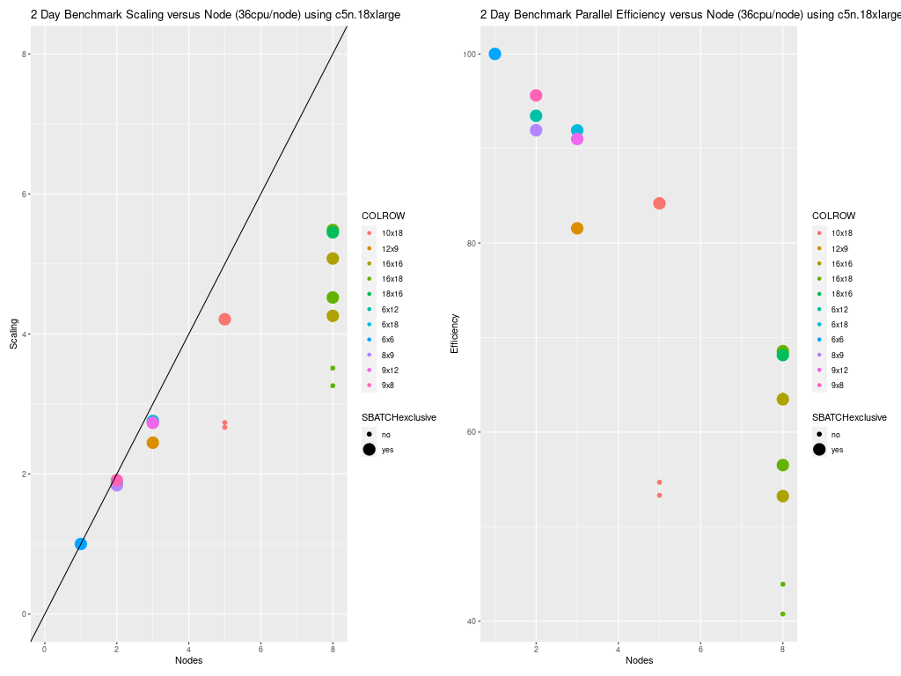
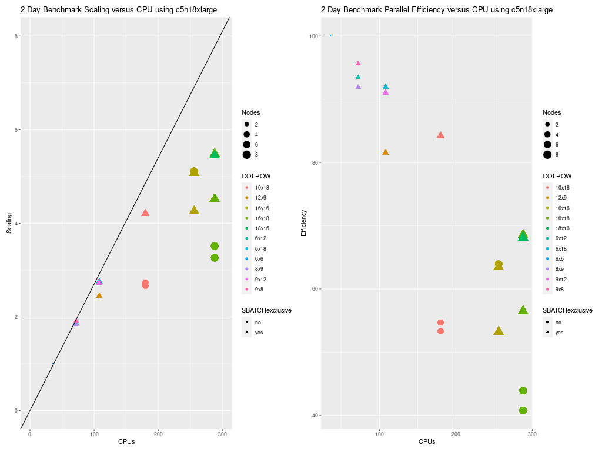
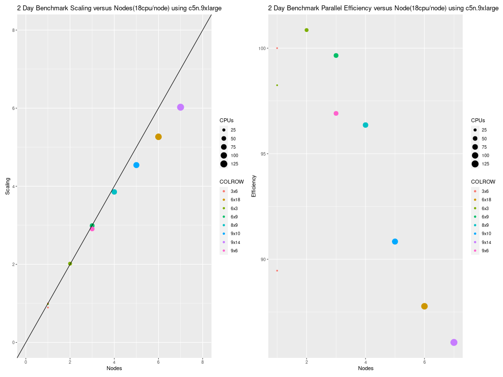
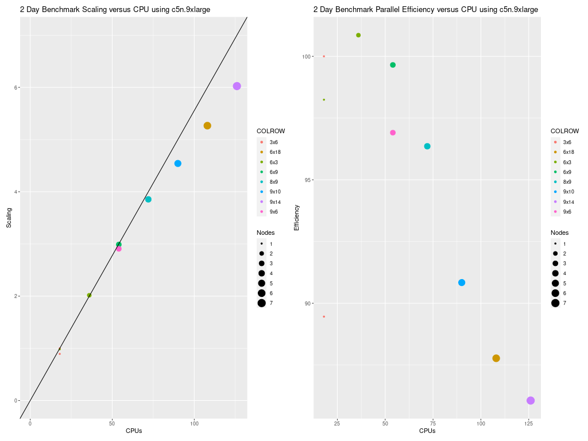
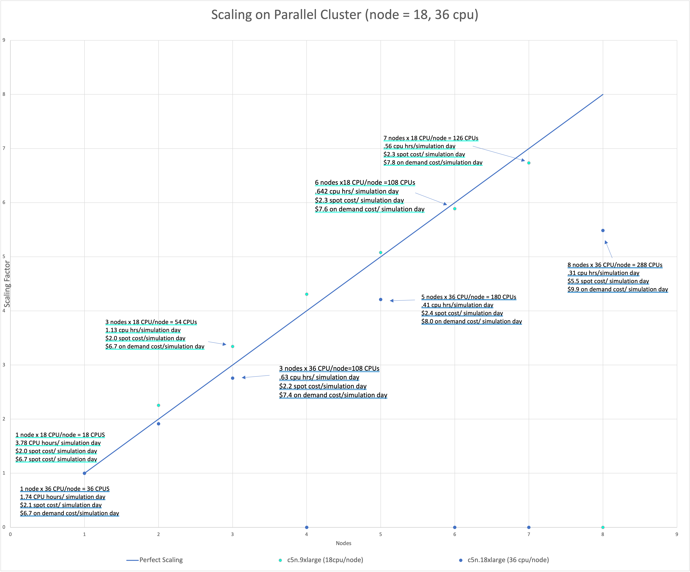
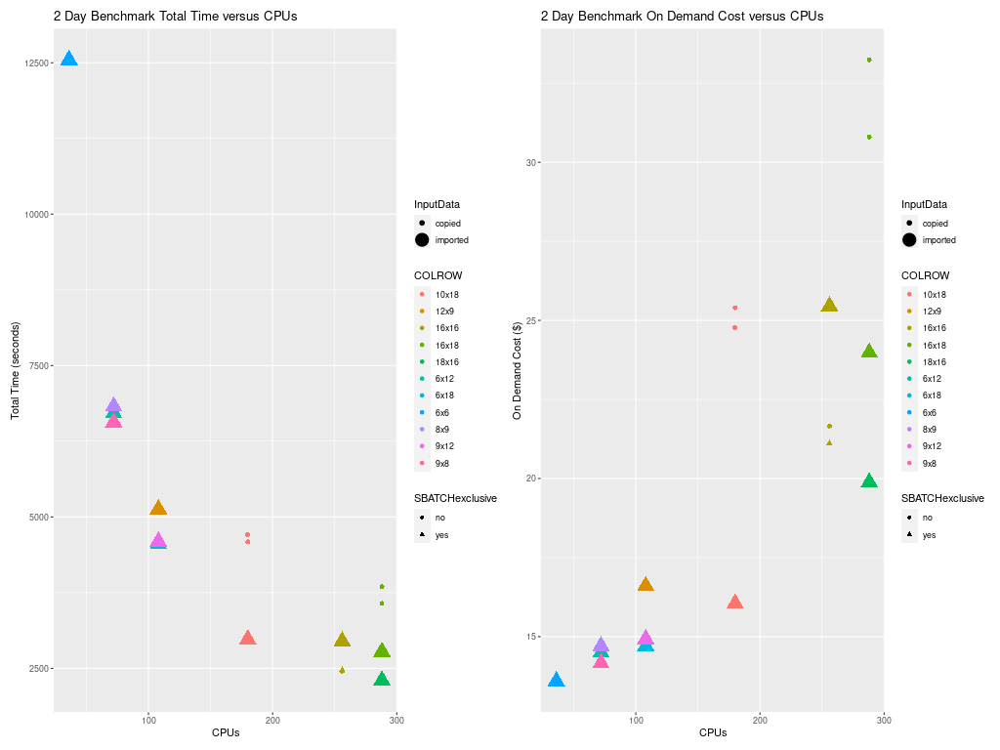
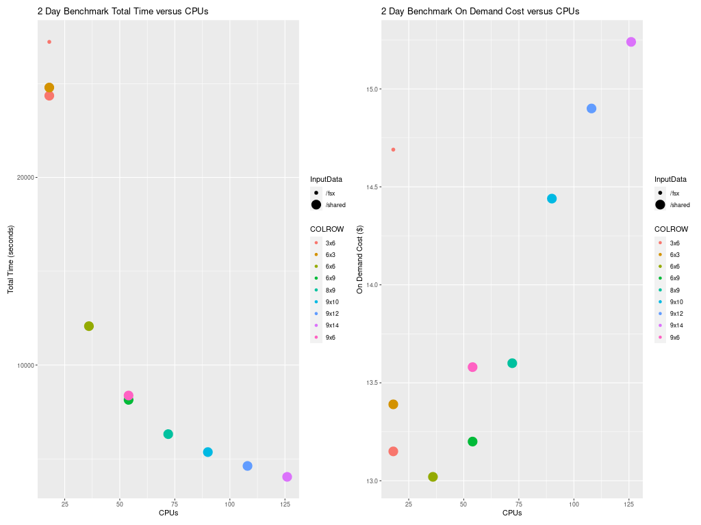
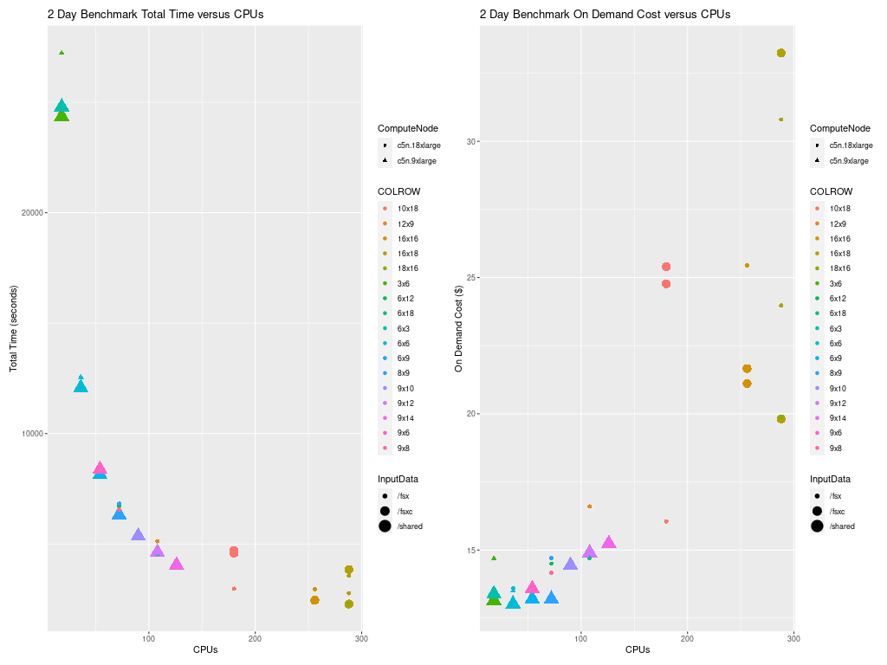

Performance Optimization

## Right-sizing Compute Nodes for the ParallelCluster Configuration

Selection of the compute nodes depends on the domain size and resolution for the CMAQ case, and what your model run time requirements are.
Larger hardware and memory configurations may also be required for instrumented versions of CMAQ incuding CMAQ-ISAM and CMAQ-DDM3D.
The ParallelCluster allows you to run the compute nodes only as long as the job requires, and you can also update the compute nodes as needed for your domain.

## An explanation of why a scaling analysis is required for Multinode or Parallel MPI Codes

Quote from the following link.

"IMPORTANT: The optimal value of --nodes and --ntasks for a parallel code must be determined empirically by conducting a scaling analysis. As these quantities increase, the parallel efficiency tends to decrease. The parallel efficiency is the serial execution time divided by the product of the parallel execution time and the number of tasks. If multiple nodes are used then in most cases one should try to use all of the CPU-cores on each node."

```{note}
For the scaling analysis that was performed with CMAQ, the parallel efficiency was determined as the runtime for the smallest number of CPUs divided by the product of the parallel execution time and the number of additional cpus used. If smallest NPCOLxNPROW configuration was 18 cpus, the run time for that case was used, and then the parallel efficiency for the case where 36 cpus were used would be parallel efficiency = runtime_18cpu/(runtime_36cpu*2)*100
```

```{seealso}
<a href="https://researchcomputing.princeton.edu/support/knowledge-base/scaling-analysis">Scaling Analysis - see section on Multinode or Parallel MPI Codes</a>

<a href="https://researchcomputing.princeton.edu/support/knowledge-base/slurm#multinode">Example Slurm script for Multinode Runs</a>
```

## Slurm Compute Node Provisioning

AWS ParallelCluster relies on SLURM to make the job allocation and scaling decisions. The jobs are launched, terminated, and resources maintained according to the Slurm instructions in the CMAQ run script. The YAML file for Parallel Cluster is used to set the identity of the head node and the compute node, and the maximum number of compute nodes that can be submitted to the queue. The head node can't be updated after a cluster is created. The compute nodes, and the maximum number of compute nodes can be updated after a cluster is created. 

Number of compute nodes dispatched by the slurm scheduler is specified in the run script using #SBATCH --nodes=XX #SBATCH --ntasks-per-node=YY where the maximum value of tasks per node or YY limited by many CPUs are on the compute node.

As an example:

For c5n.18xlarge, there are 36 CPUs/node, so maximum value of YY is 36 or --ntask-per-node=36.  

If running a job with 180 processors, this would require the --nodes=XX or XX to be set to 5 compute nodes, as 36x5=180.  

The setting for NPCOLxNPROW must also be a maximum of 180, ie. 18 x 10 or 10 x 18 to use all of the CPUs in the parallel cluster.

For c5n.9xlarge, there are 18 CPUS/node, so maximum value of YY is 18 or --ntask-per-node=18.

If running a job with 180 processors, this would require the --nodes=XX or XX to be set to 10 compute nodes, as 18x10=180.

```{note}
If you submit a slurm job requesting more nodes than are available in the region, then you will get the following message when you use the squeue command under NODELIST(REASON): (Nodes required for job are DOWN, DRAINED or reserved for jobs in higher priority partition)
In the scaling tables below, this is indicated as "Unable to provision".
```

```{seealso}
<a href="https://aws.amazon.com/blogs/aws/new-c5n-instances-with-100-gbps-networking/">C5n Instance</a>
```

Quoted from the above link:

"Each vCPU is a hardware hyperthread on the Intel Xeon Platinum 8000 series processor. You get full control over the C-states on the two largest sizes, allowing you to run a single core at up to 3.5 Ghz using Intel Turbo Boost Technology.  The C5n instances also feature a higher amount of memory per core, putting them in the current “sweet spot” for HPC applications that work most efficiently when there’s at least 4 GiB of memory for each core. The instances also benefit from some internal improvements that boost memory access speed by up to 19% in comparison to the C5 and C5d instances.  The C5n instances incorporate the fourth generation of our custom Nitro hardware, allowing the high-end instances to provide up to 100 Gbps of network throughput, along with a higher ceiling on packets per second. The Elastic Network Interface (ENI) on the C5n uses up to 32 queues (in comparison to 8 on the C5 and C5d), allowing the packet processing workload to be better distributed across all available vCPUs."

Resources specified in the YAML file: 

* Ubuntu2004 
* Disable Simultaneous Multi-threading
* Spot Pricing 
* Shared EBS filesystem to install software

* 1.2 TiB Shared Lustre file system with imported S3 Bucket (1.2 TiB is the minimum file size that you can specify for Lustre File System) mounted as /fsx <b>or</b> EBS volume 500 GB size mounted as /shared/data

* Slurm Placement Group enabled
* Elastic Fabric Adapter Enabled on c5n.9xlarge and c5n.18xlarge

```{seealso}
<a href="https://aws.amazon.com/ec2/instance-types/c5/">EC2 Instance Types</a>
```

```{note}
Pricing information in the tables below are subject to change. The links from which this pricing data was collected are listed below.
```

```{seealso}
<a href="https://aws.amazon.com/blogs/aws/new-c5n-instances-with-100-gbps-networking/">AWS c5n Pricing</a>
```

```{seealso}
<a href="https://aws.amazon.com/ec2/spot/pricing/">EC2 SPOT Pricing</a>
```

```{seealso}
<a href="https://aws.amazon.com/ec2/pricing/on-demand">EC2 On-Demand Pricing</a>
```

```{seealso}
<a href="https://docs.aws.amazon.com/parallelcluster/latest/ug/spot.html">Working with Spot Instances - ParallelCluster</a>
```

## Spot versus On-Demand Pricing

Table 1. EC2 Instance On-Demand versus Spot Pricing (price is subject to change)

| Instance Name	| vCPUs |  RAM      |  EBS Bandwidth	| Network Bandwidth | Linux On-Demand Price | Linux Spot Price | 
| ------------  | ----- | --------  | ---------------   | ---------------   | --------------------  | ---------------  |
| c4.large	| 2	| 3.75 GiB  |   Moderate	|  500 Mbps         | 	$0.116/hour         | $0.0312/hour     |
| c4.8xlarge	| 36	| 60 GiB    |	10 Gbps	        |  4,000 Mbps       | 	$1.856/hour         | $0.5903/hour     |
| c5n.large	| 2	| 5.25 GiB  |	Up to 3.5 Gbps	| Up to 25 Gbps     |   $0.108/hour         | $0.0324/hour     |
| c5n.xlarge	| 4	| 10.5 GiB  |	Up to 3.5 Gbps	| Up to 25 Gbps     |   $0.216/hour         | $0.0648/hour     |
| c5n.2xlarge	| 8	| 21 GiB    |	Up to 3.5 Gbps	| Up to 25 Gbps     |   $0.432/hour         | $0.1740/hour     |
| c5n.4xlarge	| 16	| 42 GiB    | 	3.5 Gbps	| Up to 25 Gbps     |   $0.864/hour         | $0.2860/hour     |
| c5n.9xlarge	| 36	| 96 GiB    |	7 Gbps	        | 50 Gbps           |   $1.944/hour         | $0.5971/hour     |
| c5n.18xlarge	| 72	| 192 GiB   |	14 Gbps	        | 100 Gbps          |   $3.888/hour         | $1.1732/hour     |
| c6gn.16xlarge | 64	| 128 GiB   |                   |  100 Gbps         |   $2.7648/hour        | $0.6385/hour     |	


Using c5n.18xlarge as the compute node, it costs (3.888/hr)/(1.1732/hr) = 3.314 times as much to run on demand versus spot pricing. Savings is 70% for SPOT versus ondemand pricing.

Using c5n.9xlarge as the compute node, it costs ($1.944/hr)/($0.5971/hr) = 3.25 times as much to run on demand versus spot pricing. Savings is 70% for SPOT versus ondemand pricing.

Using c6gn.16xlarge as the compute node, it costs ($2.7648/hr)/(.6385/hr) = 4.3 times as much to run on demand versus spot pricing. Savings is 77% for SPOT versus ondemand pricing for this instance type.

```{note}
Sometimes, the nodes are not available for SPOT pricing in the region you are using. 
If this is the case, the job will not start runnning in the queue, see AWS Troubleshooting. 
<a href="https://docs.aws.amazon.com/parallelcluster/latest/ug/troubleshooting.html">ParallelCluster Troubleshooting</a>
```

## Benchmark Timings

Benchmarks were performed using both c5n.18xlarge (36 cpus per node) and c5n.9xlarge (18 cpus per node)

### Benchmark Timing Results for c5n.18xlarge

Table 2. Timing Results for CMAQv5.3.3 2 Day CONUS2 Run on ParallelCluster with c5n.large head node and C5n.18xlarge Compute Nodes

Note for the C5n.18xlarge, I/O was done using /fsx, the InputData refers to whether the data was copied to /fsx or imported from fsx.

| CPUs | NodesxCPU | COLROW | Day1 Timing (sec) | Day2 Timing (sec) | TotalTime | CPU Hours/day | SBATCHexclusive | InputData | Disable Simultaneous Multithreading (yaml)| with -march=native |  Equation using Spot Pricing | SpotCost   | Equation using On Demand Pricing |  OnDemandCost | 
| ------------- | -----------    | -----------   | ----------------     | ---------------      | -------------------        | ------------------ | --------------          | ---------                              |   -------- | --------- | ---- | ----- | --- | --- | 
| 36            |  1x36          | 6x6           | 6726.72 | 5821.47   |   12548.19      | 1.74          |  yes         |  imported | true               | yes      |    1.1732/hr * 1 node * 3.486 hr= |  4.09  | 3.888/hr * 1 node * 3.496 hr = |  13.59 |
| 72            |  2x36          | 6x12          | 3562.50 | 3151.21   |    6713.71      | .93          |  yes         | imported |  true              | yes       | 1.1732/hr * 2 nodes * 1.8649 hr = |  4.37 | 3.888/hr * 2 nodes * 1.8649 = | 14.5  |
| 72            |  2x36        | 8x9             | 3665.65 | 3159.12   |    6824.77      | .95           |  yes         | imported     |  true              | yes  | 1.1732/hr * 2 nodes * 1.896 hr = | 4.45 | 3.888/hr * 2 nodes * 1.896 = |  14.7  |
| 72            |  2x36        | 9x8             | 3562.61 | 2999.69   |    6562.30      |  .91          |  yes         | imported     |  true              | yes  | 1.1732/hr * 2 nodes * 1.822 hr = | 4.28 | 3.888/hr * 2 nodes * 1.822 = | 14.16  |
| 108           |  3x36          | 6x18          | 2415.46 | 2135.26   | 4550.72          | .63     |  yes                | imported                | true   |   yes  |     1.1732/hr * 3 nodes * 1.26 hr = | 4.45   |   3.888/hr * 3 nodes * 1.26  = | 14.7  |
| 108           | 3x36           | 12x9          | 2758.01 | 2370.92   | 5128.93          | .71     |  yes                | imported                | true         |  yes |   1.1732/hr * 3 nodes * 1.42 hr = | 5.01 |   3.888/hr * 3 nodes * 1.42 hr = | 16.6 |
| 108           |  3x36          | 9x12          | 2454.11 | 2142.11   | 4596.22          | .638    |  yes                | imported                | true         | yes  | 1.1732/hr * 3 nodes * 1.276   = | 4.49 | 3.888/hr * 3 nodes * 1.276 hr =| 14.88 |
| 180           |  5x36          | 10x18         | 2481.55  | 2225.34  |    4706.89     | .65            |  no               | copied                  |  false    | yes  | 1.1732/hr * 5 nodes * 1.307 hr =  | 7.66 | 3.888/hr * 5 nodes * 1.307 hr = | 25.4 |
| 180           |  5x36          | 10x18         | 2378.73    | 2378.73    |    4588.92    | .637             |  no                | copied            |  true     | yes  | 1.1732/hr * 5 nodes * 1.2747 hr = | 7.477 | 3.888/hr * 5 nodes * 1.2747 hr = |  24.77 |
| 180           |  5x36          | 10x18         | 1585.67        | 1394.52  |    2980.19  | .41         |  yes                | imported    |  true        |   yes     | 1.1732/hr * 5nodes * 2980.9 / 3600 = | 4.85 | 3.888/hr * 5 nodes * .82 hr = | 16.05 | 
| 256           |  8x32          | 16x16         |  1289.59       | 1164.53  |    2454.12  | .34         |  no                 |  copied           |  true    | yes     | 1.1732/hr * 8nodes * 2454.12 / 3600 = | $6.398  | 3.888/hr * 8 nodes * .6817 hr = | 21.66 |
| 256           |  8x32          | 16x16         |  1305.99       | 1165.30  |    2471.29  | .34         |  yes                |   copied    |   true    |  yes       | 1.1732/hr * 8nodes * 2471.29 / 3600 = | 6.44 | 3.888/hr * 8 nodes * .686 hr = | 21.11 |
| 256           |  8x32          | 16x16         |  1564.90       | 1381.80  |    2946.70   | .40        |  yes                |   imported  | true   |   yes          | 1.1732/hr * 8nodes * 2946.7 / 3600 = | 7.68 |  3.888/hr * 8 nodes * .818 hr = | 25.45 |
| 288           |  8x36          | 16x18         | 1873.00        | 1699.24  |     3572.2   | .49        |  no                |  copied     |    false | yes             | 1.1732/hr * 8nodes * 3572.2/3600= | 9.313  | 3.888/hr * 8 nodes * .992 hr = | 30.8 |
| 288           |  8x36          |  16x18        |  1472.69       | 1302.84   |   2775.53   | .385      |  yes               |  imported   | true    | yes             | 1.1732/hr * 8nodes * .771 = | 7.24 | 3.888/hr * 8 nodes * .771 = | 23.98 | 
| 288           |  8x36          |  16x18        |  1976.35       | 1871.61   |   3847.96   | .53       |  no                |  copied     |  true   | yes             | 1.1732/hr * 8nodes * 1.069 = | 10.0 | 3.888/hr * 8 nodes * 1.069 = | 33.24 |
| 288           |  8x36          | 16x18         |  1197.19       | 1090.45  |     2287.64  | .31        |  yes               |  copied     |  true   | yes              16x18 matched 16x16 | 1.1732/hr * 8nodes * .635 = | 5.96 |  3.888/hr * 8 nodes * .635 = | 19.76
| 288           |  8x36          | 18x16         | 1206.01        | 1095.76  |     2301.77  | .32        |  yes               |  imported   |  true   | yes       | 1.1732/hr * 8nodes * 2301.77= | 6.00 | 3.888/hr * 8 nodes * .639 = | 19.88 |
| 360           | 10x36          | 18x20         |   Unable to provision  |                 |            |                     |                    |     |        |       |        |


### Benchmark Timing Results for c5n.9xlarge

Table 3. Timing Results for CMAQv5.3.3 2 Day CONUS2 Run on ParallelCluster with c5n.large head node and C5n.9xlarge Compute Nodes

| CPUs | NodesxCPU | COLROW | Day1 Timing (sec) | Day2 Timing (sec) | TotalTime | CPU Hours/day | SBATCHexclusive |  Disable Simultaneous Multithreading (yaml)| with -march=native | InputData   |    Equation using Spot Pricing | SpotCost | Equation using On Demand Pricing | OnDemandCost |
| ------------- | -----------    | -----------   | ----------------     | ---------------      | ------------- | -----  | ------------------ | --------------          | ---------                  |  ------  |   -------- | --------- | -- | -- | 
| 18            |  1x18          | 3x6           |  14341.77     | 12881.59 | 27223.36    | 3.78         |  yes  |  true | no | /fsx   | 0.5971/hr * 1 node * 7.56 hr= | 4.51         | 1.944/hr * 1 node * 7.56 hr = | 14.69 |
| 18            |  1x18          | 3x6           |  12955.32     | 11399.07 | 24354.39    | 3.38         |  yes  |  true | no | /shared   | 0.5971/hr * 1 node * 6.76 hr = | 4.03  |  1.944/hr * 1 node * 6.76 = | 13.15 |  
| 18            |  1x18          | 6x3           |  13297.84     | 11491.99 | 24789.83    | 3.44         |  yes  | true  | no | /shared   | 0.5971/hr * 1 node * 6.89 hr = | 4.11 |   1.944/hr * 1 node * 6.89 = | 13.39 | 
| 36            |  2x18          | 6x6           |   6473.95     | 5599.76  |  12073.71   | 1.67         |  yes  |  true | no  | /shared   |  0.5971/hr * 2 node * 3.35 hr= | 4.0        | 1.944/hr * 2 node * 3.35 hr = | 13.02 |
| 54            |  3x18          | 6x9           |   4356.33     | 3790.13  |  8146.46  |  1.13        |  yes    |  true | no  | /shared   |   0.5971/hr * 3 node * 2.26 hr= | 4.05           | 1.944/hr * 3 node * 2.26 hr = | 13.2 |
| 54            | 3x18           | 9x6           |   4500.29     | 3876.76  | 8377.05   |  1.16        |  yes    | true  | no  | /shared   |  0.5971/hr * 3 node * 2.33 hr = | 4.17 | 1.944/hr * 3 node * 2.33 = | 13.58 |
| 72            |  4x18          | 8x9           |    3382.01    | 2936.66  |  6318.67  |  .8775      |  yes     |  true | no  | /shared |    0.5971/hr * 4 node * 1.755 hr= | 4.19           | 1.944/hr * 4 node * 1.755 hr = | 13.2 |
| 90            |  5x18          | 9x10          |    2878.55    |  2483.56 | 5362.11   |  .745     |  yes       |  true | no  | /shared  |   0.5971/hr * 5 node * 1.49 hr= | 4.45           | 1.944/hr * 5 node * 1.49 hr = | 14.44 |
| 108            |  6x18          | 9x12         |   2463.41     |2161.07        | 4624.48  | .642 |  yes       |  true  | no  | /shared |  0.5971/hr * 6 node * 1.28 hr= | 4.6           | 1.944/hr * 6 node * 1.28 hr = | 14.9 |
| 108            | 6x18           | 9x12         | 2713.95      | 2338.09   | 5052.04     | .702   | yes   | true | no  | /fsx linked  | 0.5971/hr * 6 node * 1.40hr = | 5.03 |           | 1.944/hr * 6 node * 1.40 hr = | 16.3 |
| 108            | 6x18           | 9x12         | 2421.19     | 2144.16    | 4565.35     | .634   | yes   | true | no | /fsx copied   | 0.5971/hr * 6 node * 1.27 = | 4.54 |             | 1.944/hr * 6 node * 1.27hr = | 14.81 |
| 126            |  7x18          | 9x14         | 2144.86     | 1897.85      | 4042.71     | .56  |  yes        |  true | no  | /shared |      0.5971/hr * 7 node * 1.12 hr= | 4.69           | 1.944/hr * 7 node * 1.12 hr = | 15.24 |
| 144            |  8x18          | 12x12        | unable to provision    |      |          |                    |          |                 |     | |  |  | | | 
| 162            |  9x18          | 9x18         | unable to provision    |      |          |                    |          |                 |     | |  |  | | |
| 180            |  10x18          | 10x18       | unable to provision    |      |          |                    |          |                 |     | |  |  | | |


# Benchmark Scaling Plots

## Benchmark Scaling Plot for c5n.18xlarge

Figure 1. Scaling per Node on C5n.18xlarge Compute Nodes (36 cpu/node)



Note, there are several timings that were obtained using 8 nodes.  The 288 cpu timings were fully utilizing the 36 pe nodes using 8x36 = 288 cpus, and different NPCOLxNPROW options were used 16x18 and 18x16.
The 256 cpu timings were obtained using a NPCOLxNPROW configuration of 16x16. This benchmark configuration doesn't fully utilize all of the cpus/node, so the efficiency per node is lower, and the cost is higher.
It is best to select the NPCOLxNPROW settings that fully utilize all of the CPUs available as specified in the SBATCH commands.

```
#SBATCH --nodes=8
#SBATCH --ntasks-per-node=36
```

 
Figure 2. Scaling per CPU on c5n.18xlarge compute node



Note, poor performance was obtained for the runs using 180 processors when SBATCH --exclusive option was not used.  After this finding, the CMAQ run scripts were modified to always use this option.
The benchmark runs that were done on c5n.9xlarge used the SBATCH --exclusive option.


## Investigation of why there is a difference between the total run times for the benchmark when NPCOLxNPROW used 12x9 as compared to 9x12 and 6x18.

A comparison of the log files (sdiff  run_cctmv5.3.3_Bench_2016_12US2.108.12x9pe.2day.pcluster.log run_cctmv5.3.3_Bench_2016_12US2.108.9x12pe.2day.pcluster.log) revealed that the CPU speed for the Parallel Cluster run of the 12x9 benchmark case was slower than the CPU speed used for the 9x12 benchmark case. See the following section for details. <a href="https://pcluster-cmaq.readthedocs.io/en/latest/user_guide_pcluster/Performance-Opt/sdiff_compare.html">Comparison of log filesfor 12x9 versus 9x12 Benchmark runs</a>


The scaling efficiency using 5 nodes of 36 cpus/node =  180 cpus was 84%.  

The scaling efficiency dropped to 68% when using 8 nodes of 36 cpus/node = 288 cpus.


Figure 3.  Scaling per Node on C5n.9xlarge Compute Nodes (18 cpu/node)



Scaling is very good for the c5n.9xlarge compute nodes up to 7 nodes, the largest number of nodes that could be provisioned at the time this benchmark was performed.

Figure 4. Scaling per CPU on C5n.9xlarge Compute Node (18 cpu/node)



Scaling is also good when compared to the number of cpus used. Note that all benchmark runs performed using the c5n.9xlarge compute nodes fully utilized the number of cpus available on a node.

The scaling efficiency using 7 nodes of 18 cpus/node = 126 cpus was 86%.

## Benchmark Scaling Plot for c5n.18xlarge and c5n.9xlarge

Figure 5 shows the scaling per-node, as the configurations that were run were multiples of the number of cpus per node.  CMAQ was not run on a single cpu, as this would have been costly and inefficient.

Figure 5. Scaling on C5n.9xlarge (18 cpu/node) and C5n.18xlarge Compute Nodes (36 cpu/node)




## Total Time and Cost versus CPU Plot for c5n.18xlarge

Figure 6 shows the timings for many configuration options listed in the table above for the c5n.18xlarge cluster.  Running with no hyperthreading, using SBATCH --exclusive, and placement enabled, resulted in the fastest timings.  

Additional benchmark runs may be needed to determine the impact on performance when linking the input data using the lustre file system or copying the data to lustre and/or using the /shared ebs volume for I/O.

Figure 6. Plot of Total Time and On Demand Cost versus CPUs for c5n.18xlarge




## Total Time and Cost versus CPU Plot for c5n.9xlarge

Figure 7 shows how the total run time and On Demand Cost varies as additional CPUs are used. Note that the run script and yaml settings used for the c5n.9xlarge used settings that were optimized for running CMAQ on the cluster.

Figure 7. Plot of Total Time and On Demand Cost versus CPUs for c5n.9xlarge



## Total Time and Cost versus CPU Plot for both c5n.18xlarge and c5n.9xlarge

Figure 8. Plot of Total Time and On Demand Cost versus CPUs for both c5n.18xlarge and c5n.9xlarge



# Cost Information 

Cost information is available within the AWS Web Console for your account as you use resources, and there are also ways to forecast your costs using the pricing information available from AWS.

### Cost Explorer

Example screenshots of the AWS Cost Explorer Graphs were obtained after running several of the CMAQ Benchmarks, varying # nodes and # cpus and NPCOL/NPROW.  These costs are of a two day session of running CMAQ on the ParallelCluster, and should only be used to understand the relative cost of the EC2 instances (head node and compute nodes), compared to the storage, and network costs.

In Figure 9 The Cost Explorer Display shows the cost of different EC2 Instance Types: note that c5n.18xlarge is highest cost - as these are used as the compute nodes

Figure 9. Cost by Instance Type - AWS Console 


In Figure 10 The Cost Explorer displays a graph of the cost categorized by usage by spot or OnDemand, NatGateway, or Timed Storage. Note: spot-c5n.18xlarge is highest generating cost resource, but other resources such as storage on the EBS volume and the network NatGatway or SubnetIDs also incur costs

Figure 10. Cost by Usage Type - AWS Console 


In Figure 11. The Cost Explorer Display shows the cost by Services including EC2 Instances, S3 Buckets, and FSx Lustre File Systems

Figure 11. Cost by Service Type - AWS Console


### Compute Node Cost Estimate

Head node c5n.large compute cost = entire time that the parallel cluster is running ( creation to deletion) = 6 hours * $0.0324/hr = $ .1944 using spot pricing, 6 hours * $.108/hr = $.648 using on demand pricing.

Using 288 cpus on the ParallelCluster, it would take ~4.83 days to run a full year, using 8 c5n.18xlarge (36cpu/node) compute nodes.

Using 126 cpus  on the ParallelCluster, it would take ~8.92 days to run a full year, using 7 c5n.9xlarge (18cpu/node) compute nodes.

Table 4. Extrapolated Cost of c5n.18xlarge used for CMAQv5.3.3 Annual Simulation based on 2 day CONUS benchmark

| Benchmark Case | Compute Node | Number of PES |  Number of Nodes | Pricing    |   Cost per node | Time to completion (hour)   | Equation Extrapolate Cost for Annual Simulation | Annual Cost                | Days to Complete Annual Simulation | 
| -------------  | --------     |------------  |  --------------- | -------    |  -------------- | ------------------          |  ------------------------------------------- | ----    |  -------------------------------    |
| 2 day CONUS    |  c5n.18xlarge | 108         |           3       |    SPOT   |    1.1732/hour  |    4550.72/3600 = 1.264   |   1.264/2 * 365 = 231 hours/node * 3 nodes = 692 hr * $1.1732/hr = | $811.9 | 9.61   | 
| 2 day CONUS    |  c5n.18xlarge | 108         |           3       |  ONDEMAND   |    3.888/hour  |    4550.72/3600 = 1.264   |   1.264/2 * 365 = 231 hours/node * 3 nodes = 692 hr * $3.888/hr = | $2690.4 | 9.61   |
| 2 day CONUS    |  c5n.18xlarge | 180          |          5       |    SPOT    |    1.1732/hour |     2980.19/3600 = .8278  |    .8278/2 * 365 = 151 hours/node * 5 nodes = 755 hr * $1.1732/hr = | $886 |   6.29  |
| 2 day CONUS    |  c5n.18xlarge | 180          |          5       |  ONDEMAND  |    3.888/hour   |     2980.19/3600 = .8278  |    .8278/2 * 365 = 151 hours/node * 5 nodes = 755 hr * $3.888/hr = | $2935.44 | 6.29 |
| 2 day CONUS    |  c5n.9xlarge  | 126          |          7       |    SPOT    |   .5971/hour    |    4042.71/3600 = 1.12      |    1.12/2 * 365 = 204.94 hours/node * 7 nodes = 1434.6 hr * $.5971/hr = | $856| 8.52 |
| 2 day CONUS    |  c5n.9xlarge  | 126          |          7       |  ONDEMAND    |   1.944/hour    |    4042.71/3600 = 1.12      |    1.12/2 * 365 = 204.94 hours/node * 7 nodes = 1434.6 hr * $1.944/hr = | $2788.8 | 8.52 |

```{note}
These cost estimates depend on the availability of number of nodes for the instance type. If fewer nodes are available, then it will take longer to complete the annual run, but the costs should be accurate, as the CONUS 12US2 Domain Benchmark scales well up to this number of nodes. The cost of running an annual simulation on 3 c5n.18xlarge nodes using OnDemand Pricing is $2690.4, the cost of running an annual simulation on 5 c5n.18xlarge nodes using OnDemand pricing is $2935.44, if only 3 nodes are available, then you would pay less, but wait longer for the run to be completed, 9.61 days using 3 nodes versus 6.29 days using 5 nodes.
```

### Storage Cost Estimate

```{seealso}
<a href="https://aws.amazon.com/fsx/lustre/pricing/">AWS Lustre Pricing</a>
```


Table 5. Lustre SSD File System Pricing for us-east-1 region

| Storage Type | Storage options   | 	Pricing with data compression enabled*	| Pricing (monthly)  |
| --------     | ----------------  |   ------------------------------------    | -----------------  |
| Persistent   | 125 MB/s/TB       | 	$0.073                                  |	$0.145/month |
| Persistent   | 250 MB/s/TB       | 	$0.105                                  |	$0.210/month |
| Persistent   | 500 MB/s/TB       | 	$0.170                                  | 	$0.340/month |
| Persistent   | 1,000 MB/s/TB     |   $0.300                                  | 	$0.600/month | 
| Scratch      | 200/MB/s/TiB      |    $0.070 	                               |        $0.140/month |	

Note, there is a difference in the storage sizing units that were obtained from AWS. 

```{seealso}
<a href="https://www.techtarget.com/searchstorage/definition/tebibyte-TiB#:~:text=Tebibyte%20vs.&text=One%20tebibyte%20is%20equal%20to,when%20talking%20about%20storage%20capacity">TB vs TiB</a>
```

Quote from the above website;
"One tebibyte is equal to 2^40 or 1,099,511,627,776 bytes. 
One terabyte is equal to 1012 or 1,000,000,000,000 bytes. 
A tebibyte equals nearly 1.1 TB. 
That's about a 10% difference between the size of a tebibyte and a terabyte, which is significant when talking about storage capacity."

Lustre Scratch SSD 200 MB/s/TiB is tier of the storage pricing that we have configured in the yaml for the cmaq parallel cluster.

```{seealso}
<a href="https://docs.aws.amazon.com/parallelcluster/latest/ug/SharedStorage-v3.html#SharedStorage-v3-FsxLustreSettings">YAML FSxLustreSettings</a>
```

Cost example:
    0.14 USD per month / 730 hours in a month = 0.00019178 USD per hour

Note: 1.2 TiB is the minimum file size that you can specify for the lustre file system

    1,200 GiB x 0.00019178 USD per hour x 24 hours x 5 days = 27.6 USD

Question is 1.2 TiB enough for the output of a yearly CMAQ run?

For the output data, assuming 2 day CONUS Run, all 35 layers, all 244 variables in CONC output

```
cd /fsx/data/output/output_CCTM_v532_gcc_2016_CONUS_16x8pe_full
du -sh
```

Size of output directory when CMAQ is run to output all 35 layers, all 244 variables in the CONC file, includes all other output files

```
173G .
```

So we need 86.5 GB per day

Storage requirement for an annual simulation if you assumed you would keep all data on lustre filesystem

     86.5 GB * 365 days = 31,572.5 GB  = 31.5 TB


### Annual simulation local storage cost estimate

Assuming it takes 5 days to complete the annual simulation, and after the annual simulation is completed, the data is moved to archive storage.

     31,572.5 GB x 0.00019178 USD per hour x 24 hours x 5 days = $726.5 USD


To reduce storage requirements; after the CMAQ run is completed for each month, the post-processing scripts are run and completed, and then the CMAQ Output data for that month is moved from the Lustre Filesystem to the Archived Storage. Monthly data volume storage requirements to store 1 month of data on the lustre file system is approximately 86.5 x 30 days = 2,595 GB or 2.6 TB.  

      2,595 GB x 0.00019178 USD per hour x 24 hours x 5 days = $60 USD


Estimate for S3 Bucket cost for storing an annual simulation

```{seealso}
<a href="https://aws.amazon.com/s3/pricing/?p=pm&c=s3&z=4">S3 Storage Pricing Tiers</a>
```

| S3 Standard - General purpose storage |    Storage Pricing  |
| ------------------------------------  |    --------------   |
| First 50 TB / Month                   |     $0.023 per GB   |
| Next 450 TB / Month                   |     $0.022 per GB   |
| Over 500 TB / Month                   |     $0.021 per GB   |


### Archive Storage cost estimate for annual simulation - assuming you want to save it for 1 year

31.5 TB * 1024 GB/TB * .023 per GB * 12 months  = $8,903

| S3 Glacier Flexible Retrieval (Formerly S3 Glacier) |    Storage Pricing |
| --------------------------------------------------  |    --------------  |
| long-term archives with retrieval option from 1 minute to 12 hours|      |	
| All Storage / Month| 	$0.0036 per GB   |

S3 Glacier Flexible Retrieval Costs 6.4 times less than the S3 Standard

31.5 TB * 1024 GB/TB * $.0036 per GB * 12 months  = $1393.0 USD

Lower cost option is S3 Glacier Deep Archive (accessed once or twice a year, and restored in 12 hours)

31.5 TB * 1024 GB/TB * $.00099 per GB * 12 months  = $383 USD


# Recommended Workflow for extending to annual run

Post-process monthly save output and/or post-processed outputs to S3 Bucket at the end of each month.

Still need to determine size of post-processed output (combine output, etc).

      86.5 GB * 31 days = 2,681.5 GB * 1 TB/1024 GB =  2.62 TB

Cost for lustre storage of a monthly simulation

      2,681.5 GB x 0.00019178 USD per hour x 24 hours x 5 days = $61.7 USD

Goal is to develop a reproducable workflow that does the post processing after every month, and then copies what is required to the S3 Bucket, so that only 1 month of output is imported at a time to the lustre scratch file system from the S3 bucket.
This workflow will help with preserving the data in case the cluster or scratch file system gets pre-empted.

