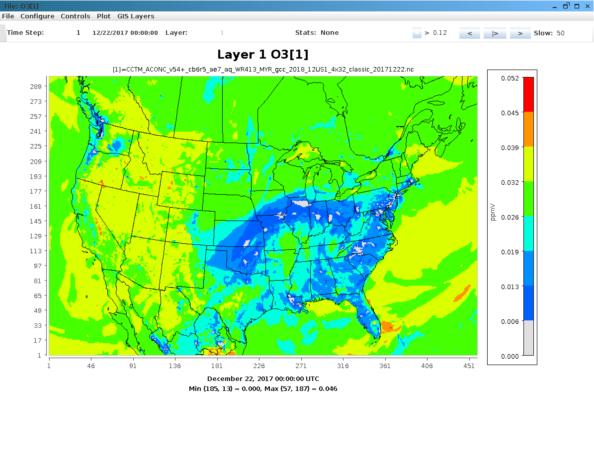
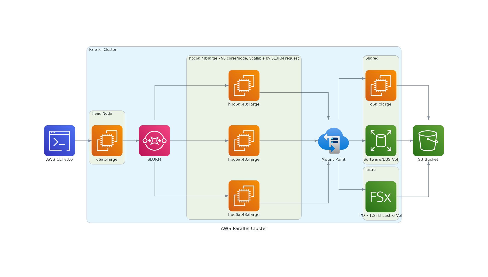

## Configurations for running CMAQ on Single VM or ParallelCluster

```{note}
AWS Educate is open to any individual, regardless of where they are in their education, technical experience, or career journey.  Learn, practice, and evaluate cloud skills in real time without creating an Amazon or AWS account. <a href="https://aws.amazon.com/education/awseducate/">AWS Educate</a>
```

```{note}
The tutorials presented here, require an AWS account, which requires a credit card.
If you are diligent in terminating the resources created in this tutorial after you run the benchmark, the cost should be less than $15.
see Performance and Cost Optimization tables.
```

## Sign up for an Amazon Web Service (AWS) Account

Go to <a href="http://aws.amazon.com">Amazon Web Service</a>

Click on "Create an AWS account" on the upper right corner.

(after you have an account it will say "Sign into the Console")


### Recommend that users set up a spending alarm using AWS 

Configure alarm to receive an email alert if you exceed $100 per month (or what ever monthly spending limit you need).

```{seealso}
See the AWS Tutorial on setting up an alarm for AWS Free Tier.
<a href="https://aws.amazon.com/getting-started/hands-on/control-your-costs-free-tier-budgets">AWS Free Tier Budgets</a>
```

## Software Requirements for CMAQ on AWS Single VM or ParallelCluster

<b>Tier 1</b>: Native OS and associated system libraries, compilers

* Operating System: Ubuntu2004 
* Tcsh shell
* Git
* Compilers (C, C++, and Fortran) - GNU compilers version ≥ 8.3
* MPI (Message Passing Interface) -  OpenMPI ≥ 4.0
* Slurm Scheduler

<b>Tier 2</b>: additional libraries required for installing CMAQ 

* NetCDF (with C, C++, and Fortran support)
* I/O API
* R Software and packages

<b>Tier 3</b>: Software distributed thru the CMAS Center

* CMAQv5.4+

* CMAQv5.4+ Post Processors

Tier 4: R packages and Scripts

* R QA Scripts

Software on Local Computer

* AWS ParallelCluster CLI v3.0 installed in a virtual environment
* pcluster is the primary AWS ParallelCluster CLI command. You use pcluster to launch and manage HPC clusters in the AWS Cloud and to create and manage custom AMI images
* run-instances is another AWS Command Line method to create a single virtual machine to run CMAQ described in chapter 6.
* Edit YAML Configuration Files using vi, nedit or other editor (yaml does not accept tabs as spacing)
* Git
* Mac - XQuartz for X11 Display
* Windows - MobaXterm  - to connect to ParallelCluster IP address

### AWS CLI v3.0 AWS Region Availability


```{note}
The scripts in this tutorial use the us-east-1 region, but the scripts can be modified to use any of the supported regions listed in the url below.
<a href="https://docs.aws.amazon.com/parallelcluster/latest/ug/supported-regions-v3.html">CLI v3 Supported Regions</a>
```

### CONUS 12US1 Domain Description

```
GRIDDESC
'12US1'
'LAM_40N97W'  -2556000.   -1728000.   12000.  12000.  459  299    1
```




## Single VM Configuration for 12US1 Benchmark Domain

* c6a.48xlarge - (96 cpus/node with Multithreading disabled) with 384 GiB memory, 50 Gigabit Network Bandwidth, 40 EBS Bandwidth (Gbps), Elastic Fabric Adapter (EFA) and Nitro Hypervisor. <b>(available in any region)</b>

| Name 	     | vCPUs   | cores |  	Memory (GiB) | 	Network Bandwidth (Gbps) |	EBS Throughput (Gbps) |
| ---        | -----   | ---   |  ------------   |  ----------------------   |   ----------------------   |
|c6a.2xlarge | 	8      |   4	|      16        | 	Up to 12.5 	     |     Up to 6.6              |
|c6a.8xlarge |	32     |  16    |      64 	 |      12.5 	             |         6.6                |
|c6a.48xlarge |	192    |  96	|      384       |	50 		     |	40                        |

or

* hpc6a.48xlarge (96 cpus/node) with 384 GiB memory, using two 48-core 3rd generation AMD EPYC 7003 series processors built on 7nm process nodes for increased efficiency with a total of 96 cores (4 GiB of memory per core), Elastic Fabric Adapter (EFA) and Nitro Hypervisor (lower cost than c6a.48xlarge)  <b>only available in us-east-2 region</b>

| Name          | cores |        Memory (GiB) |  EFA Network Bandwidth (Gbps) |      Network Bandwidth(Gbps) |
| ---           | ---   |  ------------   |  ----------------------           |   ----------------------   |
| Hpc6a.48xlarge  | 96    |        384      |         100                       |               25           |


##  ParallelCluster Configuration for 12US1 Benchmark Domain

```{note}
It is recommended to use a head node that is in the same family a the compute node so that the compiler options and executable is optimized for that processor type.
```

There are two recommended configuration of the ParallelCluster HPC head node and compute nodes to run the CMAQ CONUS benchmark for two days:

First configuration:

Head node:

* c6a.xlarge

(note that head node should match the processor family of the compute nodes)

Compute Node:

* hpc6a.48xlarge (96 cpus/node) with 384 GiB memory, using two 48-core 3rd generation AMD EPYC 7003 series processors built on 7nm process nodes for increased efficiency with a total of 96 cores (4 GiB of memory per core), Elastic Fabric Adapter (EFA) and Nitro Hypervisor (lower cost than c6a.48xlarge)  <b>only available in us-east-2 region</b>

or (more costly option, but available in all regions)

* c6a.48xlarge (96 cpus/node with Multithreading disabled)
with 384 GiB memory, 50 Gigabit Network Bandwidth, 40 EBS Bandwidth (Gbps), Elastic Fabric Adapter (EFA) and Nitro Hypervisor

<a href="https://aws.amazon.com/ec2/instance-types/hpc6/">HPC6a EC2 Instance</a>

```{note}
CMAQ is developed using OpenMPI and can take advantage of increasing the number of CPUs and memory. 
ParallelCluster provides a ready-made auto scaling solution.
```

Figure 1. AWS Recommended ParallelCluster Configuration (Number of compute nodes depends on setting for NPCOLxNPROW and #SBATCH --nodes=XX #SBATCH --ntasks-per-node=YY )



Second configuration (Least expensive - see chapter on Cost and Performance Optimization):

Head node:

* c7g.large

(note that head node should match the processor family of the compute nodes)

Compute Node:


* hpc7g.16xlarge (64 cores/node) with 128 GiB memory (2 GiB of memory per core), Arm-based custom Graviton3E processors, which provide Double Data Rate 5 (DDR5) memory that offers 50% more bandwidth compared to DDR4, Elastic Fabric Adapter (EFA) and Nitro Hypervisor <b>only available in us-east-1 region</b> 

<a href="https://aws.amazon.com/ec2/instance-types/hpc7g/">HPC7g EC2 Instance</a>


