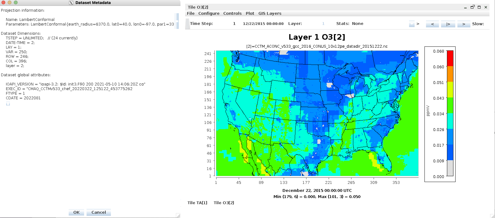
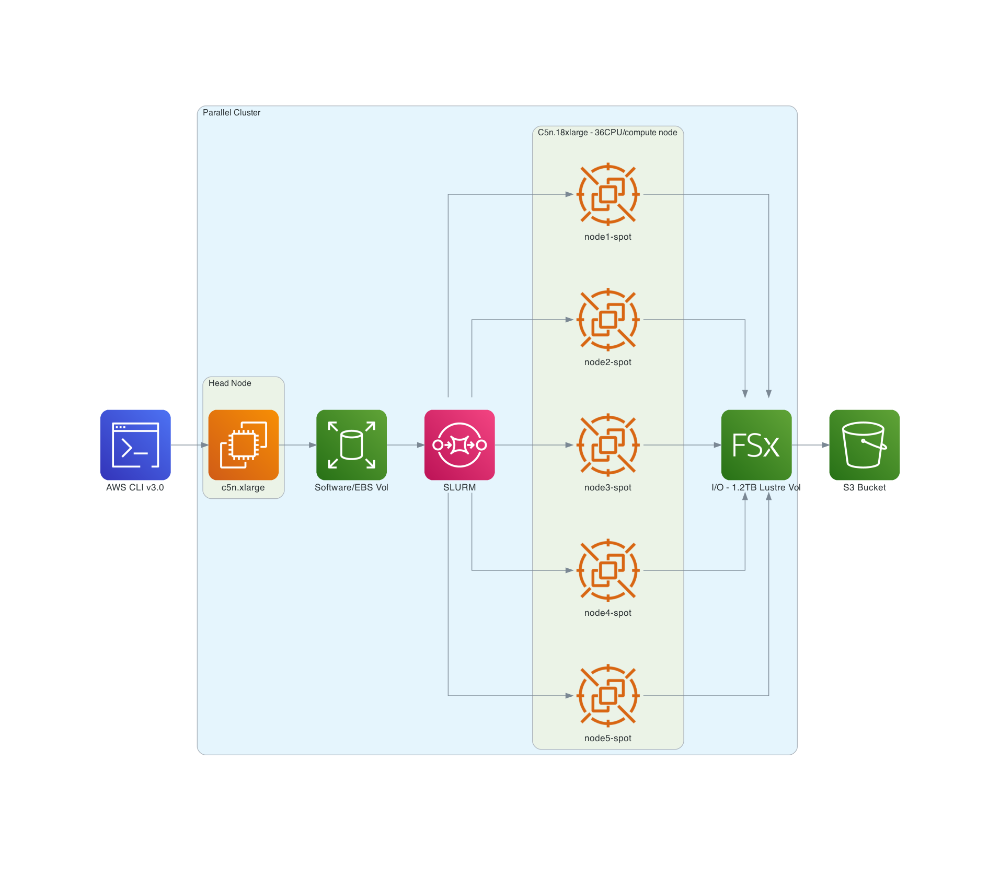

## Configurations for running CMAQ on AWS ParallelCluster

### Recommend that users set up a spending alarm using AWS 

Configure alarm to receive an email alert if you exceed $100 per month (or what ever monthly spending limit you need).

```{seealso}
See the AWS Tutorial on setting up an alarm for AWS Free Tier.
<a href="https://aws.amazon.com/getting-started/hands-on/control-your-costs-free-tier-budgets">AWS Free Tier Budgets</a>
```

## Software Requirements for CMAQ on AWS ParallelCluster

Tier 1: Native OS and associated system libraries, compilers

* Operating System: Ubuntu2004 
* Tcsh shell
* Git
* Compilers (C, C++, and Fortran) - GNU compilers version ≥ 8.3
* MPI (Message Passing Interface) -  OpenMPI ≥ 4.0
* Slurm Scheduler

Tier 2: additional libraries required for installing CMAQ 

* NetCDF (with C, C++, and Fortran support)
* I/O API
* R Software and packages

Tier 3: Software distributed thru the CMAS Center

* CMAQv533
* CMAQv533 Post Processors

Tier 4: R packages and Scripts

* R QA Scripts

Software on Local Computer

* AWS CLI v3.0 installed in a virtual environment
* pcluster is the primary AWS ParallelCluster CLI command. You use pcluster to launch and manage HPC clusters in the AWS Cloud and to create and manage custom AMI images
* Edit YAML Configuration Files using vi, nedit or other editor (yaml does not accept tabs as spacing)
* Git
* Mac - XQuartz for X11 Display
* Windows - MobaXterm  - to connect to ParallelCluster IP address

### AWS CLI v3.0 AWS Region Availability


```{note}
The scripts in this tutorial use the us-east-1 region, but the scripts can be modified to use any of the supported regions listed in the url below.
<a href="https://docs.aws.amazon.com/parallelcluster/latest/ug/supported-regions-v3.html">CLI v3 Supported Regions</a>
```


### CONUS 12US2 Domain Description

```
GRIDDESC
'12US2'
'12CONUS'     -2412000.0 -1620000.0 12000.0 12000.0 396 246 1
```




##  ParallelCluster Configuration for CONUS 12US2 Domain

```{note}
It is recommended to use a head node that is in the same family a the compute node so that the compiler options and executable is optimized for that processor type.
```

Recommended configuration of the ParallelCluster HPC head node and compute nodes to run the CMAQ CONUS benchmark for two days:

Head node:

* c5n.large

Compute Node:

* c5n.9xlarge (16 cpus/node with Multithreading disabled)
with 96 GiB memory, 50 Gbps Network Bandwidth, 9,500 EBS Bandwidth (Mbps) and Elastic Fabric Adapter (EFA)

or

* c5n.18xlarge  (36 cpus/node with Multithreading disabled)
with 192 GiB memory, 100 Gbps Network Bandwidth, 19,000 EBS Bandwidth (Mbps) and Elastic Fabric Adapter (EFA)


```{note}
Additional best practice of allowing the ParallelCluster to create a placement group .
<a href="https://docs.aws.amazon.com/parallelcluster/latest/ug/best-practices-v3.html>Network Performance</a>
<a href="https://docs.aws.amazon.com/AWSEC2/latest/UserGuide/placement-groups.html>Placement Groups</a>
```

This is specified in the yaml file in the slurm queue's network settings.

```
Networking:
  PlacementGroup:
    Enabled: true
```


```{note}
To provide the lowest latency and the highest packet-per-second network performance for your placement group, choose an instance type that supports enhanced networking. For more information, see Enhanced Networking.
<a href="https://docs.aws.amazon.com/AWSEC2/latest/UserGuide/enhanced-networking.html">Enhanced Networking (ENA)</a>
```

```{note}
Elastic Fabric Adapter(EFA)
"EFA provides lower and more consistent latency and higher throughput than the TCP transport traditionally used in cloud-based HPC systems. It enhances the performance of inter-instance communication that is critical for scaling HPC and machine learning applications. It is optimized to work on the existing AWS network infrastructure and it can scale depending on application requirements." "An EFA is an Elastic Network Adapter (ENA) with added capabilities. It provides all of the functionality of an ENA, with an additional OS-bypass functionality. OS-bypass is an access model that allows HPC and machine learning applications to communicate directly with the network interface hardware to provide low-latency, reliable transport functionality."
<a href="https://docs.aws.amazon.com/AWSEC2/latest/UserGuide/efa.html">Elastic Fabric Adapter(EFA)</a>
```


Figure 1. AWS Recommended ParallelCluster Configuration (Number of compute nodes depends on setting for NPCOLxNPROW and #SBATCH --nodes=XX #SBATCH --ntasks-per-node=YY )



