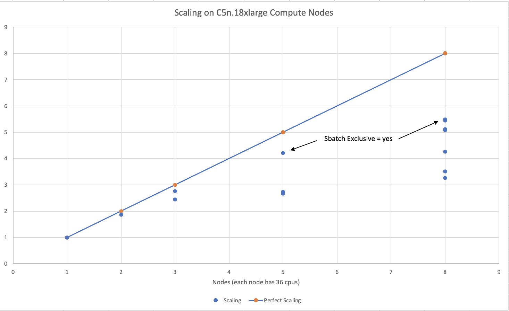

## Information on all the AWS options 
Recommended Parallel Cluster configurations for running CMAQ on AWS Parallel Cluster

### Please set up a alarm on AWS 

Configure alarm to receive an email alert if you exceed $100 per month (or what ever monthly spending limit you need).

## Software Requirements for CMAQ on AWS Parallel Cluster

Tier 1: Native OS and associated system libraries, compilers

* Operating System: Ubuntu2004 
* Tcsh shell
* Git
* Compilers (C, C++, and Fortran) - GNU compilers version ≥ 8.3
* MPI (Message Passing Interface) -  OpenMPI ≥ 4.0
* Slurm Scheduler

Tier 2: additional libraries required for installing CMAQ 

* NetCDF (with C, C++, and Fortran support)
* I/O API
* R Software and packages

Tier 3: Software distributed thru the CMAS Center

* CMAQv533
* CMAQv533 Post Processors

Tier 4: R packages and Scripts

* R QA Scripts

Software on Local Computer

* AWS CLI v3.0 installed in a virtual environment
* pcluster is the primary AWS ParallelCluster CLI command. You use pcluster to launch and manage HPC clusters in the AWS Cloud and to create and manage custom AMI images
* Edit YAML Configuration Files using vi, nedit or other editor (yaml does not accept tabs as spacing)
* Git
* Mac - XQuartz for X11 Display
* Windows - MobaXterm  - to connect to Parallel Cluster IP address

### AWS CLI v3.0 AWS Region Availability
Note, the scripts in this tutorial use the us-east-1 region, but the scripts can be modified to use any of the supported regions listed in the url below.

<a href="https://docs.aws.amazon.com/parallelcluster/latest/ug/supported-regions-v3.html">CLI v3 Supported Regions</a>


##  Parallel Cluster Configuration for CONUS Domain

Recommended configuration of the Parallel Cluster HPC head node and compute nodes to run the CMAQ CONUS benchmark for two days:

Head node:

* c5n.large

Compute Node:

* c5n.18xlarge  (36 cpus)
with 192 GiB memory, 14 Gbps EBS Bandwidth, and 100 Gbps Network Bandwidth

Figure 1. AWS Recommended Parallel Cluster Configuration (Number of compute nodes depends on setting for NPCOLxNPROW and #SBATCH --nodes=XX #SBATCH --ntasks-per-node=YY )


### Right-sizing Compute Nodes for the Parallel Cluster Configuration

The size of hardware depends on the domain size and resolution for  your CMAQ case, and how quickly your turn-around requirements are.
Larger hardware and memory configurations are also required for instrumented versions of CMAQ incuding CMAQ-ISAM and CMAQ-DDM3D.
The Parallel Cluster allows you to run the compute nodes only as long as the job requires, and you can also update the compute nodes as needed for your domain

### Slurm Compute Node Provisioning

AWS ParallelCluster doesn't make job allocation or scaling decisions. It simple tries to launch, terminate, and maintain resources according to Slurm’s instructions.

Number of compute nodes dispatched by the slurm scheduler is specified in the run script using #SBATCH --nodes=XX #SBATCH --ntasks-per-node=YY where the maximum value of tasks per node or YY limited by many CPUs are on the compute node.  

For c5n.18xlarge, there are 36 CPUs, so maximum value of YY is 36 or --ntask-per-node=36.  

If running a job with 180 processors, this would require the --nodes=XX or XX to be set to 5 compute nodes, as 36x5=180.  

The setting for NPCOLxNPROW must also be a maximum of 180, ie. 18 x 10 or 10 x 18 to use all of the CPUs in the parallel cluster.


<a href="https://aws.amazon.com/blogs/aws/new-c5n-instances-with-100-gbps-networking/">C5n Instance </a>

Each vCPU is a hardware hyperthread on the Intel Xeon Platinum 8000 series processor. You get full control over the C-states on the two largest sizes, allowing you to run a single core at up to 3.5 Ghz using Intel Turbo Boost Technology.

The new instances also feature a higher amount of memory per core, putting them in the current “sweet spot” for HPC applications that work most efficiently when there’s at least 4 GiB of memory for each core. The instances also benefit from some internal improvements that boost memory access speed by up to 19% in comparison to the C5 and C5d instances.

The C5n instances incorporate the fourth generation of our custom Nitro hardware, allowing the high-end instances to provide up to 100 Gbps of network throughput, along with a higher ceiling on packets per second. The Elastic Network Interface (ENI) on the C5n uses up to 32 queues (in comparison to 8 on the C5 and C5d), allowing the packet processing workload to be better distributed across all available vCPUs. 


Resources specified in the YAML file: 

* Ubuntu2004 
* Disable Simultaneous Multi-threading
* Spot Pricing 
* Shared EBS filesystem to insall software
* 1.2 TiB Shared Lustre file system with imported S3 Bucket (1.2 TiB is the minimum file size that you can specify for Lustre File System)
* Slurm Placement Group enabled
* Elastic Fabric Adapter Enabled on c5n.9xlarge and c5n.18xlarge

```<seealso>
https://aws.amazon.com/ec2/instance-types/c5/
```

```{note}
Pricing information in the tables below are subject to change. The links from which this pricing data was collected are listed below.
```

```<seealso>
<a href="https://aws.amazon.com/blogs/aws/new-c5n-instances-with-100-gbps-networking/">AWS c5n Pricing</a>
```

```<seealso>
<a href="https://aws.amazon.com/ec2/spot/pricing/">EC2 SPOT Pricing</a>
```

```<seealso>
<a href="https://aws.amazon.com/ec2/pricing/on-demand">EC2 On-Demand Pricing</a>
```

```<seealso>
<a href="https://docs.aws.amazon.com/parallelcluster/latest/ug/spot.html">Working with Spot Instances - Parallel Cluster</a>
```

## Spot versus On-Demand Pricing

Table 1. EC2 Instance On-Demand versus Spot Pricing (price is subject to change)

| Instance Name	| vCPUs |  RAM      |  EBS Bandwidth	| Network Bandwidth | Linux On-Demand Price | Linux Spot Price | 
| ------------  | ----- | --------  | ---------------   | ---------------   | --------------------  | ---------------  |
| c4.large	| 2	| 3.75 GiB  |   Moderate	|  500 Mbps         | 	$0.116/hour         | $0.0312/hour     |
| c4.8xlarge	| 36	| 60 GiB    |	10 Gbps	        |  4,000 Mbps       | 	$1.856/hour         | $0.5903/hour     |
| c5n.large	| 2	| 5.25 GiB  |	Up to 3.5 Gbps	| Up to 25 Gbps     |   $0.108/hour         | $0.0324/hour     |
| c5n.xlarge	| 4	| 10.5 GiB  |	Up to 3.5 Gbps	| Up to 25 Gbps     |   $0.216/hour         | $0.0648/hour     |
| c5n.2xlarge	| 8	| 21 GiB    |	Up to 3.5 Gbps	| Up to 25 Gbps     |   $0.432/hour         | $0.1740/hour     |
| c5n.4xlarge	| 16	| 42 GiB    | 	3.5 Gbps	| Up to 25 Gbps     |   $0.864/hour         | $0.2860/hour     |
| c5n.9xlarge	| 36	| 96 GiB    |	7 Gbps	        | 50 Gbps           |   $1.944/hour         | $0.5971/hour     |
| c5n.18xlarge	| 72	| 192 GiB   |	14 Gbps	        | 100 Gbps          |   $3.888/hour         | $1.1732/hour     |

Using c5n.18xlarge as the compute node, it costs (3.888/hr)/(1.1732/hr) = 3.314 times as much to run on demand versus spot pricing.

## Benchmark Timing Results

Table 2. Timing Results for CMAQv5.3.3 2 Day CONUS2 Run on Parallel Cluster with c5n.large head node and C5n.18xlarge Compute Nodes

| Number of PEs | #Nodesx#CPU | NPCOLxNPROW | Day1 Timing (sec) | Day2 Timing (sec) | Total Time(2days)(sec) | Hours/day | SBATCH --exclusive | Data Imported or Copied | DisableSimultaneousMultithreading(yaml)| with -march=native | Answers Matched | Cost using Spot Pricing | Cost using On Demand Pricing | 
| ------------- | -----------    | -----------   | ----------------     | ---------------      | -------------------        | ------------------ | --------------          | ---------                              |   -------- | --------- | ------ | ---- | ----- |
| 36            |  1x36          | 6x6           | 6726.72 | 5821.47   |   12548.19      | 1.7          |  yes         | imported     | true               | yes                   |                      |    1.1732/hr * 1 node * 3.486 hr= $4.09           | 3.888/hr * 1 node * 3.496 hr = $13.59 |
| 72            |  2x36          | 6x12          | 3562.50 | 3151.21   |    6713.71      | .95          |  yes         | imported     |  true              | yes                   | 6x12 did not match 12x9  | 1.1732/hr * 2 nodes * 1.8649 hr = $4.37 | 3.888/hr * 2 nodes * 1.8649 = $14.5  |
| 72            |  2x36        | 8x9             | 3665.65 | 3159.12   |    6824.77      | .95           |  yes         | imported     |  true              | yes                   |                          | 1.1732/hr * 2 nodes * 1.8649 hr = $4.37 | 3.888/hr * 2 nodes * 1.8649 = $14.5  |
| 72            |  2x36        | 9x8             | 3562.61 | 2999.69   |    6562.30      |  .91          |  yes         | imported     |  true              | yes                   |                          | 1.1732/hr * 2 nodes * 1.8649 hr = $4.37 | 3.888/hr * 2 nodes * 1.8649 = $14.5  |
| 108           |  3x36          | 6x18          | 2415.46 | 2135.26   | 4550.72          | .63     |  yes                | imported                | true                   |   yes  | 6x12 does match 6x18   |     1.1732/hr * 3 nodes * 1.26 hr = $4.45           |   3.888/hr * 3 nodes * 1.26  = $14.7  |
| 108           | 3x36           | 12x9          | 2758.01 | 2370.92   | 5128.93          | .71     |  yes                | imported                | true         |  yes |  6x12 did not match 12x9 |   1.1732/hr * 3 nodes * 1.42 hr = $5.01    |   3.888/hr * 3 nodes * 1.42 hr = $16.6                                    |
| 180           |  5x36          | 10x18         | 2481.55  | 2225.34  |    4706.89     | .65            |  no               | copied                  |  false           | yes              |            | 1.1732/hr * 5 nodes * 1.307 hr = $7.66 | 3.888/hr * 5 nodes * 1.307 hr = $25.4 |
| 180           |  5x36          | 10x18         | 2378.73    | 2378.73    |    4588.92    | .637             |  no                | copied                  |  true        | yes       | 10x18 did not match 16x18 | 1.1732/hr * 5 nodes * 1.2747 = $7.477 | $ 24.77 |
| 180           |  5x36          | 10x18         | 1585.67        | 1394.52  |    2980.19  | .41         |  yes                | imported    |  true        |   yes |          | 1.1732/hr * 5nodes * 2980.9 / 3600 = $4.85 | $16.05 | 
| 256           |  8x32          | 16x16         |  1289.59       | 1164.53  |    2454.12  | .34         |  no                 |  copied           |  true    | yes |            | 1.1732/hr * 8nodes * 2454.12 / 3600 = $6.398  | $21.66 |
| 256           |  8x32          | 16x16         |  1305.99       | 1165.30  |    2471.29  | .34         |  no                |   copied    |   true    |  yes |           | 1.1732/hr * 8nodes * 2471.29 / 3600 = $6.44 | $21.11 |
| 256           |  8x32          | 16x16         |  1564.90       | 1381.80  |    2946.70   | .40        |  no                |   imported  | true   |   yes |         | 1.1732/hr * 8nodes * 2946.7 / 3600 = $7.68 | $25.55 |
| 288           |  8x36          | 16x18         | 1873.00        | 1699.24  |     3572.2   | .49        |  no                |  copied     |    false | yes |            | 1.1732/hr * 8nodes * 3572.2/3600= $9.313  | $30.8 |
| 288           |  8x36          |  16x18        |  1976.35       | 1871.61   |   3847.96   | .53       |  no                |  copied     |  true   | yes |            | 1.1732/hr * 8nodes * 3847.96=$10.0 | $33.18 |
| 288           |  8x36          | 16x18         |  1197.19       | 1090.45  |     2287.64  | .31        |  yes               |  copied     |  true   | yes |             16x18 matched 16x16 | 1.1732/hr * 8nodes * 2297.64=$5.99 | $19.81
| 288           |  8x36          | 18x16         | 1206.01        | 1095.76  |     2301.77  | .32        |  yes               |  imported   |  true        |             |   | 1.1732/hr * 8nodes * 2301.77=$6.00 | $19.46 |
| 360           | 10x36          | 18x20         |   unable to provision  |                 |            |                     |                    |  imported   |  true        |    yes         |       |        |

Figure 2. Scaling on C5n.18xlarge Compute Nodes (36 cpu/node)




Table 3. Timing Results for CMAQv5.3.3 2 Day CONUS2 Run on Parallel Cluster with c5n.large head node and C5n.9xlarge Compute Nodes

| Number of PEs | #Nodesx#CPU | NPCOLxNPROW | Day1 Timing (sec) | Day2 Timing (sec) | Total Time(2days)(sec) | SBATCH --exclusive | Data Imported or Copied | DisableSimultaneousMultithreading(yaml)| with -march=native | Answers Matched | Cost using Spot Pricing | Cost using On Demand Pricing |
| ------------- | -----------    | -----------   | ----------------     | ---------------      | -------------------        | ------------------ | --------------          | ---------                              |   -------- | --------- | ------ | ---- |
| 18            |  1x18          | 3x6           |               |               |                    |  yes         | imported     | true               | yes                   |                      |    0.5971/hr * 1 node * ? hr= $?           | 1.944/hr * 1 node * ? hr = $? |
| 36            |  2x18          | 6x6           |               |               |                    |  yes         | imported     | true               | yes                   |                      |    0.5971/hr * 2 node * ? hr= $?           | 1.944/hr * 2 node * ? hr = $? |
| 54            |  3x18          | 6x9           |               |               |                    |  yes         | imported     | true               | yes                   |                      |    0.5971/hr * 3 node * ? hr= $?           | 1.944/hr * 3 node * ? hr = $? |
| 72            |  4x18          | 8x9           |               |               |                    |  yes         | imported     | true               | yes                   |                      |    0.5971/hr * 4 node * ? hr= $?           | 1.944/hr * 4 node * ? hr = $? |
| 90            |  5x18          | 9x10          |               |               |                    |  yes         | imported     | true               | yes                   |                      |    0.5971/hr * 5 node * ? hr= $?           | 1.944/hr * 5 node * ? hr = $? |
| 108            |  6x18          | 9x12         |               |               |                    |  yes         | imported     | true               | yes                   |                      |    0.5971/hr * 6 node * ? hr= $?           | 1.944/hr * 6 node * ? hr = $? |
| 126            |  7x18          | 9x14         |               |               |                    |  yes         | imported     | true               | yes                   |                      |    0.5971/hr * 7 node * ? hr= $?           | 1.944/hr * 7 node * ? hr = $? |
| 144            |  8x18          | 12x12        |               |               |                    |  yes         | imported     | true               | yes                   |                      |    0.5971/hr * 8 node * ? hr= $?           | 1.944/hr * 8 node * ? hr = $? |
| 162            |  9x18          | 9x18        |               |               |                    |  yes         | imported     | true               | yes                   |                      |    0.5971/hr * 9 node * ? hr= $?           | 1.944/hr * 9 node * ? hr = $? |
| 180            |  10x18          | 10x18        |               |               |                    |  yes         | imported     | true               | yes                   |                   |    0.5971/hr * 10 node * ? hr= $?           | 1.944/hr * 10 node * ? hr = $? |


Example screenshots of the AWS Cost Explorer Graphs were obtained after running several of the CMAQ Benchmarks, varying # nodes and # cpus and NPCOL/NPROW.  These costs are of a two day session of running CMAQ on the Parallel Cluster, and should only be used to understand the relative cost of the EC2 instances (head node and compute nodes), compared to the storage, and network costs.

In Figure 3 The Cost Explorer Display shows the cost of different EC2 Instance Types: note that c5n.18xlarge is highest cost - as these are used as the compute nodes

Figure 3. Cost by Instance Type - AWS Console 


In Figure 4 The Cost Explorer displays a graph of the cost categorized by usage by spot or OnDemand, NatGateway, or Timed Storage. Note: spot-c5n.18xlarge is highest generating cost resource, but other resources such as storage on the EBS volume and the network NatGatway or SubnetIDs also incur costs

Figure 4. Cost by Usage Type - AWS Console 


In Figure 5 The Cost Explorer Display shows the cost by Services including EC2 Instances, S3 Buckets, and FSx Lustre File Systems

Figure 5. Cost by Service Type - AWS Console


### Compute Node Cost Estimate

Head node c5n.large compute cost = entire time that the parallel cluster is running ( creation to deletion) = 6 hours * $0.0324/hr = $ .1944 using spot pricing, 6 hours * $.108/hr = $.648 using on demand pricing.

Total c5n.18xlarge cost of Running Benchmarking Suite using ONDEMAND pricing = $297
(sum the cost of all of the runs in the above table assuming ONDEMAND pricing)

Total c5n.18xlarge cost of Running Benchmarking Suite using SPOT pricing = $89


Using 288 cpus on the Parallel Cluster, it would take ~4.832 days to run a full year, using 8 c5n.18xlarge compute nodes.

Table 3. Extrapolated Cost of c5n.18xlarge used for CMAQv5.3.3 Annual Simulation based on 2 day CONUS benchmark

| Benchmark Case | Number of PES |  Number of c5n.18xlarge Nodes | Pricing    |   Cost per node | Time to completion (hour)   | Extrapolate Cost for Annual Simulation                 |  
| -------------  | ------------  |  --------------- | -------    |  -------------- | ------------------          |  --------------------------------------------------    |
| 2 day CONUS    |  288          |          8       |    SPOT    |    1.1732/hour |     2287.64/3600 = .635455  |    .635455/2 * 365 = 115.97 hours/node * 8 nodes = 927.7 * $1.1732 = $1088.4 |
| 2 day CONUS    |  288          |          8       |  ONDEMAND  |    3.888/hour   |     2287.64/3600 = .635455  |    .635455/2 * 365 = 115.97 hours/node * 8 nodes = 927.7 * $3.888 = $3606.9 |


<a href="https://aws.amazon.com/fsx/lustre/pricing/">AWS Lustre Pricing</a>


Table 4. Lustre SSD File System Pricing for us-east-1 region

| Storage Type | Storage options   | 	Pricing with data compression enabled*	| Pricing (monthly)  |
| --------     | ----------------  |   ------------------------------------    | -----------------  |
| Persistent   | 125 MB/s/TB       | 	$0.073                                  |	$0.145/month |
| Persistent   | 250 MB/s/TB       | 	$0.105                                  |	$0.210/month |
| Persistent   | 500 MB/s/TB       | 	$0.170                                  | 	$0.340/month |
| Persistent   | 1,000 MB/s/TB     |   $0.300                                  | 	$0.600/month | 
| Scratch      | 200/MB/s/TiB      |    $0.070 	                               |        $0.140/month |	

Note, there is a difference in the storage sizing units that were obtained from AWS. 
See the following article for additional information:
<a href="https://www.techtarget.com/searchstorage/definition/tebibyte-TiB#:~:text=Tebibyte%20vs.&text=One%20tebibyte%20is%20equal%20to,when%20talking%20about%20storage%20capacity">TB vs TiB</a>

One tebibyte is equal to 240 or 1,099,511,627,776 bytes. 
One terabyte is equal to 1012 or 1,000,000,000,000 bytes. 
A tebibyte equals nearly 1.1 TB. 
That's about a 10% difference between the size of a tebibyte and a terabyte, which is significant when talking about storage capacity.

Lustre Scratch SSD 200 MB/s/TiB is tier of the storage pricing that we have configured in the yaml for the cmaq parallel cluster.

<a href="https://docs.aws.amazon.com/parallelcluster/latest/ug/SharedStorage-v3.html#SharedStorage-v3-FsxLustreSettings">YAML FSxLustreSettings</a>

Cost example:
    0.14 USD per month / 730 hours in a month = 0.00019178 USD per hour

Note: 1.2 TiB is the minimum file size that you can specify for the lustre file system

    1,200 GiB x 0.00019178 USD per hour x 24 hours x 5 days = 27.6 USD

Question is 1.2 TiB enough for the output of a yearly CMAQ run?

For the output data, assuming 2 day CONUS Run, all 35 layers, all 244 variables in CONC output

```
cd /fsx/data/output/output_CCTM_v532_gcc_2016_CONUS_16x8pe_full
du -sh
```

Size of output directory when CMAQ is run to output all 35 layers, all 244 variables in the CONC file, includes all other output files

```
173G .
```

So we need 86.5 GB per day

Storage requirement for an annual simulation if you assumed you would keep all data on lustre filesystem

     86.5 GB * 365 days = 31,572.5 GB  = 31.5 TB


### Annual simulation local storage cost estimate

Assuming it takes 5 days to complete the annual simulation, and after the annual simulation is completed, the data is moved to archive storage.

     31,572.5 GB x 0.00019178 USD per hour x 24 hours x 5 days = $726.5 USD


To reduce storage requirements; after the CMAQ run is completed for each month, the post-processing scripts are run and completed, and then the CMAQ Output data for that month is moved from the Lustre Filesystem to the Archived Storage. Monthly data volume storage requirements to store 1 month of data on the lustre file system is approximately 86.5 x 30 days = 2,595 GB or 2.6 TB.  

      2,595 GB x 0.00019178 USD per hour x 24 hours x 5 days = $60 USD


Estimate for S3 Bucket cost for storing an annual simulation

<a href="https://aws.amazon.com/s3/pricing/?p=pm&c=s3&z=4">S3 Storage Pricing Tiers</a>

| S3 Standard - General purpose storage |    Storage Pricing  |
| ------------------------------------  |    --------------   |
| First 50 TB / Month                   |     $0.023 per GB   |
| Next 450 TB / Month                   |     $0.022 per GB   |
| Over 500 TB / Month                   |     $0.021 per GB   |


### Archive Storage cost estimate for annual simulation - assuming you want to save it for 1 year

31.5 TB * 1024 GB/TB * .023 per GB * 12 months  = $8,903

| S3 Glacier Flexible Retrieval (Formerly S3 Glacier) |    Storage Pricing |
| --------------------------------------------------  |    --------------  |
| long-term archives with retrieval option from 1 minute to 12 hours|      |	
| All Storage / Month| 	$0.0036 per GB   |

S3 Glacier Flexible Retrieval Costs 6.4 times less than the S3 Standard

31.5 TB * 1024 GB/TB * $.0036 per GB * 12 months  = $1393.0 USD

Lower cost option is S3 Glacier Deep Archive (accessed once or twice a year, and restored in 12 hours)

31.5 TB * 1024 GB/TB * $.00099 per GB * 12 months  = $383 USD


## Recommended Workflow for extending to annual run

Post-process monthly save output and/or post-processed outputs to S3 Bucket at the end of each month.

Still need to determine size of post-processed output (combine output, etc).

      86.5 GB * 31 days = 2,681.5 GB * 1 TB/1024 GB =  2.62 TB

Cost for lustre storage of a monthly simulation

      2,681.5 GB x 0.00019178 USD per hour x 24 hours x 5 days = $61.7 USD

Goal is to develop a reproducable workflow that does the post processing after every month, and then copies what is required to the S3 Bucket, so that only 1 month of output is imported at a time to the lustre scratch file system from the S3 bucket.
This workflow will help with preserving the data in case the cluster or scratch file system gets pre-empted.

