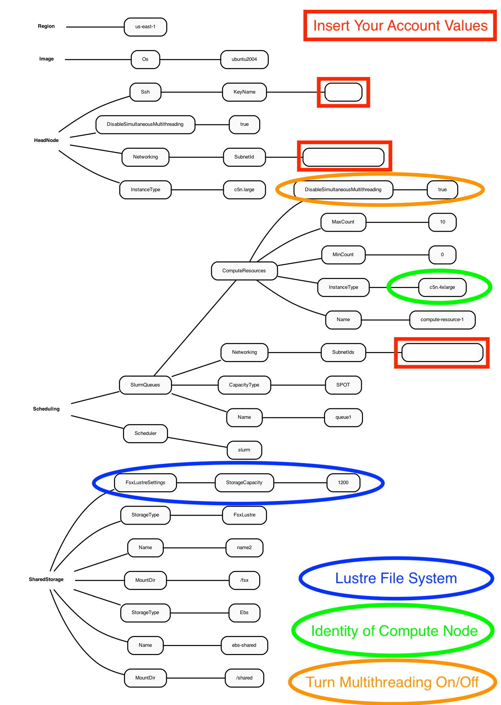

# Create CMAQ Cluster using SPOT pricing

## Use an existing yaml file from the git repo to create a parallel cluster

```
cd /shared/build
```

### Use a configuration file from the github repo that was cloned to your local machine

```
git clone -b main https://github.com/lizadams/pcluster-cmaq.git pcluster-cmaq
```


```
cd pcluster-cmaq
```

###  edit the c5n-4xlarge.yaml
NOTE: the c5n-4xlarge.yaml is configured to use SPOT instances for the compute nodes


`vi c5n-4xlarge.yaml`

### replace the key pair and subnet ID in the c5n-4xlarge.yaml file with the values created when you configured the demo cluster

```
Region: us-east-1
Image:
  Os: ubuntu2004
HeadNode:
  InstanceType: c5n.large
  Networking:
    SubnetId: subnet-018cfea3edf3c4765  << replace
  DisableSimultaneousMultithreading: true
  Ssh:
    KeyName: centos                     << replace
Scheduling:
  Scheduler: slurm
  SlurmQueues:
    - Name: queue1
      CapacityType: SPOT
      Networking:
        SubnetIds:
          - subnet-018cfea3edf3c4765    << replace
      ComputeResources:
        - Name: compute-resource-1
          InstanceType: c5n.4xlarge
          MinCount: 0
          MaxCount: 10
          DisableSimultaneousMultithreading: true
SharedStorage:
  - MountDir: /shared
    Name: ebs-shared
    StorageType: Ebs
  - MountDir: /fsx
    Name: name2
    StorageType: FsxLustre
    FsxLustreSettings:
      StorageCapacity: 1200
```

### Yaml file for the c5n-4xlarge contains the settings as shown in the following diagram.

Figure 1. Diagram of YAML file used to configure a Parallel Cluster with a c5n.large head node and c5n.4xlarge compute nodes using SPOT pricing



## Create the c5n-4xlarge pcluster

`pcluster create-cluster --cluster-configuration c5n-4xlarge.yaml --cluster-name cmaq --region us-east-1`

### Check on status of cluster

`pcluster describe-cluster --region=us-east-1 --cluster-name cmaq`


After 5-10 minutes, you see the following status: "clusterStatus": "CREATE_COMPLETE"

### Start the compute nodes

`pcluster update-compute-fleet --region us-east-1 --cluster-name cmaq --status START_REQUESTED`

#### Login to cluster
(note, replace the centos.pem with your Key Pair)

`pcluster ssh -v -Y -i ~/centos.pem --cluster-name cmaq`

### Show compute nodes

`scontrol show nodes`

## Update the compute nodes

### Before building the software, verify that you can update the compute nodes from the c5n.4xlarge to c5n.18xlarge 

The c5n.18xlarge requires that the elastic network adapter is enabled in the yaml file. Exit the pcluster and return to your local command line
If you only modified the yaml file to update the compute node identity, without making additional updates to the network and other settings, then you would not achieve all of the benefits of using the c5n.18xlarge compute node in the parallel cluster.

### Exit the cluster

`exit`


### Stop the compute nodes

`pcluster update-compute-fleet --region us-east-1 --cluster-name cmaq --status STOP_REQUESTED`

### Verify that the compute nodes are stopped

`pcluster describe-cluster --region=us-east-1 --cluster-name cmaq`

keep rechecking until you see the following status "computeFleetStatus": "STOPPED",


### YAML file for c5n.xlarge head node and c5n18xlarge compute Node

Figure 2. Diagram of YAML file used to configure a Parallel Cluster with a c5n-xlarge head node and c5n-18xlarge compute nodes(36CPU per Node)


Note, the c5n-18xlarge yaml configuration file contains a setting for PlacementGroup.

```
PlacementGroup:
          Enabled: true
```
 
A placement group is used to get the lowest inter-node latency. 

A placement group guarantees that your instances are on the same networking backbone. 


### Update compute node from c5n4xlarge to c5n.n18xlarge

You will need to edit the c5n-18xlarge.yaml to specify your KeyName and SubnetId (use the values generated in your new-hello-world.yaml) This yaml file specifies ubuntu2004 as the OS, c5n.large for the head node, c5n.18xlarge as the compute nodes and both a /shared Ebs directory(for software install) and a /fsx Lustre File System (for Input and Output Data) and enables the elastic fabric adapter.

`vi c5n-18xlarge.yaml`

Output:

```
Region: us-east-1
Image:
  Os: ubuntu2004
HeadNode:
  InstanceType: c5n.large
  Networking:
    SubnetId: subnet-018cfea3edf3c4765      <<<  replace
  DisableSimultaneousMultithreading: true
  Ssh:
    KeyName: centos                         <<<  replace
Scheduling:
  Scheduler: slurm
  SlurmSettings:
    ScaledownIdletime: 5
  SlurmQueues:
    - Name: queue1
      CapacityType: SPOT
      Networking:
        SubnetIds:
          - subnet-018cfea3edf3c4765         <<<  replace
        PlacementGroup:
          Enabled: true
      ComputeResources:
        - Name: compute-resource-1
          InstanceType: c5n.18xlarge
          MinCount: 0
          MaxCount: 10
          DisableSimultaneousMultithreading: true
          Efa:                                     <<< Note new section that enables elastic fabric adapter
            Enabled: true
            GdrSupport: false
SharedStorage:
  - MountDir: /shared
    Name: ebs-shared
    StorageType: Ebs
  - MountDir: /fsx
    Name: name2
    StorageType: FsxLustre
    FsxLustreSettings:
      StorageCapacity: 1200
```

### Update cluster to use c5n.18xlarge compute node

`pcluster update-cluster --region us-east-1 --cluster-name cmaq --cluster-configuration c5n-18xlarge.yaml`

### Verify that the compute nodes have been updated

`pcluster describe-cluster --region=us-east-1 --cluster-name cmaq`

### Re-start the compute nodes

`pcluster update-compute-fleet --region us-east-1 --cluster-name cmaq --status START_REQUESTED`

### Login to updated cluster
(note, replace the centos.pem with your Key Pair)

`pcluster ssh -v -Y -i ~/centos.pem --cluster-name cmaq`

### Check to make sure elastic network adapter (ENA) is enabled

`modinfo ena`

`lspci`

### Check what modules are available on the cluster

`module avail`

### Load the openmpi module

`module load openmpi/4.1.1`

### Load the Libfabric module

`module load libfabric-aws/1.13.0amzn1.0`

### Verify the gcc compiler version is greater than 8.0

`gcc --version`

output:

```
gcc (Ubuntu 9.3.0-17ubuntu1~20.04) 9.3.0 Copyright (C) 2019 Free Software Foundation, Inc. This is free software; see the source for copying conditions. There is NO warranty; not even for MERCHANTABILITY or FITNESS FOR A PARTICULAR PURPOSE.
```

See instructions for installing and running CMAQ on cluster.

<a href="https://docs.aws.amazon.com/AWSEC2/latest/UserGuide/enhanced-networking-ena.html#test-enhanced-networking-ena">Link to the Amazon Website">Enhanced Networking Adapter Documentation</a>

### Tips to managing the parallel cluster

1. The head node can be stopped from the AWS Console after stopping compute nodes of the cluster, as long as it is restarted before issuing the command to restart the cluster.
2. The pcluster slurm queue system will create and destroy the compute nodes, so that helps reduce manual cleanup for the cluster.
3. The compute nodes are terminated after they have been idle for a period of time. The yaml setting used for this is as follows: SlurmSettings: ScaledownIdletime: 5
4. The default idle time is 10 minutes, but I have seen the compute nodes stay up longer than that, so it is important to double check, as you are charged when the compute nodes are available, even if they are not running a job.
5. copy/backup the outputs and logs to an s3 bucket for follow-up analysis
6. After copying output and log files to the s3 bucket the cluster can be deleted
7. Once the pcluster is deleted all of the volumes, head node, and compute node will be terminated, and costs will only be incurred by the S3 Bucket storage.

#### Pcluster User Manual

<a href="https://docs.aws.amazon.com/parallelcluster/latest/ug/what-is-aws-parallelcluster.html">Parallel Cluster User Manual</a>

### Note, if you are going to run the CMAQ Benchmark using Option 1 then you can delete this cluster.

#### Exit the cluster

`exit`

#### Delete the demo cluster

`pcluster delete-cluster --cluster-name cmaq --region us-east-1`

### If you plan to install CMAQ software and libraries yourself following Option 2, then skip option 1 and continue to use this cluster
