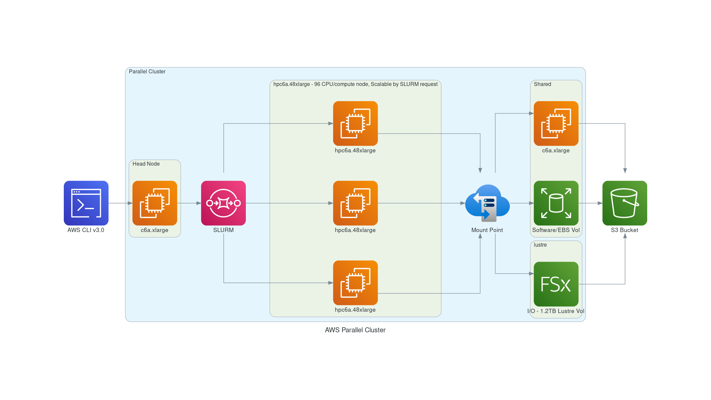

CMAQv5.3.3 CONUS 2 Benchmark Tutorial using 12US2 Domain

## Use ParallelCluster pre-installed with CMAQv5.3.3 software and 12US2 Benchmark

Step by step instructions for running the CMAQ 12US2 Benchmark for 2 days on a ParallelCluster.

### Obtain YAML file pre-loaded with input data and software 

#### Choose a directory on your local machine to obtain a copy of the github repo.

`cd /your/local/machine/install/path/`

#### Use a configuration file from the github by cloning the repo to your local machine 

`git clone -b main https://github.com/CMASCenter/pcluster-cmaq.git pcluster-cmaq`


`cd pcluster-cmaq`

```{note} To find the default settings for Lustre see:
<a href="https://docs.aws.amazon.com/parallelcluster/latest/ug/SharedStorage-v3.html#SharedStorage-v3-FsxLustreSettings">Lustre Settings for ParallelCluster</a>
```

### Examine Diagram of the YAML file to build pre-installed software and input data. 
Includes Snapshot ID of volume pre-installed with CMAQ software stack and name of S3 Bucket to import data to the Lustre Filesystem

Figure 1. Diagram of YAML file used to configure a ParallelCluster with a c5n.large head node and c5n.18xlarge compute nodes with Software and Data Pre-installed (linked on lustre filesystem)



### Edit Yaml file 

This Yaml file specifies the /shared directory that contains the CMAQv5.3.3 and libraries, and the input data that will be imported from an S3 bucket to the /fsx lustre file system
Note, the following yaml file is using a hpc6a-48xlarge compute node, and is using ONDEMAND pricing. 

```{note}
Edit the hpc6a.48xlarge.ebs_unencrypted_installed_public_ubuntu2004.ebs_200.fsx_import_east-2b.yaml file to specify your subnet-id and your keypair prior to creating the cluster
In order to obtain these subnet id you will need to run pcluster configure
```

```
pcluster configure -r us-east-2 --config hpc6a.48xlarge.ebs.fsx.us-east-2.yaml
```

Example of the answers that were used to create the yaml for this benchmark:

```
Allowed values for EC2 Key Pair Name:
1. xxx-xxx
2. xxx-xxx-xxx
EC2 Key Pair Name [xxx-xxx]: 1
Allowed values for Scheduler:
1. slurm
2. awsbatch
Scheduler [slurm]: 1
Allowed values for Operating System:
1. alinux2
2. centos7
3. ubuntu1804
4. ubuntu2004
Operating System [alinux2]: 4
Head node instance type [t2.micro]: c6a.xlarge
Number of queues [1]: 
Name of queue 1 [queue1]: 
Number of compute resources for queue1 [1]: 1
Compute instance type for compute resource 1 in queue1 [t2.micro]: hpc6a.48xlarge
The EC2 instance selected supports enhanced networking capabilities using Elastic Fabric Adapter (EFA). EFA enables you to run applications requiring high levels of inter-node communications at scale on AWS at no additional charge (https://docs.aws.amazon.com/parallelcluster/latest/ug/efa-v3.html).
Enable EFA on hpc6a.48xlarge (y/n) [y]: y
Maximum instance count [10]: 
Enabling EFA requires compute instances to be placed within a Placement Group. Please specify an existing Placement Group name or leave it blank for ParallelCluster to create one.
Placement Group name []: 
Automate VPC creation? (y/n) [n]: y
Allowed values for Availability Zone:
1. us-east-2b
Availability Zone [us-east-2b]: 
Allowed values for Network Configuration:
1. Head node in a public subnet and compute fleet in a private subnet
2. Head node and compute fleet in the same public subnet
Network Configuration [Head node in a public subnet and compute fleet in a private subnet]: 2
Beginning VPC creation. Please do not leave the terminal until the creation is finalized
Creating CloudFormation stack...
Do not leave the terminal until the process has finished.
Status: parallelclusternetworking-pub-20230123170628 - CREATE_COMPLETE          
The stack has been created.
Configuration file written to hpc6a.48xlarge.ebs.fsx.us-east-2.yaml
You can edit your configuration file or simply run 'pcluster create-cluster --cluster-configuration hpc6a.48xlarge.ebs.fsx.us-east-2.yaml --cluster-name cluster-name --region us-east-2' to create your cluster.
```


`vi hpc6a.48xlarge.ebs_unencrypted_installed_public_ubuntu2004.ebs_200.fsx_import_east-2b.yaml`

Output:

```
Region: us-east-2
Image:
  Os: ubuntu2004
HeadNode:
  InstanceType: c6a.xlarge
  Networking:
    SubnetId: subnet-xx-xx-xx                           <<< replace subnetID
  DisableSimultaneousMultithreading: true
  Ssh:
    KeyName: your-key                                   <<< replace keyname
  LocalStorage:
    RootVolume:
      Encrypted: false
Scheduling:
  Scheduler: slurm
  SlurmSettings:
    ScaledownIdletime: 5
  SlurmQueues:
    - Name: queue1
      CapacityType: ONDEMAND 
      Networking:
        SubnetIds:
          - subnet-xx-xx-xxx                            <<< replace subnetID
        PlacementGroup:
          Enabled: true
      ComputeResources:
        - Name: compute-resource-1
          InstanceType: hpc6a.48xlarge
          MinCount: 0
          MaxCount: 10
          DisableSimultaneousMultithreading: true
          Efa:
            Enabled: true
            GdrSupport: false
SharedStorage:
  - MountDir: /shared
    Name: ebs-shared
    StorageType: Ebs
    EbsSettings:
      VolumeType: gp3
      Size: 500
      Encrypted: false
      SnapshotId: snap-0f9592e0ea1749b5b
  - MountDir: /fsx
    Name: name2
    StorageType: FsxLustre
    FsxLustreSettings:
      StorageCapacity: 1200
      ImportPath: s3://cmas-cmaq-conus2-benchmark
```


## Create CMAQ ParallelCluster with software/data pre-installed

`pcluster create-cluster --cluster-configuration hpc6a.48xlarge.ebs_unencrypted_installed_public_ubuntu2004.ebs_200.fsx_import_east-2b.yaml --cluster-name cmaq --region us-east-2`

Output:

```
{
  "cluster": {
    "clusterName": "cmaq",
    "cloudformationStackStatus": "CREATE_IN_PROGRESS",
    "cloudformationStackArn": "arn:aws:cloudformation:us-east-2:440858712842:stack/cmaq/6cfb1a50-6e99-11ec-8af1-0ea2256597e5",
    "region": "us-east-2",
    "version": "3.0.2",
    "clusterStatus": "CREATE_IN_PROGRESS"
  }
}

```

Check status again

`pcluster describe-cluster --region=us-east-2 --cluster-name cmaq`

Output:

```
{
  "creationTime": "2022-01-06T02:36:18.119Z",
  "version": "3.0.2",
  "clusterConfiguration": {
    "url": "
  },
  "tags": [
    {
      "value": "3.0.2",
      "key": "parallelcluster:version"
    }
  ],
  "cloudFormationStackStatus": "CREATE_IN_PROGRESS",
  "clusterName": "cmaq",
  "computeFleetStatus": "UNKNOWN",
  "cloudformationStackArn": 
  "lastUpdatedTime": "2022-01-06T02:36:18.119Z",
  "region": "us-east-2",
  "clusterStatus": "CREATE_IN_PROGRESS"
}
```

Note, the snapshot image used is smaller than the EBS volume requested in the yaml file.
Therefore you will get a warning from Parallel Cluster:

```
pcluster create-cluster --cluster-configuration hpc6a.48xlarge.ebs_unencrypted_installed_public_ubuntu2004.ebs_200.fsx_import_east-2b.yaml --cluster-name cmaq --region us-east-2
{
  "cluster": {
    "clusterName": "cmaq",
    "cloudformationStackStatus": "CREATE_IN_PROGRESS",
    "cloudformationStackArn": "arn:aws:cloudformation:us-east-2:440858712842:stack/cmaq/276abf10-94fc-11ed-885c-02032a236214",
    "region": "us-east-2",
    "version": "3.1.2",
    "clusterStatus": "CREATE_IN_PROGRESS"
  },
  "validationMessages": [
    {
      "level": "WARNING",
      "type": "EbsVolumeSizeSnapshotValidator",
      "message": "The specified volume size is larger than snapshot size. In order to use the full capacity of the volume, you'll need to manually resize the partition according to this doc: https://docs.aws.amazon.com/AWSEC2/latest/UserGuide/recognize-expanded-volume-linux.html"
    }
  ]
}
```

After 5-10 minutes, check the status again and recheck until you see the following status: "clusterStatus": "CREATE_COMPLETE"

Check status again

`pcluster describe-cluster --region=us-east-2 --cluster-name cmaq`

Output:

```
  "cloudFormationStackStatus": "CREATE_COMPLETE",
  "clusterName": "cmaq",
  "computeFleetStatus": "RUNNING",
  "cloudformationStackArn": "arn:aws:cloudformation:us-east-1:440858712842:stack/cmaq/3cd2ba10-c18f-11ec-9f57-0e9b4dd12971",
  "lastUpdatedTime": "2022-04-21T16:22:28.879Z",
  "region": "us-east-2",
  "clusterStatus": "CREATE_COMPLETE"
```

Start the compute nodes, if the computeFleetStatus is not set to RUNNING

`pcluster update-compute-fleet --region us-east-1 --cluster-name cmaq --status START_REQUESTED`

## Log into the new cluster
```{note}
replace your-key.pem with your Key Name
```

`pcluster ssh -v -Y -i ~/your-key.pem --region=us-east-2 --cluster-name cmaq`

## Resize the EBS Volume

To resize the EBS volume, you will need to login to the cluster and then run the following command:

`sudo resize2fs /dev/nvme1n1`

output:

```
resize2fs 1.45.5 (07-Jan-2020)
Filesystem at /dev/nvme1n1 is mounted on /shared; on-line resizing required
old_desc_blocks = 5, new_desc_blocks = 63
The filesystem on /dev/nvme1n1 is now 131072000 (4k) blocks long.
```


## Change shell to use tcsh

```
sudo usermod -s /bin/tcsh ubuntu
```

Log out and then log back in to have the shell take effect.


## Verify Software

The software is pre-loaded on the /shared volume of the ParallelCluster.  The software was previously loaded and saved to the snapshot.

`ls /shared/build`

Create a .cshrc file by copying it from the git repo that is on /shared/pcluster-cmaq

`cp /shared/pcluster-cmaq/dot.cshrc.pcluster ~/.cshrc`

Source shell

`csh`

Load the modules

`module avail`

Output:

```
------------------------------------------------------------ /usr/share/modules/modulefiles ------------------------------------------------------------
dot  libfabric-aws/1.16.1amzn1.0  module-git  module-info  modules  null  openmpi/4.1.4  use.own  

--------------------------------------------------------- /opt/intel/mpi/2021.6.0/modulefiles ----------------------------------------------------------
intelmpi  
```

Load the modules openmpi and libfabric

`module load openmpi/4.1.4`

`module load libfabric-aws/1.16.1amzn1.0`


## Verify Input Data

The input data was imported from the S3 bucket to the lustre file system (/fsx).

`cd /fsx/data/CMAQ_Modeling_Platform_2016/CONUS/12US2/`

Notice that the data doesn't take up much space, only the objects are loaded, the datasets will not be loaded to the /fsx volume until they are used either by the run scripts or using the touch command.

```{note} More information about enhanced s3 integration for Lustre see:
<a href="https://aws.amazon.com/blogs/aws/enhanced-amazon-s3-integration-for-amazon-fsx-for-lustre/">Enhanced S3 integration with lustre</a>
```


`du -h`

Output:

```
27K     ./land
33K     ./MCIP
28K     ./emissions/ptegu
55K     ./emissions/ptagfire
27K     ./emissions/ptnonipm
55K     ./emissions/ptfire_othna
27K     ./emissions/pt_oilgas
26K     ./emissions/inln_point/stack_groups
51K     ./emissions/inln_point
28K     ./emissions/cmv_c1c2_12
28K     ./emissions/cmv_c3_12
28K     ./emissions/othpt
55K     ./emissions/ptfire
407K    ./emissions
27K     ./icbc
518K    .
```

Change the group and ownership permissions on the /fsx/data directory

`sudo chown ubuntu /fsx/data`

`sudo chgrp ubuntu /fsx/data`

Create the output directory

`mkdir -p /fsx/data/output`

## Examine CMAQ Run Scripts

The run scripts are available in two locations, one in the CMAQ scripts directory. 

Another copy is available in the pcluster-cmaq repo.
Do a git pull to obtain the latest scripts in the pcluster-cmaq repo.

`cd /shared/pcluster-cmaq`

`git pull`

Copy the run scripts from the repo.
Note, there are different run scripts depending on what compute node is used. This tutorial assumes hpc6a-48xlarge is the compute node.

`cp /shared/pcluster-cmaq/run_scripts/hpc6a_shared/*.pin.codemod.csh /shared/build/openmpi_gcc/CMAQ_v533/CCTM/scripts/`

```{note}
The time that it takes the 2 day CONUS benchmark to run will vary based on the number of CPUs used, and the compute node that is being used, and what disks are used for the I/O (EBS or lustre).
The Benchmark Scaling Plot for hpc6a-48xlarge on fsx and shared (include here).
```

Examine how the run script is configured

`head -n 30 /shared/build/openmpi_gcc/CMAQ_v533/CCTM/scripts/run_cctm_2016_12US2.576pe.6x96.24x24.pcluster.hpc6a.48xlarge.fsx.pin.codemod.csh`

```
#!/bin/csh -f
## For hpc6a.48xlarge (96 cpu)
## works with cluster-ubuntu.yaml
## data on /fsx directory
#SBATCH --nodes=6
#SBATCH --ntasks-per-node=96
#SBATCH --exclusive
#SBATCH -J CMAQ
#SBATCH -o /shared/build/openmpi_gcc/CMAQ_v533/CCTM/scripts/run_cctmv5.3.3_Bench_2016_12US2.hpc6a.48xlarge.576.6x96.24x24pe.2day.pcluster.fsx.pin.codemod.log
#SBATCH -e /shared/build/openmpi_gcc/CMAQ_v533/CCTM/scripts/run_cctmv5.3.3_Bench_2016_12US2.hpc6a.48xlarge.576.6x96.24x24pe.2day.pcluster.fsx.pin.codemod.log
```

```{note}
In this run script, slurm or SBATCH requests 6 nodes, each node with 96 pes, or 6x96 = 576 pes
```

Verify that the NPCOL and NPROW settings in the script are configured to match what is being requested in the SBATCH commands that tell slurm how many compute nodes to  provision. 
In this case, to run CMAQ using on 108 cpus (SBATCH --nodes=6 and --ntasks-per-node=69), use NPCOL=24 and NPROW=24.

`grep NPCOL /shared/build/openmpi_gcc/CMAQ_v533/CCTM/scripts/run_cctm_2016_12US2.576pe.6x96.24x24.pcluster.hpc6a.48xlarge.fsx.pin.codemod.csh`

Output:

```
   setenv NPCOL_NPROW "1 1"; set NPROCS   = 1 # single processor setting
   @ NPCOL  =  24; @ NPROW = 24
   @ NPROCS = $NPCOL * $NPROW
   setenv NPCOL_NPROW "$NPCOL $NPROW"; 

```


## To run on the EBS Volume a code modification is required. 
Note, we will use this modification when running on both lustre and EBS.

Copy the BLD directory with a code modification to wr_conc.F and wr_aconc.F to your directory.

`cp -rp /shared/pcluster-cmaq/run_scripts/BLD_CCTM_v533_gcc_codemod /shared/build/openmpi_gcc/CMAQ_v533/CCTM/scripts/`

## Build the code by running the makefile

cd /shared/build/openmpi_gcc/CMAQ_v533/CCTM/scripts/BLD_CCTM_v533_gcc_codemod

Check to see you have the modules loaded

`module list`

```
openmpi/4.1.1   2) libfabric-aws/1.13.2amzn1.0
```

Run the Make command

`make`

Verify that the executable has been created

`ls -lrt CCTM_v533.exe`


## Submit Job to Slurm Queue to run CMAQ on Lustre

`cd /shared/build/openmpi_gcc/CMAQ_v533/CCTM/scripts/`

`sbatch run_cctm_2016_12US2.576pe.6x96.24x24.pcluster.hpc6a.48xlarge.fsx.pin.codemod.csh`


### Check status of run

`squeue `

Output:

```
JOBID PARTITION     NAME     USER ST       TIME  NODES NODELIST(REASON)
                 1    queue1     CMAQ   ubuntu PD       0:00      6 (BeginTime)
```

### Successfully started run

`squeue`

```
             JOBID PARTITION     NAME     USER ST       TIME  NODES NODELIST(REASON)
                 5    queue1     CMAQ   ubuntu  R      22:39      6 queue1-dy-compute-resource-1-[1-6]
```

### Once the job is successfully running 

Check on the log file status

`grep -i 'Processing completed.' CTM_LOG_001*_gcc_2016*`

Output:

```
            Processing completed...    6.5 seconds
            Processing completed...    6.5 seconds
            Processing completed...    6.5 seconds
            Processing completed...    6.5 seconds
            Processing completed...    6.4 seconds
```

Once the job has completed running the two day benchmark check the log file for the timings.

`tail -n 5 run_cctmv5.3.3_Bench_2016_12US2.hpc6a.48xlarge.576.6x96.24x24pe.2day.pcluster.fsx.pin.codemod.2.log`

Output:

```
Num  Day        Wall Time
01   2015-12-22   1028.33
02   2015-12-23   916.31
     Total Time = 1944.64
      Avg. Time = 972.32
```

## Submit a run script to run on the EBS volume

To run on the EBS volume, you need to copy the input data from the s3 bucket to the /shared volume.
You don't want to copy directly from the /fsx volume, as this will copy more files than you need. The s3 copy script below copies only two days worth of data from the s3 bucket.
If you copy from /fsx directory, you would be copying all of the files on the s3 bucket.

```
cd /shared/pcluster-cmaq/s3_scripts
./s3_copy_nosign_conus_cmas_opendata_to_shared.csh
```


## Modify YAML and then Update Parallel Cluster.

Note, not all settings in the yaml file can be updated, for some settings, such as using a different snapshot, you will need to terminate this cluster and create a new one.

If you want to edit the yaml file to update a setting such as the maximum number of compute nodes available, use the following command to stop the compute nodes

`pcluster update-compute-fleet --region us-east-2 --cluster-name cmaq --status STOP_REQUESTED`

Edit the yaml file to modify MaxCount under ComputeResoureces, then update the cluster using the following command:

`pcluster update-cluster --region us-east-2 --cluster-name cmaq --cluster-configuration  hpc6a.48xlarge.ebs_unencrypted_installed_public_ubuntu2004.ebs_200.fsx_import_east-2b.yaml`

Output:

```
{
  "cluster": {
    "clusterName": "cmaq",
    "cloudformationStackStatus": "UPDATE_IN_PROGRESS",
    "cloudformationStackArn": "xx-xxx-xx",
    "region": "us-east-2",
    "version": "3.1.1",
    "clusterStatus": "UPDATE_IN_PROGRESS"
  },
    "changeSet": [
    {
      "parameter": "Scheduling.SlurmQueues[queue1].ComputeResources[compute-resource-1].MaxCount",
      "requestedValue": 15,
      "currentValue": 10
    }
  ]
}

```

Check status of updated cluster

`pcluster describe-cluster --region=us-east-2 --cluster-name cmaq`

Output:

```
"clusterStatus": "UPDATE_IN_PROGRESS"
```

once you see

```
  "clusterStatus": "UPDATE_COMPLETE"
  "clusterName": "cmaq",
  "computeFleetStatus": "STOPPED",
  "cloudformationStackArn": "arn:aws:cloudformation:us-east-2:440858712842:stack/cmaq2/d68e5180-9698-11ed-b06c-06cfae76125a",
  "lastUpdatedTime": "2023-01-23T14:39:44.670Z",
  "region": "us-east-2",
  "clusterStatus": "UPDATE_COMPLETE"
}

```

Restart the compute nodes

`pcluster update-compute-fleet --region us-east-2 --cluster-name cmaq --status START_REQUESTED`


Verify that compute nodes have started

`pcluster describe-cluster --region=us-east-2 --cluster-name cmaq`

Output:

```
 "computeFleetStatus": "RUNNING",
```

Re-login to the cluster


`pcluster ssh -v -Y -i ~/your-key.pem --region=us-east-2 --cluster-name cmaq`


### Submit a new job using the updated compute nodes

`sbatch run_cctm_2016_12US2.576pe.6x96.24x24.pcluster.hpc6a.48xlarge.fsx.pin.codemod.csh`

```{note}
If you still have difficulty running a job in the slurm queue, there may be other issues that need to be resolved.
```

### Submit a 576 pe job 6 nodes x 96 cpus on the EBS volume /shared

`sbatch run_cctm_2016_12US2.576pe.6x96.24x24.pcluster.hpc6a.48xlarge.shared.pin.csh`

`grep -i 'Processing completed.' CTM_LOG_036.v533_gcc_2016_CONUS_6x12pe_20151223`

Output:

```
            Processing completed...    5.1 seconds
            Processing completed...    2.0 seconds
            Processing completed...    2.0 seconds
            Processing completed...    1.9 seconds
            Processing completed...    1.9 seconds
            Processing completed...    2.0 seconds
            Processing completed...    2.0 seconds
            Processing completed...    1.9 seconds

```


`tail -n 18`

Output:

```
==================================
  ***** CMAQ TIMING REPORT *****
==================================
Start Day: 2015-12-22
End Day:   2015-12-23
Number of Simulation Days: 2
Domain Name:               12US2
Number of Grid Cells:      3409560  (ROW x COL x LAY)
Number of Layers:          35
Number of Processes:       576
   All times are in seconds.

Num  Day        Wall Time
01   2015-12-22   1043.09
02   2015-12-23   932.98
     Total Time = 1976.07
      Avg. Time = 988.03

```

## Submit a minimum of 2 benchmark runs

Ideally, two CMAQ runs should be submitted to the slurm queue, using two different NPCOLxNPROW configurations, to create output needed for the QA and Post Processing Sections in Chapter 6.

## upgrade pcluster version to try Persistent 2 Lustre Filesystem

```
/Users/lizadams/apc-ve/bin/python3 -m pip install --upgrade pip'\n'
python3 -m pip install --upgrade "aws-parallelcluster"
```

Create a new configuration file

pcluster configure -r us-east-2 --config hpc6a.48xlarge.ebs.fsx.us-east-2.yaml


Getting a CREATE_FAILED error message

## Query the stack formation log messages

```
pcluster get-cluster-stack-events --cluster-name cmaq2 --region us-east-2  --query 'events[?resourceStatus==`CREATE_FAILED`]'
```

Output
```
    "eventId": "FSX39ea84acf1fef629-CREATE_FAILED-2023-01-23T17:14:19.869Z",
    "physicalResourceId": "",
    "resourceStatus": "CREATE_FAILED",
    "resourceStatusReason": "Linking a Persistent 2 file system to an S3 bucket using the LustreConfiguraton is not supported. Create a file system and then create a data repository association to link S3 buckets to the file system. For more details, visit https://docs.aws.amazon.com/fsx/latest/LustreGuide/create-dra-linked-data-repo.html (Service: AmazonFSx; Status Code: 400; Error Code: BadRequest; Request ID: dd4df24a-0eed-4e94-8205-a9d5a9605aae; Proxy: null)",
    "resourceProperties": "{\"FileSystemTypeVersion\":\"2.12\",\"StorageCapacity\":\"1200\",\"FileSystemType\":\"LUSTRE\",\"LustreConfiguration\":{\"ImportPath\":\"s3://cmas-cmaq-conus2-benchmark\",\"DeploymentType\":\"PERSISTENT_2\",\"PerUnitStorageThroughput\":\"1000\"},\"SecurityGroupIds\":[\"sg-00ab9ad20ea71b395\"],\"SubnetIds\":[\"subnet-02800a67052ad340a\"],\"Tags\":[{\"Value\":\"name2\",\"Key\":\"Name\"}]}",
    "stackId": "arn:aws:cloudformation:us-east-2:440858712842:stack/cmaq2/561cc920-9b41-11ed-a8d2-0a9db28fc6a2",
    "stackName": "cmaq2",
    "logicalResourceId": "FSX39ea84acf1fef629",
    "resourceType": "AWS::FSx::FileSystem",
    "timestamp": "2023-01-23T17:14:19.869Z"
```

Not sure the best way to set the VPC and security groups. Do you match the Parallel Cluster settings, or as the parallel cluster failed to build with the persistent2 lustre settings, do you create a new VPC and modify the yaml to have the parallel cluster use the VPC settings established when you create the lustre filesystem?

