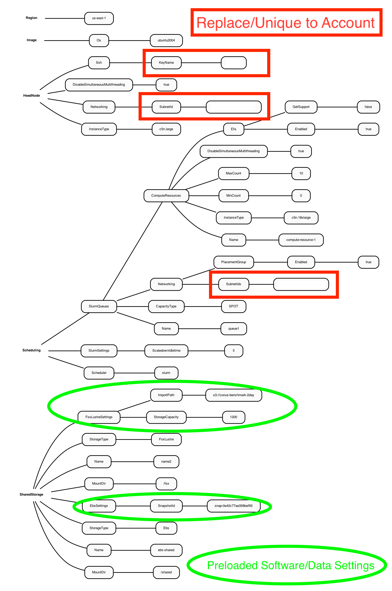

Intermediate Tutorial

## Use ParallelCluster pre-installed with software and data.

Step by step instructions for running the CMAQ 12US2 Benchmark for 2 days on a ParallelCluster.

### Obtain YAML file pre-loaded with input data and software 

#### Choose a directory on your local machine to obtain a copy of the github repo.

`cd /your/local/machine/install/path/`

#### Use a configuration file from the github by cloning the repo to your local machine 

`git clone -b main https://github.com/CMASCenter/pcluster-cmaq.git pcluster-cmaq`


`cd pcluster-cmaq`

```{note} To find the default settings for Lustre see:
<a href="https://docs.aws.amazon.com/parallelcluster/latest/ug/SharedStorage-v3.html#SharedStorage-v3-FsxLustreSettings">Lustre Settings for ParallelCluster</a>
```

### Examine Diagram of the YAML file to build pre-installed software and input data. 
Includes Snapshot ID of volume pre-installed with CMAQ software stack and name of S3 Bucket to import data to the Lustre Filesystem

Figure 1. Diagram of YAML file used to configure a ParallelCluster with a c5n.large head node and c5n.18xlarge compute nodes with Software and Data Pre-installed (linked on lustre filesystem)



### Edit Yaml file 

This Yaml file specifies the /shared directory that contains the CMAQv5.3.3 and libraries, and the input data that will be imported from an S3 bucket to the /fsx lustre file system
Note, the following yaml file is using a c5n-9xlarge compute node, and is using ONDEMAND pricing. 

```{note}
Edit the c5n-9xlarge.ebs_unencrypted_installed_public_ubuntu2004.fsx_import_opendata.yaml file to specify your subnet-id and your keypair prior to creating the cluster
```

`vi c5n-9xlarge.ebs_unencrypted_installed_public_ubuntu2004.fsx_import_opendata.yaml`

Output:

```
Region: us-east-1
Image:
  Os: ubuntu2004
HeadNode:
  InstanceType: c5n.large
  Networking:
    SubnetId: subnet-xx-xx-xx                           <<< replace subnetID
  DisableSimultaneousMultithreading: true
  Ssh:
    KeyName: your-key                                   <<< replace keyname
Scheduling:
  Scheduler: slurm
  SlurmSettings:
    ScaledownIdletime: 5
  SlurmQueues:
    - Name: queue1
      CapacityType: SPOT
      Networking:
        SubnetIds:
          - subnet-xx-xx-xxx                            <<< replace subnetID
        PlacementGroup:
          Enabled: true
      ComputeResources:
        - Name: compute-resource-1
          InstanceType: c5n.9xlarge
          MinCount: 0
          MaxCount: 10
          DisableSimultaneousMultithreading: true
          Efa:
            Enabled: true
            GdrSupport: false
SharedStorage:
  - MountDir: /shared
    Name: ebs-shared
    StorageType: Ebs
    EbsSettings:
      SnapshotId: snap-017568d24a4cedc83
  - MountDir: /fsx
    Name: name2
    StorageType: FsxLustre
    FsxLustreSettings:
      StorageCapacity: 1200
      ImportPath: s3://cmas-cmaq-conus2-benchmark/data/CMAQ_Modeling_Platform_2016/CONUS
```


## Create CMAQ ParallelCluster with software/data pre-installed

`pcluster create-cluster --cluster-configuration c5n-9xlarge.ebs_unencrypted_installed_public_ubuntu2004.fsx_import_opendata.yaml --cluster-name cmaq --region us-east-1`

Output:

```
{
  "cluster": {
    "clusterName": "cmaq",
    "cloudformationStackStatus": "CREATE_IN_PROGRESS",
    "cloudformationStackArn": "arn:aws:cloudformation:us-east-1:440858712842:stack/cmaq/6cfb1a50-6e99-11ec-8af1-0ea2256597e5",
    "region": "us-east-1",
    "version": "3.0.2",
    "clusterStatus": "CREATE_IN_PROGRESS"
  }
}

```

Check status again

`pcluster describe-cluster --region=us-east-1 --cluster-name cmaq`

Output:

```
{
  "creationTime": "2022-01-06T02:36:18.119Z",
  "version": "3.0.2",
  "clusterConfiguration": {
    "url": "
  },
  "tags": [
    {
      "value": "3.0.2",
      "key": "parallelcluster:version"
    }
  ],
  "cloudFormationStackStatus": "CREATE_IN_PROGRESS",
  "clusterName": "cmaq",
  "computeFleetStatus": "UNKNOWN",
  "cloudformationStackArn": 
  "lastUpdatedTime": "2022-01-06T02:36:18.119Z",
  "region": "us-east-1",
  "clusterStatus": "CREATE_IN_PROGRESS"
}
```

After 5-10 minutes, check the status again and recheck until you see the following status: "clusterStatus": "CREATE_COMPLETE"

Check status again

`pcluster describe-cluster --region=us-east-1 --cluster-name cmaq`

Output:

```
  "cloudFormationStackStatus": "CREATE_COMPLETE",
  "clusterName": "cmaq",
  "computeFleetStatus": "RUNNING",
  "cloudformationStackArn": "arn:aws:cloudformation:us-east-1:440858712842:stack/cmaq/3cd2ba10-c18f-11ec-9f57-0e9b4dd12971",
  "lastUpdatedTime": "2022-04-21T16:22:28.879Z",
  "region": "us-east-1",
  "clusterStatus": "CREATE_COMPLETE"
```

Start the compute nodes, if the computeFleetStatus is not set to RUNNING

`pcluster update-compute-fleet --region us-east-1 --cluster-name cmaq --status START_REQUESTED`

## Log into the new cluster
```{note}
replace your-key.pem with your Key Name
```

`pcluster ssh -v -Y -i ~/your-key.pem --cluster-name cmaq`

## Change shell to use tcsh

```
sudo usermod -s /bin/tcsh ubuntu
```

Log out and then log back in to have the shell take effect.


## Verify Software

The software is pre-loaded on the /shared volume of the ParallelCluster.  The software was previously loaded and saved to the snapshot.

`ls /shared/build`

Create a .cshrc file by copying it from the git repo that is on /shared/pcluster-cmaq

`cp /shared/pcluster-cmaq/dot.cshrc.pcluster ~/.cshrc`

Source shell

`csh`

Load the modules

`module avail`

Output:

```
------------------------------------------------------------ /usr/share/modules/modulefiles -------------------------------------------------------------
dot  libfabric-aws/1.13.2amzn1.0  module-git  module-info  modules  null  openmpi/4.1.1  use.own
```

Load the modules openmpi and libfabric

`module load openmpi/4.1.1`

`module load libfabric-aws/1.13.2amzn1.0`


## Verify Input Data

The input data was imported from the S3 bucket to the lustre file system (/fsx).

`cd /fsx/data/CMAQ_Modeling_Platform_2016/CONUS/12US2/`

Notice that the data doesn't take up much space, it must be linked, rather than copied.

`du -h`

Output:

```
27K     ./land
33K     ./MCIP
28K     ./emissions/ptegu
55K     ./emissions/ptagfire
27K     ./emissions/ptnonipm
55K     ./emissions/ptfire_othna
27K     ./emissions/pt_oilgas
26K     ./emissions/inln_point/stack_groups
51K     ./emissions/inln_point
28K     ./emissions/cmv_c1c2_12
28K     ./emissions/cmv_c3_12
28K     ./emissions/othpt
55K     ./emissions/ptfire
407K    ./emissions
27K     ./icbc
518K    .
```

Change the group and ownership permissions on the /fsx/data directory

`sudo chown ubuntu /fsx/data`

`sudo chgrp ubuntu /fsx/data`

Create the output directory

`mkdir -p /fsx/data/output`

## Examine CMAQ Run Scripts

The run scripts are available in two locations, one in the CMAQ scripts directory. 

Another copy is available in the pcluster-cmaq repo.
Do a git pull to obtain the latest scripts in the pcluster-cmaq repo.

`cd /shared/pcluster-cmaq`

`git pull`

Verify that the run scripts are updated and pre-configured for the parallel cluster by comparing with what is available in the github repo

`cd /shared/build/openmpi_gcc/CMAQ_v533/CCTM/scripts`

Example:

`diff /shared/pcluster-cmaq/run_scripts/cmaq533/c5n.9xlarge/run_cctm_2016_12US2.108pe.6x18.pcluster.csh .`

If a run script is missing or outdated, copy the run scripts from the repo.
Note, there are different run scripts depending on what compute node is used. This tutorial assumes c5n.9xlarge is the compute node.

`cp /shared/pcluster-cmaq/run_scripts/cmaq533/c5n.9xlarge/run*pcluster.csh /shared/build/openmpi_gcc/CMAQ_v533/CCTM/scripts/`

```{note}
The time that it takes the 2 day CONUS benchmark to run will vary based on the number of CPUs used, and the compute node that is being used.
See Figure 3 Benchmark Scaling Plot for c5n.18xlarge and c5n.9xlarge in [chapter 11](../Performance-Opt/performance-optimization.md) for reference.
```

Examine how the run script is configured

`head -n 30 /shared/build/openmpi_gcc/CMAQ_v533/CCTM/scripts/run_cctm_2016_12US2.108pe.6x18.pcluster.csh`

```
#!/bin/csh -f
## For c5n.9xlarge (36 vcpu - 18 cpu)
## works with cluster-ubuntu.yaml
## data on /fsx directory
#SBATCH --nodes=6
#SBATCH --ntasks-per-node=18
#SBATCH --exclusive
#SBATCH -J CMAQ
#SBATCH -o /shared/build/openmpi_gcc/CMAQ_v533/CCTM/scripts/run_cctmv5.3.3_Bench_2016_12US2.108.9x12pe.2day.sharedvol.log
#SBATCH -e /shared/build/openmpi_gcc/CMAQ_v533/CCTM/scripts/run_cctmv5.3.3_Bench_2016_12US2.108.9x12pe.2day.sharedvol.log
```

```{note}
In this run script, slurm or SBATCH requests 6 nodes, each node with 18 pes, or 6x18 = 108 pes
```

Verify that the NPCOL and NPROW settings in the script are configured to match what is being requested in the SBATCH commands that tell slurm how many compute nodes to  provision. 
In this case, to run CMAQ using on 108 cpus (SBATCH --nodes=6 and --ntasks-per-node=18), use NPCOL=9 and NPROW=12.

`grep NPCOL /shared/build/openmpi_gcc/CMAQ_v533/CCTM/scripts/run_cctm_2016_12US2.108pe.6x18.pcluster.csh`

Output:

```
   setenv NPCOL_NPROW "1 1"; set NPROCS   = 1 # single processor setting
   @ NPCOL  =  9; @ NPROW = 12
   @ NPROCS = $NPCOL * $NPROW
   setenv NPCOL_NPROW "$NPCOL $NPROW"; 

```


## Submit Job to Slurm Queue

`cd /shared/build/openmpi_gcc/CMAQ_v533/CCTM/scripts/`

`sbatch run_cctm_2016_12US2.108pe.6x18.pcluster.csh`


### Check status of run

`squeue `

Output:

```
JOBID PARTITION     NAME     USER ST       TIME  NODES NODELIST(REASON)
                 1    queue1     CMAQ   ubuntu PD       0:00      6 (BeginTime)
```

### Successfully started run

`squeue`

```
             JOBID PARTITION     NAME     USER ST       TIME  NODES NODELIST(REASON)
                 5    queue1     CMAQ   ubuntu  R      22:39      6 queue1-dy-compute-resource-1-[1-6]
```

### Once the job is successfully running 

Check on the log file status

`grep -i 'Processing completed.' CTM_LOG_001*_gcc_2016*`

Output:

```
            Processing completed...    6.5 seconds
            Processing completed...    6.5 seconds
            Processing completed...    6.5 seconds
            Processing completed...    6.5 seconds
            Processing completed...    6.4 seconds
```

Once the job has completed running the two day benchmark check the log file for the timings.

`tail -n 30 run_cctmv5.3.3_Bench_2016_12US2.108.9x12pe.2day.fsx_copied.log`

Output:

```
==================================
  ***** CMAQ TIMING REPORT *****
==================================
Start Day: 2015-12-22
End Day:   2015-12-23
Number of Simulation Days: 2
Domain Name:               12US2
Number of Grid Cells:      3409560  (ROW x COL x LAY)
Number of Layers:          35
Number of Processes:       108
   All times are in seconds.

Num  Day        Wall Time
01   2015-12-22   2421.19
02   2015-12-23   2144.16
     Total Time = 4565.35
      Avg. Time = 2282.67
```


```{note}
if you see the following message, you may want to submit a job that requires fewer PEs.
```

```
ip-10-0-5-165:/shared/build/openmpi_gcc/CMAQ_v533/CCTM/scripts% squeue
             JOBID PARTITION     NAME     USER ST       TIME  NODES NODELIST(REASON)
                 1    queue1     CMAQ   ubuntu PD       0:00      6 (Nodes required for job are DOWN, DRAINED or reserved for jobs in higher priority partitions)
```

### If you repeatedly see that the job is not successfully provisioned, cancel the job.

To cancel the job use the following command

`scancel 1`

### Try submitting a smaller job to the queue.

`sbatch run_cctm_2016_12US2.90pe.5x18.pcluster.csh`

### Check status of run

`squeue `

### Check to view any errors in the log on the parallel cluster

`vi /var/log/parallelcluster/slurm_resume.log`

 An error occurred (MaxSpotInstanceCountExceeded) when calling the RunInstances operation: Max spot instance count exceeded

```{note}
If you encounter this error, you will need to submit a request to increase this spot instance limit using the AWS Website.
```


### if the job will not run using SPOT pricing, then update the compute nodes to use ONDEMAND pricing

To do this, exit the cluster, stop the compute nodes, then edit the yaml file to modify SPOT to ONDEMAND.

`exit`


On your local computer use the following command to stop the compute nodes

`pcluster update-compute-fleet --region us-east-1 --cluster-name cmaq --status STOP_REQUESTED`


Edit the yaml file to modify SPOT to ONDEMAND, then update the cluster using the following command:

`pcluster update-cluster --region us-east-1 --cluster-name cmaq --cluster-configuration  c5n-18xlarge.ebs_unencrypted_installed_public_ubuntu2004.fsx_import_opendata.yaml`

Output:

```
{
  "cluster": {
    "clusterName": "cmaq",
    "cloudformationStackStatus": "UPDATE_IN_PROGRESS",
    "cloudformationStackArn": "xx-xxx-xx",
    "region": "us-east-1",
    "version": "3.1.1",
    "clusterStatus": "UPDATE_IN_PROGRESS"
  },
  "changeSet": [
    {
      "parameter": "Scheduling.SlurmQueues[queue1].CapacityType",
      "requestedValue": "ONDEMAND",
      "currentValue": "SPOT"                                      <<<  Modify to use ONDEMAND
    }
  ]
}
```

Check status of updated cluster

`pcluster describe-cluster --region=us-east-1 --cluster-name cmaq`

Output:

```
"clusterStatus": "UPDATE_IN_PROGRESS"
```

once you see

```
  "clusterStatus": "UPDATE_COMPLETE"
```

Restart the compute nodes

`pcluster update-compute-fleet --region us-east-1 --cluster-name cmaq --status START_REQUESTED`


Verify that compute nodes have started

`pcluster describe-cluster --region=us-east-1 --cluster-name cmaq`

Output:

```
 "computeFleetStatus": "RUNNING",
```

Re-login to the cluster


`pcluster ssh -v -Y -i ~/your-key.pem --cluster-name cmaq`


### Submit a new job using the updated ondemand compute nodes

`sbatch run_cctm_2016_12US2.180pe.5x36.pcluster.csh`

```{note}
If you still have difficulty running a job in the slurm queue, there may be other issues that need to be resolved.
```

Verify that your IAM Policy has been created for your account.

Someone with administrative permissions should eable the spot instances IAM Policy: AWSEC2SpotServiceRolePolicy

An alternative way to enable this policy is to login to the EC2 Website and launch a spot instance.
The service policy will be automatically created, that can then be used by ParallelCluster.

### Submit a 72 pe job 2 nodes x 36 cpus

`sbatch run_cctm_2016_12US2.72pe.2x36.pcluster.csh`

`grep -i 'Processing completed.' CTM_LOG_036.v533_gcc_2016_CONUS_6x12pe_20151223`

Output:

```
 Processing completed...    9.0 seconds
            Processing completed...   12.0 seconds
            Processing completed...   11.2 seconds
            Processing completed...    9.0 seconds
            Processing completed...    9.1 seconds
```


`tail -n 20 run_cctmv5.3.3_Bench_2016_12US2.72.6x12pe.2day.pcluster.log `

Output:

```
==================================
  ***** CMAQ TIMING REPORT *****
==================================
Start Day: 2015-12-22
End Day:   2015-12-23
Number of Simulation Days: 2
Domain Name:               12US2
Number of Grid Cells:      3409560  (ROW x COL x LAY)
Number of Layers:          35
Number of Processes:       72
   All times are in seconds.

Num  Day        Wall Time
01   2015-12-22   3562.50
02   2015-12-23   3151.21
     Total Time = 6713.71
      Avg. Time = 3356.85
```

## Submit a minimum of 2 benchmark runs

Ideally, two CMAQ runs should be submitted to the slurm queue, using two different NPCOLxNPROW configurations, to create output needed for the QA and Post Processing Sections in Chapter 6.

