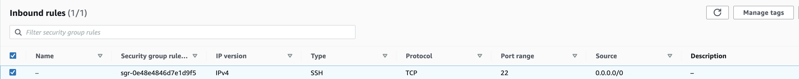
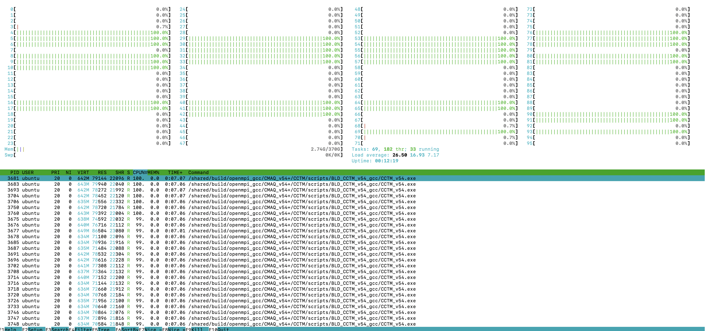

# Learn how to Use AWS CLI to launch c6a.48xlarge EC2 instance using Public AMI

## Public AMI contains the software and data to run 12US1 using CMAQv5.4+

Software was pre-installed and saved to a public ami. 

The input data was also transferred from the AWS Open Data Program and installed on the EBS volume.

This chapter describes the process that was used to test and configure the c6a.48xlarge ec2 instance to run CMAQv5.4 for the 12US1 domain.

Todo: Need to create command line options to copy a public ami to a different region.

### Verify that you can see the public AMI on the us-east-1 region.


`aws ec2 describe-images --region us-east-1 --image-id ami-088f82f334dde0c9f`


Output:

```
{
    "Images": [
        {
            "Architecture": "x86_64",
            "CreationDate": "2023-06-26T18:17:08.000Z",
            "ImageId": "ami-088f82f334dde0c9f",
            "ImageLocation": "440858712842/EC2CMAQv54io2_12LISTOS-training_12NE3_12US1",
            "ImageType": "machine",
            "Public": true,
            "OwnerId": "440858712842",
            "PlatformDetails": "Linux/UNIX",
            "UsageOperation": "RunInstances",
            "State": "available",
            "BlockDeviceMappings": [
                {
                    "DeviceName": "/dev/sda1",
                    "Ebs": {
                        "DeleteOnTermination": true,
                        "Iops": 100000,
                        "SnapshotId": "snap-042b05034228ec830",
                        "VolumeSize": 500,
                        "VolumeType": "io2",
                        "Encrypted": false
                    }
                },
                {
                    "DeviceName": "/dev/sdb",
                    "VirtualName": "ephemeral0"
                },
                {
                    "DeviceName": "/dev/sdc",
                    "VirtualName": "ephemeral1"
                }
            ],
            "EnaSupport": true,
            "Hypervisor": "xen",
            "Name": "EC2CMAQv54io2_12LISTOS-training_12NE3_12US1",
            "RootDeviceName": "/dev/sda1",
            "RootDeviceType": "ebs",
            "SriovNetSupport": "simple",
            "VirtualizationType": "hvm",
            "DeprecationTime": "2025-06-26T18:17:08.000Z"
        }
    ]
}

```

Use q to exit out of the command line

Note, the AMI uses the maximum value available on io2 for Iops of 100000.


### AWS Resources for the aws cli method to launch ec2 instances.
 
<a href="https://docs.aws.amazon.com/cli/latest/userguide/cli-services-ec2-instances.html">aws cli examples</a>

<a href="https://awscli.amazonaws.com/v2/documentation/api/latest/reference/ec2/run-instances.html">aws cli run instances command</a>

<a href="https://ec2spotworkshops.com/launching_ec2_spot_instances.html">Tutorial Launch Spot Instances</a>

(note, it discourages the use of run-instances for launching spot instances, but they do provide an example method)

<a href="https://ec2spotworkshops.com/launching_ec2_spot_instances/runinstances_api.html">Launching EC2 Spot Instances using Run Instances API</a>


Additional resources for spot instance provisioning.

<a href="https://docs.aws.amazon.com/AWSEC2/latest/UserGuide/spot-requests.html">Spot Instance Requests</a>


To launch a Spot Instance with RunInstances API you create the configuration file as described below:

```
cat <<EoF > ./runinstances-config.json
{
    "DryRun": false,
    "MaxCount": 1,
    "MinCount": 1,
    "InstanceType": "c6a.48xlarge",
    "ImageId": "ami-088f82f334dde0c9f",
    "InstanceMarketOptions": {
        "MarketType": "spot"
    },
    "TagSpecifications": [
        {
            "ResourceType": "instance",
            "Tags": [
                {
                    "Key": "Name",
                    "Value": "EC2SpotCMAQv54"
                }
            ]
        }
    ]
}
EoF
```

## Use the publically available AMI to launch an ondemand c6a.48xlarge ec2 instance using a gp3 volume with 16000 IOPS with hyperthreading disabled 


Note, we will be using a json file that has been preconfigured to specify the ImageId

## Obtain the code using git

`git clone -b main https://github.com/CMASCenter/pcluster-cmaq`

`cd pcluster-cmaq/json`


Note, you will need to obtain a security group id from your IT administrator that allows ssh login access.
If this is enabled by default, then you can remove the --security-group-ids launch-wizard-with-tcp-access 

Example command: note launch-wizard-with-tcp-access needs to be replaced by your security group ID, and your-pem key needs to be replaced by the name of your-pem.pem key.

`aws ec2 run-instances --debug --key-name your-pem --security-group-ids launch-wizard-with-tcp-access --dry-run --region us-east-1 --cli-input-json file://runinstances-config.json`

Command that works for UNC's security group and pem key:

`aws ec2 run-instances --debug --key-name cmaqv5.4 --security-group-ids launch-wizard-179 --region us-east-1 --dry-run --ebs-optimized --cpu-options CoreCount=96,ThreadsPerCore=1 --cli-input-json file://runinstances-config.io2.json`

Once you have verified that the command above works with the --dry-run option, rerun it without as follows.

`aws ec2 run-instances --debug --key-name cmaqv5.4 --security-group-ids launch-wizard-179 --region us-east-1 --ebs-optimized --cpu-options CoreCount=96,ThreadsPerCore=1 --cli-input-json file://runinstances-config.io2.json`

Example of security group inbound and outbound rules required to connect to EC2 instance via ssh.




Additional resources

<a href="https://docs.aws.amazon.com/cli/latest/userguide/cli-services-ec2-sg.html">CLI commands to create Security Group</a>

### Use the following command to obtain the public IP address of the machine.

This command is commented out, as the instance hasn't been created yet. keeping the instructions for documentation purposes.

`aws ec2 describe-instances --region=us-east-1 --filters "Name=image-id,Values=ami-088f82f334dde0c9f" | grep PublicIpAddress`

### Login to the ec2 instance

Note, the following command must be modified to specify your key, and ip address (obtained from the previous command):

`ssh -v -Y -i ~/downloads/your-pem.pem ubuntu@ip.address`


### Login to the ec2 instance again, so that you have two windows logged into the machine.

`ssh -Y -i ~/downloads/your-pem.pem ubuntu@your-ip-address` 


## Load the environment modules

`module avail`

`module load ioapi-3.2/gcc-11.3.0-netcdf  mpi/openmpi-4.1.2  netcdf-4.8.1/gcc-11.3 `

## Update the pcluster-cmaq repo using git

`cd /shared/pcluster-cmaq`

`git pull`


## Run CMAQv5.4 for 12US1 Listos Training 3 Day benchmark Case on 32 pe (this will take less than 2 minutes)

Input data is available for a subdomain of the 12km 12US1 case.

```
GRIDDESC

'2018_12Listos'
'LamCon_40N_97W'   1812000.000    240000.000     12000.000     12000.000   25   25    1
```

### Use command line to submit the job. This single virtual machine does not have a job scheduler such as slurm installed.


```
cd /shared/build/openmpi_gcc/CMAQ_v54+/CCTM/scripts
./run_cctm_2018_12US1_listos_32pe.csh |& tee ./run_cctm_2018_12US1_listos_32pe.log
```

### Use HTOP to view performance.

`htop`

output




### Successful output

```
==================================
  ***** CMAQ TIMING REPORT *****
==================================
Start Day: 2018-08-05
End Day:   2018-08-07
Number of Simulation Days: 3
Domain Name:               2018_12Listos
Number of Grid Cells:      21875  (ROW x COL x LAY)
Number of Layers:          35
Number of Processes:       32
   All times are in seconds.

Num  Day        Wall Time
01   2018-08-05   87.6
02   2018-08-06   77.9
03   2018-08-07   77.2
     Total Time = 242.70
      Avg. Time = 80.90
```


### Change to the scripts directory

`cd /shared/build/openmpi_gcc/CMAQ_v54+/CCTM/scripts/`

### Use lscpu to confirm that there are 96 processors on the c6a.48xlarge ec2 instance that was created with hyperthreading turned off.

`lscpu`

Output:

```
Architecture:            x86_64
  CPU op-mode(s):        32-bit, 64-bit
  Address sizes:         48 bits physical, 48 bits virtual
  Byte Order:            Little Endian
CPU(s):                  96
  On-line CPU(s) list:   0-95
Vendor ID:               AuthenticAMD
  Model name:            AMD EPYC 7R13 Processor
    CPU family:          25
    Model:               1
    Thread(s) per core:  1
    Core(s) per socket:  48
    Socket(s):           2
    Stepping:            1
    BogoMIPS:            5299.98
    Flags:               fpu vme de pse tsc msr pae mce cx8 apic sep mtrr pge mca cmov pat pse36 clflush mmx fxsr sse sse2 ht syscall nx mmxext fxs
                         r_opt pdpe1gb rdtscp lm constant_tsc rep_good nopl nonstop_tsc cpuid extd_apicid aperfmperf tsc_known_freq pni pclmulqdq m
                         onitor ssse3 fma cx16 pcid sse4_1 sse4_2 x2apic movbe popcnt aes xsave avx f16c rdrand hypervisor lahf_lm cmp_legacy cr8_l
                         egacy abm sse4a misalignsse 3dnowprefetch topoext perfctr_core invpcid_single ssbd ibrs ibpb stibp vmmcall fsgsbase bmi1 a
                         vx2 smep bmi2 invpcid rdseed adx smap clflushopt clwb sha_ni xsaveopt xsavec xgetbv1 clzero xsaveerptr rdpru wbnoinvd arat
                          npt nrip_save vaes vpclmulqdq rdpid
Virtualization features: 
  Hypervisor vendor:     KVM
  Virtualization type:   full
Caches (sum of all):     
  L1d:                   3 MiB (96 instances)
  L1i:                   3 MiB (96 instances)
  L2:                    48 MiB (96 instances)
  L3:                    384 MiB (12 instances)
NUMA:                    
  NUMA node(s):          4
  NUMA node0 CPU(s):     0-23
  NUMA node1 CPU(s):     24-47
  NUMA node2 CPU(s):     48-71
  NUMA node3 CPU(s):     72-95
Vulnerabilities:         
  Itlb multihit:         Not affected
  L1tf:                  Not affected
  Mds:                   Not affected
  Meltdown:              Not affected
  Mmio stale data:       Not affected
  Retbleed:              Not affected
  Spec store bypass:     Mitigation; Speculative Store Bypass disabled via prctl
  Spectre v1:            Mitigation; usercopy/swapgs barriers and __user pointer sanitization
  Spectre v2:            Mitigation; Retpolines, IBPB conditional, IBRS_FW, RSB filling, PBRSB-eIBRS Not affected
  Srbds:                 Not affected
  Tsx async abort:       Not affected
```


### Download input data for 12NE3 1 day Benchmark case

Instructions to copy data from the s3 bucket to the ec2 instance and run this benchmark.

(note, you can skip this step as the input data has already been installed.)

`cd /shared/pcluster-cmaq/s3_scripts`

Examine the command line options that are used to download the data. Note, that we can use the --nosign option, as the data is available from the CMAS Open Data Warehouse on AWS.

`cat s3_copy_12NE3_Bench.csh`

Output

```
#!/bin/csh -f
#Script to download enough data to run START_DATE 201522 and END_DATE 201523 for 12km Northeast Domain
#Requires installing aws command line interface
#https://docs.aws.amazon.com/cli/latest/userguide/install-cliv2-linux.html#cliv2-linux-install
#Total storage required is 56 G

setenv AWS_REGION "us-east-1"

aws s3 cp --no-sign-request --recursive s3://cmas-cmaq/CMAQv5.4_2018_12NE3_Benchmark_2Day_Input /shared/data/
```

### change the permissions on the script

`chmod 755 s3_copy_12NE3_Bench.csh`

### Use the aws s3 copy command to copy data from the CMAS Data Warehouse Open Data S3 bucket.

`./s3_copy_12NE3_Bench.csh`


### Link the data directory on /shared/data

```
cd /shared/build/openmpi_gcc/CMAQ_v54+/data
ln -s /shared/data/2018_12NE3 .
```

### Edit the 12US3 Benchmark run script to use the gcc compiler and to output all species to CONC output file.

`cd /shared/build/openmpi_gcc/CMAQ_v54+/CCTM/scripts/`

`cp run_cctm_Bench_2018_12NE3.c6a.2xlarge.csh run_cctm_Bench_2018_12NE3.c6a.48xlarge.csh`

`vi run_cctm_Bench_2018_12NE3.c6a48xlarge.csh`

change

`   setenv compiler intel`

to

`   setenv compiler gcc`

Comment out the CONC_SPCS setting that limits them to only 12 species 

```
   # setenv CONC_SPCS "O3 NO ANO3I ANO3J NO2 FORM ISOP NH3 ANH4I ANH4J ASO4I ASO4J" 
```

Change NPCOL x NPROW to use 12 x 8

```
   @ NPCOL  =  12; @ NPROW =  8
```


### Run the 12US3 Benchmark case  on 96 processors

```
./run_cctm_Bench_2018_12NE3.c6a48xlarge.csh |& tee ./run_cctm_Bench_2018_12NE3.c6a48xlarge.96pe.log
```

### Successful output for all species output in the 3-D CONC File (222 variables)

```
==================================
  ***** CMAQ TIMING REPORT *****
==================================
Start Day: 2018-07-01
End Day:   2018-07-01
Number of Simulation Days: 1
Domain Name:               2018_12NE3
Number of Grid Cells:      367500  (ROW x COL x LAY)
Number of Layers:          35
Number of Processes:       96
   All times are in seconds.

Num  Day        Wall Time
01   2018-07-01   236.27
     Total Time = 236.27
      Avg. Time = 236.27
```


### Run the 12US3 Benchmark case  on 32 processors

```
./run_cctm_Bench_2018_12NE3.c6a48xlarge.csh |& tee ./run_cctm_Bench_2018_12NE3.c6a48xlarge.32pe.log
```

### Successful output for 12 species output in the 3-D CONC file took 7.4 minutes to run 1 day

```
==================================
  ***** CMAQ TIMING REPORT *****
==================================
Start Day: 2018-07-01
End Day:   2018-07-01
Number of Simulation Days: 1
Domain Name:               2018_12NE3
Number of Grid Cells:      367500  (ROW x COL x LAY)
Number of Layers:          35
Number of Processes:       32
   All times are in seconds.

Num  Day        Wall Time
01   2018-07-01   445.19
     Total Time = 445.19
      Avg. Time = 445.19


```

### Successful output for all species output in the 3-D CONC File (222 variables)

```
==================================
  ***** CMAQ TIMING REPORT *****
==================================
Start Day: 2018-07-01
End Day:   2018-07-01
Number of Simulation Days: 1
Domain Name:               2018_12NE3
Number of Grid Cells:      367500  (ROW x COL x LAY)
Number of Layers:          35
Number of Processes:       32
   All times are in seconds.

Num  Day        Wall Time
01   2018-07-01   444.34
     Total Time = 444.34
      Avg. Time = 444.34

```

Compare to timings available in <a href="https://github.com/USEPA/CMAQ/blob/main/DOCS/Users_Guide/CMAQ_UG_ch03_preparing_compute_environment.md">Table 3-1 Example of job scenarios at EPA for a single day simulation.</a>

```
Domain 	                Domain size 	Species Tracked 	Input files size 	Output files size 	Run time (# cores)
2018 North East US 	100 X 105 X 35 	225 	                26GB 	                2GB 	                15 min/day (32)
```

### Change the NPCOLxNPROW to use all 96 processors

```
==================================
  ***** CMAQ TIMING REPORT *****
==================================
Start Day: 2018-07-01
End Day:   2018-07-01
Number of Simulation Days: 1
Domain Name:               2018_12NE3
Number of Grid Cells:      367500  (ROW x COL x LAY)
Number of Layers:          35
Number of Processes:       96
   All times are in seconds.

Num  Day        Wall Time
01   2018-07-01   227.56
     Total Time = 227.56
      Avg. Time = 227.56
```

### Run 12US1 2 day benchmark case on 96 processors

```
./run_cctm_2018_12US1_v54_cb6r5_ae6.20171222.8x12.ncclassic.csh | & tee run_cctm_2018_12US1_v54_cb6r5_ae6.20171222.8x12.ncclassic.16000IOPS.log
```

### Successful timing

```
==================================
  ***** CMAQ TIMING REPORT *****
==================================
Start Day: 2017-12-22
End Day:   2017-12-23
Number of Simulation Days: 2
Domain Name:               12US1
Number of Grid Cells:      4803435  (ROW x COL x LAY)
Number of Layers:          35
Number of Processes:       96
   All times are in seconds.

Num  Day        Wall Time
01   2017-12-22   2979.7
02   2017-12-23   3333.7
     Total Time = 6313.40
      Avg. Time = 3156.70
```

### Run 12US1 2 day benchmark case on 96 processors

```
./run_cctm_2018_12US1_v54_cb6r5_ae6.20171222.12x8.ncclassic.csh |& tee ./run_cctm_2018_12US1_v54_cb6r5_ae6.20171222.12x8.ncclassic.log
```

### Verify that it is using 99% of each of the 96 cores using htop

`htop`

### Check the timings while the job is still running using the following command

```
cd /shared/data/output/output_v54_cb6r5_ae7_aq_WR413_MYR_gcc_2018_12US1_8x12_classic


grep 'Processing completed' CTM_LOG_001*
```

Output:

```
            Processing completed...       9.0214 seconds
            Processing completed...       8.9559 seconds
            Processing completed...       8.9168 seconds
            Processing completed...       8.9294 seconds
            Processing completed...       8.9067 seconds
            Processing completed...      12.6627 seconds
            Processing completed...       9.4496 seconds
            Processing completed...       8.8013 seconds
            Processing completed...       8.8550 seconds
            Processing completed...       8.8905 seconds
            Processing completed...       8.8481 seconds
            Processing completed...       8.8778 seconds
            Processing completed...       8.8695 seconds
            Processing completed...       8.9117 seconds
            Processing completed...       8.9099 seconds
```


### Successful timing using io2 filesystem

```
==================================
  ***** CMAQ TIMING REPORT *****
==================================
Start Day: 2017-12-22
End Day:   2017-12-23
Number of Simulation Days: 2
Domain Name:               12US1
Number of Grid Cells:      4803435  (ROW x COL x LAY)
Number of Layers:          35
Number of Processes:       96
   All times are in seconds.

Num  Day        Wall Time
01   2017-12-22   3003.4
02   2017-12-23   3321.5
     Total Time = 6324.90
      Avg. Time = 3162.45

```

### Successful run timing using gp3 filesystem (somtimes the timing is 2x worse, haven't found a cause for this variabilities in performance)

```
==================================
  ***** CMAQ TIMING REPORT *****
==================================
Start Day: 2017-12-22
End Day:   2017-12-23
Number of Simulation Days: 2
Domain Name:               12US1
Number of Grid Cells:      4803435  (ROW x COL x LAY)
Number of Layers:          35
Number of Processes:       96
   All times are in seconds.

Num  Day        Wall Time
01   2017-12-22   3070.4
02   2017-12-23   3386.7
     Total Time = 6457.10
      Avg. Time = 3228.55

```


Compare timing to output available <a href="https://github.com/USEPA/CMAQ/blob/main/DOCS/Users_Guide/CMAQ_UG_ch05_running_a_simulation.md#571-cctm-logfiles">CMAQ User Guide: Running CMAQ</a>

### Find the InstanceID using the following command on your local machine.

`aws ec2 describe-instances --region=us-east-1 | grep InstanceId`

Output

i-xxxx

### Stop the instance

`aws ec2 stop-instances --region=us-east-1 --instance-ids i-xxxx`


Get the following error message.

aws ec2 stop-instances --region=us-east-1 --instance-ids i-041a702cc9f7f7b5d

An error occurred (UnsupportedOperation) when calling the StopInstances operation: You can't stop the Spot Instance 'i-041a702cc9f7f7b5d' because it is associated with a one-time Spot Instance request. You can only stop Spot Instances associated with persistent Spot Instance requests.


Note sure how to do a persistent spot instance request .
### Terminate Instance

`aws ec2 terminate-instances --region=us-east-1 --instance-ids i-xxxx`

### Verify that the instance is being shut down.

`aws ec2 describe-instances --region=us-east-1`
