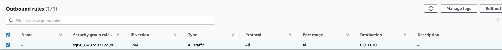

# Use AWS CLI to launch EC2 instance using Public AMI

## Public AMI contains the software and data to run 12US1 using CMAQv5.4+

Software was pre-installed and saved to a public ami. 

The input data was also transferred from the AWS Open Data Program and installed on the EBS volume.

### Verify that you can see the public AMI on the us-east-1 region.


`aws ec2 describe-images --region us-east-1 --image-id ami-0aaa0cfeb5ed5763c`

Output:

```
{
    "Images": [
        {
            "Architecture": "x86_64",
            "CreationDate": "2023-06-07T02:52:26.000Z",
            "ImageId": "ami-0aaa0cfeb5ed5763c",
            "ImageLocation": "440858712842/cmaqv5.4_c6a.48xlarge",
            "ImageType": "machine",
            "Public": true,
            "OwnerId": "440858712842",
            "PlatformDetails": "Linux/UNIX",
            "UsageOperation": "RunInstances",
            "State": "available",
            "BlockDeviceMappings": [
                {
                    "DeviceName": "/dev/sda1",
                    "Ebs": {
                        "DeleteOnTermination": true,
                        "Iops": 4000,
                        "SnapshotId": "snap-0c2f11a82e76aac9b",
                        "VolumeSize": 500,
                        "VolumeType": "gp3",
                        "Throughput": 1000,
                        "Encrypted": false
                    }
                },
                {
                    "DeviceName": "/dev/sdb",
                    "VirtualName": "ephemeral0"
                },
                {
                    "DeviceName": "/dev/sdc",
                    "VirtualName": "ephemeral1"
                }
            ],
            "EnaSupport": true,
            "Hypervisor": "xen",
            "Name": "cmaqv5.4_c6a.48xlarge",
            "RootDeviceName": "/dev/sda1",
            "RootDeviceType": "ebs",
            "SriovNetSupport": "simple",
            "VirtualizationType": "hvm",
            "DeprecationTime": "2025-06-07T02:52:26.000Z"
        }
    ]
}
```


Note, the following command works if an ec2 instance is running using this ami.

`aws ec2 describe-instances --region=us-east-1 --filters "Name=image-id,Values=ami-0aaa0cfeb5ed5763c"`

### AWS Resources for the aws cli method to launch ec2 instances.
 
<a href="https://docs.aws.amazon.com/cli/latest/userguide/cli-services-ec2-instances.html">aws cli exampmles</a>

<a href="https://awscli.amazonaws.com/v2/documentation/api/latest/reference/ec2/run-instances.html">aws cli run instances command</a>

<a href="https://ec2spotworkshops.com/launching_ec2_spot_instances.html">Tutorial Launch Spot Instances</a>

(note, it discourages the use of run-instances for launching spot instances, but they do provide an example method)

<a href="https://ec2spotworkshops.com/launching_ec2_spot_instances/runinstances_api.html">Launching EC2 Spot Instances using Run Instances API</a>


Additional resources for spot instance provisioning.

<a href="https://docs.aws.amazon.com/AWSEC2/latest/UserGuide/spot-requests.html">Spot Instance Requests</a>


To launch a Spot Instance with RunInstances API you create below configuration file:

```
cat <<EoF > ./runinstances-config.json
{
    "MaxCount": 1,
    "MinCount": 1,
    "InstanceType": "c6a.48xlarge",
    "LaunchTemplate": {
        "LaunchTemplateId":"${LAUNCH_TEMPLATE_ID}",
        "Version": "1"
    },
    "InstanceMarketOptions": {
        "MarketType": "spot"
    },
    "TagSpecifications": [
        {
            "ResourceType": "instance",
            "Tags": [
                {
                    "Key": "Name",
                    "Value": "EC2SpotCMAQv54"
                }
            ]
        }
    ]
}
EoF
```

### Use the publically available AMI to launch a new Single VM using a c6a.48xlarge ec2 instance.


Launch a new instance using the AMI with the software loaded and request a spot instance for the c6a.8xlarge EC2 instance


`aws ec2 run-instances --debug --key-name your-pem --security-group-ids launch-wizard-with-tcp-access --region us-east-1 --cli-input-json file://runinstances-config.json`

Example of security group inbound and outbound rules required to connect to EC2 instance via ssh.




(I am not sure if you can create a security group rule from the aws command line.)

Additional resources
<a href="https://docs.aws.amazon.com/cli/latest/userguide/cli-services-ec2-sg.html">CLI commands to create Security Group</a>

### Use the following command to obtain the public IP address of the machine.

`aws ec2 describe-instances --region=us-east-1 --filters "Name=image-id,Values=ami-0aaa0cfeb5ed5763c" | grep PublicIpAddress`
(this command may need to be updated, if there are multiple instances running the same AMI)

### Login to the ec2 instance

ssh -v -Y -i ~/downloads/cmas.pem your-pem@ip.address

## Run CMAQv5.4 for the full 12US1 Domain on c6a.48xlarge with 192 vcpus

Input Data is available for a 2 day benchmark 12US1 Domain for both netCDF4 compressed (*.nc4) and classic netCDF-3 compression (*.nc).


I re-saved the AMI and launched a c6a.48xlarge with 192 vcpus, running as spot instance.

Spot Pricing cost for Linux in US East Region


c6a.48xlarge	$6.4733 per Hour


### Run utility to uncompress hdf5 *.nc4 files and save as classic *.nc files


May need to look at disabling hyperthreading at runtime.

<a href="https://aws.amazon.com/blogs/compute/disabling-intel-hyper-threading-technology-on-amazon-linux/">Disable Hyperthreading</a>


### Increased disk space on /shared to 500 GB 

Ran out of disk space when trying to run the full 12US1 domain, so it is necessary to increase the size.
You can do this in the AWS Web Interface without stopping the instance. 

Expanded the root volume to 500 GB, and increased the throughput to 1000 MB/s and then expanded it using these instructions, and then resized it.

<a href="https://docs.aws.amazon.com/AWSEC2/latest/UserGuide/recognize-expanded-volume-linux.html">Recognize Expanded Volume</a>

Rerunning the 12US1 case on 8x12 processors - for total of 96 processors.

It takes about 13 minutes of initial I/O prior to the model starting.


Successful run output:

```
==================================
  ***** CMAQ TIMING REPORT *****
==================================
Start Day: 2017-12-22
End Day:   2017-12-23
Number of Simulation Days: 2
Domain Name:               12US1
Number of Grid Cells:      4803435  (ROW x COL x LAY)
Number of Layers:          35
Number of Processes:       96
   All times are in seconds.

Num  Day        Wall Time
01   2017-12-22   3395.1
02   2017-12-23   3389.0
     Total Time = 6784.10
      Avg. Time = 3392.05
```

Note, this run time is slower than a single node of the Parallel Cluster using the HPC6a.48xlarge (total time = 5000 seconds). Note the 12US1 domain is larger than the 12US2 domain that was used for the HPC6a.48xlarge benchmarks. 
It would be good to do another benchmark for 12US1 using HPC6a.48xlarge a compute node that is configured for HPC by AWS.   AWS turns off hyperthreading by default for HPC6a.48xlarge, and there may be other optimizations for HPC applications (disk/networking/cpu).
