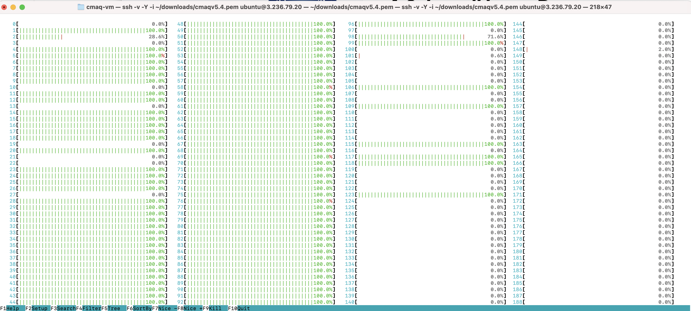
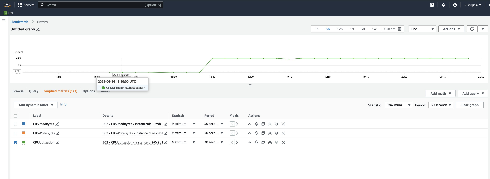
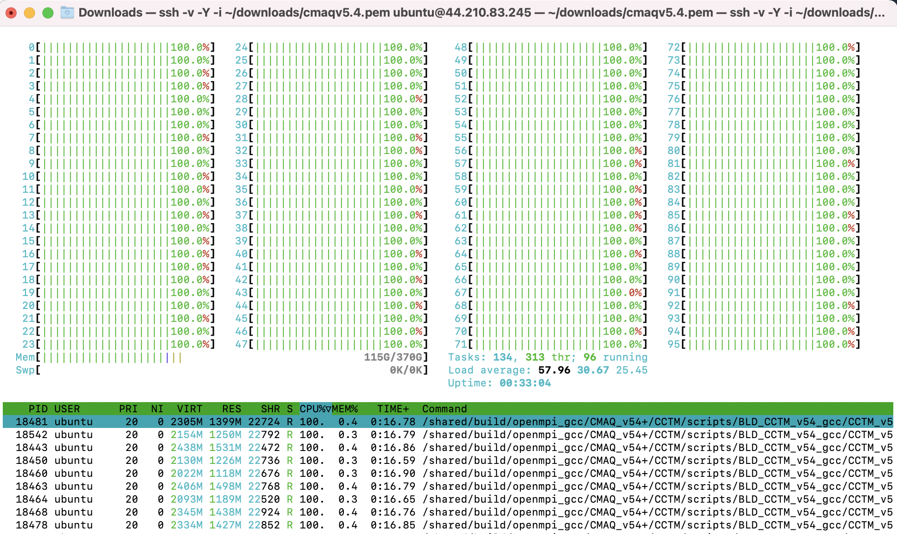
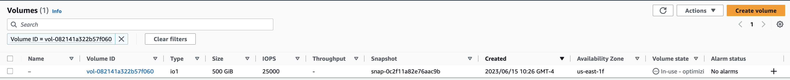

# Use AWS CLI to launch EC2 instance using Public AMI

## Public AMI contains the software and data to run 12US1 using CMAQv5.4+

Software was pre-installed and saved to a public ami. 

The input data was also transferred from the AWS Open Data Program and installed on the EBS volume.

### Verify that you can see the public AMI on the us-east-1 region.


`aws ec2 describe-images --region us-east-1 --image-id ami-0aaa0cfeb5ed5763c`

Output:

```
{
    "Images": [
        {
            "Architecture": "x86_64",
            "CreationDate": "2023-06-07T02:52:26.000Z",
            "ImageId": "ami-0aaa0cfeb5ed5763c",
            "ImageLocation": "440858712842/cmaqv5.4_c6a.48xlarge",
            "ImageType": "machine",
            "Public": true,
            "OwnerId": "440858712842",
            "PlatformDetails": "Linux/UNIX",
            "UsageOperation": "RunInstances",
            "State": "available",
            "BlockDeviceMappings": [
                {
                    "DeviceName": "/dev/sda1",
                    "Ebs": {
                        "DeleteOnTermination": true,
                        "Iops": 4000,
                        "SnapshotId": "snap-0c2f11a82e76aac9b",
                        "VolumeSize": 500,
                        "VolumeType": "gp3",
                        "Throughput": 1000,
                        "Encrypted": false
                    }
                },
                {
                    "DeviceName": "/dev/sdb",
                    "VirtualName": "ephemeral0"
                },
                {
                    "DeviceName": "/dev/sdc",
                    "VirtualName": "ephemeral1"
                }
            ],
            "EnaSupport": true,
            "Hypervisor": "xen",
            "Name": "cmaqv5.4_c6a.48xlarge",
            "RootDeviceName": "/dev/sda1",
            "RootDeviceType": "ebs",
            "SriovNetSupport": "simple",
            "VirtualizationType": "hvm",
            "DeprecationTime": "2025-06-07T02:52:26.000Z"
        }
    ]
}
```


Note, the following command works if an ec2 instance is running using this ami.

`aws ec2 describe-instances --region=us-east-1 --filters "Name=image-id,Values=ami-0aaa0cfeb5ed5763c"`

### AWS Resources for the aws cli method to launch ec2 instances.
 
<a href="https://docs.aws.amazon.com/cli/latest/userguide/cli-services-ec2-instances.html">aws cli exampmles</a>

<a href="https://awscli.amazonaws.com/v2/documentation/api/latest/reference/ec2/run-instances.html">aws cli run instances command</a>

<a href="https://ec2spotworkshops.com/launching_ec2_spot_instances.html">Tutorial Launch Spot Instances</a>

(note, it discourages the use of run-instances for launching spot instances, but they do provide an example method)

<a href="https://ec2spotworkshops.com/launching_ec2_spot_instances/runinstances_api.html">Launching EC2 Spot Instances using Run Instances API</a>


Additional resources for spot instance provisioning.

<a href="https://docs.aws.amazon.com/AWSEC2/latest/UserGuide/spot-requests.html">Spot Instance Requests</a>


To launch a Spot Instance with RunInstances API you create below configuration file:

```
cat <<EoF > ./runinstances-config.json
{
    "MaxCount": 1,
    "MinCount": 1,
    "InstanceType": "c6a.48xlarge",
    "LaunchTemplate": {
        "LaunchTemplateId":"${LAUNCH_TEMPLATE_ID}",
        "Version": "1"
    },
    "InstanceMarketOptions": {
        "MarketType": "spot"
    },
    "TagSpecifications": [
        {
            "ResourceType": "instance",
            "Tags": [
                {
                    "Key": "Name",
                    "Value": "EC2SpotCMAQv54"
                }
            ]
        }
    ]
}
EoF
```

### Use the publically available AMI to launch a new Single VM using a c6a.48xlarge ec2 instance.


Launch a new instance using the AMI with the software loaded and request a spot instance for the c6a.8xlarge EC2 instance


`aws ec2 run-instances --debug --key-name your-pem --security-group-ids launch-wizard-with-tcp-access --region us-east-1 --cli-input-json file://runinstances-config.json`

Example of security group inbound and outbound rules required to connect to EC2 instance via ssh.


(I am not sure if you can create a security group rule from the aws command line.)

Additional resources
<a href="https://docs.aws.amazon.com/cli/latest/userguide/cli-services-ec2-sg.html">CLI commands to create Security Group</a>

### Use the following command to obtain the public IP address of the machine.

`aws ec2 describe-instances --region=us-east-1 --filters "Name=image-id,Values=ami-0aaa0cfeb5ed5763c" | grep PublicIpAddress`
(this command may need to be updated, if there are multiple instances running the same AMI)

### Login to the ec2 instance

ssh -v -Y -i ~/downloads/your-pem.pem ubuntu@ip.address


## Load the environment modules

`module avail`

`module load ioapi-3.2/gcc-11.3.0-netcdf`

`module load netcdf-4.8.1/gcc-11.3`

`module load mpi/openmpi-4.1.2`


## Run CMAQv5.4 for the 12km Listos Training Case

Input data is available for a subdomain of the 12km 12US1 case.

```
GRIDDESC

'2018_12Listos'
'LamCon_40N_97W'   1812000.000    240000.000     12000.000     12000.000   25   25    1
```

```
cd /shared/build/openmpi_gcc/CMAQ_v54+/CCTM/scripts
./run_cctm_2018_12US1_listos_32pe.csh |& tee ./run_cctm_2018_12US1_listos_32pe.log

```

Successful output:

```
==================================
  ***** CMAQ TIMING REPORT *****
==================================
Start Day: 2018-08-05
End Day:   2018-08-07
Number of Simulation Days: 3
Domain Name:               2018_12Listos
Number of Grid Cells:      21875  (ROW x COL x LAY)
Number of Layers:          35
Number of Processes:       32
   All times are in seconds.

Num  Day        Wall Time
01   2018-08-05   69.9
02   2018-08-06   64.7
03   2018-08-07   66.5
     Total Time = 201.10
      Avg. Time = 67.03

```

Note, this timing is faster than the timing obtained using the AWS Web Interface to create the c6n.48xlarge instance.

While using the full domain 12US1 causes significant performance degradation.


## Run CMAQv5.4 for the full 12US1 Domain on c6a.48xlarge with 192 vcpus


```
GRIDDESC
' '  !  end coords.  grids:  name; xorig yorig xcell ycell ncols nrows nthik
'12US1'
'LAM_40N97W'  -2556000.   -1728000.   12000.  12000.  459  299    1
```

Input Data for the 12US1 domain is available for a 2 day benchmark 12US1 Domain for both netCDF4 compressed (*.nc4) and classic netCDF-3 compression (*.nc).
The 96 pe run on the c6a.48xlarge instance will take approximately 120 minutes for 1 day, or 240 minutes for the full 2 day benchmark.
(Not sure why this is taking so much longer than an earlier run using the on demand instance.)
Perhaps I am missing a setting in the aws cli configuration of the virtual machine?
How do I troubleshoot this issue?


Tried the following command:

`aws ec2 describe-instances --region=us-east-1 --filters "Name=image-id,Values=ami-0aaa0cfeb5ed5763c"`

In the output, I noticed that the EbsOptimized flag was set to false. Perhaps I need to try using true in the runinstances-config.json file or at the run-instances command line when the spot instances was created.

```
                    "EbsOptimized": false,
                    "EnaSupport": true,
                    "Hypervisor": "xen",
                    "InstanceLifecycle": "spot",
```

Next time, try adding this option to the run-instances command --ebs-optimized
should I also change the Hypervisor to Nitro?

Also need to use this option to disable multithreading:

```
--cpu-options (structure)

    The CPU options for the instance. For more information, see Optimize CPU options in the Amazon EC2 User Guide .

    CoreCount -> (integer)

        The number of CPU cores for the instance.

    ThreadsPerCore -> (integer)

        The number of threads per CPU core. To disable multithreading for the instance, specify a value of 1 . Otherwise, specify the default value of 2 .

--cpu-options CoreCount=integer,ThreadsPerCore=integer,AmdSevSnp=string

JSON Syntax:

{
  "CoreCount": integer,
  "ThreadsPerCore": integer,
  "AmdSevSnp": "enabled"|"disabled"
}


```


cd /shared/build/openmpi_gcc/CMAQ_v54+/CCTM/scripts

`./run_cctm_2018_12US1_v54_cb6r5_ae6.20171222.12x8.ncclassic.csh |& tee ./run_cctm_2018_12US1_v54_cb6r5_ae6.20171222.12x8.ncclassic.log


Spot Pricing cost for Linux in US East Region

c6a.48xlarge	$7 per Hour


Rerunning the 12US1 case on 8x12 processors - for total of 96 processors.

It took about 39 minutes of initial I/O prior to the model starting.

## Once the model starts running (see Processing cmpleted ...) in the log file, then use htop to view the CPU usage.

Login to the virtual machine and then run the following command.

`./htop`




### Using Cloudwatch to see the CPU utilization.

Note that we are using 96 pes of the 192 virtual cpus, so the maximum cpu utilization reported would be 50%.




Successful run output, but it is taking too long:

```
==================================
  ***** CMAQ TIMING REPORT *****
==================================
Start Day: 2017-12-22
End Day:   2017-12-23
Number of Simulation Days: 2
Domain Name:               12US1
Number of Grid Cells:      4803435  (ROW x COL x LAY)
Number of Layers:          35
Number of Processes:       96
   All times are in seconds.

Num  Day        Wall Time
01   2017-12-22   6320.8
02   2017-12-23   5409.6
     Total Time = 11730.40
      Avg. Time = 5865.20

```

You can use the AWS Web Interface to get an estimate of the savings of using a SPOT versus OnDEMAND Instance.


## Save volume as a snapshot

saving the volume as a snapshot so that I can have a copy of the log files to show the poor performance of the spot instance.
After the snapshot is created then I will delete the instance.
The snapshot name is c6a.48xlarge.cmaqv54.spot, snap-0cc3df82ba5bf5da8

## Clean up Virtual Machine

### Find the InstanceID using the following command on your local machine.

`aws ec2 describe-instances --region=us-east-1 | grep InstanceId` 

Output

i-xxxx

### Terminate the instance

`aws ec2 terminate-instances --region=us-east-1 --instance-ids i-xxxx`

<a href="https://docs.aws.amazon.com/cli/latest/userguide/cli-services-ec2-instances.html">Commands for terminating EC2 instance from CLI</a>


## Create c6a.48xlarge with hyperthreading disabled 


`aws ec2 run-instances --debug --key-name cmaqv5.4 --security-group-ids launch-wizard-179 --region us-east-1 --ebs-optimized --dry-run --cpu-options CoreCount=96,ThreadsPerCore=1 --cli-input-json file://runinstances-config.json`

(note, take out --dry-run option after you try and verify it works)

Obtain the public IP address for the virtual machine

`aws ec2 describe-instances --region=us-east-1 --filters "Name=image-id,Values=ami-0aaa0cfeb5ed5763c" | grep PublicIpAddress`

Login to the machine
`ssh -v -Y -i ~/your-pem.pem ubuntu@your-ip-address

### Retry the Listos run script.

```
cd /shared/build/openmpi_gcc/CMAQ_v54+/CCTM/scripts
./run_cctm_2018_12US1_listos_32pe.csh |& tee ./run_cctm_2018_12US1_listos_32pe.log

```

### Use HTOP to view performance.

`htop`

output


### Successful output

```
==================================
  ***** CMAQ TIMING REPORT *****
==================================
Start Day: 2018-08-05
End Day:   2018-08-07
Number of Simulation Days: 3
Domain Name:               2018_12Listos
Number of Grid Cells:      21875  (ROW x COL x LAY)
Number of Layers:          35
Number of Processes:       32
   All times are in seconds.

Num  Day        Wall Time
01   2018-08-05   87.6
02   2018-08-06   77.9
03   2018-08-07   77.2
     Total Time = 242.70
      Avg. Time = 80.90
```

Retried the 12US1 benchmark case but the i/o was still too slow.


Used the AWS Web Interface to upgrade to an io1 system

<a href="https://aws.amazon.com/blogs/storage/how-to-choose-the-best-amazon-ebs-volume-type-for-your-self-managed-database-deployment/">Choosing EBS Storage Type</a>

After upgrading to the io1 volume, the performance was much improved.

Now, we need to examine the cost, and whether it would cost less for an io2 volume.





Additional information about how to calculate storage pricing.

<a href="https://aws.amazon.com/ebs/pricing/">EBS Pricing</a>


Good comparison of EBS vs EFS, and discussion of using Cloud Volumes ONTAP for data tiering between S3 Buckets and EBS volumes.

<a href="https://bluexp.netapp.com/blog/ebs-efs-amazons3-best-cloud-storage-system">Comparison between EBS and EFS</a>

The aws cli can also be used to modify the volume as per these instructions.

<a href="https://docs.aws.amazon.com/cli/latest/reference/ec2/modify-volume.html>aws cli modify volume</a>

Successful Output

```
==================================
  ***** CMAQ TIMING REPORT *****
==================================
Start Day: 2017-12-22
End Day:   2017-12-23
Number of Simulation Days: 2
Domain Name:               12US1
Number of Grid Cells:      4803435  (ROW x COL x LAY)
`Number of Layers:          35
Number of Processes:       96
   All times are in seconds.

Num  Day        Wall Time
01   2017-12-22   3045.2
02   2017-12-23   3351.8
     Total Time = 6397.00
      Avg. Time = 3198.50
```

Saved the EC2 instance as an AMI and made that ami public.

New AMI instance name to use for CMAQv5.4 on c6a.48xlarge using 500 GB io1 Storage.

ami-031a6e4499abffdb6

Edit runinstances-config.json to use the new ami.


`aws ec2 run-instances --debug --key-name cmaqv5.4 --security-group-ids launch-wizard-179 --region us-east-1 --ebs-optimized --dry-run --cpu-options CoreCount=96,ThreadsPerCore=1 --cli-input-json file://runinstances-config.json`
