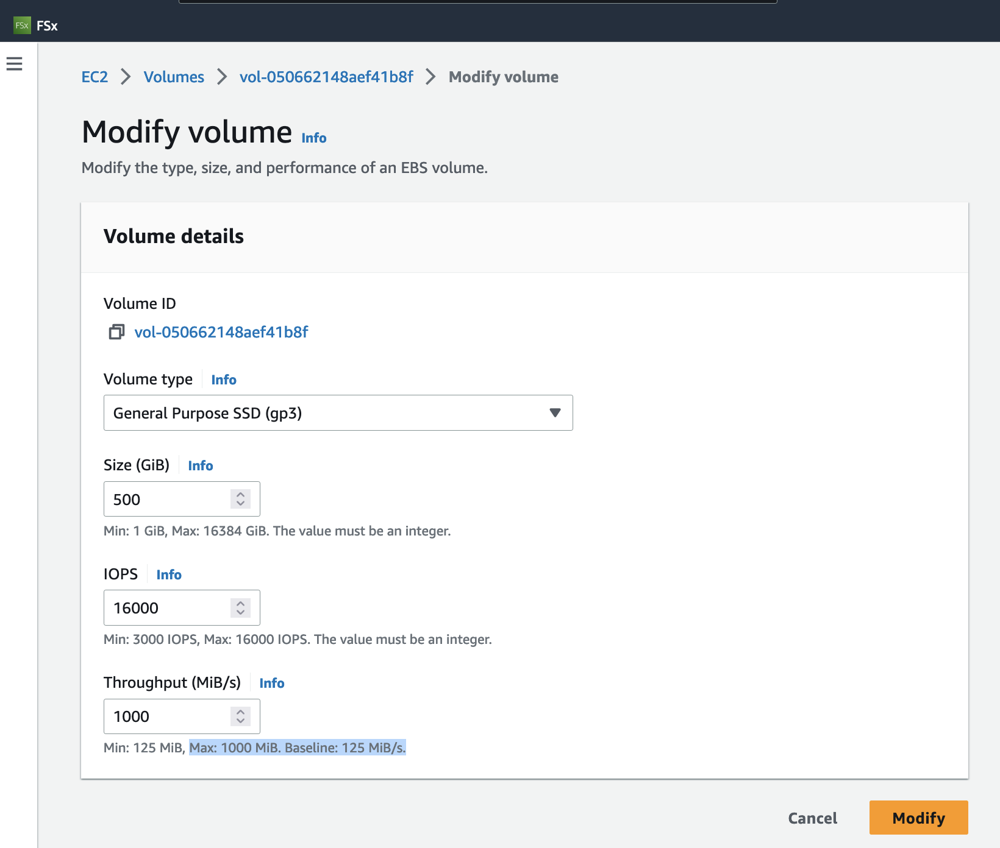
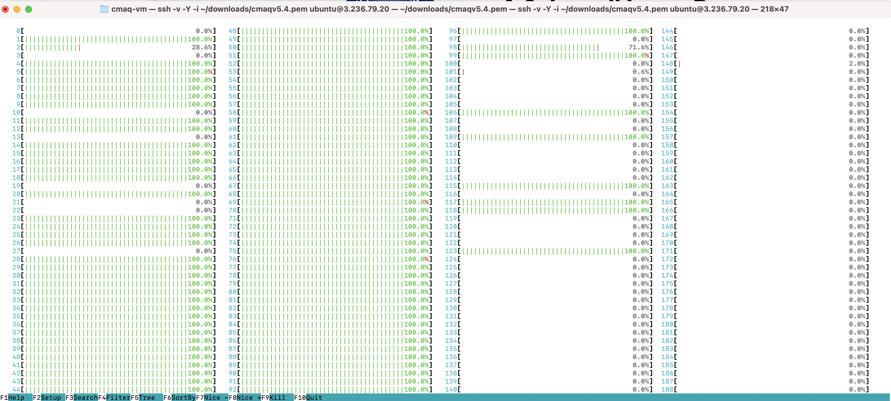
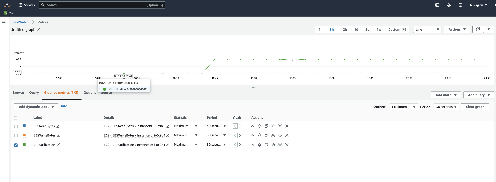
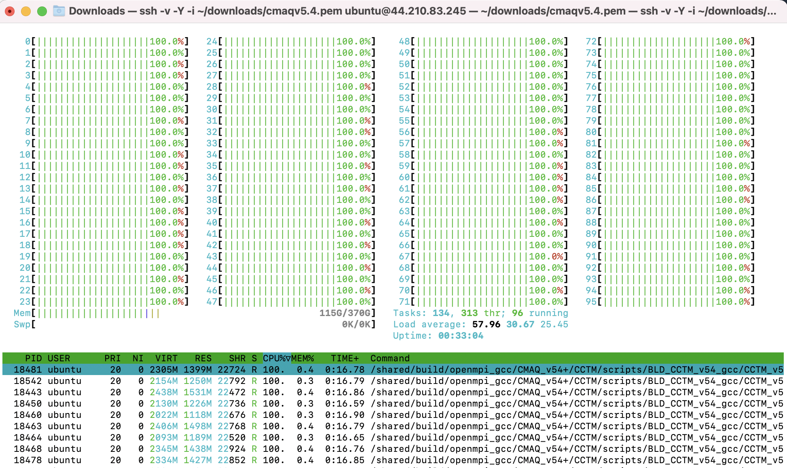
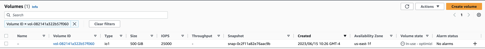

# Documentation of Troubleshooting effort for CMAQv5.4+ on 12US1 

## Public AMI contains the software and data to run 12US1 using CMAQv5.4+

Software was pre-installed and saved to a public ami. 

The input data was also transferred from the AWS Open Data Program and installed on the EBS volume.

This chapter describes the process that was used to test and configure the c6a.48xlarge ec2 instance to run CMAQv5.4 for the 12US1 domain.

Todo: Need to create command line options to copy a public ami to a different region.

### Verify that you can see the public AMI on the us-east-1 region.


`aws ec2 describe-images --region us-east-1 --image-id ami-0aaa0cfeb5ed5763c`

Output:

```
{
    "Images": [
        {
            "Architecture": "x86_64",
            "CreationDate": "2023-06-07T02:52:26.000Z",
            "ImageId": "ami-0aaa0cfeb5ed5763c",
            "ImageLocation": "440858712842/cmaqv5.4_c6a.48xlarge",
            "ImageType": "machine",
            "Public": true,
            "OwnerId": "440858712842",
            "PlatformDetails": "Linux/UNIX",
            "UsageOperation": "RunInstances",
            "State": "available",
            "BlockDeviceMappings": [
                {
                    "DeviceName": "/dev/sda1",
                    "Ebs": {
                        "DeleteOnTermination": true,
                        "Iops": 4000,
                        "SnapshotId": "snap-0c2f11a82e76aac9b",
                        "VolumeSize": 500,
                        "VolumeType": "gp3",
                        "Throughput": 1000,
                        "Encrypted": false
                    }
                },
                {
                    "DeviceName": "/dev/sdb",
                    "VirtualName": "ephemeral0"
                },
                {
                    "DeviceName": "/dev/sdc",
                    "VirtualName": "ephemeral1"
                }
            ],
            "EnaSupport": true,
            "Hypervisor": "xen",
            "Name": "cmaqv5.4_c6a.48xlarge",
            "RootDeviceName": "/dev/sda1",
            "RootDeviceType": "ebs",
            "SriovNetSupport": "simple",
            "VirtualizationType": "hvm",
            "DeprecationTime": "2025-06-07T02:52:26.000Z"
        }
    ]
}
```

Note that the above AMI has a the maximum throughput limit of 1000, but this AMI had an IOPS limit of 4000 which caused I/O issues documented below.

The solution is to use update the volume to a use the maximum value for IOPS of 16000, and then save the EC2 instance as a new AMI that will have the highest IOPS and throughput for the gp3 VolumeType.
The following is a screenshot of the option to do this within the AWS Web Interface. I will work on documenting a method to do this from the command line, but this will be saved for the advanced tutorial.




### AWS Resources for the aws cli method to launch ec2 instances.
 
<a href="https://docs.aws.amazon.com/cli/latest/userguide/cli-services-ec2-instances.html">aws cli exampmles</a>

<a href="https://awscli.amazonaws.com/v2/documentation/api/latest/reference/ec2/run-instances.html">aws cli run instances command</a>

<a href="https://ec2spotworkshops.com/launching_ec2_spot_instances.html">Tutorial Launch Spot Instances</a>

(note, it discourages the use of run-instances for launching spot instances, but they do provide an example method)

<a href="https://ec2spotworkshops.com/launching_ec2_spot_instances/runinstances_api.html">Launching EC2 Spot Instances using Run Instances API</a>


Additional resources for spot instance provisioning.

<a href="https://docs.aws.amazon.com/AWSEC2/latest/UserGuide/spot-requests.html">Spot Instance Requests</a>


To launch a Spot Instance with RunInstances API you create the configuration file as described below:

```
cat <<EoF > ./runinstances-config.json
{
    "DryRun": false,
    "MaxCount": 1,
    "MinCount": 1,
    "InstanceType": "c6a.48xlarge",
    "ImageId": "ami-0aaa0cfeb5ed5763c",
    "InstanceMarketOptions": {
        "MarketType": "spot"
    },
    "TagSpecifications": [
        {
            "ResourceType": "instance",
            "Tags": [
                {
                    "Key": "Name",
                    "Value": "EC2SpotCMAQv54"
                }
            ]
        }
    ]
}
EoF
```

{
    "DryRun": false,
    "MaxCount": 1,
    "MinCount": 1,
    "InstanceType": "c6a.48xlarge",
    "ImageId": "ami-0aaa0cfeb5ed5763c",
    "InstanceMarketOptions": {
        "MarketType": "spot"
    },
    "TagSpecifications": [
        {
            "ResourceType": "instance",
            "Tags": [
                {
                    "Key": "Name",
                    "Value": "EC2SpotCMAQv54"
                }
            ]
        }
    ]
}


## Use a publically available AMI to launch a c6a.48xlarge ec2 instance using a gp3 volume with 16000 IOPS 


Launch a new instance using the AMI with the software loaded and request a spot instance for the c6a.8xlarge EC2 instance

Note, we will be using a json file that has been preconfigured to specify the ImageId

`cd /shared/pcluster-cmaq`


Note, you will need to obtain a security group id from your IT administrator that allows ssh login access.
If this is enabled by default, then you can remove the --security-group-ids launch-wizard-with-tcp-access 

Example command: note launch-wizard-with-tcp-access needs to be replaced by your security group ID, and your-pem key needs to be replaced by the name of your-pem.pem key.

`aws ec2 run-instances --debug --key-name your-pem --security-group-ids launch-wizard-with-tcp-access --dryrun --region us-east-1 --cli-input-json file://runinstances-config.json`

Command that works for UNC's security group and pem key:

`aws ec2 run-instances --debug --key-name cmaqv5.4 --security-group-ids launch-wizard-179 --region us-east-1 --dryrun --ebs-optimized --cpu-options CoreCount=96,ThreadsPerCore=1 --cli-input-json file://runinstances-config.hyperthread-off.16000IOPS.json`

Once you have verified that the command above works with the --dryrun option, rerun it without as follows.

`aws ec2 run-instances --debug --key-name cmaqv5.4 --security-group-ids launch-wizard-179 --region us-east-1 --ebs-optimized --cpu-options CoreCount=96,ThreadsPerCore=1 --cli-input-json file://runinstances-config.hyperthread-off.16000IOPS.json`

Example of security group inbound and outbound rules required to connect to EC2 instance via ssh.


(I am not sure if you can create a security group rule from the aws command line.)

Additional resources

<a href="https://docs.aws.amazon.com/cli/latest/userguide/cli-services-ec2-sg.html">CLI commands to create Security Group</a>

### Use the following command to obtain the public IP address of the machine.

This command is commented out, as the instance hasn't been created yet. keeping the instructions for documentation purposes.

`aws ec2 describe-instances --region=us-east-1 --filters "Name=image-id,Values=ami-0aaa0cfeb5ed5763c" | grep PublicIpAddress`

### Login to the ec2 instance

Note, the following command must be modified to specify your key, and ip address (obtained from the previous command):

`ssh -v -Y -i ~/downloads/your-pem.pem ubuntu@ip.address`


## Load the environment modules

`module avail`
`module load ioapi-3.2/gcc-11.3.0-netcdf  mpi/openmpi-4.1.2  netcdf-4.8.1/gcc-11.3 `


## Run CMAQv5.4 for the 12km Listos Training Case

Input data is available for a subdomain of the 12km 12US1 case.

```
GRIDDESC

'2018_12Listos'
'LamCon_40N_97W'   1812000.000    240000.000     12000.000     12000.000   25   25    1
```

```
cd /shared/build/openmpi_gcc/CMAQ_v54+/CCTM/scripts
./run_cctm_2018_12US1_listos_32pe.csh |& tee ./run_cctm_2018_12US1_listos_32pe.log

```

Successful output:

```
==================================
  ***** CMAQ TIMING REPORT *****
==================================
Start Day: 2018-08-05
End Day:   2018-08-07
Number of Simulation Days: 3
Domain Name:               2018_12Listos
Number of Grid Cells:      21875  (ROW x COL x LAY)
Number of Layers:          35
Number of Processes:       32
   All times are in seconds.

Num  Day        Wall Time
01   2018-08-05   69.9
02   2018-08-06   64.7
03   2018-08-07   66.5
     Total Time = 201.10
      Avg. Time = 67.03

```


## Run CMAQv5.4 for the full 12US1 Domain on c6a.48xlarge with 192 vcpus


```
GRIDDESC
' '  !  end coords.  grids:  name; xorig yorig xcell ycell ncols nrows nthik
'12US1'
'LAM_40N97W'  -2556000.   -1728000.   12000.  12000.  459  299    1
```

Input Data for the 12US1 domain is available for a 2 day benchmark 12US1 Domain for both netCDF4 compressed (*.nc4) and classic netCDF-3 compression (*.nc).
The 96 pe run on the c6a.48xlarge instance will take approximately 120 minutes for 1 day, or 240 minutes for the full 2 day benchmark.

Options that were used to disable multi-trheading:

```
--cpu-options (structure)

    The CPU options for the instance. For more information, see Optimize CPU options in the Amazon EC2 User Guide .

    CoreCount -> (integer)

        The number of CPU cores for the instance.

    ThreadsPerCore -> (integer)

        The number of threads per CPU core. To disable multithreading for the instance, specify a value of 1 . Otherwise, specify the default value of 2 .

--cpu-options CoreCount=integer,ThreadsPerCore=integer,AmdSevSnp=string

JSON Syntax:

{
  "CoreCount": integer,
  "ThreadsPerCore": integer,
  "AmdSevSnp": "enabled"|"disabled"
}


```

### Use command line to submit the job. This single virtual machine does not have a job scheduler such as slurm installed.

```
cd /shared/build/openmpi_gcc/CMAQ_v54+/CCTM/scripts

./run_cctm_2018_12US1_v54_cb6r5_ae6.20171222.8x12.ncclassic.csh |& tee ./run_cctm_2018_12US1_v54_cb6r5_ae6.20171222.8x12.ncclassic.2nd.log

```


Spot Pricing cost for Linux in US East Region

c6a.48xlarge	$5.88 per Hour


Rerunning the 12US1 case on 8x12 processors - for total of 96 processors.

It took about 39 minutes of initial I/O prior to the model starting using this gp3 ami. Fahim was not able to reproduce this performance issue.
I am not sure how to diagnose the issue.  When I upgraded the AMI to use an io2 disk, this poor I/O issue was resolved.

## Once the model starts running (see Processing cmpleted ...) in the log file, then use htop to view the CPU usage.

Login to the virtual machine and then run the following command.

`./htop`




### Using Cloudwatch to see the CPU utilization.

Note that we are using 96 pes of the 192 virtual cpus, so the maximum cpu utilization reported would be 50%.




Successful run output, but it is taking too long (twice as long as on the Parallel Cluster).

```
==================================
  ***** CMAQ TIMING REPORT *****
==================================
Start Day: 2017-12-22
End Day:   2017-12-23
Number of Simulation Days: 2
Domain Name:               12US1
Number of Grid Cells:      4803435  (ROW x COL x LAY)
Number of Layers:          35
Number of Processes:       96
   All times are in seconds.

Num  Day        Wall Time
01   2017-12-22   6320.8
02   2017-12-23   5409.6
     Total Time = 11730.40
      Avg. Time = 5865.20

```

Perhaps the instance is being i/o throttled?

<a href="https://repost.aws/knowledge-center/ebs-volume-io-queue-latency-issues">ebs-volume-io-queue-latency-issues</a>

Trying this CloudWatch Report

<a href="https://repost.aws/knowledge-center/ebs-volume-throughput-limits">EBS Volume Throughput Limits</a>

This report is saying that the maximum throughput for this gp3 volume is 1,000 MiB/s, and the baseline throughtput Limit is 125 MiB/s.
Need to run this same report for the io2 volume, and see what the values are.

<a href="https://us-east-1.console.aws.amazon.com/cloudwatch/home?region=us-east-1#dashboards/dashboard/vol-050662148aef41b8f-EBS-Statistics">EBS Volume Throughput</a>

```
Volume ID: vol-050662148aef41b8f
Instance ID: i-0c2615494c0a89ea9
```


You can use the AWS Web Interface to get an estimate of the savings of using a SPOT versus OnDEMAND Instance.


## Save volume as a snapshot

saving the volume as a snapshot so that I can have a copy of the log files to show the poor performance of the spot instance.
After the snapshot is created then I will delete the instance.
The snapshot name is c6a.48xlarge.cmaqv54.spot, snap-0cc3df82ba5bf5da8

## Clean up Virtual Machine

### Find the InstanceID using the following command on your local machine.

`## aws ec2 describe-instances --region=us-east-1 | grep InstanceId` 

Output

i-xxxx

### Terminate the instance

`## aws ec2 terminate-instances --region=us-east-1 --instance-ids i-xxxx`

<a href="https://docs.aws.amazon.com/cli/latest/userguide/cli-services-ec2-instances.html">Commands for terminating EC2 instance from CLI</a>


## Create c6a.48xlarge with hyperthreading disabled 


`## aws ec2 run-instances --debug --key-name cmaqv5.4 --security-group-ids launch-wizard-179 --region us-east-1 --ebs-optimized --dry-run --cpu-options CoreCount=96,ThreadsPerCore=1 --cli-input-json file://runinstances-config.json`

(note, take out --dry-run option after you try and verify it works)

Obtain the public IP address for the virtual machine

`## aws ec2 describe-instances --region=us-east-1 --filters "Name=image-id,Values=ami-0aaa0cfeb5ed5763c" | grep PublicIpAddress`

Login to the machine
`## ssh -v -Y -i ~/your-pem.pem ubuntu@your-ip-address

### Retry the Listos run script.

```
## cd /shared/build/openmpi_gcc/CMAQ_v54+/CCTM/scripts
## ./run_cctm_2018_12US1_listos_32pe.csh |& tee ./run_cctm_2018_12US1_listos_32pe.log

```

### Use HTOP to view performance.

`htop`

output


### Successful output

```
==================================
  ***** CMAQ TIMING REPORT *****
==================================
Start Day: 2018-08-05
End Day:   2018-08-07
Number of Simulation Days: 3
Domain Name:               2018_12Listos
Number of Grid Cells:      21875  (ROW x COL x LAY)
Number of Layers:          35
Number of Processes:       32
   All times are in seconds.

Num  Day        Wall Time
01   2018-08-05   87.6
02   2018-08-06   77.9
03   2018-08-07   77.2
     Total Time = 242.70
      Avg. Time = 80.90
```

Retried the 12US1 benchmark case but the i/o was still too slow.


### Used the AWS Web Interface to upgrade to an io1 system

<a href="https://aws.amazon.com/blogs/storage/how-to-choose-the-best-amazon-ebs-volume-type-for-your-self-managed-database-deployment/">Choosing EBS Storage Type</a>

After upgrading to the io1 volume, the performance was much improved.

Now, we need to examine the cost, and whether it would cost less for an io2 volume.





Additional information about how to calculate storage pricing.

<a href="https://aws.amazon.com/ebs/pricing/">EBS Pricing</a>


Good comparison of EBS vs EFS, and discussion of using Cloud Volumes ONTAP for data tiering between S3 Buckets and EBS volumes.

<a href="https://bluexp.netapp.com/blog/ebs-efs-amazons3-best-cloud-storage-system">Comparison between EBS and EFS</a>

The aws cli can also be used to modify the volume as per these instructions.

<a href="https://docs.aws.amazon.com/cli/latest/reference/ec2/modify-volume.html">aws cli modify volume</a>

Output

```
==================================
  ***** CMAQ TIMING REPORT *****
==================================
Start Day: 2017-12-22
End Day:   2017-12-23
Number of Simulation Days: 2
Domain Name:               12US1
Number of Grid Cells:      4803435  (ROW x COL x LAY)
`Number of Layers:          35
Number of Processes:       96
   All times are in seconds.

Num  Day        Wall Time
01   2017-12-22   3045.2
02   2017-12-23   3351.8
     Total Time = 6397.00
      Avg. Time = 3198.50
```

Saved the EC2 instance as an AMI and made that ami public.

# Use new ami instance with faster storage (io1) to create c6a.48xlarge ec2 instance 

Note: these command should work, using a runinstance-config.jason file that is in the /shared/pcluster-cmaq directory. (it has already been edited to specify the ami listed below.)

The your-key.pem and the runinstance-config.jason file should be copied to the same directory before using the aws cli instructions below.

New AMI instance name to use for CMAQv5.4 on c6a.48xlarge using 500 GB io1 Storage.

ami-031a6e4499abffdb6

Edit runinstances-config.json to use the new ami.

Add the following line: 

```
    "ImageId": "ami-031a6e4499abffdb6",
```

### Create new instance

Note, you will need to obtain a security group id from your IT administrator that allows ssh login access.
If this is enabled by default, then you can remove the --security-group-ids your-security-group-with-ssh-access-to-Instance option. 

Note, you will need to create or have a keypair that will be used to login to the ec2 instance that you create.

<a href="https://docs.aws.amazon.com/AWSEC2/latest/UserGuide/replacing-key-pair.html">Replacing Key Pair</a>

Create c6a.48xlarge instance: 

`aws ec2 run-instances --debug --key-name your-pem --security-group-ids your-security-group-with-ssh-access-to-Instance --region us-east-1 --ebs-optimized --dry-run --cpu-options CoreCount=96,ThreadsPerCore=1 --cli-input-json file://runinstances-config.json`

(take out --dryrun option after you see the following message:

`botocore.exceptions.ClientError: An error occurred (DryRunOperation) when calling the RunInstances operation: Request would have succeeded, but DryRun flag is set.`

Re-try creating the c5a.48xlarge instance without the dry-run option::

`aws ec2 run-instances --debug --key-name your-pem --security-group-ids your-security-group-with-ssh-access-to-Instance --region us-east-1 --ebs-optimized --cpu-options CoreCount=96,ThreadsPerCore=1 --cli-input-json file://runinstances-config.json`


### Check that the ec2 instance is running using the following command.

`aws ec2 describe-instances --region=us-east-1`

### Use the following command to obtain the IP address

`aws ec2 describe-instances --region=us-east-1  | grep PublicIpAddress`

### Login

`ssh -v -Y -i ~/your-pem.pem ubuntu@your-publicIpAddress`

### Load environment modules

`module avail`

`module load ioapi-3.2/gcc-11.3.0-netcdf  mpi/openmpi-4.1.2  netcdf-4.8.1/gcc-11.3 `

### Change to the scripts directory

`cd /shared/build/openmpi_gcc/CMAQ_v54+/CCTM/scripts/`

### Use lscpu to confirm that there are 96 processors on the c6a.48xlarge ec2 instance that was created with hyperthreading turned off.

`lscpu`

Output:

```
Architecture:            x86_64
  CPU op-mode(s):        32-bit, 64-bit
  Address sizes:         48 bits physical, 48 bits virtual
  Byte Order:            Little Endian
CPU(s):                  96
  On-line CPU(s) list:   0-95
Vendor ID:               AuthenticAMD
  Model name:            AMD EPYC 7R13 Processor
    CPU family:          25
    Model:               1
    Thread(s) per core:  1
    Core(s) per socket:  48
    Socket(s):           2
    Stepping:            1
    BogoMIPS:            5299.98
    Flags:               fpu vme de pse tsc msr pae mce cx8 apic sep mtrr pge mca cmov pat pse36 clflush mmx fxsr sse sse2 ht syscall nx mmxext fxs
                         r_opt pdpe1gb rdtscp lm constant_tsc rep_good nopl nonstop_tsc cpuid extd_apicid aperfmperf tsc_known_freq pni pclmulqdq m
                         onitor ssse3 fma cx16 pcid sse4_1 sse4_2 x2apic movbe popcnt aes xsave avx f16c rdrand hypervisor lahf_lm cmp_legacy cr8_l
                         egacy abm sse4a misalignsse 3dnowprefetch topoext perfctr_core invpcid_single ssbd ibrs ibpb stibp vmmcall fsgsbase bmi1 a
                         vx2 smep bmi2 invpcid rdseed adx smap clflushopt clwb sha_ni xsaveopt xsavec xgetbv1 clzero xsaveerptr rdpru wbnoinvd arat
                          npt nrip_save vaes vpclmulqdq rdpid
Virtualization features: 
  Hypervisor vendor:     KVM
  Virtualization type:   full
Caches (sum of all):     
  L1d:                   3 MiB (96 instances)
  L1i:                   3 MiB (96 instances)
  L2:                    48 MiB (96 instances)
  L3:                    384 MiB (12 instances)
NUMA:                    
  NUMA node(s):          4
  NUMA node0 CPU(s):     0-23
  NUMA node1 CPU(s):     24-47
  NUMA node2 CPU(s):     48-71
  NUMA node3 CPU(s):     72-95
Vulnerabilities:         
  Itlb multihit:         Not affected
  L1tf:                  Not affected
  Mds:                   Not affected
  Meltdown:              Not affected
  Mmio stale data:       Not affected
  Retbleed:              Not affected
  Spec store bypass:     Mitigation; Speculative Store Bypass disabled via prctl
  Spectre v1:            Mitigation; usercopy/swapgs barriers and __user pointer sanitization
  Spectre v2:            Mitigation; Retpolines, IBPB conditional, IBRS_FW, RSB filling, PBRSB-eIBRS Not affected
  Srbds:                 Not affected
  Tsx async abort:       Not affected
```

### Login to the ec2 instance again, so that you have two windows logged into the machine.

`ssh -Y -i ~/your-pem.pem ubuntu@your-ip-address`


### Run 12US1 Listos Training 3 Day benchmark Case on 32 pe (this will take less than 2 minutes)

`./run_cctm_2018_12US1_listos_32pe.csh | & tee ./run_cctm_2018_12US1_listos_32pe.2nd.log`

### Successful output

```
==================================
  ***** CMAQ TIMING REPORT *****
==================================
Start Day: 2018-08-05
End Day:   2018-08-07
Number of Simulation Days: 3
Domain Name:               2018_12Listos
Number of Grid Cells:      21875  (ROW x COL x LAY)
Number of Layers:          35
Number of Processes:       32
   All times are in seconds.

Num  Day        Wall Time
01   2018-08-05   35.7
02   2018-08-06   35.2
03   2018-08-07   36.1
     Total Time = 107.00
      Avg. Time = 35.66
```

### Download input data for 12NE3 1 day Benchmark case

Instructions to copy data from the s3 bucket to the ec2 instance and run this benchmark.

`cd /shared/pcluster-cmaq/`

Examine the command line options that are used to download the data. Note, that we can use the --nosign option, as the data is available from the CMAS Open Data Warehouse on AWS.

`cat s3_copy_12NE3_Bench.csh`

Output

```
#!/bin/csh -f
#Script to download enough data to run START_DATE 201522 and END_DATE 201523 for 12km Northeast Domain
#Requires installing aws command line interface
#https://docs.aws.amazon.com/cli/latest/userguide/install-cliv2-linux.html#cliv2-linux-install
#Total storage required is 56 G

setenv AWS_REGION "us-east-1"

aws s3 cp --no-sign-request --recursive s3://cmas-cmaq/CMAQv5.4_2018_12NE3_Benchmark_2Day_Input /shared/data/
```

### Use the aws s3 copy command to copy data from the CMAS Data Warehouse Open Data S3 bucket.

`./s3_copy_12NE3_Bench.csh`


### Link the data directory on /shared/data

```
cd /shared/build/openmpi_gcc/CMAQ_v54+/data
ln -s /shared/data/2018_12NE3 .
```

### Edit the 12US3 Benchmark run script to use the gcc compiler and to output all species to CONC output file.

`vi run_cctm_Bench_2018_12NE3.c6a48xlarge.csh`

change

`   setenv compiler intel`

to

`   setenv compiler gcc`

Comment out the CONC_SPCS setting that limits them to only 12 species 

```
   # setenv CONC_SPCS "O3 NO ANO3I ANO3J NO2 FORM ISOP NH3 ANH4I ANH4J ASO4I ASO4J" 
```


### Run the 12US3 Benchmark case 

```
./run_cctm_Bench_2018_12NE3.c6a48xlarge.csh |& tee ./run_cctm_Bench_2018_12NE3.c6a48xlarge.32pe.log
```

### Successful output for 12 species output in the 3-D CONC file took 7.4 minutes to run 1 day

```
==================================
  ***** CMAQ TIMING REPORT *****
==================================
Start Day: 2018-07-01
End Day:   2018-07-01
Number of Simulation Days: 1
Domain Name:               2018_12NE3
Number of Grid Cells:      367500  (ROW x COL x LAY)
Number of Layers:          35
Number of Processes:       32
   All times are in seconds.

Num  Day        Wall Time
01   2018-07-01   445.19
     Total Time = 445.19
      Avg. Time = 445.19


```

### Successful output for all species output in the 3-D CONC File (222 variables)

```
==================================
  ***** CMAQ TIMING REPORT *****
==================================
Start Day: 2018-07-01
End Day:   2018-07-01
Number of Simulation Days: 1
Domain Name:               2018_12NE3
Number of Grid Cells:      367500  (ROW x COL x LAY)
Number of Layers:          35
Number of Processes:       32
   All times are in seconds.

Num  Day        Wall Time
01   2018-07-01   444.34
     Total Time = 444.34
      Avg. Time = 444.34

```

Todo: look into process pinning. (will it make a difference on a single VM for number of cores less than 96?)


Compare to timings available in <a href="https://github.com/USEPA/CMAQ/blob/main/DOCS/Users_Guide/CMAQ_UG_ch03_preparing_compute_environment.md">Table 3-1 Example of job scenarios at EPA for a single day simulation.</a>

```
Domain 	                Domain size 	Species Tracked 	Input files size 	Output files size 	Run time (# cores)
2018 North East US 	100 X 105 X 35 	225 	                26GB 	                2GB 	                15 min/day (32)
```

### Run 12US1 2 day benchmark case on 96 processors

```
./run_cctm_2018_12US1_v54_cb6r5_ae6.20171222.12x8.ncclassic.csh |& tee ./run_cctm_2018_12US1_v54_cb6r5_ae6.20171222.12x8.ncclassic.log
```

### Verify that it is using 99% of each of the 96 cores using htop

`htop`

### Successful run timing

```
==================================
  ***** CMAQ TIMING REPORT *****
==================================
Start Day: 2017-12-22
End Day:   2017-12-23
Number of Simulation Days: 2
Domain Name:               12US1
Number of Grid Cells:      4803435  (ROW x COL x LAY)
Number of Layers:          35
Number of Processes:       96
   All times are in seconds.

Num  Day        Wall Time
01   2017-12-22   3070.4
02   2017-12-23   3386.7
     Total Time = 6457.10
      Avg. Time = 3228.55

```

Compare timing to output available <a href="https://github.com/USEPA/CMAQ/blob/main/DOCS/Users_Guide/CMAQ_UG_ch05_running_a_simulation.md#571-cctm-logfiles">CMAQ User Guide: Running CMAQ</a>

### Find the InstanceID using the following command on your local machine.

`aws ec2 describe-instances --region=us-east-1 | grep InstanceId`

Output

i-xxxx

### Stop the instance

`aws ec2 stop-instances --region=us-east-1 --instance-ids i-xxxx`


Get the following error message.

aws ec2 stop-instances --region=us-east-1 --instance-ids i-041a702cc9f7f7b5d

An error occurred (UnsupportedOperation) when calling the StopInstances operation: You can't stop the Spot Instance 'i-041a702cc9f7f7b5d' because it is associated with a one-time Spot Instance request. You can only stop Spot Instances associated with persistent Spot Instance requests.


Note sure how to do a persistent spot instance request .
### Terminate Instance

`aws ec2 terminate-instances --region=us-east-1 --instance-ids i-xxxx`


### Try creating the gp3 version of the ami using the Nitro Hypervisor, and see if that improves the performance without the cost of the io1 volume.

no - the nitro is being used.

 "Hypervisor": "xen", - this applies to the nitro hypervisor according to the documentation.

Try creating the gp3 ami from the web interface, and see if you can reproduce the performance issues or not. If it performs well, then use the --describe-instances command to see what is different between the ami created from web interface and that created from the command line.
