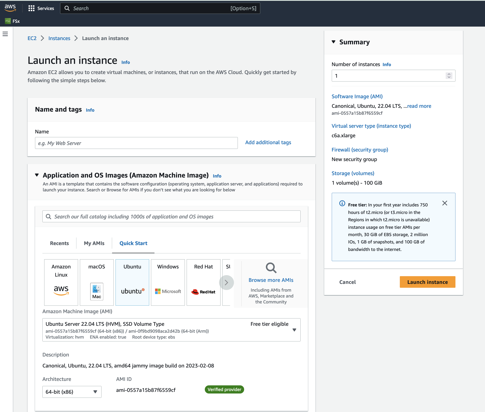

# Install Software and run CMAQv5.4 on c6a.xlarge for the 12km Listos Training Domain

Instructions are provided to build and install CMAQ on c6a.xlarge compute node installed from  Ubuntu 22.04.2 LTS (GNU/Linux 5.15.0-1031-aws x86_64) Image that contains modules for git, openmpi and gcc.  The compute node does not have a SLURM scheduler on it, so jobs are run interactively from the command line. 

Instructions to install data and CMAQ libraries and model are provided along with sample run scripts to run CMAQ on 4 processors on a single c6a.xlarge instance.

This will provide users with experience using the AWS Console to create a Virtual Machine, select Operating System, select the size of the VM as c6a.xlarge vcpus, 8 GiB memory, using an SSH private key to login and install and run CMAQ.

Using this method, the user needs to be careful to start and stop the Virtual Machine and only have it run while doing the intial installation, and while running CMAQ.
The full c6a.xlarge instance will incur charges as long as it is on, even if a job isn't running on it.

This is different than the Parallel Cluster, where if CMAQ is not running in the queue, then the Compute nodes are down, and not incurring costs.

## Build CMAQv5.4+ on c6a.xlarge EC2 instance

### Create a c6a.xlarge Virtual Machine

1. Login to AWS Console
2. Select Get Started with EC2 
3. Select Launch Instance
4. Application and OS (Operating System) Images: Select Ubunutu 22.04 LTS(HVM), SSD Volume Type
(the version of OS determines what packages are available from apt-get and that determines the version of software obtained, ie. cdo version > 2.0 for Ubuntu 22.04 LTS, or cdo version < 2.0 for Ubuntu 18.04.
5. Instance Type: Select c6a.xlarge ($0.153/hr)
6. Key pair - SSH public key, select existing key or create a new one.
7. Network settings - select default settings
8. Configure storage - select 100 GiB gp3 Root volume 
9. Select Launch instance





### Login to the Virtual Machine 

Change the permissions on the public key using command

`chmod 400  [your-key-name].pem`

Login to the Virtual Machine using ssh to the IP address using the public key.

`ssh -Y -i ./xxxxxxx_key.pem ubuntu@xx.xx.xx.xx`


### Make the /shared directory

sudo mkdir /shared

### Change the group and ownership of the shared directory

```
sudo chown ubuntu /shared
sudo chgrp ubuntu /shared
```

Change directories and verify that you see the /shared directory with Size of 100 GB

`cd /shared`

`df -h`

Output

```
df -h
Filesystem       Size  Used Avail Use% Mounted on
/dev/root         97G  1.6G   96G   2% /
tmpfs             16G     0   16G   0% /dev/shm
tmpfs            6.2G  876K  6.2G   1% /run
tmpfs            5.0M     0  5.0M   0% /run/lock
/dev/nvme0n1p15  105M  6.1M   99M   6% /boot/efi
tmpfs            3.1G  4.0K  3.1G   1% /run/user/1000

```

### Create subdirectories on /shared

Create a /shared/build, /shared/data and /shared/cyclecloud-cmaq directory 

```
cd /shared
mkdir build
mkdir data
```

### Check operating system version

```
lsb_release -a
```

output

```
No LSB modules are available.
Distributor ID:	Ubuntu
Description:	Ubuntu 22.04.2 LTS
Release:	22.04
Codename:	jammy

```

### Install Environment Modules

```
sudo apt-get upgrade
sudo apt-get install environment-modules
```

### Logout and then log back in to activate modules command

### Verify module command works

```
 module list
```

Output:

No Modulefiles Currently Loaded.


```
module avail
```

Output:

```
--------------------------------------------------------------------------------------- /usr/share/modules/modulefiles ---------------------------------------------------------------------------------------
dot  module-git  module-info  modules  null  use.own  
```


### Set up build environment 

Load the git module

```
module load module-git
```

If you do not see git available as a module, you may need to install it as follows:

`sudo apt-get install git`

### Install Compilers and OpenMPI

```
sudo apt-get update
sudo apt-get install gcc-9
sudo apt-get  install gfortran-9
sudo apt-get install openmpi-bin openmpi-common libopenmpi-dev libgtk2.0-dev
sudo apt-get install tcsh
```

### Change shell to use tcsh

```
sudo usermod -s /usr/bin/tcsh ubuntu
```

### Logout and log back in, then check the shell

```
echo $SHELL
```

output

```
/usr/bin/tcsh
```

### Check available versions of compiler

```
dpkg --list | grep compiler
```

### Choose gcc-9 and gfortran-9 as default compilers

```
sudo update-alternatives --install /usr/bin/gcc gcc /usr/bin/gcc-9 9
sudo update-alternatives --install /usr/bin/gfortran gfortran /usr/bin/gfortran-9 9
```

### Check version of gcc

```
gcc --version
```

output

```
gcc --version
gcc (Ubuntu 9.5.0-1ubuntu1~22.04) 9.5.0
```

### Check version of gfortran

```
gfortran --version
```

Output

```
GNU Fortran (Ubuntu 9.5.0-1ubuntu1~22.04) 9.5.0
```


### Check version of OpenMPI

```
mpirun --version
```

output

```
mpirun (Open MPI) 4.1.2
```


### Install Parallel Cluster CMAQ Repo

`cd /shared`

`git clone -b main https://github.com/CMASCenter/pcluster-cmaq.git`

### Install and build netcdf C, netcdf Fortran, I/O API, and CMAQ

`cd /shared/pcluster-cmaq/install`

### Install netcdf-C and netcdf-Fortran

`./gcc_netcdf_singlevm.csh |& tee ./gcc_netcdf_singlevm.log`

If successful, you will see the following output, that at the bottom shows what versions of the netCDF library were installed.


```

+-------------------------------------------------------------+
| Congratulations! You have successfully installed the netCDF |
| Fortran libraries.                                          |
|                                                             |
| You can use script "nf-config" to find out the relevant     |
| compiler options to build your application. Enter           |
|                                                             |
|     nf-config --help                                        |
|                                                             |
| for additional information.                                 |
|                                                             |
| CAUTION:                                                    |
|                                                             |
| If you have not already run "make check", then we strongly  |
| recommend you do so. It does not take very long.            |
|                                                             |
| Before using netCDF to store important data, test your      |
| build with "make check".                                    |
|                                                             |
| NetCDF is tested nightly on many platforms at Unidata       |
| but your platform is probably different in some ways.       |
|                                                             |
| If any tests fail, please see the netCDF web site:          |
| https://www.unidata.ucar.edu/software/netcdf/                |
|                                                             |
| NetCDF is developed and maintained at the Unidata Program   |
| Center. Unidata provides a broad array of data and software |
| tools for use in geoscience education and research.         |
| https://www.unidata.ucar.edu                                 |
+-------------------------------------------------------------+

make[3]: Leaving directory '/shared/build/netcdf-fortran-4.5.4'
make[2]: Leaving directory '/shared/build/netcdf-fortran-4.5.4'
make[1]: Leaving directory '/shared/build/netcdf-fortran-4.5.4'
netCDF 4.8.1
netCDF-Fortran 4.5.3
```

Install I/O API

`./gcc_ioapi_singlevm.csh |& tee ./gcc_ioapi_singlevm.log`


Find what operating system is on the system:

` cat /etc/os-release`

Output

```
PRETTY_NAME="Ubuntu 22.04.2 LTS"
NAME="Ubuntu"
VERSION_ID="22.04"
VERSION="22.04.2 LTS (Jammy Jellyfish)"
VERSION_CODENAME=jammy
ID=ubuntu
ID_LIKE=debian
HOME_URL="https://www.ubuntu.com/"
SUPPORT_URL="https://help.ubuntu.com/"
BUG_REPORT_URL="https://bugs.launchpad.net/ubuntu/"
PRIVACY_POLICY_URL="https://www.ubuntu.com/legal/terms-and-policies/privacy-policy"
UBUNTU_CODENAME=jammy
```


### Copy a file to set paths 

`cd /shared/pcluster-cmaq/install`

`cp dot.cshrc.singlevm ~/.cshrc`

### Exit cluster and log back in to activate the update shell, or use csh

### Create Environment Module for Libraries

There are two steps required to create your own custome module:

1. write a module file

2. add a line to your ~/.cshrc to update the MODULEPATH

Create a new custom module that will be loaded with:

```
module load ioapi-3.2/gcc-9.5-netcdf
```

Step 1: Create the module file for ioapi-3.2.

First, create a path to store the module file. The path must contain /Modules/modulefiles/ and should have the general form
/<path to>/Modules/modulefiles/<module-name>/<version> where <version> is typically numerical and is the actual module file.  

```
mkdir -p /shared/build/Modules/modulefiles/ioapi-3.2
```

Next, create the module file and save it in the directory above.

```
cd /shared/build/Modules/modulefiles/ioapi-3.2
vim gcc-9.5-netcdf
```

Contents of gcc-9.5-netcdf:

```
#%Module
  
proc ModulesHelp { } {
   puts stderr "This module adds ioapi-3.2/gcc-9.5 to your path"
}

module-whatis "This module adds ioapi-3.2/gcc-9.5 to your path\n"

set basedir "/shared/build/ioapi-3.2/"
prepend-path PATH "${basedir}/Linux2_x86_64gfort"
prepend-path LD_LIBRARY_PATH "${basedir}/ioapi/fixed_src"
```

The example module file above sets two evironment variables.

The modules update the PATH and LD_LIBRARY_PATH. 

Step 2. Create the module file for netcdf-4.8.1

```
mkdir -p /shared/build/Modules/modulefiles/netcdf-4.8.1
```

Next, create the module file and save it in the directory above.

```
cd /shared/build/Modules/modulefiles/netcdf-4.8.1
vim gcc-9.5
```

Contents of gcc-9.5

```
#%Module
  
proc ModulesHelp { } {
   puts stderr "This module adds netcdf-4.8.1/gcc-9.5 to your path"
}

module-whatis "This module adds netcdf-4.8.1/gcc-9.5 to your path\n"

set basedir "/shared/build/netcdf"
prepend-path PATH "${basedir}/bin"
prepend-path LD_LIBRARY_PATH "${basedir}/lib"
module load mpi/openmpi-4.1.2
```

Step 3. Create the module file for mpi

```
mkdir -p /shared/build/Modules/modulefiles/mpi
```

Next, create the module file and save it in the directory above.

```
cd /shared/build/Modules/modulefiles/mpi
vim openmpi-4.1.2
```


Contents of openmpi-4.1.2

```
#%Module
  
proc ModulesHelp { } {
   puts stderr "This module adds mpi/openmpi-4.1.2 to your path"
}

module-whatis "This module adds mpi/openmpi-4.1.2 to your path\n"

set basedir "/usr/lib/x86_64-linux-gnu/openmpi/"
prepend-path PATH "/usr/bin/"
prepend-path LD_LIBRARY_PATH "${basedir}/lib"
```


Step 4: Add the module path to MODULEPATH.

Now that the module file has been created, add the following line to your ~/.cshrc file so that it can be found:

```
module use --append /shared/build/Modules/modulefiles
```

Step 5: View the modules available after creation of the new module

The module avail command shows the paths to the module files on a given cluster.

```
module avail
```

Output

```
ioapi-3.2/gcc-9.5-netcdf  mpi/openmpi-4.1.2  netcdf-4.8.1/gcc-9.5 
```

Step 4: Load the new modules

```
ioapi-3.2/gcc-9.5-netcdf  mpi/openmpi-4.1.2  netcdf-4.8.1/gcc-9.5 
```

### Find path for openmpi libraries

```
ompi_info --path libdir
```

output

```
 Libdir: /usr/lib/x86_64-linux-gnu/openmpi/lib
```

### Find path for include files for openmpi

```
ompi_info --path incdir
```

output

```
Incdir: /usr/lib/x86_64-linux-gnu/openmpi/include
```

### Edit the config_cmaq_singlevm.csh script to specify the paths for OpenMPI
Note, search for case gcc so that you edit the section of the file that is using the gcc compiler.

```
       setenv MPI_INCL_DIR     /usr/lib/x86_64-linux-gnu/openmpi/include              #> MPI Include directory path
        setenv MPI_LIB_DIR     /usr/lib/x86_64-linux-gnu/openmpi/lib             #> MPI Lib directory path
```

### Install Python

```
sudo apt-get install python3 python3-pip
```

Check Version

```
python3 --version
Python 3.10.6
ip-172-31-27-148:/shared/build/openmpi_gcc/CMAQ_v54+/CCTM/scripts> python3 -m pip --version
pip 22.0.2 from /usr/lib/python3/dist-packages/pip (python 3.10)

```

### Install jupyter notebook.

```
pip install jupyterlab
```

### Install and Build CMAQ

```
cd /shared/pcluster-cmaq/install
./gcc_cmaq54+_singlevm.csh |& tee ./gcc_cmaq54+_singlevm.log
```

#### Add compile option to makefile to get beyond a type mismatch error

Add the following to the compile option: -fallow-argument-mismatch

```
cd /shared/build/openmpi_gcc/CMAQ_v54+/CCTM/scripts/BLD_CCTM_v54_gcc
vi Makefile.gcc
```

Output:
```
 FSTD = -fallow-argument-mismatch -O3 -funroll-loops -finit-character=32 -Wtabs -Wsurprising -ftree-vectorize  -ftree-loop-if-convert -finline-limit=512
```

### Run make again

```
make |& tee Make.log
```

Verfify that the executable was successfully built.

`ls /shared/build/openmpi_gcc/CMAQ_v54+/CCTM/scripts/BLD_CCTM_v54_gcc/*.exe`

Output

```
/shared/build/openmpi_gcc/CMAQ_v54+/CCTM/scripts/BLD_CCTM_v54_gcc/CCTM_v54.exe
```

### Copy the run scripts from the repo to the run directory

`cd /shared/build/openmpi_gcc/CMAQ_v54+/CCTM/scripts`

`cp /shared/pcluster-cmaq/run_scripts/c6a/*.csh .`

List the scripts available

`ls -rlt *.csh*`

Output

```
-rwxrwxr-x 1 ubuntu ubuntu  8374 Jun  6 19:06 bldit_mech.csh
-rwxrwxr-x 1 ubuntu ubuntu 37040 Jun  6 19:06 bldit_cctm.csh
-rwxrwxr-x 1 ubuntu ubuntu 39500 Jun  6 19:06 run_cctm_cracmm_2018_4LISTOS1.csh
-rwxrwxr-x 1 ubuntu ubuntu 38493 Jun  6 19:06 run_cctm_Bench_2018_12NE3.csh
-rwxrwxr-x 1 ubuntu ubuntu 51329 Jun  6 19:06 run_cctm_Bench_2018_12NE3.WRFCMAQ.csh
-rwxrwxr-x 1 ubuntu ubuntu 38158 Jun  6 19:06 run_cctm_Bench_2016_12SE1.csh
-rwxrwxr-x 1 ubuntu ubuntu 39265 Jun  6 19:06 run_cctm_2016_12US1.csh
-rwxrwxr-x 1 ubuntu ubuntu 37458 Jun  6 19:06 run_cctm_2015_HEMI.csh
-rwxrwxr-x 1 ubuntu ubuntu 37583 Jun  6 19:06 run_cctm_2010_4CALIF1.csh
-rwxrwxr-x 1 ubuntu ubuntu  38460 Jun  6 19:36 run_cctm_2018_12US1_listos.csh

```

## Download the Input data from the S3 Bucket 


### Install aws command line

see <a href="https://docs.aws.amazon.com/cli/latest/userguide/getting-started-install.html">Install AWS CLI</a>


`cd /shared/build`

`curl "https://awscli.amazonaws.com/awscli-exe-linux-x86_64.zip" -o "awscliv2.zip"`

### Install unzip and unzip file

`sudo apt install zip`

`/usr/bin/unzip awscliv2.zip`

`sudo ./aws/install`

output

```
You can now run: /usr/local/bin/aws --version
```

Note, you will need to add this path to your .cshrc

### Edit .cshrc

vi ~/.cshrc

add the following to the path  /usr/local/bin

Output:

```
# start .cshrc

umask 002

if ( ! $?LD_LIBRARY_PATH ) then
    setenv LD_LIBRARY_PATH /shared/build/netcdf/lib
else
    setenv LD_LIBRARY_PATH ${LD_LIBRARY_PATH}:/shared/build/netcdf/lib
endif

set path = ($path /shared/build/netcdf/bin /shared/build/ioapi-3.2/Linux2_x86_64gfort /opt/slurm/bin/ /usr/local/bin/ )

if ($?tcsh) then
   source /usr/share/modules/init/tcsh
else
   source /usr/share/modules/init/csh
endif
```


### Install the input data using the s3 script

`cd /shared/pcluster-cmaq/s3_scripts/`

`./s3_copy_nosign_cmaqv5.4-listos_cmas_opendata_to_shared.csh`

### Link the input data directory to the default location

```
cd /shared/build/openmpi_gcc/CMAQ_v54+/data
ln -s /shared/data/12US1_LISTOS .
```

Note, this Virtual Machine does not have Slurm installed or configured.

## Run CMAQ interactively using the following command:

`cd /shared/build/openmpi_gcc/CMAQ_v54+/CCTM/scripts`

`./run_cctm_2018_12US1_listos.csh |& tee ./run_cctm_2018_12US1_listos.log`

When the run has completed, record the timing of the two day benchmark.

`tail -n 30  run_cctm_2018_12US1_listos.log`

Output:

```
==================================
  ***** CMAQ TIMING REPORT *****
==================================
Start Day: 2018-08-05
End Day:   2018-08-07
Number of Simulation Days: 3
Domain Name:               2018_12Listos
Number of Grid Cells:      21875  (ROW x COL x LAY)
Number of Layers:          35
Number of Processes:       4
   All times are in seconds.

Num  Day        Wall Time
01   2018-08-05   166.3
02   2018-08-06   166.2
03   2018-08-07   169.5
     Total Time = 502.00
      Avg. Time = 167.33

```

## Run CMAQ interactively on 32 pes using the following command:

`cd /shared/build/openmpi_gcc/CMAQ_v54+/CCTM/scripts`

`./run_cctm_2018_12US1_listos_32pe.csh |& tee run_cctm_2018_12US1_listos_32pe.log`

Output

```
==================================
  ***** CMAQ TIMING REPORT *****
==================================
Start Day: 2018-08-05
End Day:   2018-08-07
Number of Simulation Days: 3
Domain Name:               2018_12Listos
Number of Grid Cells:      21875  (ROW x COL x LAY)
Number of Layers:          35
Number of Processes:       32
   All times are in seconds.

Num  Day        Wall Time
01   2018-08-05   80.6
02   2018-08-06   72.7
03   2018-08-07   76.3
     Total Time = 229.60
      Avg. Time = 76.53
```
