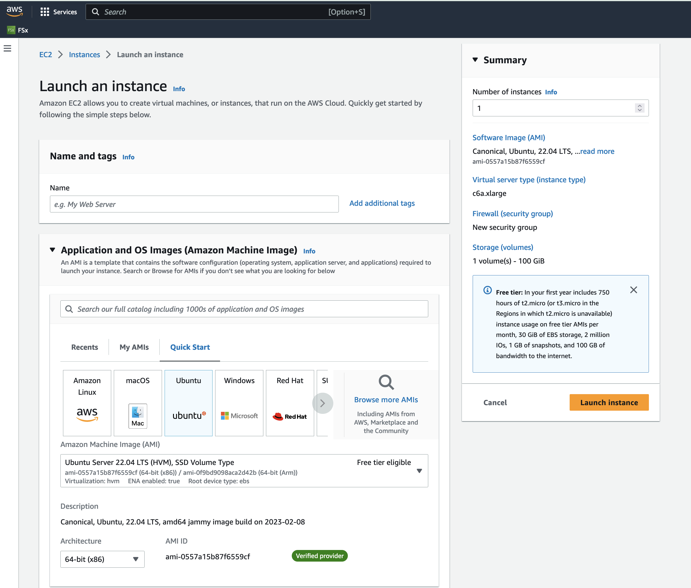

Intermediate Tutorial: Run CMAQ from c6a.xlarge

Instructions are provided to build and install CMAQ on c6a.xlarge compute node installed from  Ubuntu 22.04.2 LTS (GNU/Linux 5.15.0-1031-aws x86_64) Image that contains modules for git, openmpi and gcc.  The compute node does not have a SLURM scheduler on it, so jobs are run interactively from the command line. 

Instructions to install data and CMAQ libraries and model are provided along with sample run scripts to run CMAQ on 4 processors on a single c6a.xlarge instance.

This will provide users with experience using the AWS Console to create a Virtual Machine, select Operating System, select the size of the VM as c6a.xlarge vcpus, 8 GiB memory, using an SSH private key to login and install and run CMAQ.

Using this method, the user needs to be careful to start and stop the Virtual Machine and only have it run while doing the intial installation, and while running CMAQ.
The full c6a.xlarge instance will incur charges as long as it is on, even if a job isn't running on it.

This is different than the Parallel Cluster, where if CMAQ is not running in the queue, then the Compute nodes are down, and not incurring costs.

## Create a c6a.xlarge Virtual Machine

1. Login to AWS Console
2. Select Get Started with EC2 
3. Select Launch Instance
3. Application and OS (Operating System) Images: Select Ubunut
4. Instance Type: Select c6a.xlarge ($0.153/hr)
5. Key paar - SSH public key, select existing key or create a new one.
6. Network settings - select default settings
7. Configure storage - select 100 GiB gp3 Root volume 
8. Select Launch instance





## Login to the Virtual Machine 

Change the permissions on the public key using command

`chmod 400  [your-key-name].pem`

Login to the Virtual Machine using ssh to the IP address using the public key.

`ssh -Y -i ./xxxxxxx_key.pem username@xx.xx.xx.xx`


### Make the /shared directory

sudo mkdir /shared

## Change the group and ownership of the shared directory

```
sudo chown ubuntu /shared
sudo chgrp ubuntu /shared
```

Change directories and verify that you see the /shared directory with Size of 100 GB

`cd /shared`

`df -h`

Output

```
df -h
Filesystem       Size  Used Avail Use% Mounted on
/dev/root         97G  2.1G   95G   3% /
tmpfs            3.8G     0  3.8G   0% /dev/shm
tmpfs            1.6G  824K  1.6G   1% /run
tmpfs            5.0M     0  5.0M   0% /run/lock
/dev/nvme0n1p15  105M  6.1M   99M   6% /boot/efi
tmpfs            777M  4.0K  777M   1% /run/user/1000
```

### Create subdirectories on /shared

Create a /shared/build, /shared/data and /shared/cyclecloud-cmaq directory 

```
cd /shared
mkdir build
mkdir data
```

## Set up build environment 

Load the git module

```
module load module-git
```

If you do not see git available as a module, you may need to install it as follows:


`sudo yum install git`

### Install OpenMPI

```
sudo apt-get install gcc
sudo apt install gfortran
sudo apt-get install openmpi-bin openmpi-common libopenmpi-dev libgtk2.0-dev
sudo apt-get install tcsh

### Change shell to use tcsh

sudo usermod -s /usr/bin/tcsh ubuntu

### Logout and log back in, then check the shell

echo $SHELL

output

```
/usr/bin/tcsh
```


### Check version of OpenMPI

```
mpirun --version
```

output

```
mpirun (Open MPI) 4.1.2
```

### Load the openmpi module (need to set this up)

```
module load mpi/openmpi-4.1.2
```

### Install Parallel Cluster CMAQ Repo

`git clone -b main https://github.com/CMASCenter/pcluster-cmaq.git`

### Install and build netcdf C, netcdf Fortran, I/O API, and CMAQ

`cd /shared/pcluster-cmaq`

Install netcdf-C and netcdf-Fortran

`./gcc_install.csh`

If successful, you will see the following output, that at the bottom shows what versions of the netCDF library were installed.

```
+-------------------------------------------------------------+
| Congratulations! You have successfully installed the netCDF |
| Fortran libraries.                                          |
|                                                             |
| You can use script "nf-config" to find out the relevant     |
| compiler options to build your application. Enter           |
|                                                             |
|     nf-config --help                                        |
|                                                             |
| for additional information.                                 |
|                                                             |
| CAUTION:                                                    |
|                                                             |
| If you have not already run "make check", then we strongly  |
| recommend you do so. It does not take very long.            |
|                                                             |
| Before using netCDF to store important data, test your      |
| build with "make check".                                    |
|                                                             |
| NetCDF is tested nightly on many platforms at Unidata       |
| but your platform is probably different in some ways.       |
|                                                             |
| If any tests fail, please see the netCDF web site:          |
| https://www.unidata.ucar.edu/software/netcdf/                |
|                                                             |
| NetCDF is developed and maintained at the Unidata Program   |
| Center. Unidata provides a broad array of data and software |
| tools for use in geoscience education and research.         |
| https://www.unidata.ucar.edu                                 |
+-------------------------------------------------------------+

make[3]: Leaving directory '/shared/build/netcdf-fortran-4.5.4'
make[2]: Leaving directory '/shared/build/netcdf-fortran-4.5.4'
make[1]: Leaving directory '/shared/build/netcdf-fortran-4.5.4'
netCDF 4.8.1
netCDF-Fortran 4.5.4
```

Install I/O API

`./gcc_ioapi.csh`


Find what operating system is on the system:

` cat /etc/os-release`

Output

```
NAME="AlmaLinux"
VERSION="8.5 (Arctic Sphynx)"
ID="almalinux"
ID_LIKE="rhel centos fedora"
VERSION_ID="8.5"
PLATFORM_ID="platform:el8"
PRETTY_NAME="AlmaLinux 8.5 (Arctic Sphynx)"
ANSI_COLOR="0;34"
CPE_NAME="cpe:/o:almalinux:almalinux:8::baseos"
HOME_URL="https://almalinux.org/"
DOCUMENTATION_URL="https://wiki.almalinux.org/"
BUG_REPORT_URL="https://bugs.almalinux.org/"

ALMALINUX_MANTISBT_PROJECT="AlmaLinux-8"
ALMALINUX_MANTISBT_PROJECT_VERSION="8.5"
```

## Change shell to use tcsh

`sudo usermod -s /bin/tcsh azureuser`


Log out and then log back in to have the shell take effect.

Copy a file to set paths 

`cd /shared/cyclecloud-cmaq`

`cp dot.cshrc.vm ~/.cshrc`

## Create Environment Module for Libraries

There are two steps required to create your own custome module:

1. write a module file

2. add a line to your ~/.cshrc to update the MODULEPATH

Create a new custom module that will be loaded with:

```
module load ioapi-3.2_20200828/gcc-9.2.1-netcdf
```

Step 1: Create the module file.

First, create a path to store the module file. The path must contain /Modules/modulefiles/ and should have the general form
/<path to>/Modules/modulefiles/<module-name>/<version> where <version> is typically numerical and is the actual module file.  

```
mkdir /shared/build/Modules/modulefiles/ioapi-3.2_20200828
```

Next, crate the module file and save it in the directory above.

```
cd /shared/build/Modules/modulefiles/ioapi-3.2_20200828
vim gcc-9.2.1-netcdf
```

Contents of gcc-9.2.1-netcdf:

```
#%Module
  
proc ModulesHelp { } {
   puts stderr "This module adds ioapi-3.2_20200828/gcc-9.2.1 to your path"
}

module-whatis "This module adds ioapi-3.2_20200828/gcc-9.2.1 to your path\n"

set basedir "/shared/build/ioapi-3.2_branch_20200828/"
prepend-path PATH "${basedir}/Linux2_x86_64gfort"
prepend-path LD_LIBRARY_PATH "${basedir}/ioapi/fixed_src"
module load mpi/openmpi-4.1.1
module load gcc-9.2.1
```

The example module file above sets two evironment variables and loads two system modules.

The modules update the PATH and LD_LIBRARY_PATH. 

Step 2: Add the module path to MODULEPATH.

Now that the odule file has been created, add the following line to your ~/.cshrc file so that it can be found:

```
module use --append /shared/build/Modules/modulefiles/ioapi-3.2_20200828/gcc-9.2.1-netcdf
```

Step 3: View the modules available after creation of the new module

The module avail command shows the paths to the module files on a given cluster.

```
module avail
```

Step 4: Load the new module

```
module load ioapi-3.2_20200828/gcc-9.2.1-netcdf
```


## Install and Build CMAQ

`./gcc_cmaq.csh`

Verfify that the executable was successfully built.

`ls /shared/build/openmpi_gcc/CMAQ_v533/CCTM/scripts/BLD_CCTM_v533_gcc/*.exe`

Output

```
/shared/build/openmpi_gcc/CMAQ_v533/CCTM/scripts/BLD_CCTM_v533_gcc/CCTM_v533.exe
```

## Copy the run scripts from the repo to the run directory

`cd /shared/build/openmpi_gcc/CMAQ_v533/CCTM/scripts`

`cp /shared/cyclecloud-cmaq/run_scripts/HB120v3/*pe.csh .`

List the scripts available

`ls -rlt *pe.csh*`

Output

```
run_cctm_2016_12US2.90pe.csh
run_cctm_2016_12US2.36pe.csh
run_cctm_2016_12US2.16pe.csh
run_cctm_2016_12US2.120pe.csh
```

## Download the Input data from the S3 Bucket 

### Install aws command line

see <a href="https://docs.aws.amazon.com/cli/latest/userguide/getting-started-install.html">Install AWS CLI</a>


`cd /shared/build`

`curl "https://awscli.amazonaws.com/awscli-exe-linux-x86_64.zip" -o "awscliv2.zip"`

`unzip awscliv2.zip`

`sudo ./aws/install`


### Install the input data using the s3 script

`cd /shared/cyclecloud-cmaq/s3_scripts/`

`./s3_copy_nosign_conus_cmas_opendata_to_shared.csh`

Note, this Virtual Machine does not have Slurm installed or configured.

## Run CMAQ interactively using the following command:

`cd /shared/build/openmpi_gcc/CMAQ_v533/CCTM/scripts`

`./run_cctm_2016_12US2.120pe.csh |& tee ./run_cctm_2016_12US2.120pe.log`

When the run has completed, record the timing of the two day benchmark.

`tail -n 30  run_cctm_2016_12US2.120pe.log`

Output:

```
==================================
  ***** CMAQ TIMING REPORT *****
==================================
Start Day: 2015-12-22
End Day:   2015-12-23
Number of Simulation Days: 2
Domain Name:               12US2
Number of Grid Cells:      3409560  (ROW x COL x LAY)
Number of Layers:          35
Number of Processes:       120
   All times are in seconds.

Num  Day        Wall Time
01   2015-12-22   2458.35
02   2015-12-23   2205.08
     Total Time = 4663.43
      Avg. Time = 2331.71
```

If runs are submitted immediately after a successful completion of a run, then you may skey the scaling results.
It would be ideal to wait 30 minutes before running a second job. 

### Run second job interactively using the following command:

`./run_cctm_2016_12US2.90pe.csh | & tee ./run_cctm_2016_12US2.90pe.log`

Output

```
==================================
  ***** CMAQ TIMING REPORT *****
==================================
Start Day: 2015-12-22
End Day:   2015-12-23
Number of Simulation Days: 2
Domain Name:               12US2
Number of Grid Cells:      3409560  (ROW x COL x LAY)
Number of Layers:          35
Number of Processes:       90
   All times are in seconds.

Num  Day        Wall Time
01   2015-12-22   2786.21
02   2015-12-23   2417.74
     Total Time = 5203.95
      Avg. Time = 2601.97
```

