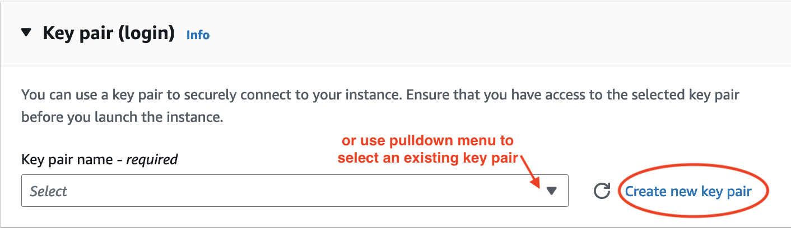
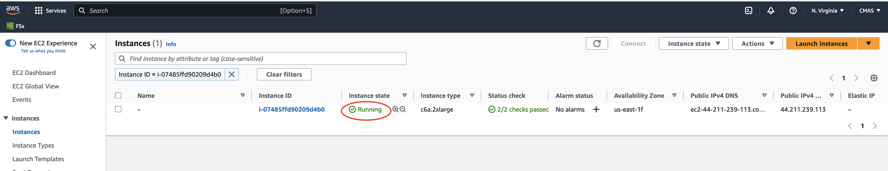

# Create a VM from the AWS Web Console

Here we will use an Amazon Elastic Compute Cloud (EC2) C6a instance to run a small CMAQ benchmark case.  The software needed to run the benchmark is pre-installed on a public Amazon Machine Image (AMI).  The input data is also publicly available through the AWS Open Data Program. 

If you are not able to access the AWS Web Console, skip to section 1.2 to learn how to use the AWS Command Line Interface (CLI).

```{note}
When working on the AWS Cloud you will need to select a Region for your workloads. (See AWS blog on <a href="https://aws.amazon.com/blogs/architecture/what-to-consider-when-selecting-a-region-for-your-workloads/">What to consider when selecting a region</a>).  The scripts used in this tutorial use the us-east-1 region, but they can be modified to use any of the supported regions listed here:
<a href="https://docs.aws.amazon.com/parallelcluster/latest/ug/supported-regions-v3.html">CLI v3 Supported Regions</a>
```

<a href="https://aws.amazon.com/">1. Login to AWS Web Console.</a> and select EC2


2. Click on the orange "Launch Instance" button.


3. Search for AMI.

4. Enter the AMI name: ami-051ba52c157e4070c in the search box and return or enter.


5. Click on the Community AMI tab and then and click on the orange "Select" button.


```{note}
This Amazon Machine Image (AMI) was built using a C6a EC2 Instance, with default Ubuntu OS (Ubuntu OS, 22.04 LTS, amd64 jammy), with gcc compilers, OpenMPI, netCDF, I/O API, and CMAQv5.4.
<a href="https://aws.amazon.com/ec2/instance-types/c6a/">Amazon EC2 C6a Instances</a>
To create a VM using a different family of EC2 instances, you would need to choose the default Ubuntu OS and follow the Developer Guide to install the compilers and software for CMAQv5.4.
```

6. Search for c6a.2xlarge Instance Type and select it.

Note, the screenshots show the c6a.2xlarge instance type being selected. If you were running a larger benchmark, you would want to select a larger sized instance such as a c6a.8xlarge or c6a.48xlarge. 


7. Select key pair name or create a new key pair.




8. Use the default network settings.


9. Review the storage options. The AMI is preconfigured to use 500 GiB of gp3 as the root volume (not encrypted).


10. Select the pull-down options for Advanced details.


11. Select checkbox for Request Spot Instances.


12. Scroll down until you see option to Specify CPU cores.

13. Click the checkbox for "Specify CPU cores".

14. Then select 4 Cores, and 1 thread per core.


If you are building a VM using a different instance type, just select 1 thread per core and leave the number of cores to the value that is pre-set. 
c6a.2xlarge (4 Cores), c6a.8xlarge (16 cores), c6a.48x large (96 cores).

15. In the Summary Menu, select Launch Instance.


16. Click on the link to the instance once it is successfully launched.


17. Wait until the Status check has been completed and the Instance State is running



18. Click on the instance link and copy the Public IP address to your clipboard.


19. You will use this Public IP address to login into the VM that you just created (c6a.2xlarge ec2 instance).

On your local computer, you will use the following command.

```
ssh -v -Y -i ~/downloads/your-pem.pem ubuntu@xx.xxx.xxx.xxx
```
