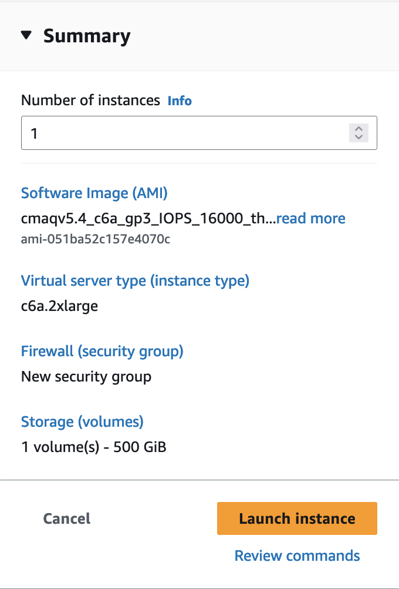

# Create a VM from the AWS Web Console

Here we will use an Amazon Elastic Compute Cloud (EC2) C6a instance to run a small CMAQ benchmark case.  The software needed to run the benchmark is pre-installed on a public AMI.  The input data is also publicly available through the AWS Open Data Program. 

<a href="https://aws.amazon.com/">Login to AWS Web Console</a> and select EC2


Click on the orange "Launch Instance" button


Search for AMI

Enter the ami name: ami-051ba52c157e4070c in the Search box and return or enter.


Click on the Community AMI tab and then and click on the orange "Select" button


Note this AMI was built for the following architecture, and can be used by the c6a - hpc6a family of instances

Canonical, Ubuntu, 22.04 LTS, amd64 jammy image build on 2023-07-05

Search for c6a.2xlarge Instance Type and select it.

Note, the screenshots show the c6a.2xlarge instance type being selected.

If you were running a larger benchmark, you would want to select a larger sized instance such as a c6a.8xlarge or c6a.48xlarge. 


Select key pair name or create a new key pair


Use the default Network Settings


Review Storage Options

The AMI is preconfigured to use 500 GiB of gp3 as the root volume (Not encrypted)


Select the Pull-down options for Advanced details


Select checkbox for Request Spot Instances


Scroll down until you see option to Specify CPU cores

Click the checkbox for "Specify CPU cores"

Then select 4 Cores, and 1 thread per core


If you are building a VM using a different instance type, just select 1 thread per core and leave the number of cores to the value that is pre-set. 
c6a.2xlarge (4 Cores), c6a.8xlarge (16 cores), c6a.48x large (96 cores).


In the Summary Menu, select Launch Instance



Click on the link to the instance once it is successfully launched


Wait until the Status check has been completed and the Instance State is running


Click on the instance link and copy the Public IP address to your clipboard


You will use this Public IP address to login into the VM that you just created (c6a.2xlarge ec2 instance).

On your local computer, you will use the following command.

```
ssh -v -Y -i ~/downloads/your-pem.pem ubuntu@xx.xxx.xxx.xxx
```
