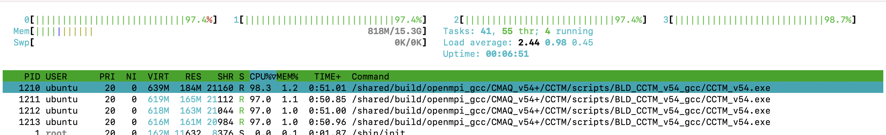

# Run CMAQv5.4 on c6a.2xlarge

Obtain IP address from AWS Web Console or use the following AWS CLI command to obtain the public IP address of the machine.

`aws ec2 describe-instances --region=us-east-1 --filters "Name=image-id,Values=ami-051ba52c157e4070c" | grep PublicIpAddress`

## Login to the ec2 instance

`ssh -v -Y -i ~/downloads/your-pem.pem ubuntu@ip.address`


Login to the ec2 instance again, so that you have two windows logged into the machine.

`ssh -Y -i ~/downloads/your-pem.pem ubuntu@your-ip-address` 


Load the environment modules

`module avail`

`module load ioapi-3.2/gcc-11.3.0-netcdf  mpi/openmpi-4.1.2  netcdf-4.8.1/gcc-11.3 `

Verify that the input data for the benchmark is available.

`ls -lrt /shared/data/12US1_LISTOS/*`

Run CMAQv5.4 for 12US1 Listos Training 3 Day benchmark Case on 4 pe

Note, this is a small 12km benchmark case, with 25 rows and 25 columns.

```
GRIDDESC

'2018_12Listos'
'LamCon_40N_97W'   1812000.000    240000.000     12000.000     12000.000   25   25    1
```

## Run CMAQv5.4

```{note}
Use command line to submit the job.  There is no job scheduler (such as slurm) installed.
```

```
cd /shared/build/openmpi_gcc/CMAQ_v54+/CCTM/scripts
./run_cctm_2018_12US1_listos.csh | & tee ./run_cctm_2018_12US1_listos.c6a.2xlarge.log
```

Use HTOP to view performance.

`htop`

output


If the ec2 instance is configured to use 1 thread per core in the advanced setting, then it will have 4 cores.

For MPI or parallel applications such as CMAQ it is best to turn off hyperthreading.




After the benchmark is complete, use the following command to view the timing results.

`tail -n 20 run_cctm_2018_12US1_listos.c6a.2xlarge.log`

```
==================================
  ***** CMAQ TIMING REPORT *****
==================================
Start Day: 2018-08-05
End Day:   2018-08-07
Number of Simulation Days: 3
Domain Name:               2018_12Listos
Number of Grid Cells:      21875  (ROW x COL x LAY)
Number of Layers:          35
Number of Processes:       4
   All times are in seconds.

Num  Day        Wall Time
01   2018-08-05   165.5
02   2018-08-06   165.8
03   2018-08-07   169.5
     Total Time = 500.80
      Avg. Time = 166.93
```

Use lscpu to view number of cores

Confirm that there are 4 cores on the c6a.2xlarge ec2 instance that was created with hyperthreading turned off (1 thread per core).

`lscpu`

Output:

```
lscpu
Architecture:            x86_64
  CPU op-mode(s):        32-bit, 64-bit
  Address sizes:         48 bits physical, 48 bits virtual
  Byte Order:            Little Endian
CPU(s):                  4
  On-line CPU(s) list:   0-3
Vendor ID:               AuthenticAMD
  Model name:            AMD EPYC 7R13 Processor
    CPU family:          25
    Model:               1
    Thread(s) per core:  1
    Core(s) per socket:  4
    Socket(s):           1
    Stepping:            1
    BogoMIPS:            5299.98
    Flags:               fpu vme de pse tsc msr pae mce cx8 apic sep mtrr pge mca cmov pat pse36 clflush mmx fxsr sse sse2 ht syscall nx mmxext fxsr_opt pdpe1gb rdt
                         scp lm constant_tsc rep_good nopl nonstop_tsc cpuid extd_apicid aperfmperf tsc_known_freq pni pclmulqdq ssse3 fma cx16 pcid sse4_1 sse4_2 x
                         2apic movbe popcnt aes xsave avx f16c rdrand hypervisor lahf_lm cmp_legacy cr8_legacy abm sse4a misalignsse 3dnowprefetch topoext invpcid_s
                         ingle ssbd ibrs ibpb stibp vmmcall fsgsbase bmi1 avx2 smep bmi2 invpcid rdseed adx smap clflushopt clwb sha_ni xsaveopt xsavec xgetbv1 clze
                         ro xsaveerptr rdpru wbnoinvd arat npt nrip_save vaes vpclmulqdq rdpid
Virtualization features: 
  Hypervisor vendor:     KVM
  Virtualization type:   full
Caches (sum of all):     
  L1d:                   128 KiB (4 instances)
  L1i:                   128 KiB (4 instances)
  L2:                    2 MiB (4 instances)
  L3:                    16 MiB (1 instance)
NUMA:                    
  NUMA node(s):          1
  NUMA node0 CPU(s):     0-3
```

```{note}
If the run time seems to take awhile at the beginning of each day, then you may need to resubmit the job.
There is an initial latency issue when storage blocks are initially pulled down from Amazon S3 and written to the volume.

For the 12US1 or other large benchmarks with larger input file sizes, this latency or delay is longer. Note: users will need to use a larger ec2 instanceto run the 12US1 benchmark, and also follow instructions available on how to initialize the volume prior to running.
<a href="https://docs.aws.amazon.com/AWSEC2/latest/UserGuide/ebs-initialize.html">Initialize EBS Volume</a> 
```

Once you have successfully run the benchmark, terminate the instance.

Terminate the c6a.2xlarge either thru the Web Console or using the CLI

Find the InstanceID using the following command on your local machine.

`aws ec2 describe-instances --region=us-east-1 | grep InstanceId`

Output

i-xxxx

## Terminate Instance

`aws ec2 terminate-instances --region=us-east-1 --instance-ids i-xxxx`

Verify that the instance is being shut down.

`aws ec2 describe-instances --region=us-east-1`

