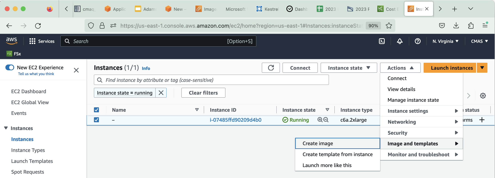

## Save output data and run script logs 

Copy the log files and the output data to an s3 bucket.

or

## Save the full input data, run scripts, output data and logs to an AMI that is owned by your account.

### Go to the EC2 Dashboard 

<a href="https://us-east-1.console.aws.amazon.com/ec2/home?region=us-east-1#Home:"<EC2 Resources on AWS Web Console</a>

### Click on Instances Running

Select the checkbox next to the c6a.2xlarge instance name

### Select Actions Pulldown menu and select Images and templates and Create Image.

Note, this will log you out of the ec2 instance, and should be done after all runs have been completed and your are ready to save the image.

### When the pop-up menu asks if you are sure you want to save the image, click on the .

