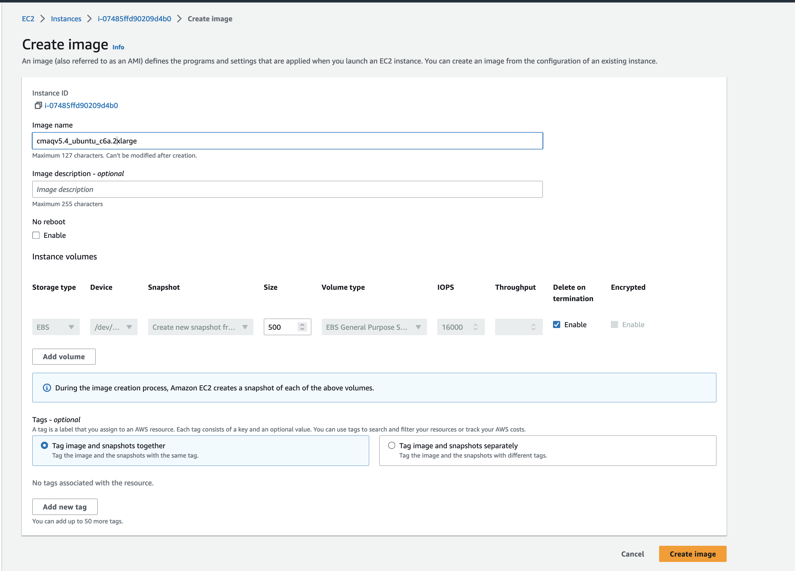

## Save output data and run script logs  (optional)

Copy the log files and the output data to an s3 bucket.


```
cd /shared/pcluster-cmaq/s3_scripts
```

```
cat s3_upload.c6a.2xlarge.csh
```

Output

```
#!/bin/csh -f
# Script to upload output data to S3 bucket
# need to set up your AWS credentials prior to running this script
# aws configure
# NOTE: need permission to create a bucket and write to an s3 bucket. 
# 

mkdir /shared/data/output/logs
mkdir /shared/data/output/scripts

cp /shared/build/openmpi_gcc/CMAQ_v54+/CCTM/scripts/*.log /shared/data/output/logs
cp  /shared/build/openmpi_gcc/CMAQ_v54+/CCTM/scripts/*.csh /shared/data/output/scripts

setenv BUCKET c6a.2xlarge.cmaqv5.4

aws s3 mb s3://$BUCKET
aws s3 cp --recursive /shared/data/output s3://BUCKET
```

Set your aws credentials by running the command

```
aws configure
```


Edit the script to create a unique bucket name

Run the script

```
./s3_upload.c6a.2xlarge.csh
```


or

## Save the full input data, run scripts, output data and logs to an AMI that is owned by your account.

### Go to the EC2 Dashboard 

<a href="https://us-east-1.console.aws.amazon.com/ec2/home?region=us-east-1">EC2 Resources on AWS Web Console</a>


### Click on Instances Running

Select the checkbox next to the c6a.2xlarge instance name


### Select Actions Pulldown menu and select Images and templates and Create Image.

Note, this will log you out of the ec2 instance, and should be done after all runs have been completed and your are ready to save the image.


### Fill out the name of the image 

Name the instance to help identify the ec2 instance type, CMAQ version installed, and perhaps the input/output data available




### Click Save Image

Wait until the image status available before terminating the ec2 instance

### Click on AMI under the left menu, and then search for the image name and confirm that the status has a green checkmark and available
