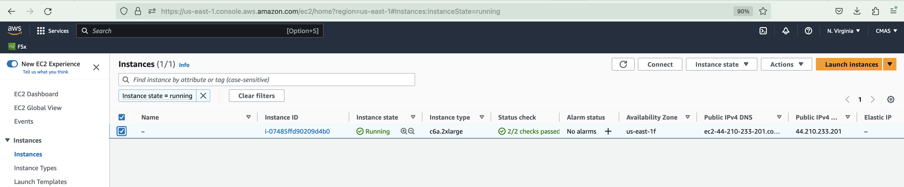
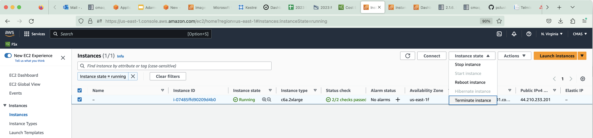
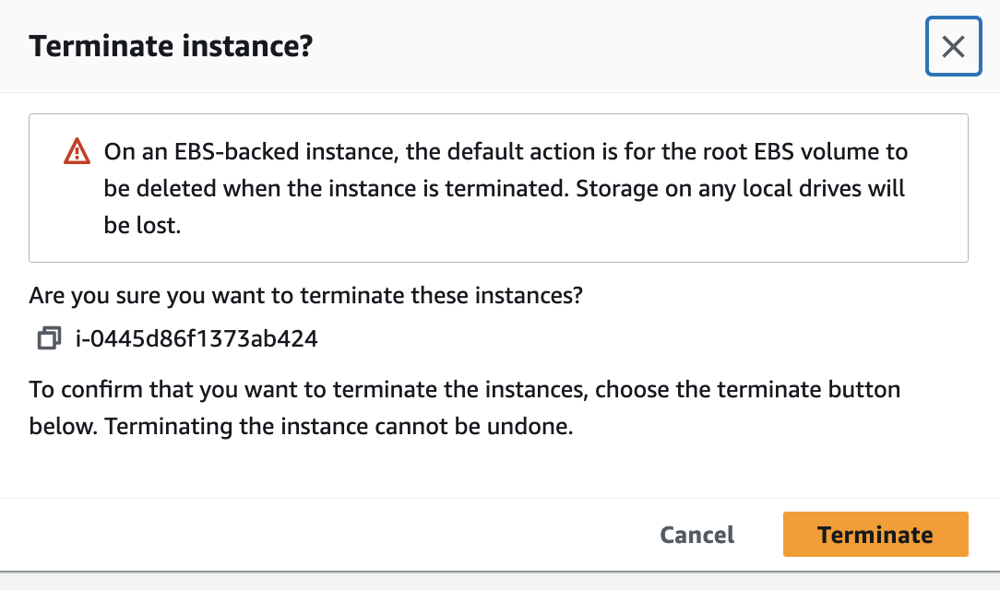

## Stop Instance 

### Go to the EC2 Dashboard 

<a href="https://us-east-1.console.aws.amazon.com/ec2/home?region=us-east-1#Home:">EC2 Resources on AWS Web Console</a>

### Click on Instances Running

Select the checkbox next to the c6a.2xlarge instance name

### Select Instance State Pulldown menu and select terminate instance.

### When the pop-up menu asks if you are sure you want to terminate the instance, click on the orange Terminate button.

