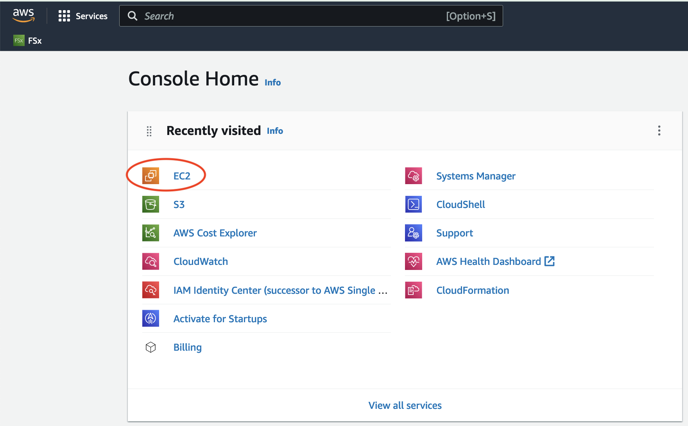
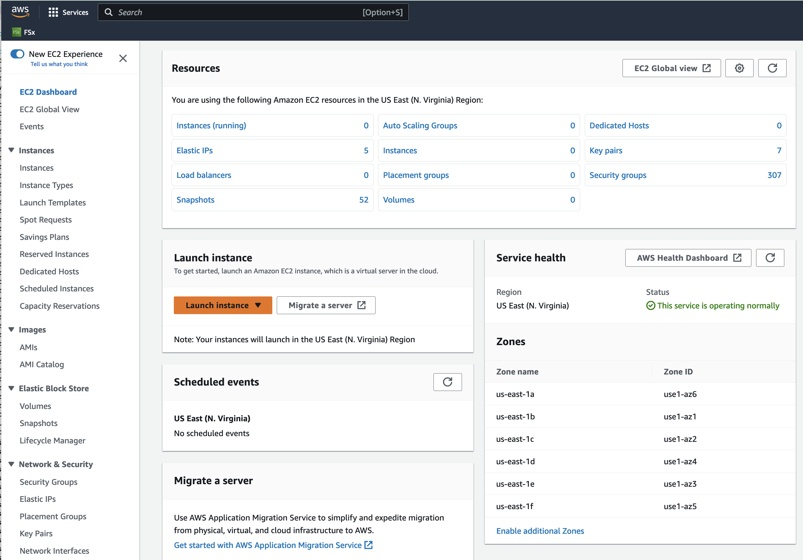
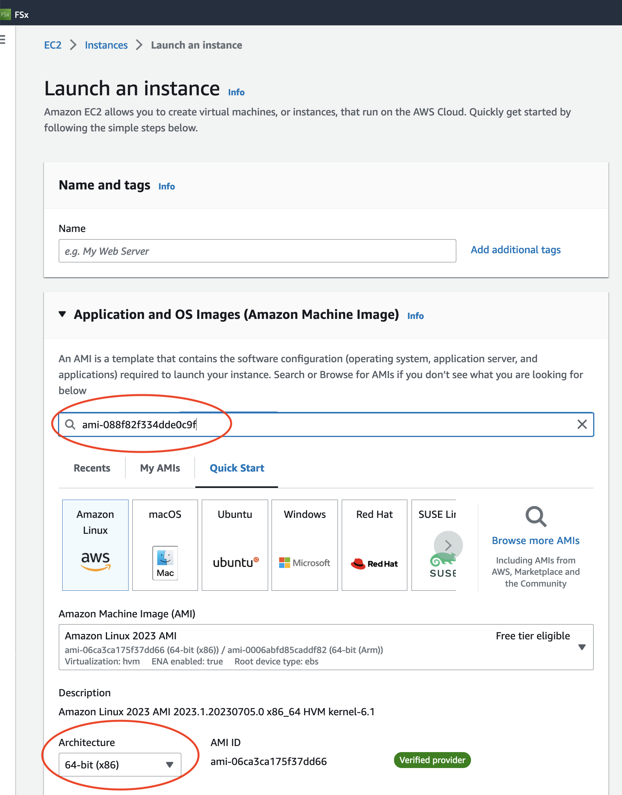
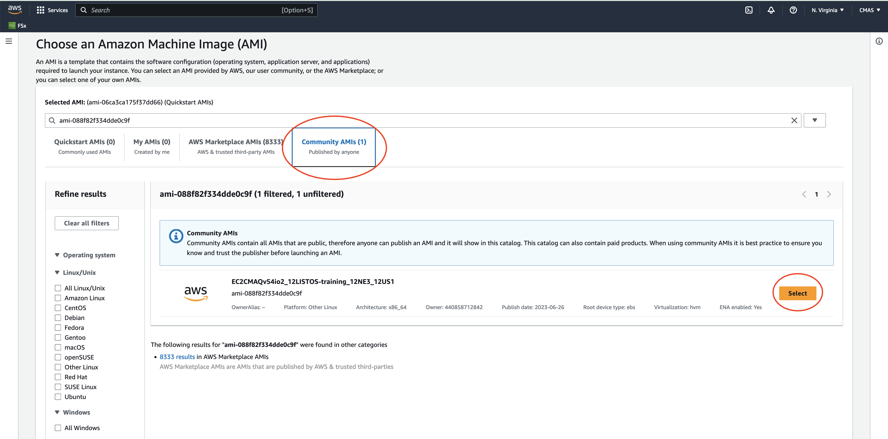
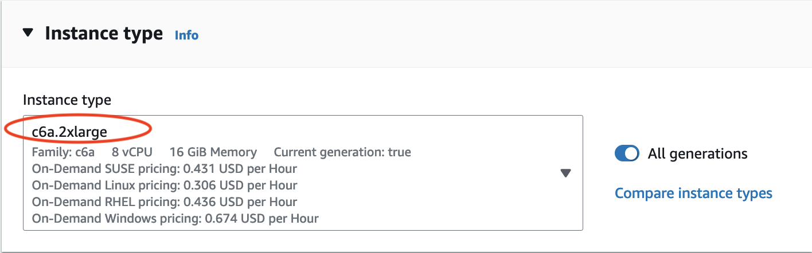
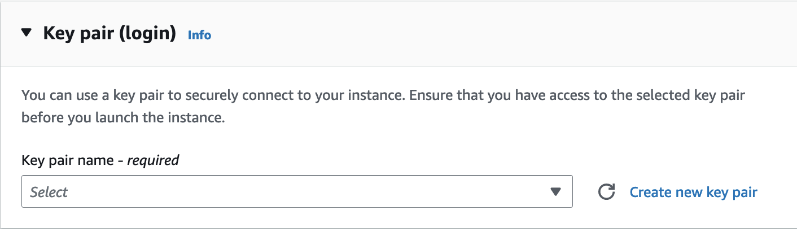
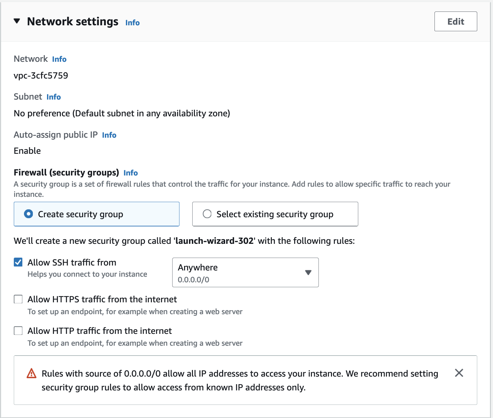
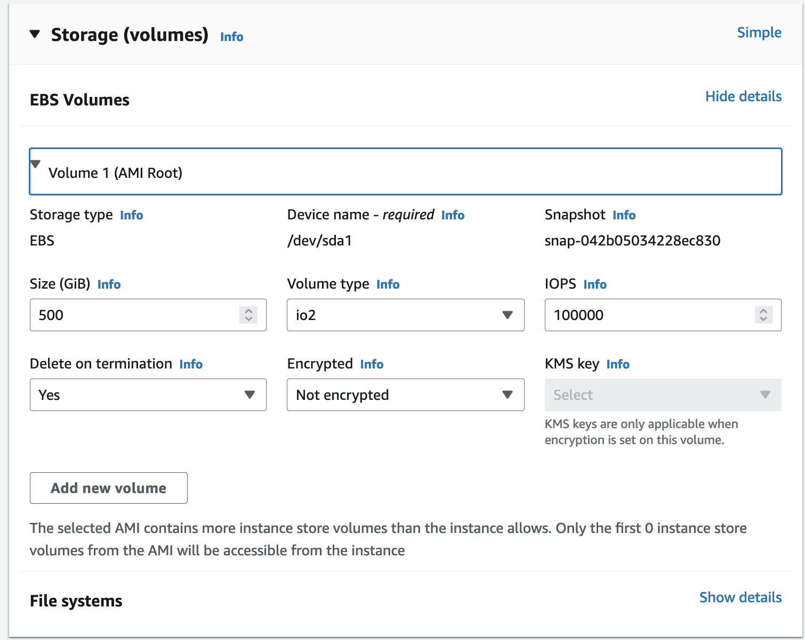
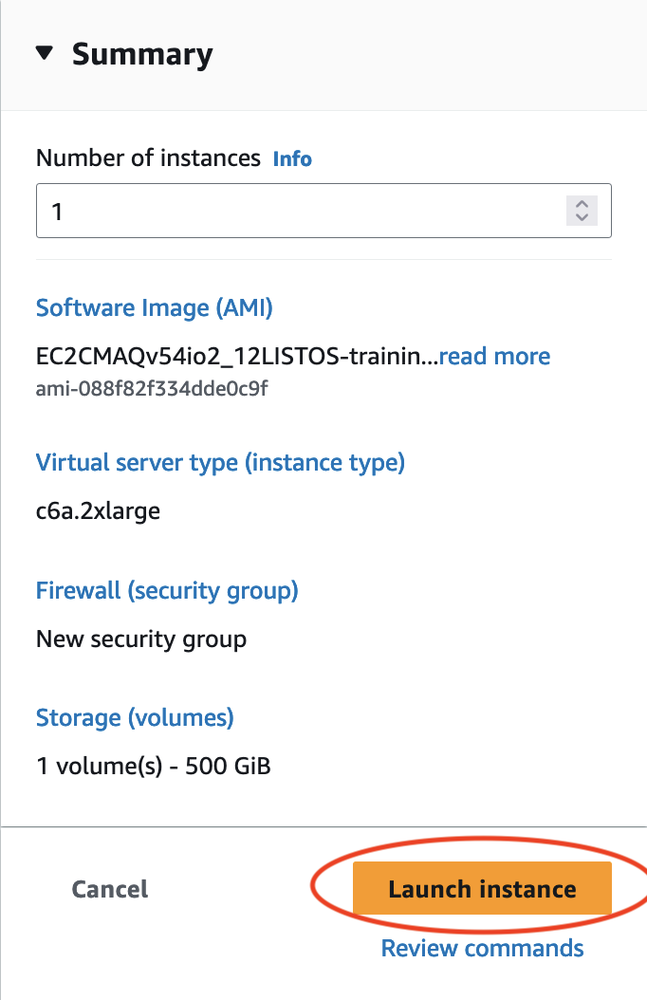

# Learn how to Use the AWS Management Console to launch EC2 instance using Public AMI

## Public AMI contains the software and data to run 12US1 using CMAQv5.4+

Software was pre-installed and saved to a public ami.

The input data was also transferred from the AWS Open Data Program and installed on the EBS volume.

This chapter describes the process used in the AWS Web interface to configure and create a c6a.2xlarge ec2 instance using a public ami. 
With additional instructions to use ssh to login and run CMAQ for the 12LISTOS-training domain.

### Login to the AWs Consol and select EC2

### Click on the orange "Launch Instance" button

### Enter the ami name: ami-051ba52c157e4070c in the Search box and return or enter.

Click on the Community AMI tab and then and click on the orange "Select" button

### Note this AMI was built for the following architecture, and can be used by the c6a - hpc6a family of instances

Canonical, Ubuntu, 22.04 LTS, amd64 jammy image build on 2023-05-16

### Search for c6a.2xlarge Instance Type and select 

### Select key pair name or create a new key pair

### Use the default Network Settings

### Configure Storage

Use the pull down menu to select 500 GiB of gp3 as the root volume (Not encrypted)

### In the Summary Menu, select Launch Instance

