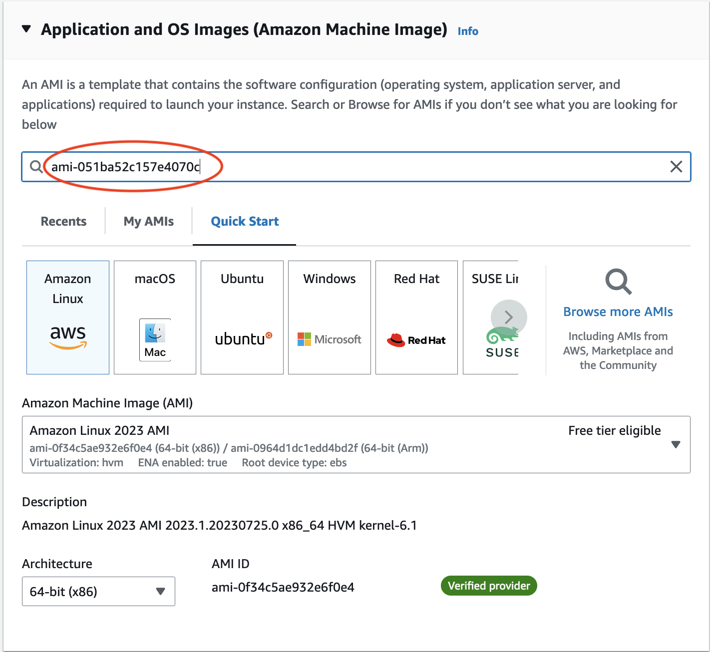

# Create c6a.2xlarge EC2 instance using Public AMI

This chapter describes the process used in the AWS Web interface to configure and create a c6a.2xlarge ec2 instance using a public ami. 
See chapter 3 for instructions to use ssh to login and run CMAQ for the 12LISTOS-training domain.

Software was pre-installed and saved to a public ami. The input data was also transferred from the AWS Open Data Program and installed on the EBS volume.

## Login to the AWS Consol and select EC2

<a href="https://aws.amazon.com/">Login to AWS Web Console</a>


### Click on the orange "Launch Instance" button


## Search for AMI

Enter the ami name: ami-051ba52c157e4070c in the Search box and return or enter.



Click on the Community AMI tab and then and click on the orange "Select" button


### Note this AMI was built for the following architecture, and can be used by the c6a - hpc6a family of instances

Canonical, Ubuntu, 22.04 LTS, amd64 jammy image build on 2023-07-05

### Search for c6a.2xlarge Instance Type and select 
Note, the screenshots show the c6a.2xlarge instance type being selected.
You can repeat this process for creating a single VM for the c6a.8xlarge and c6a.48xlarge by just searching for and selecting those ec2-instances instead.


## Select key pair name or create a new key pair


## Use the default Network Settings


## Review Storage Options

The AMI is preconfigured to use 500 GiB of gp3 as the root volume (Not encrypted)


## Select the Pull-down options for Advanced details


### Select checkbox for Request Spot Instances


Scroll down until you see option to Specify CPU cores

### Click the checkbox for "Specify CPU cores"

Then select 4 Cores, and 1 thread per core


If you are building a VM using a different instance type, just select 1 thread per core and leave the number of cores to the value that is pre-set. 
c6a.2xlarge (4 Cores), c6a.8xlarge (16 cores), c6a.48x large (96 cores).


## In the Summary Menu, select Launch Instance


### Click on the link to the instance once it is successfully launched


### Wait until the Status check has been completed and the Instance State is running


### Click on the instance link and copy the Public IP address to your clipboard


## Use the ssh command to login to the c6a.2xlarge instance

```
ssh -v -Y -i ~/downloads/your-pem.pem ubuntu@xx.xxx.xxx.xxx
```


