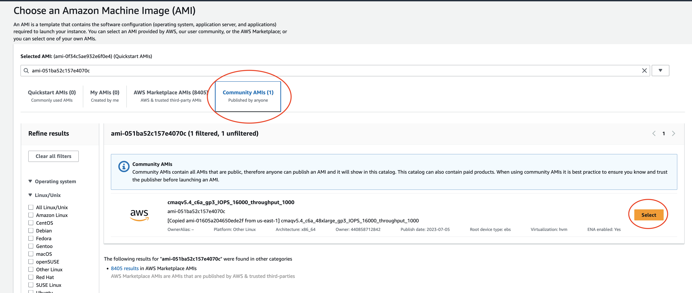

# Learn how to Use the AWS Management Console to launch EC2 instance using Public AMI

## Public AMI contains the software and data to run 12US1 using CMAQv5.4+

Software was pre-installed and saved to a public ami.

The input data was also transferred from the AWS Open Data Program and installed on the EBS volume.

This chapter describes the process used in the AWS Web interface to configure and create a c6a.2xlarge ec2 instance using a public ami. 
With additional instructions to use ssh to login and run CMAQ for the 12LISTOS-training domain.

### Login to the AWs Consol and select EC2

### Click on the orange "Launch Instance" button

### Enter the ami name: ami-051ba52c157e4070c in the Search box and return or enter.

Click on the Community AMI tab and then and click on the orange "Select" button

