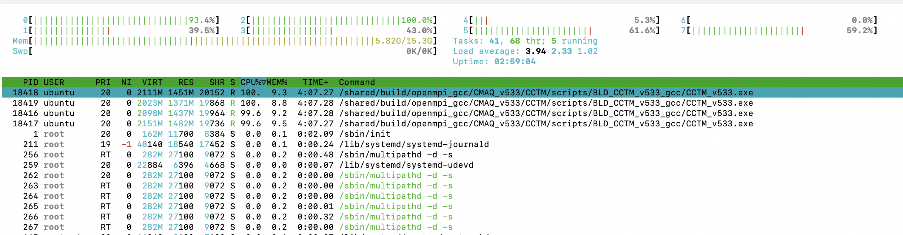

## Run CMAQv5.3.3 on c6a.2xlarge

### Login to the ec2 instance

Note, the following command must be modified to specify your key, and ip address (obtained from the previous command):

`ssh -v -Y -i ~/downloads/your-pem.pem ubuntu@ip.address`


### Login to the ec2 instance again, so that you have two windows logged into the machine.

`ssh -Y -i ~/downloads/your-pem.pem ubuntu@your-ip-address` 


## Load the environment modules

`module avail`

`module load ioapi-3.2/gcc-11.3.0-netcdf  mpi/openmpi-4.1.2  netcdf-4.8.1/gcc-11.3 `

## Update the pcluster-cmaq repo using git

`cd /shared/pcluster-cmaq`

`git pull`

### Verify that the input data is available

Input Data for the 2016_12SE1 Benchmark

`ls -lrt /shared/data/CMAQv5.3.2_Benchmark_2Day_Input/2016_12SE1/*`


## Run CMAQv5.3.3 for 2016_12SE1 1 Day benchmark Case on 4 pe


```
' '
'LamCon_40N_97W'
  2        33.000        45.000       -97.000       -97.000        40.000
' '
'SE52BENCH'
'LamCon_40N_97W'    792000.000  -1080000.000     12000.000     12000.000 100  80   1
'2016_12SE1'
'LamCon_40N_97W'    792000.000  -1080000.000     12000.000     12000.000 100  80   1

```

### Use command line to submit the job. This single virtual machine does not have a job scheduler such as slurm installed.

```
cd /shared/build/openmpi_gcc/CMAQ_v533/CCTM/scripts
./run_cctm_Bench_2016_12SE1.csh |& tee run_cctm_Bench_2016_12SE1.log
```

### Use HTOP to view performance.

`htop`

output


If the ec2 instance was created without specifying 1 thread per core in the Advanced Settings, then it will have 8 vcpus.




### Successful output using the gp3 volume with hyperthreading on (8vcpus)

```

```

### Use lscpu to confirm that there are 4 cores on the c6a.2xlarge ec2 instance that was created with hyperthreading turned off (1 thread per core).

`lscpu`

Output:

```
Architecture:            x86_64
  CPU op-mode(s):        32-bit, 64-bit
  Address sizes:         48 bits physical, 48 bits virtual
  Byte Order:            Little Endian
CPU(s):                  8
  On-line CPU(s) list:   0-7
Vendor ID:               AuthenticAMD
  Model name:            AMD EPYC 7R13 Processor
    CPU family:          25
    Model:               1
    Thread(s) per core:  2
    Core(s) per socket:  4
    Socket(s):           1
    Stepping:            1
    BogoMIPS:            5300.00
    Flags:               fpu vme de pse tsc msr pae mce cx8 apic sep mtrr pge mca cmov pat pse36 clflush mmx fxsr sse sse2 ht syscall nx mmxext fxsr_opt pdpe1gb rdtscp lm con
                         stant_tsc rep_good nopl nonstop_tsc cpuid extd_apicid aperfmperf tsc_known_freq pni pclmulqdq ssse3 fma cx16 pcid sse4_1 sse4_2 x2apic movbe popcnt a
                         es xsave avx f16c rdrand hypervisor lahf_lm cmp_legacy cr8_legacy abm sse4a misalignsse 3dnowprefetch topoext invpcid_single ssbd ibrs ibpb stibp vmm
                         call fsgsbase bmi1 avx2 smep bmi2 invpcid rdseed adx smap clflushopt clwb sha_ni xsaveopt xsavec xgetbv1 clzero xsaveerptr rdpru wbnoinvd arat npt nr
                         ip_save vaes vpclmulqdq rdpid
Virtualization features: 
  Hypervisor vendor:     KVM
  Virtualization type:   full
Caches (sum of all):     
  L1d:                   128 KiB (4 instances)
  L1i:                   128 KiB (4 instances)
  L2:                    2 MiB (4 instances)
  L3:                    16 MiB (1 instance)
NUMA:                    
  NUMA node(s):          1
  NUMA node0 CPU(s):     0-7
Vulnerabilities:         
  Itlb multihit:         Not affected
  L1tf:                  Not affected
  Mds:                   Not affected
  Meltdown:              Not affected
  Mmio stale data:       Not affected
  Retbleed:              Not affected
  Spec store bypass:     Mitigation; Speculative Store Bypass disabled via prctl
  Spectre v1:            Mitigation; usercopy/swapgs barriers and __user pointer sanitization
  Spectre v2:            Mitigation; Retpolines, IBPB conditional, IBRS_FW, STIBP conditional, RSB filling, PBRSB-eIBRS Not affected
  Srbds:                 Not affected
  Tsx async abort:       Not affected

```
