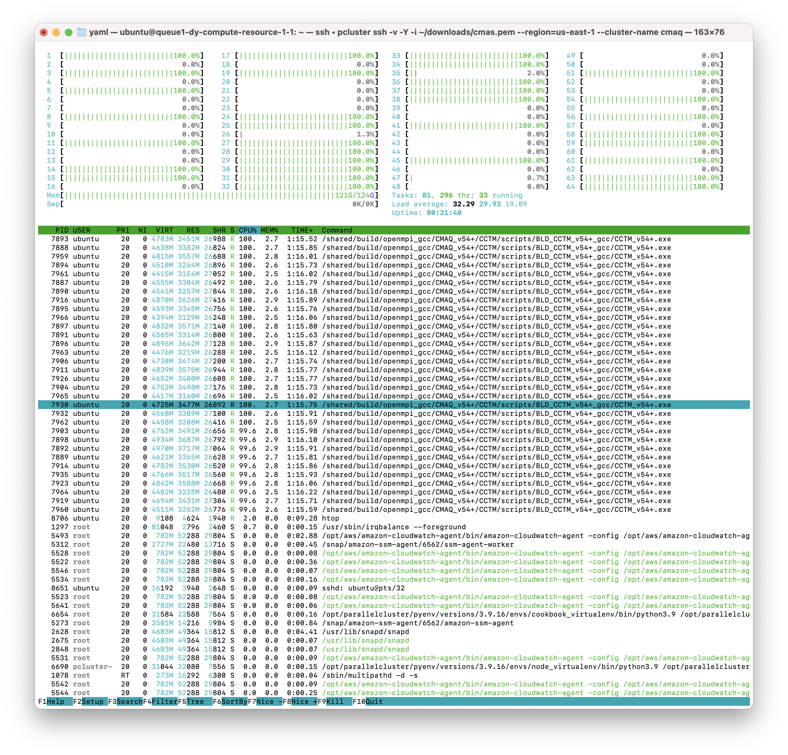
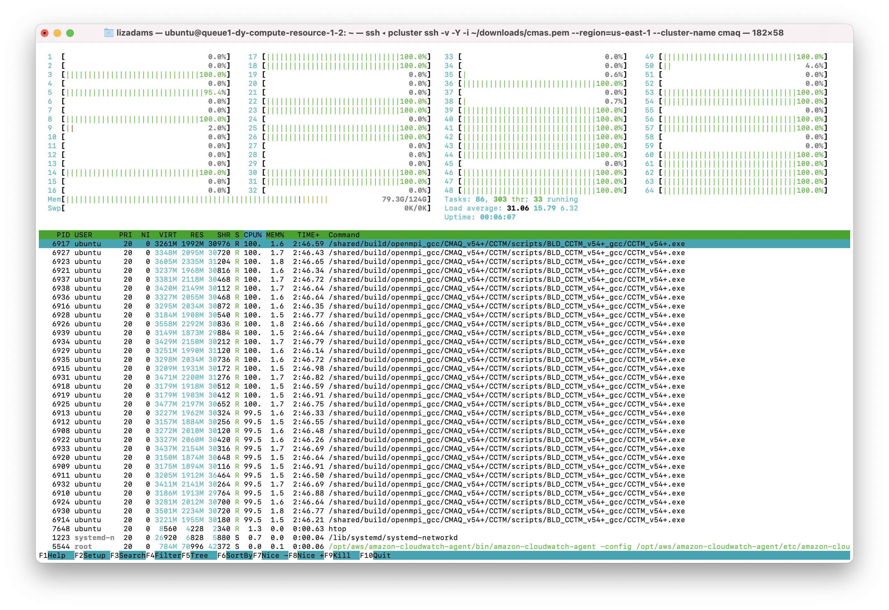

## Run CMAQ using hpc7g.16xlarge comput nodes

### Verify that you have an updated set of run scripts from the pcluster-cmaq repo

`cd /shared/pcluster-cmaq/run_scripts/hpc7g.16xlarge/`

`ls -lrt  run_cctm_2018_12US1_v54_cb6r5_ae6.20171222.1x64.ncclassic.csh`

`diff run_cctm_2018_12US1_v54_cb6r5_ae6.20171222.1x64.ncclassic.csh /shared/pcluster-cmaq/run_scripts/cmaqv54+/`


If they don't exist or are not identical, then copy the run scripts from the repo

`cp /shared/pcluster-cmaq/run_scripts/hpc7g.16xlarge/run_cctm* /shared/build/openmpi_gcc/CMAQ_v54+/CCTM/scripts/`


### Verify that the input data is imported to /fsx from the S3 Bucket

`ls /fsx`

### Preloading the files

Amazon FSx copies data from your Amazon S3 data repository when a file is first accessed. CMAQ is sensitive to latencies, so it is best to preload contents of individual files or directories using the following command:

```
cd /fsx
nohup find /fsx/ -type f -print0 | xargs -0 -n 1 sudo lfs hsm_restore &
```

### Create a /fsx/data and /fsx/data/output directory

`mkdir -p /fsx/data/output`

### Link the data to what is being used in the run scriptso

```
setenv INPDIR  /$DISK/data/CMAQ_Modeling_Platform_2018/2018_12US1  #Input Directory
```


```
cd /fsx/data
ln -s ../CMAQv5.4_2018_12US1_Benchmark_2Day_Input ./CMAQ_Modeling_Platform_2018
```


### Run the 12US1 Domain on 32 pes

```
cd /shared/build/openmpi_gcc/CMAQ_v54+/CCTM/scripts/

sbatch run_cctm_2018_12US1_v54_cb6r5_ae6.20171222.1x32.ncclassic.csh`
```

Note, it will take about 3-5 minutes for the compute notes to start up. This is reflected in the Status (ST) of CF (configuring)

### Check the status in the queue

`squeue -u ubuntu`

Output:

```
JOBID PARTITION     NAME     USER ST       TIME  NODES NODELIST(REASON)
                 2    queue1     CMAQ   ubuntu  CF                1 queue1-dy-compute-resource-1-[1]
```
After 5 minutes the status will change once the compute nodes have been created and the job is running

`squeue -u ubuntu`

Output:

```
             JOBID PARTITION     NAME     USER ST       TIME  NODES NODELIST(REASON)
                 2    queue1     CMAQ   ubuntu  R      19:30      1 queue1-dy-compute-resource-1-1

```

The 64 pe job was crashing due to exceeding the memory available. Using 32 cores, there is more memory per core available.
On 32 cores, the htop output shows the job using 121 out of 124 GB of memory.




The 32 pe job should take xx minutes to run (xx minutes per day)

### check on the status of the cluster using CloudWatch

(optional)

```
<a href="https://console.aws.amazon.com/cloudwatch/home?region=us-east-1#dashboards:name=cmaq-us-east-1">Cloudwatch Dashboard</a>
<a href="https://aws.amazon.com/blogs/compute/monitoring-dashboard-for-aws-parallelcluster/">Monitoring Dashboard for ParallelCluster</a>
```

### check the timings while the job is still running using the following command

`cd  output_v54+_cb6r5_ae7_aq_WR413_MYR_gcc_2018_12US1_1x32_classic`

`grep 'Processing completed' CTM_LOG_001*`

Output:

```
            Processing completed...      17.3195 seconds
            Processing completed...      17.3576 seconds
            Processing completed...      17.2984 seconds
            Processing completed...      17.2890 seconds
            Processing completed...      23.1307 seconds
            Processing completed...      19.8616 seconds
```

### When the job has completed, use tail to view the timing from the log file.

`cd /shared/build/openmpi_gcc/CMAQ_v54+/CCTM/scripts/`

`tail run_cctm5.4+_Bench_2018_12US1_cb6r5_ae6_20200131_MYR.32.4x8pe.2day.20171222start.1x32.log`

Output:

```

```

### Submit a request for a 64 pe job ( 2 x 32 pe) using 2 nodes

`sbatch run_cctm_2018_12US1_v54_cb6r5_ae6.20171222.2x32.ncclassic.csh`

### Check on the status in the queue

`squeue -u ubuntu`

Note, it takes about 5 minutes for the compute nodes to be initialized, once the job is running the ST or status will change from CF (configure) to R

Output:

```
             JOBID PARTITION     NAME     USER ST       TIME  NODES NODELIST(REASON)
                 4    queue1     CMAQ   ubuntu  R       7:20      1 queue1-dy-compute-resource-1-3
```

When you run 64 cores on two compute nodes, the amount of memory used per node is decreased as observed in the htop output belows.



### Check the status of the run

`tail run_cctm5.4+_Bench_2018_12US1_cb6r5_ae6_20200131_MYR.64.8x8pe.2day.20171222start.2x32.log`

The 64 pe job should take xx minutes to run (xx minutes per day)
Note, this is a different domain (12US1 versus 12US2) than what was used for the HPC6a.48xlarge Benchmark runs, so the timings are not directly comparible.
The 12US1 domain is larger than 12US2.

'12US1'
'LAM_40N97W'  -2556000.   -1728000.   12000.  12000.  459  299    1


### Check whether the scheduler thinks there are cpus or vcpus

`sinfo -lN`

Output:

```
Fri Jun 30 16:39:48 2023
NODELIST                         NODES PARTITION       STATE CPUS    S:C:T MEMORY TMP_DISK WEIGHT AVAIL_FE REASON              
queue1-dy-compute-resource-1-1       1   queue1*   allocated 64     64:1:1 124518        0      1 dynamic, none                
queue1-dy-compute-resource-1-2       1   queue1*       idle~ 64     64:1:1 124518        0      1 dynamic, none                
queue1-dy-compute-resource-1-3       1   queue1*       idle~ 64     64:1:1 124518        0      1 dynamic, none                
queue1-dy-compute-resource-1-4       1   queue1*       idle~ 64     64:1:1 124518        0      1 dynamic, none                
queue1-dy-compute-resource-1-5       1   queue1*       idle~ 64     64:1:1 124518        0      1 dynamic, none                
queue1-dy-compute-resource-1-6       1   queue1*       idle~ 64     64:1:1 124518        0      1 dynamic, none                
queue1-dy-compute-resource-1-7       1   queue1*       idle~ 64     64:1:1 124518        0      1 dynamic, none                
queue1-dy-compute-resource-1-8       1   queue1*       idle~ 64     64:1:1 124518        0      1 dynamic, none                
queue1-dy-compute-resource-1-9       1   queue1*       idle~ 64     64:1:1 124518        0      1 dynamic, none                
queue1-dy-compute-resource-1-10      1   queue1*       idle~ 64     64:1:1 124518        0      1 dynamic, none     
```

### When multiple jobs are both submitted to the queue they will be dispatched to different compute nodes.

`squeue`

output

```
Submitted batch job 4
ip-10-0-1-243:/shared/build/openmpi_gcc/CMAQ_v54+/CCTM/scripts> squeue
             JOBID PARTITION     NAME     USER ST       TIME  NODES NODELIST(REASON)
                 4    queue1     CMAQ   ubuntu CF       0:01      1 queue1-dy-compute-resource-1-3
                 3    queue1     CMAQ   ubuntu  R      21:28      2 queue1-dy-compute-resource-1-[1-2]
```

### When the job has completed, use tail to view the timing from the log file.

`cd /shared/build/openmpi_gcc/CMAQ_v54+/CCTM/scripts/`

`tail run_cctm5.4+_Bench_2018_12US1_cb6r5_ae6_20200131_MYR.64.8x8pe.2day.20171222start.2x32.log`

Output:

```
==================================
  ***** CMAQ TIMING REPORT *****
==================================
Start Day: 2017-12-22
End Day:   2017-12-23
Number of Simulation Days: 2
Domain Name:               12US1
Number of Grid Cells:      4803435  (ROW x COL x LAY)
Number of Layers:          35
Number of Processes:       96
   All times are in seconds.

Num  Day        Wall Time
01   2017-12-22   3153.2
02   2017-12-23   3485.9
     Total Time = 6639.10
      Avg. Time = 3319.55

```

Based on the Total Time, adding an additional node gave a speed-up of 1.7.
6639.10/3888.50 = 1.7074

### Submit a job to run on 288 pes, 3x96 nodes

`sbatch run_cctm_2018_12US1_v54_cb6r5_ae6.20171222.3x96.ncclassic.csh`

### Verify that it is running on 3 nodes

`sbatch`

output:

```
             JOBID PARTITION     NAME     USER ST       TIME  NODES NODELIST(REASON)
                 5    queue1     CMAQ   ubuntu  R       4:29      3 queue1-dy-compute-resource-1-[1-3]
```

### Check the log for how quickly the job is running

`grep 'Processing completed'  run_cctm5.4+_Bench_2018_12US1_cb6r5_ae6_20200131_MYR.288.18x16pe.2day.20171222start.3x96.log`

Output:

```
 Processing completed...       4.0245 seconds
            Processing completed...       4.0263 seconds
            Processing completed...       3.9885 seconds
            Processing completed...       3.9723 seconds
            Processing completed...       3.9934 seconds
            Processing completed...       4.0075 seconds
            Processing completed...       3.9871 seconds
```

When the job has completed, use tail to view the timing from the log file.

`cd /shared/build/openmpi_gcc/CMAQ_v54+/CCTM/scripts/`

`tail -n 30 run_cctm5.4+_Bench_2018_12US1_cb6r5_ae6_20200131_MYR.288.18x16pe.2day.20171222start.3x96.log`

Output:

```
==================================
  ***** CMAQ TIMING REPORT *****
==================================
Start Day: 2017-12-22
End Day:   2017-12-23
Number of Simulation Days: 2
Domain Name:               12US1
Number of Grid Cells:      4803435  (ROW x COL x LAY)
Number of Layers:          35
Number of Processes:       288
   All times are in seconds.

Num  Day        Wall Time
01   2017-12-22   1475.9
02   2017-12-23   1580.7
     Total Time = 3056.60
      Avg. Time = 1528.30
```


Once you have submitted a few benchmark runs and they have completed successfully, proceed to the next chapter.
