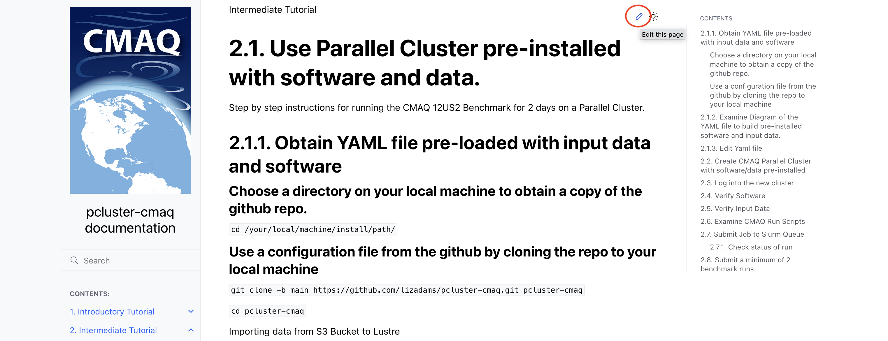

## Contribute to Pcluster-cmaq Documentation

Please take note of any issues and submit to <a href="https://github.com/lizadams/pcluster-cmaq/issues">Github Issue</a>

```{note}
At the top of each page of the documentation, there is also an pencil icon, that you can click.
It will create a fork of the project on your github account that you can make edits and then submit a poll request.
```


If you are able to create a pull request, please include the following in your issue:

* pull request number

If you are not able to create a pull request, please include the following in your issue:

* section number
* description of the issue encountered
* recommended fix, if available


