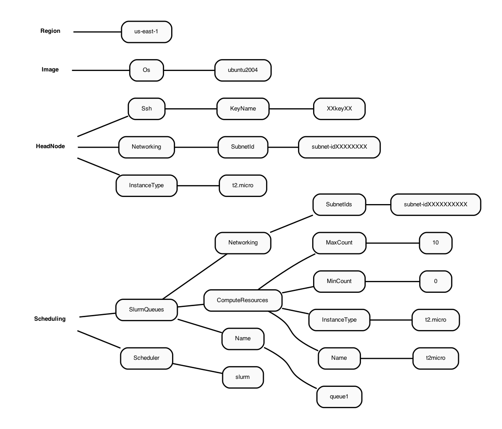

# Use AWS Command Line Interface (CLI) v3.0 to configure and launch a demo cluster 

Requires the user to have a key.pair that was created on an ec2.instance

<a href="https://docs.aws.amazon.com/AWSEC2/latest/UserGuide/ec2-key-pairs.html">Guide to obtaining AWS Key Pair</a>

## 2.1 Install AWS Parallel Cluster Command Line Interface on your local machine

### 2.1.1 Instructions for LINUX

Create a virtual environment on a linux machine to install aws-parallel cluster

<a href="https://docs.aws.amazon.com/parallelcluster/latest/ug/install-v3-virtual-environment.html">Guide to install AWS CL3 in Virtual Environment"</a>

```python
python3 -m virtualenv ~/apc-ve
source ~/apc-ve/bin/activate
python --version
python3 -m pip install --upgrade aws-parallelcluster
pcluster version
```

#### Follow the Parallel Cluster User Guide and install node.js

```python
curl -o- https://raw.githubusercontent.com/nvm-sh/nvm/v0.38.0/install.sh 
chmod ug+x ~/.nvm/nvm.sh
source ~/.nvm/nvm.sh
nvm install node
node --version
python3 -m pip install --upgrade "aws-parallelcluster"
```

###  2.1.2 Instructions for Windows

Create a virtual environment on a windows machine to install aws-parallel cluster

<a href="pcluster create-cluster --cluster-configuration c5n-18xlarge.ebs_shared.yaml --cluster-name cmaq --region us-east-1">Guide to install AWS CL3 in Windows Environment</a>

Note, it is actually a guide for CL2, but replace the commands to install CL3

Also to activate the virtual environment once it is installed run

`activate`

## 2.2 Configure AWS Command line credentials on your local machine
<a href="https://docs.aws.amazon.com/cli/latest/userguide/cli-configure-quickstart.html">Link to Setting up AWS Credential Instructions</a>

 `aws configure` 

## 2.3 Configure a demo cluster

### 2.3.1 To create a parallel cluster, a yaml file needs to be created that is unique to your account.

An example of the yaml file contents is described in the following Diagram:

Figure 1. Diagram of YAML file used to configure a Parallel Cluster with a t2.micro head node and t2.micro compute nodes



For more information about the configuration file see
<a href="https://docs.aws.amazon.com/parallelcluster/latest/ug/cluster-configuration-file-v3.html">Cluster Configuration File</a>


### 2.3.2 Create a yaml configuration file for the cluster following these instructions
<a href="https://docs.aws.amazon.com/parallelcluster/latest/ug/install-v3-configuring.html">Link to Parallel Cluster Configure Instructions</a>

 `pcluster configure --config new-hello-world.yaml`

Input the following answers at each prompt:

1. Allowed values for AWS Region ID: `us-east-1`
2. Allowed values for EC2 Key Pair Name:  `choose your key pair`
2. Allowed values for Scheduler: `slurm`
3. Allowed values for Operating System: `ubuntu2004`
4. Head node instance type: `t2.micro`
5. Number of queues: `1`
6. Name of queue 1: `queue1`
7. Number of compute resources for queue1 [1]: `1`
8. Compute instance type for compute resource 1 in queue1: `t2.micro`
9. Maximum instance count [10]: `10`
10. Automate VPC creation?: `y`
11. Allowed values for Availability Zone: `1`
12. Allowed values for Network Configuration: `2. Head node and compute fleet in the same public subnet`

Beginning VPC creation. Please do not leave the terminal until the creation is finalized

### 2.3.3 Note, the choice of operating system (specified during the yaml creation, or in an existing yaml file) determines what modules and gcc compiler versions are available.

1. Centos7 has an older gcc version 4
2. Ubuntu2004 has gcc version 9+
3. Alinux or Amazon Linux/Red Hat Linux (haven't tried)


### 2.3.4 Examine the yaml file 

 `cat new-hello-world.yaml`

```
Region: us-east-1
Image:
  Os: ubuntu2004
HeadNode:
  InstanceType: t2.micro
  Networking:
    SubnetId: subnet-xx-xx-xx                  <<< unique to your account
  Ssh:
    KeyName: your-key                          <<< unique to your account
Scheduling:
  Scheduler: slurm
  SlurmQueues:
  - Name: queue1
    ComputeResources:
    - Name: t2micro
      InstanceType: t2.micro
      MinCount: 0
      MaxCount: 10
    Networking:
      SubnetIds:
      - subnet-xx-xx-xx                        <<< unique to your account
```

Note, the above yaml file is the very simplest form available.  If you upgrade the compute node to using a faster compute instance, then you will need to add additional configuration options (networking, elastic fabric adapter) to the yaml file.  These modifications will be highlighted in the yaml figures provided in the tutorial.

The key pair and Subnetid in the yaml file are unique to your account.  To create the AWS MVP Parallel Cluster, the key pair and subnet ID from the new-hello-world.yaml file that you created using your account will need to be transferred to the c5n-4xlarge.yaml and c5n-18xlarge.yaml Yaml files that will be used to create the MVP Parallel Cluster in the next section of the tutorial. You will need to edit these yaml files to use the key pair and your Subnetid that are valid for your AWS Account.

## 2.4 Create a demo cluster

 `pcluster create-cluster --cluster-configuration new-hello-world.yaml --cluster-name hello-pcluster --region us-east-1`

### 2.4.1 Check on the status of the cluster

 `pcluster describe-cluster --region=us-east-1 --cluster-name hello-pcluster`

### 2.4.2 List available clusters

 `pcluster list-clusters --region=us-east-1`

### 2.4.3 Check on status of cluster again

 `pcluster describe-cluster --region=us-east-1 --cluster-name hello-pcluster`

After 5-10 minutes, you see the following status: "clusterStatus": "CREATE_COMPLETE"

While the cluster has been created, only the t2.micro head node is running.  Before any jobs can be submitted to the slurm queue, the compute nodes need to be started.

Note, the compute nodes are not "provisioned" or "created" at this time (so they do not begin to incur costs).  The compute nodes are only provisioned when a slurm job is scheduled.  After a slurm job is completed, then the compute nodes will be terminated after 5 minutes of idletime.

### 2.4.4 Start the compute nodes

 `pcluster update-compute-fleet --region us-east-1 --cluster-name hello-pcluster --status START_REQUESTED`

### 2.4.5 SSH into the cluster 
(note, replace the your-key.pem key pair with your key pair)

Example:
 pcluster ssh -v -Y -i ~/your-key.pem --cluster-name hello-pcluster

 `pcluster ssh -v -Y -i ~/[your-key-pair] --cluster-name hello-pcluster`

login prompt should look something like (this will depend on what OS was chosen in the yaml file).

[ip-xx-x-xx-xxx pcluster-cmaq]

### 2.4.6 Check what modules are available on the Parallel Cluster

 `module avail`

### 2.4.7 Check what version of the compiler is available

 `gcc --version`

Need a minimum of gcc 8+ for CMAQ

### 2.4.8 Check what version of openmpi is available

 `mpirun --version`

Need a minimum openmpi version 4.0.1 for CMAQ

### 2.4.9 Verify that Slurm is available (if slurm is not available, then you may need to try a different OS)

`which sbatch`

### 2.4.10 We will not install sofware on this demo cluster, as the t2.micro head node is too small
Save the key pair and SubnetId from this new-hello-world.yaml to use in the yaml for the CMAQ MVP Cluster

### 2.4.11 Exit the cluster

 `exit`

## 2.4.12 Delete the demo cluster


 `pcluster delete-cluster --cluster-name hello-pcluster --region us-east-1`


## 2.4.13 To learn more about the pcluster commands

 `pcluster --help`

## 2.4.14 To use a parallel cluster
Requires the user to have AWS Identity and Access Management roles in AWS Parallel Cluster

<a href="https://docs.aws.amazon.com/parallelcluster/latest/ug/iam.html">AWS Identity and Access Management roles in AWS Parallel Cluster</a>

AWS ParallelCluster uses multiple AWS services to deploy and operate a cluster. See the complete list in the AWS Services used in AWS ParallelCluster section.
It appears you can create the demo cluster, and even the MVP cluster, but you can't submit a slurm job and have it provision compute nodes until you have the IAM Policies set for your account. This likely requires the system administrator who has permissions to access the AWS Web Interface with root access to add these policies and then to attach them to each user account.

Need to add a policy called AWSEC2SpotServiceRolePolicy to the account prior to running a job on the Parallel Cluster.
