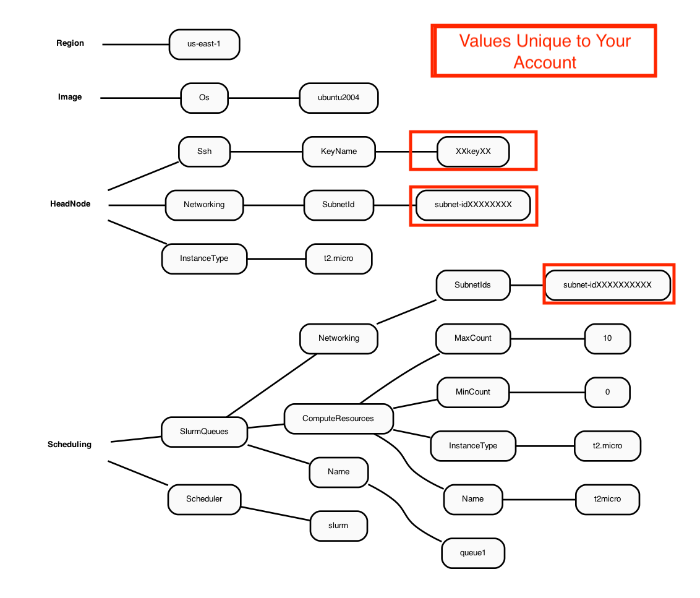

# Use AWS CLI v3.0 to configure and launch a demo cluster 

Requires the user to have a key.pair that was created on an ec2.instance

<a href="https://docs.aws.amazon.com/AWSEC2/latest/UserGuide/ec2-key-pairs.html">Guide to obtaining AWS Key Pair</a>

## Install AWS Parallel Cluster Command Line

### Create a virtual environment on a linux machine to install aws-parallel cluster

<a href="https://docs.aws.amazon.com/parallelcluster/latest/ug/install-v3-virtual-environment.html">Guide to install AWS CL3 in Virtual Environment"</a>

```python
python3 -m virtualenv ~/apc-ve
source ~/apc-ve/bin/activate
python --version
python3 -m pip install --upgrade aws-parallelcluster
pcluster version
```

### Follow the Parallel Cluster User Guide and install node.js

```python
curl -o- https://raw.githubusercontent.com/nvm-sh/nvm/v0.38.0/install.sh 
chmod ug+x ~/.nvm/nvm.sh
source ~/.nvm/nvm.sh
nvm install node
node --version
python3 -m pip install --upgrade "aws-parallelcluster"
```

### Create a virtual environment on a windows machine to install aws-parallel cluster

<a href="pcluster create-cluster --cluster-configuration c5n-18xlarge.ebs_shared.yaml --cluster-name cmaq --region us-east-1">Guide to install AWS CL3 in Windows Environment</a>

Note, it is actually a guide for CL2, but replace the commands to install CL3

Also to activate the virtual environment once it is installed run

`activate`

### Configure AWS Command line credentials
<a href="https://docs.aws.amazon.com/cli/latest/userguide/cli-configure-quickstart.html">Link to Setting up AWS Credential Instructions</a>

 `aws configure` 

## Configure a demo cluster

### To create a parallel cluster, a yaml file needs to be configured that is unique to your account.

An example of the yaml file contents is described in the following Diagram:

Figure 1. Diagram of YAML file used to configure a Parallel Cluster with a t2.micro head node and t2.micro compute nodes



For more information about the configuration file see
<a href="https://docs.aws.amazon.com/parallelcluster/latest/ug/cluster-configuration-file-v3.html">Cluster Configuration File</a>


### Create a yaml configuration file for the cluster following these instructions
<a href="https://docs.aws.amazon.com/parallelcluster/latest/ug/install-v3-configuring.html">Link to Parallel Cluster Configure Instructions</a>

 `pcluster configure --config new-hello-world.yaml`

1. select region: us-east-1
2. select scheduler: slurm
3. select operating system: ubuntu2004
4. select head node instance type: t2.micro
5. select number of queues: 1
6. number of compute resources for queue1 [1]: 1
7. select compute node instance type: t2.micro
8. select maximum instance count [10]: 10
9. Automate VPC creation (y/n) [n]: y
10. select availability zone: 1
11. select network configuration: 1

Beginning VPC creation. Please do not leave the terminal until the creation is finalized


### Examine the yaml file 

 `cat new-hello-world.yaml`

The key pair and Subnetid in the yaml file are unique to your account.  Yaml files that are used in this tutorial will need to be edited to use your key pair and your Subnetid. 

## Create a demo cluster

 `pcluster create-cluster --cluster-configuration new-hello-world.yaml --cluster-name hello-pcluster --region us-east-1`

### Check on the status of the cluster

 `pcluster describe-cluster --region=us-east-1 --cluster-name hello-pcluster`

### List available clusters

 `pcluster list-clusters --region=us-east-1`

### Start the compute nodes

 `pcluster update-compute-fleet --region us-east-1 --cluster-name hello-pcluster --status START_REQUESTED`

### SSH into the cluster 
(note, replace the centos.pem key pair with your key pair)

Example:
 pcluster ssh -v -Y -i ~/centos.pem --cluster-name hello-pcluster

 `pcluster ssh -v -Y -i ~/[your-key-pair] --cluster-name hello-pcluster`

login prompt should look something like (this will depend on what OS was chosen in the yaml file).

[ip-xx-x-xx-xxx pcluster-cmaq]

### Check what modules are available on the Parallel Cluster

 `module avail`

### Check what version of the compiler is available

 `gcc --version`

Need a minimum of gcc 8+ for CMAQ

### Check what version of openmpi is available

 `mpirun --version`

Need a minimum openmpi version 4.0.1 for CMAQ

### We will not install sofware on this demo cluster, as the t2.micro head node is too small
Save the key pair and SubnetId from this new-hello-world.yaml to use in the yaml for the CMAQ Cluster

### Exit the cluster

 `exit`

## Delete the demo cluster


 `pcluster delete-cluster --cluster-name hello-pcluster --region us-east-1`


## To learn more about the pcluster commands

 `pcluster --help`
