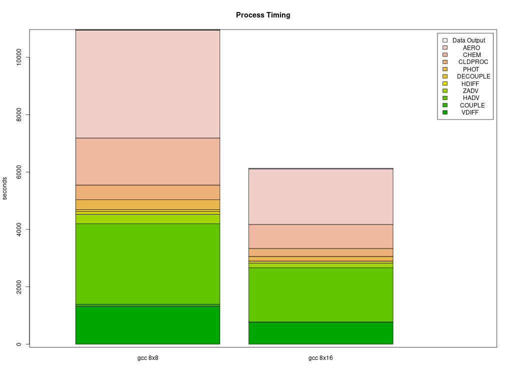

# Parse timings from the log file 

## Compare the timings for the following CONUS Parallel Cluster Runs

### Using different PE configurations, using DisableSimultaneousMultithreading: true in yaml file, using 36 cpus - no virtual cpus
         
         NPCOL x NPROW  , CPU   , SBATCH Command  
   - [ ] 10x18 , 180  ,    #SBATCH --nodes=5, #SBATCH --ntasks-per-node=36
   - [ ] 16x16,  256  ,    #SBATCH --nodes=8, #SBATCH --ntasks-per-node=32
   - [ ] 16x18,  288  ,    #SBATCH --nodes=8, #SBATCH --ntasks-per-node=36

### Using different compute nodes   

   - [ ] c5n.18xlarge  (72 virtual cpus, 36 cpus) - with Elastic Fabric Adapter
   - [ ] c5n.9xlarge   (36 virtual cpus, 18 cpus) - no Eleastic Fabric Adapter

### With and without SBATCH --exclusive option

### With and without Elastic Fabric and Elastic Netaork Adapter turned on

### With and without network placement turned on

### Using different local storage options and copying versus importing data to lustre

   - [ ] input data imported from S3 bucket to lustre
   - [ ] input data copied from S3 bucket to lustre
   - [ ] input data copied from S3 bucket to an EBS volume

### Using different yaml settings for slurm  

   - [ ] DisableSimultaneousMultithreading= true
   - [ ] DisableSimultaneousMultithreading= false

### Use parse_timing.r script to examine timings of each process in CMAQ

```
cd qa_scripts
Rscript parse_timing.r
```

Timing Plot Comparing GCC run on 16 x 8 pe versus 8 x 16 pe


Timing Plot Comparing GCC run on 8 x 8 pe versus 8 x 16 pe


