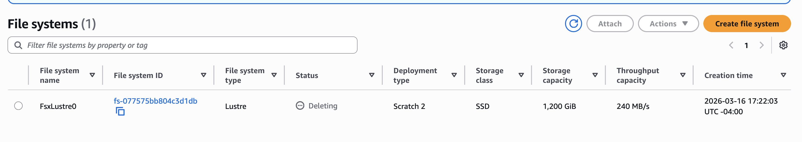

# Modify the ParallelCluster to remove the lustre filesystem

Step by step instructions to removing the lustre file system from the cluster


## The following section assumes that you have already created the hpc7g pcluster using this command:

Note, this yaml file is configured to have 12 nodes of the hpc7g.16xlarge (64 pe per node) and 7 nodes of the hpc7g.8xlarge (32 pe per node).

`pcluster create-cluster --cluster-configuration hpc7g.16xlarge.ebs_unencrypted_installed_public_ubuntu2004.fsx_import.yaml --cluster-name cmaq --region us-east-1`

## Output recieved from command line: 

```
{
  "cluster": {
    "clusterName": "cmaq",
    "cloudformationStackStatus": "CREATE_IN_PROGRESS",
    "cloudformationStackArn": "arn:aws:cloudformation:us-east-1:440858712842:stack/cmaq/2e7eb730-faac-11ef-b084-0affc1aac5d7",
    "region": "us-east-1",
    "version": "3.9.2",
    "clusterStatus": "CREATE_IN_PROGRESS",
    "scheduler": {
      "type": "slurm"
    }
  },
  "validationMessages": [
    {
      "level": "WARNING",
      "type": "EbsVolumeSizeSnapshotValidator",
      "message": "The specified volume size is larger than snapshot size. In order to use the full capacity of the volume, you'll need to manually resize the partition according to this doc: https://docs.aws.amazon.com/AWSEC2/latest/UserGuide/recognize-expanded-volume-linux.html"
    },
    {
      "level": "INFO",
      "type": "DeletionPolicyValidator",
      "message": "The DeletionPolicy is set to Delete. The storage 'ebs-shared' will be deleted when you remove it from the configuration when performing a cluster update or deleting the cluster."
    },
    {
      "level": "INFO",
      "type": "DeletionPolicyValidator",
      "message": "The DeletionPolicy is set to Delete. The storage 'name2' will be deleted when you remove it from the configuration when performing a cluster update or deleting the cluster."
    }
  ]
}
```

## Check on status of cluster

Use this command to check on the status of the cluster

`pcluster describe-cluster --region=us-east-1 --cluster-name cmaq`

## Modify the yaml file to remove the /fsx volume

```
cp hpc7g.16xlarge.ebs_unencrypted_installed_public_ubuntu2004.fsx_import.yaml hpc7g.16xlarge.ebs_unencrypted_installed_public_ubuntu2004.no_fsx.yaml
```

Remove the following section from the yaml file

```
- MountDir: /fsx
     Name: name2
     StorageType: FsxLustre
     FsxLustreSettings:
       StorageCapacity: 1200
       ImportPath: s3://cmas-cmaq
```

```
vi hpc7g.16xlarge.ebs_unencrypted_installed_public_ubuntu2004.no_fsx.yaml
```

Use search to find /fsx, and then use the 6dd to delete the last 6 lines in the file.

## Stop the compute fleet

Use the command:

```
pcluster update-compute-fleet --region us-east-1 --cluster-name cmaq --status STOP_REQUESTED
```

Check on the status until it says update complete

``` 
pcluster describe-cluster --region=us-east-1 --cluster-name cmaq
```

## Update cluster to remove the lustre filesystem 
Use the yaml configuration file that was modified to delete the /fsx or lustre filesystem.

```
pcluster update-cluster --region us-east-1 --cluster-name cmaq --cluster-configuration hpc7g.16xlarge.ebs_unencrypted_installed_public_ubuntu2004.no_fsx.yaml
```

## Check on the status until it says the update is complete 

```
pcluster describe-cluster --region=us-east-1 --cluster-name cmaq
```

## Verify that the fsx volume is being deleted in the AWS Website Console



## Update the compute fleet to restart the compute nodes 

```
pcluster update-compute-fleet --region us-east-1 --cluster-name cmaq --status START_REQUESTED
```

## To re-add the /fsx filesystem

Follow the same procedure of stopping the compute nodes, then upgrading the cluster configuration to use a yaml file with the /fsx defined. 

