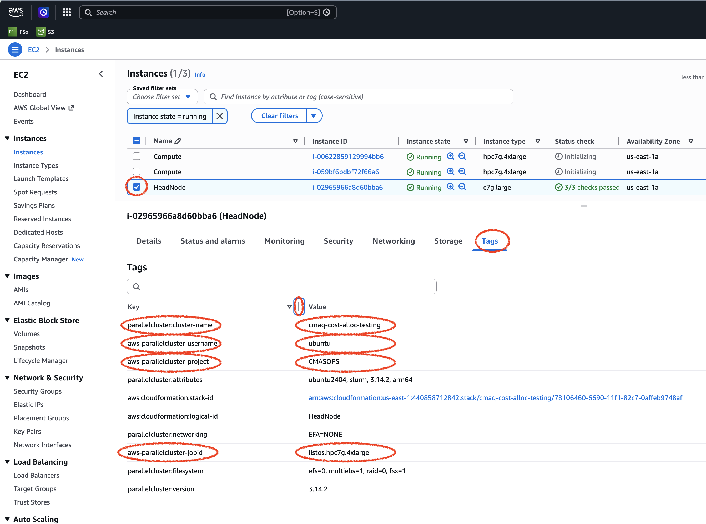
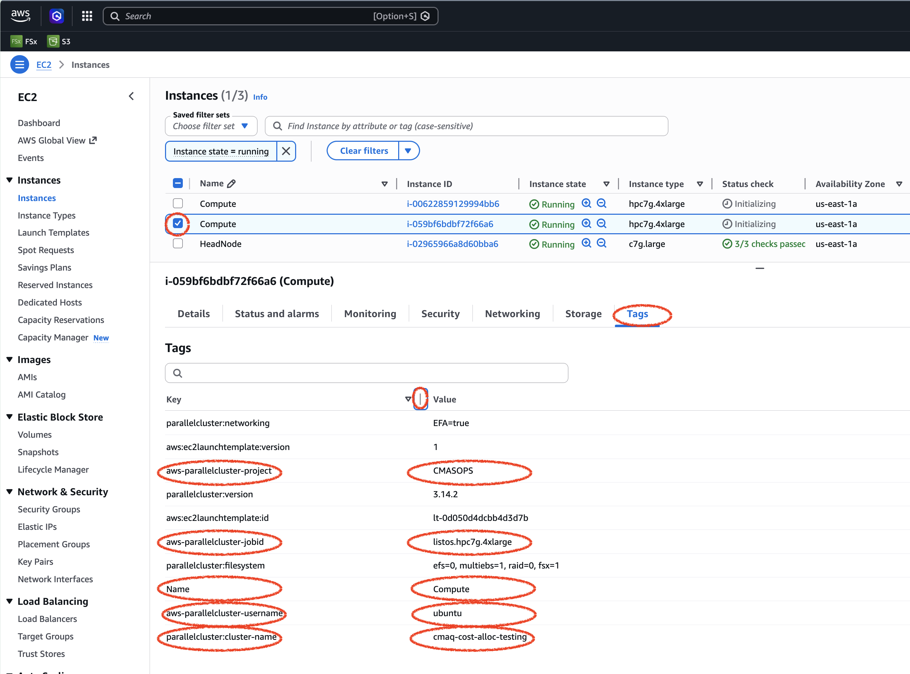

# Create Cost Allocation Tags for Analysis using AWS Cost Explorer. 

Step by step instructions for using cost allocation tags. This method was obtained from the following website: <br>
<a href="https://aws.amazon.com/blogs/compute/using-cost-allocation-tags-with-aws-parallelcluster">Using Cost Allocation Tags with AWS ParallelCluster"</a>  
Note, these instructions to use the post_install.sh script don't work any more because tags assigned to parallel cluster must be done at start up, and can't be modified after the cluster is created.
<a href="https://docs.aws.amazon.com/parallelcluster/latest/ug/Tags-v3.html">Limited Tag updates on Parallel Cluster</a>

Steps 1&2 have already been implemented for the CMAS Center Account.<br>


## Activation of an AWS Defined tag: createdBy in the Console

Go to the Billing and Cost Management.<br>
On the left panel select Cost Allocation Tags<br>
On the AWS Generated cost allocation tags tab <br>
search for aws:createdBy<br>
Select and then click on activate.<br>

The values for these tags will be set in the yaml file used to create the parallel cluster.<br>


## Creation of the  pclusterTagsAndBudget IAM Policy 
This was done via the AWS console.<br>
Edited a policy named pclusterTagsAndBudget<br>
Implemented the following policies<br>

```
    Type: 'AWS::IAM::ManagedPolicy'
    Properties:
      ManagedPolicyName: pclusterTagsAndBudget
      Path: /
      PolicyDocument:
        Version: 2012-10-17
        Statement:
          - Effect: Allow
            Action:
              - 'ec2:DeleteTags'
              - 'ec2:DescribeTags'
              - 'ec2:CreateTags'
            Resource: '*'
          - Effect: Allow
            Action:
              - 'budgets:ViewBudget'
            Resource: 'arn:aws:budgets::*:budget/*'
```


Note, currently we use one login ID, ubuntu to login IDs for the parallel cluster.<br>

<br>


## Review example yaml file that has the lines that need to be added highlighted by !!

```
Image:
  Os: alinux2
HeadNode:
  InstanceType: t2.micro
  Networking:
    SubnetId: <subnet-id>
  Ssh:
    KeyName: <key>
Scheduling:
  Scheduler: slurm
  SlurmQueues:
    - Name: queue1
      Networking:
        SubnetIds:
          - <subnet-id>
      ComputeResources:
        - Name: compute-resource1
          InstanceType: t2.micro
          MinCount: 0
          MaxCount: 10
Tags:                                                                        !!
  - Key: aws-parallelcluster-username                                        !!
    Value: lizadams                                                          !!
  - Key: aws-parallelcluster-jobid                                           !!
    Value: 12US1CMAQ                                                         !!
  - Key: aws-parallelcluster-project                                         !!
    Value: CMASOPS                                                           !!
```

## Use above template to modify your cluster yaml to add cost allocation tags

Cut and paste the lines that have !! comments and add them to your cluster yaml file.
Note, these tags can not be updated using the pcluster command. Once the tags are set, they are used for the lifetime of the pcluster.
To use new tags, you need to create new plcuster.

## Or - review the Listos Cost Allocation Yaml that is provided here:
For an account outside of CMAS, you will need to run the pcluster configure command using your account and then modify that yaml file to add the tags.

```
cd pcluster-cmaq/yaml/
cat hpc7g.4xlarge.cost-alloc-tags.yaml
```

## Use the modified yaml file to create the cluster

```
pcluster create-cluster --cluster-configuration hpc7g.4xlarge.cost-alloc-tags.yaml  --cluster-name cmaq --region us-east-1
```

### Check on the cluster status

Use this command to check on the status of the cluster until the clusterStatus is CREATE_COMPLETE.

```
pcluster describe-cluster --region=us-east-1 --cluster-name cmaq
```

### login to your cluster

```
pcluster ssh -v -Y -i ~/cmas.pem --region=us-east-1 --cluster-name cmaq
```

### Resize the EBS Volume

To resize the EBS volume, run the following command:<br>

```
sudo resize2fs /dev/nvme1n1
```

### Obtain the Listos Benchmark Case from the S3 bucket
Note, my original instructions were to put the data on /shared/data, but after having issue running, it is better to move to /fsx to avoid error not finding CONC file due to slower disk speed of /shared volume.

```
cd /fsx
aws s3 --no-sign-request cp --region=us-east-1 --recursive s3://cmas-cmaq/CMAQv5.4_2018_12LISTOS_Benchmark_3Day_Input .
```

### Obtain the Listos Run script from the S3 bucket

```
cp /shared/pcluster-cmaq/run_scripts/c6a/run_cctm_2018_12US1_listos.csh /shared/build/openmpi_gcc/CMAQ_v54+/CCTM/scripts/
```


### Modify the version number in the run script to match the precompiled code version

```
vi /shared/build/openmpi_gcc/CMAQ_v54+/CCTM/scripts/run_cctm_2018_12US1_listos.csh
```

Change version number.
```
 set VRSN      = v54+              #> Code Version
```

### Modify the run script

1. Add slurm instructions
2. Add CMAQ_DATA environment variable
3. modify APPL environment variable to match input data
4. Modify number of processors used

Add the following SLURM instructions to the top of the run script

```
#!/bin/csh -f
## For Parallel Cluster 16 cores x 2 = 32
## data on /fsx or lustre data directory
## https://dataverse.unc.edu/dataset.xhtml?persistentId=doi:10.15139/S3/LDTWKH
#SBATCH --nodes=2
#SBATCH --ntasks-per-node=16
#SBATCH --exclusive
#SBATCH -J CMAQ
#SBATCH -o cmaq_cost_alloc_tag_%j.txt
```

Modify this section of the run script #> Set Working, Input, and Output Directories to use:

```
setenv CMAQ_DATA /fsx    # add this environment variable
setenv APPL 12LISTOS_Training   # change this setting
   @ NPCOL  =  4; @ NPROW =  8  # change this setting
```


### Load the modules to get the libraries and compiler

```
module use --append /shared/build/Modules/modulefiles
```

### Check modules that are now available

```
module avail
```

### Load the library modules

```
module load libfabric-aws/2.3.1amzn1.0  openmpi/4.1.7  ioapi-3.2/gcc-9.5-netcdf  netcdf-4.8.1/gcc-9.5
```

### Submit the run to the queue

```
cd /shared/build/openmpi_gcc/CMAQ_v54+/CCTM/scripts/
sbatch run_cctm_2018_12US1_listos.csh
```


### Use squeue to check on status of runs

```
squeue
```

Output

```
             JOBID PARTITION     NAME     USER ST       TIME  NODES NODELIST(REASON)
                 1    queue1     CMAQ   ubuntu CF       0:04      2 queue1-dy-hpc7g4xlarge-[1-2]
```


### Verify that the run completes successfully


```
grep -i error CTM_LOG*
tail cmaq_cost_alloc_tag*.txt
```

Output

```
================================== 
  ***** CMAQ TIMING REPORT *****                                                
==================================
Start Day: 2018-08-05                                                           
End Day:   2018-08-07   
Number of Simulation Days: 3
Domain Name:               2018_12Listos                                        
Number of Grid Cells:      21875  (ROW x COL x LAY)
Number of Layers:          35
Number of Processes:       32
   All times are in seconds.

Num  Day        Wall Time                                                       
01   2018-08-05   54.0
02   2018-08-06   40.3
03   2018-08-07   46.6 
     Total Time = 140.90
      Avg. Time = 46.96

```


### Check the status of the cluster via the console and the command line to verify that the compute nodes have shut down

```
pcluster describe-cluster --cluster-name cmaq --region us-east-1
```

### Terminate the cluster after the compute nodes have successfully terminated.

```
pcluster delete-cluster --cluster-name cmaq --region us-east-1
```


### Verify that the cost allocation tags are visible on the head node and compute nodes using the AWS Console

Login to aws console
search for ec2 
look for the headnode and compute nodes that are running.
Select the headnode, and then click on the Tags (all the way on the right)






### Tried updating the cluster to use different values for tags

Error message:

```

pcluster update-cluster --cluster-configuration hpc7g.test2  --cluster-name pcluster --region us-east-1
{
  "message": "Update failure",
  "updateValidationErrors": [
    {
      "parameter": "Tags[aws-parallelcluster-jobid].Value",
      "requestedValue": "12LISTOS_Training_hpc7g.16xlarge",
      "message": "Update actions are not currently supported for the 'Value' parameter. Restore 'Value' value to '12US1CMAQ.hpc7g.4xlarge'. If you need this change, please consider creating a new cluster instead of updating the existing one.",
      "currentValue": "12US1CMAQ.hpc7g.4xlarge"
    },
    {
      "parameter": "Tags[aws-parallelcluster-project].Value",
      "requestedValue": "CMASOPS-12LISTOS_Training",
      "message": "Update actions are not currently supported for the 'Value' parameter. Restore 'Value' value to 'CMASOPS'. If you need this change, please consider creating a new cluster instead of updating the existing one.",
      "currentValue": "CMASOPS"
    }
  ],
  "changeSet": [
    {
      "parameter": "Tags[aws-parallelcluster-jobid].Value",
      "requestedValue": "12LISTOS_Training_hpc7g.16xlarge",
      "currentValue": "12US1CMAQ.hpc7g.4xlarge"
    },
    {
      "parameter": "Tags[aws-parallelcluster-project].Value",
      "requestedValue": "CMASOPS-12LISTOS_Training",
      "currentValue": "CMASOPS"
    }
  ]
}

```

### Stop the compute fleet before trying to update tags

```
pcluster update-compute-fleet --cluster-name pcluster --region us-east-1 --status STOP_REQUESTED
```

```
 pcluster describe-cluster --cluster-name pcluster --region us-east-1   
{
  "creationTime": "2026-06-04T18:54:48.482Z",
  "headNode": {
    "launchTime": "2026-06-04T19:08:04.000Z",
    "instanceId": "i-01453c1a12388173e",
    "publicIpAddress": "13.221.205.184",
    "instanceType": "c7g.large",
    "state": "running",
    "privateIpAddress": "10.0.10.204"
  },
  "version": "3.14.2",
  "clusterConfiguration": {
  },
  "tags": [
    {
      "value": "3.14.2",
      "key": "parallelcluster:version"
    },
    {
      "value": "12US1CMAQ.hpc7g.4xlarge",
      "key": "aws-parallelcluster-jobid"
    },
    {
      "value": "pcluster",
      "key": "parallelcluster:cluster-name"
    },
    {
      "value": "CMASOPS",
      "key": "aws-parallelcluster-project"
    },
    {
      "value": "lizadams",
      "key": "aws-parallelcluster-username"
    }
  ],
  "cloudFormationStackStatus": "CREATE_COMPLETE",
  "clusterName": "pcluster",
  "computeFleetStatus": "STOPPED",
  "cloudformationStackArn": "arn:aws:cloudformation:us-east-1:440858712842:stack/pcluster/dc2e8710-6046-11f1-8fe5-0e525b316913",
  "lastUpdatedTime": "2026-06-04T18:54:48.482Z",
  "region": "us-east-1",
  "clusterStatus": "CREATE_COMPLETE",
  "scheduler": {
    "type": "slurm"
  }
}
``` 

### try to update the cluster tag aws-parallelcluster-jobid now that the compute nodes are stopped.

still failed

```
 pcluster update-cluster --cluster-name pcluster --region us-east-1 --cluster-configuration hpc7g.test2
{
  "message": "Update failure",
  "updateValidationErrors": [
    {
      "parameter": "Tags[aws-parallelcluster-jobid].Value",
      "requestedValue": "12LISTOS_Training_hpc7g.16xlarge",
      "message": "Update actions are not currently supported for the 'Value' parameter. Restore 'Value' value to '12US1CMAQ.hpc7g.4xlarge'. If you need this change, please consider creating a new cluster instead of updating the existing one.",
      "currentValue": "12US1CMAQ.hpc7g.4xlarge"
    }
  ],
  "changeSet": [
    {
      "parameter": "Tags[aws-parallelcluster-jobid].Value",
      "requestedValue": "12LISTOS_Training_hpc7g.16xlarge",
      "currentValue": "12US1CMAQ.hpc7g.4xlarge"
    }
  ]
}
```

This confirms that once the tags and values are specified when the parallel cluster is created, then they can't be changed.

If you need different values, you need to create a new cluster and delete the old one.


### Exploring Tags in Cost Explorer
It takes 24 hours for the cost data to appear in the Cost Explorer. Once 24 hours has elapsed check the AWS Website Cost Explorer and select by tags.

### AWS Tutorial on creating Pcluster with Slurm Accounting

Note that this requires an external (MySQL or MariaDB) database server.
<a href="https://docs.aws.amazon.com/parallelcluster/latest/ug/tutorials_07_slurm-accounting-v3.html">Creating a cluster with Slurm accounting</a>
and
<a href="https://docs.aws.amazon.com/parallelcluster/latest/ug/slurm-accounting-v3.html">Slurm accounting with AWS Parallel Cluster</a>
