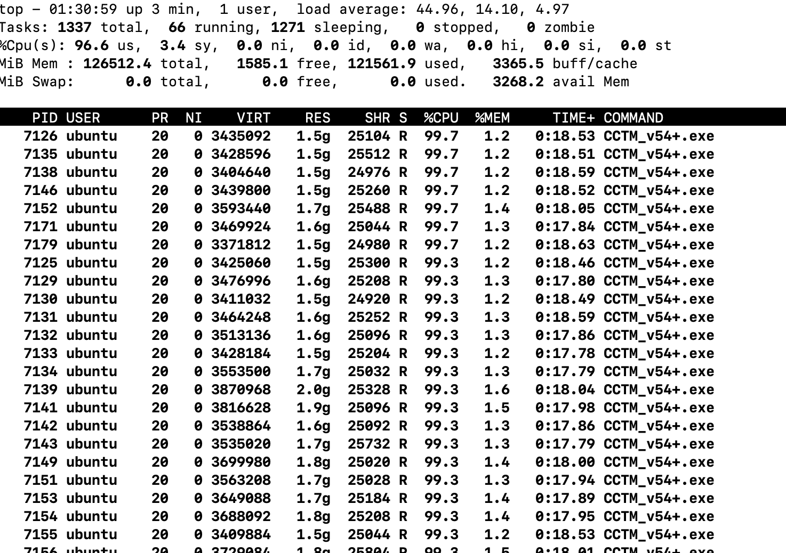

# Run CMAQ on hpc7g.16xlarge

## Login to cluster
```{note}
Replace the your-key.pem with your Key Pair.
```

```
pcluster ssh -v -Y -i ~/your-key.pem --region=us-east-1 --cluster-name cmaq
```

Check to make sure elastic network adapter (ENA) is enabled

```
modinfo ena
lspci
```

Verify the gcc compiler version is greater than 8.0

```
gcc --version
```

output:

gcc (Ubuntu 9.4.0-1ubuntu1~20.04.1) 9.4.0
Copyright (C) 2019 Free Software Foundation, Inc.
This is free software; see the source for copying conditions.  There is NO
warranty; not even for MERCHANTABILITY or FITNESS FOR A PARTICULAR PURPOSE.


Change default shell to .tcsh

```
sudo usermod -s /bin/tcsh ubuntu
```

Copy file to .cshrc

```
cp /shared/pcluster-cmaq/install/dot.cshrc.pcluster ~/.cshrc
```

Note that the .cshrc to add custom module path

```
module use --append /shared/build/Modules/modulefiles
```

Change shell to csh

logout and log back in to switch to the default shell

Use module list and then module load to load the libraries

```
module load netcdf-4.8.1/gcc-9.5  ioapi-3.2/gcc-9.5-netcdf
```


Description of the hpc7g.16xlarge instance:


Instance Size 	Physical Cores 	Memory (GiB) 	Instance Storage 	EFA Network Bandwidth (Gbps) 	Network Bandwidth (Gbps)*
hpc7g.16xlarge  64              128             EBS-only                200                                 25


Verify that you have an updated set of run scripts from the pcluster-cmaq repo

```
cd /shared/build/openmpi_gcc/CMAQ_v54+/CCTM/scripts
ls -lrt  run_cctm_2018_12US1_v54_cb6r5_ae6.20171222.2x64.ncclassic.csh
```


If they don't exist or are not identical, then copy the run scripts from the repo

```
cd /shared/pcluster-cmaq
git pull
cp /shared/pcluster-cmaq/run_scripts/hpc7g.16xlarge/run_cctm* /shared/build/openmpi_gcc/CMAQ_v54+/CCTM/scripts/
```


Verify that the input data is imported to /fsx from the S3 Bucket

```
cd /fsx/
```

## Preloading the files

Amazon FSx copies data from your Amazon S3 data repository when a file is first accessed.
CMAQ is sensitive to latencies, so it is best to preload contents of individual files or directories using the following command:

```
nohup find /fsx/ -type f -print0 | xargs -0 -n 1 sudo lfs hsm_restore &
```

Create a directory that specifies the full path that the run scripts are expecting.

```
mkdir -p /fsx/data/CMAQ_Modeling_Platform_2018/
```

Link the 2018_12US1 directoy

```
cd /fsx/data/CMAQ_Modeling_Platform_2018/
ln -s /fsx/CMAQv5.4_2018_12US1_Benchmark_2Day_Input/2018_12US1/ .
```

Link the 12LISTOS_Training data

```
cd /fsx/data/
ln -s /fsx/CMAQv5.4_2018_12LISTOS_Benchmark_3Day_Input/12LISTOS_Training ./12US1_LISTOS
```

Link the 2018_12NE3 Benchmark data

```
ln -s /fsx/CMAQv5.4_2018_12NE3_Benchmark_2Day_Input/2018_12NE3 .
```


netCDF-3 classic input files are used

The *.nc4 compressed netCDF4 files on /fsx input directory were converted to netCDF classic (nc3) files


Create the output directory`

```
mkdir -p /fsx/data/output
```


Note, that the 12US1 Domain will not run on 64 cores using the hpc7g.16xlarge, as it doesn't have enough memory per node.
It is possible to run on 64 cores using the hpc7g.8xlarge using 2 x 32 cores per node (as there is more memory per core).


## Run the 12US1 Domain on 128 cores

```
cd /shared/build/openmpi_gcc/CMAQ_v54+/CCTM/scripts/
sbatch run_cctm_2018_12US1_v54_cb6r5_ae6.20171222.2x64.ncclassic.csh
```

Note, it will take about 3-5 minutes for the compute notes to start up. This is reflected in the Status (ST) of CF (configuring)


Check the status in the queue

```
squeue -u ubuntu`
```

Output:

```
JOBID PARTITION     NAME     USER ST       TIME  NODES NODELIST(REASON)
                 3    queue1     CMAQ   ubuntu  CF                2 queue1-dy-compute-resource-1-[1-2]
```
After 5 minutes the status will change once the compute nodes have been created and the job is running

```
squeue -u ubuntu
```

Output:

```
             JOBID PARTITION     NAME     USER ST       TIME  NODES NODELIST(REASON)
                 3    queue1     CMAQ   ubuntu  R       0:58      2 queue1-dy-compute-resource-1-[1-2]
```


Check on the status of the cluster using CloudWatch (optional)

<a href="https://console.aws.amazon.com/cloudwatch/home?region=us-east-1#dashboards:name=cmaq-us-east-1">Cloudwatch Dashboard</a>

<a href="https://aws.amazon.com/blogs/compute/monitoring-dashboard-for-aws-parallelcluster/">Monitoring Dashboard for ParallelCluster</a>

Check the timings while the job is still running using the following command

`cd /fsx/data/output/output_v54+_cb6r5_ae7_aq_WR413_MYR_gcc_2018_12US1_2x64_classic/`

`grep 'Processing completed' CTM_LOG_001*`

Output:

```
            Processing completed...       7.4020 seconds
            Processing completed...       5.5893 seconds
            Processing completed...       5.5588 seconds
            Processing completed...       5.5470 seconds
            Processing completed...       5.5449 seconds
            Processing completed...       5.5105 seconds
            Processing completed...       5.5182 seconds
            Processing completed...       5.5343 seconds
            Processing completed...       5.5482 seconds
```

When the job has completed, use tail to view the timing from the log file.

`cd /shared/build/openmpi_gcc/CMAQ_v54+/CCTM/scripts/`

`tail run_cctm5.4+_Bench_2018_12US1_cb6r5_ae6_20200131_MYR.128.8x16pe.2day.20171222start.2x64.log`

Output:


```
==================================
  ***** CMAQ TIMING REPORT *****
==================================
Start Day: 2017-12-22
End Day:   2017-12-23
Number of Simulation Days: 2
Domain Name:               12US1
Number of Grid Cells:      4803435  (ROW x COL x LAY)
Number of Layers:          35
Number of Processes:       128
   All times are in seconds.

Num  Day        Wall Time
01   2017-12-22   2074.2
02   2017-12-23   2298.9
     Total Time = 4373.10
      Avg. Time = 2186.55

```

Check whether the scheduler thinks there are cpus or vcpus

`sinfo -lN`

Output:

```
Thu Jun 29 22:31:30 2023
NODELIST                         NODES PARTITION       STATE CPUS    S:C:T MEMORY TMP_DISK WEIGHT AVAIL_FE REASON              
queue1-dy-compute-resource-1-1       1   queue1*   allocated 64     64:1:1 124518        0      1 dynamic, none                
queue1-dy-compute-resource-1-2       1   queue1*       idle~ 64     64:1:1 124518        0      1 dynamic, Scheduler health che
queue1-dy-compute-resource-1-3       1   queue1*   allocated 64     64:1:1 124518        0      1 dynamic, none                
queue1-dy-compute-resource-1-4       1   queue1*       idle~ 64     64:1:1 124518        0      1 dynamic, none                
queue1-dy-compute-resource-1-5       1   queue1*       idle~ 64     64:1:1 124518        0      1 dynamic, none                
queue1-dy-compute-resource-1-6       1   queue1*       idle~ 64     64:1:1 124518        0      1 dynamic, none                
queue1-dy-compute-resource-1-7       1   queue1*       idle~ 64     64:1:1 124518        0      1 dynamic, none                
queue1-dy-compute-resource-1-8       1   queue1*       idle~ 64     64:1:1 124518        0      1 dynamic, none                
queue1-dy-compute-resource-1-9       1   queue1*       idle~ 64     64:1:1 124518        0      1 dynamic, none                
queue1-dy-compute-resource-1-10      1   queue1*       idle~ 64     64:1:1 124518        0      1 dynamic, none                
queue1-dy-compute-resource-1-11      1   queue1*       idle~ 64     64:1:1 124518        0      1 dynamic, none                
queue1-dy-compute-resource-1-12      1   queue1*       idle~ 64     64:1:1 124518        0      1 dynamic, none      
```


When the jobs are both submitted to the queue they will be dispatched to different compute nodes.

`squeue`

output

```
Submitted batch job 4
ip-10-0-1-243:/shared/build/openmpi_gcc/CMAQ_v54+/CCTM/scripts> squeue
             JOBID PARTITION     NAME     USER ST       TIME  NODES NODELIST(REASON)
                 4    queue1     CMAQ   ubuntu CF       0:01      1 queue1-dy-compute-resource-1-3
                 3    queue1     CMAQ   ubuntu  R      21:28      2 queue1-dy-compute-resource-1-[1-2]
```

Information about the error obtained when running on 1 node using hpc7g.16xlarge

1 pe job is dying, running out of memory, which means that the 12US1 case takes more than 128 GB of memory.




<a href="https://aws.amazon.com/blogs/hpc/application-deep-dive-into-the-graviton3e-based-amazon-ec2-hpc7g-instance/">2 GB Memory per core for hpc7g.16xlarge</a>

`tail -n 30 run_cctm5.4+_Bench_2018_12US1_cb6r5_ae6_20200131_MYR.64.8x8pe.2day.20171222start.1x64.log`

Output

```
a non-zero exit code. Per user-direction, the job has been aborted.
--------------------------------------------------------------------------
--------------------------------------------------------------------------
mpirun noticed that process rank 12 with PID 6866 on node queue1-dy-compute-resource-1-1 exited on signal 9 (Killed).
--------------------------------------------------------------------------
11.857u 17.117s 1:24.37 34.3%	0+0k 382640+17960io 4860pf+0w

**************************************************************
** Runscript Detected an Error: CGRID file was not written. **
**   This indicates that CMAQ was interrupted or an issue   **
**   exists with writing output. The runscript will now     **
**   abort rather than proceeding to subsequent days.       **
**************************************************************

==================================
  ***** CMAQ TIMING REPORT *****
==================================
Start Day: 2017-12-22
End Day:   2017-12-23
Number of Simulation Days: 1
Domain Name:               12US1
Number of Grid Cells:      4803435  (ROW x COL x LAY)
Number of Layers:          35
Number of Processes:       64
   All times are in seconds.

Num  Day        Wall Time
01   2017-12-22   12
     Total Time = 12.00
      Avg. Time = 12.00
```

`tail -n 30  CTM_LOG_012.v54+_cb6r5_ae7_aq_WR413_MYR_gcc_2018_12US1_1x64_classic_20171222`
```
     File "OMI" opened for input on unit:  92
     /shared/build/openmpi_gcc/CMAQ_v54+/CCTM/scripts/BLD_CCTM_v54+_gcc/OMI_1979_to_2019.dat

OMI Ozone column data has Lat by Lon Resolution:      17X     17
     Total column ozone will be interpolated to day 0:00:00   Dec. 22, 2017
     from data available on the OMI input file
```


Switched to running on more than one node c7g.8xlarge, and CMAQv5.4 ran successfully as it had access to more memory.

When the job has completed, use tail to view the timing from the log file.

`cd /shared/build/openmpi_gcc/CMAQ_v54+/CCTM/scripts/`

`tail -n 30 run_cctm5.4+_Bench_2018_12US1_cb6r5_ae6_20200131_MYR.256.16x16pe.2day.20171222start.4x64.log`

Output:

```
==================================
  ***** CMAQ TIMING REPORT *****
==================================
Start Day: 2017-12-22
End Day:   2017-12-23
Number of Simulation Days: 2
Domain Name:               12US1
Number of Grid Cells:      4803435  (ROW x COL x LAY)
Number of Layers:          35
Number of Processes:       256
   All times are in seconds.

Num  Day        Wall Time
01   2017-12-22   1347.3
02   2017-12-23   1501.4
     Total Time = 2848.70
      Avg. Time = 1424.35


```

## Submit a job to run on 192 pes, 3x64 nodes

`sbatch run_cctm_2018_12US1_v54_cb6r5_ae6.20171222.3x64.ncclassic.csh`

Verify that it is running on 3 nodes

`sbatch`

output:

```
             JOBID PARTITION     NAME     USER ST       TIME  NODES NODELIST(REASON)
                 5    queue1     CMAQ   ubuntu  R       4:29      3 queue1-dy-compute-resource-1-[1-3]
```

Check the log for how quickly the job is running

`grep 'Processing completed'  

Output:

```
```

When the job has completed, use tail to view the timing from the log file.

`cd /shared/build/openmpi_gcc/CMAQ_v54+/CCTM/scripts/`

`tail -n 30 run_cctm5.4+_Bench_2018_12US1_cb6r5_ae6_20200131_MYR.192.12x16pe.2day.20171222start.3x64.log`

Output:

```
==================================
  ***** CMAQ TIMING REPORT *****
==================================
Start Day: 2017-12-22
End Day:   2017-12-23
Number of Simulation Days: 2
Domain Name:               12US1
Number of Grid Cells:      4803435  (ROW x COL x LAY)
Number of Layers:          35
Number of Processes:       192
   All times are in seconds.

Num  Day        Wall Time
01   2017-12-22   1617.1
02   2017-12-23   1755.3
     Total Time = 3372.40
      Avg. Time = 1686.20

```

## Submit a job to run on 320 pes running on 5 nodes

Output

```
==================================
  ***** CMAQ TIMING REPORT *****
==================================
Start Day: 2017-12-22
End Day:   2017-12-23
Number of Simulation Days: 2
Domain Name:               12US1
Number of Grid Cells:      4803435  (ROW x COL x LAY)
Number of Layers:          35
Number of Processes:       320
   All times are in seconds.

Num  Day        Wall Time
01   2017-12-22   1177.0
02   2017-12-23   1266.6
     Total Time = 2443.60
      Avg. Time = 1221.80

```

## Submit a job to run on 128 cores  with 32 cores per node.
Running on  4x32 cores using the hpc7g.8xlarge instances

`sbatch  run_cctm_2018_12US1_v54_cb6r5_ae6.20171222.4x32.ncclassic.csh -w queue1-dy-compute-resource-2[1-4]`


## Run CMAQ for DESID

### Edit the DESID Namelist

1. **Edit the CMAQ DESID Chemical Species Control File**

```
cd /shared/build/openmpi_gcc/CMAQ_v54+/CCTM/scripts/BLD_CCTM_v54+_gcc
cp CMAQ_Control_DESID_cb6r5_ae7_aq.nml CMAQ_Control_DESID_cb6r5_ae7_aq_RED_EGU_POINT_NY.nml
vi CMAQ_Control_DESID_cb6r5_ae7_aq_RED_EGU_POINT_NY.nml
```

2. **Add the following lines to the bottom of the file according to the DESID Tutorial Instructions**

https://github.com/USEPA/CMAQ/blob/main/DOCS/Users_Guide/Tutorials/CMAQ_UG_tutorial_emissions.md#scale_stream
(place the line before the / file marker)

```csh
   ! PT_EGU Emissions Scaling reduce PT_EGU emissions in New York by 25%. Note, to reduce the emissions by 25% we use DESID to multiply what had been 100% emissions by .75, so that the resulting emissions is reduced by 25%.
   'NY'  , 'PT_EGU'      ,'All'    ,'All'         ,'All' ,.75    ,'UNIT','o',
```

3. **Activate DESID Diagnostics**

Create a DESID Control File and edit it to define NY as a region, and activate DESID emissions diagnostics
Define NY as a region in the DESID Region Definitions

```csh
cp CMAQ_Control_DESID.nml CMAQ_Control_DESID_RED_EGU_POINT_NY.nml
vi  CMAQ_Control_DESID_RED_EGU_POINT_NY.nml &
```

Modify the following section to use the NY region that is specified in the CMAQ_MASKS file, note the CMAQ_MASKS file is defined in the DESID Run script.

```csh
&Desid_RegionDef
 Desid_Reg_nml  =
 !            Region Label   | File_Label  | Variable on File
 !              'EVERYWHERE'  ,'N/A'        ,'N/A',
               'NY'         ,'CMAQ_MASKS' ,'NY',
 !<Example>    'ALL'         ,'ISAM_REGIONS','ALL',
/
```

4. **Create two stream family definitions, one that includes all point source emissions, and the second that only contains PT_EGU**

```csh
!------------------------------------------------------------------------------!
! Emissions Scaling Family Definitions                                         !
!    This component includes definitions for families of emission streams and  !
!    region combinations.                                                      !
!------------------------------------------------------------------------------!
&Desid_StreamFamVars
 Desid_N_Stream_Fams = 2           ! Exact number of stream family definitions
 Desid_Max_Stream_Fam_Members = 20 ! Larger than the number of streams on all
                                   ! family definitions
/

&Desid_StreamFam
! For emission streams available in several run scripts under CCTM/scripts

  StreamFamilyName(1)     = 'PT_SOURCES'
  StreamFamilyMembers(1,1:8)= 'PT_NONEGU','PT_OTHER', 'PT_AGFIRES', 'PT_FIRES', 'PT_RXFIRES', 'PT_OTHFIRES', 'PT_OILGAS','PT_CMV_C1C2'

  StreamFamilyName(2)     = 'PT_EGUS'
  StreamFamilyMembers(2,1:1)= 'PT_EGU'
&Desid_Diag
```

5. **activate DESID diagnostics to report the reduction in PT_EGU emissions.**

Note, if you define only one diagnostic rule, you must comment out all other rules.

```csh
&Desid_DiagVars
  Desid_N_Diag_Rules = 1    ! Exact Number of Diagnostic Rules Below
  Desid_Max_Diag_Streams=20 ! Maximum number of species variables on all rules
                            ! below (do not count expansions)
  Desid_Max_Diag_Spec = 80  ! Maximum number of species variables on all rules
                            ! below (do not count expansions)
/
```

```csh
! Create a diagnostic of the sum of the components of the PT_SOURCES
 ! family (defined in the stream family section). This file will be column sums
 ! and will include all the emitted species as long as they appear on at least
 ! one of the streams within PT_SOURCES.


    Desid_Diag_Streams_Nml(1,:)= 'PT_EGUS'
    Desid_Diag_Fmt_Nml(1)      = 'COLSUM'
    Desid_Diag_Spec_Nml(1,:)   = 'ALL'
```

6. **Verify that the settings are correct by comparing to the version in the github repo directory**

```csh
diff CMAQ_Control_DESID_RED_EGU_POINT_NY.nml /shared/pcluster-cmaq/qa_scripts/workshop/CMAQ_Control_DESID_RED_EGU_POINT_NY.nml
```

7. **Copy the Run script and edit it to use the DESID namelist files**

```csh
cd /shared/build/openmpi_gcc/CMAQ_v54+/CCTM/scripts/BLD_CCTM_v54+_gcc
cp run_cctm_2018_12US1_v54_cb6r5_ae6.20171222.3x64.ncclassic.csh run_cctm_2018_12US1_v54_cb6r5_ae6.20171222.3x64.ncclassic_DESID_RED_NY.csh
```


### Edit runscript to use DESID Namelist

1. **Copy the Run script and edit it to use the DESID namelist files**

```csh
cd /shared/build/openmpi_gcc/CMAQ_v54+/CCTM/scripts/BLD_CCTM_v54+_gcc
cp run_cctm_2018_12US1_v54_cb6r5_ae6.20171222.3x64.ncclassic.csh run_cctm_2018_12US1_v54_cb6r5_ae6.20171222.3x64.ncclassic_DESID_RED_NY.csh
```

2. **Change APPL to a new name**

```csh
set APPL      = 12US1_DESID_REDUCE        #> Application Name (e.g. Gridname)
```

3. **Verify the following emission stream names match the names used in the DESID namelist.**

```csh
grep STK_EMIS_LAB_00 ../run_cctm_2018_12US1_v54_cb6r5_ae6.20171222.3x64.ncclassic.DESID_RED_NY.csh
```

Output

```
setenv STK_EMIS_LAB_001 PT_NONEGU
setenv STK_EMIS_LAB_002 PT_EGU
setenv STK_EMIS_LAB_003 PT_OTHER
setenv STK_EMIS_LAB_004 PT_AGFIRES
setenv STK_EMIS_LAB_005 PT_FIRES
setenv STK_EMIS_LAB_006 PT_RXFIRES
setenv STK_EMIS_LAB_007 PT_OTHFIRES
setenv STK_EMIS_LAB_008 PT_OILGAS
setenv STK_EMIS_LAB_009 PT_CMV_C1C2
```

4. **Compare the above settings to those used in the Emission Stream Family defined in the DESID Namelist.**

```csh
grep -A 2 -B 2 StreamFamilyMembers CMAQ_Control_DESID_RED_EGU_POINT_NY.nml
```


Output

```
  StreamFamilyName(1)     = 'PT_SOURCES'
  StreamFamilyMembers(1,1:4)= 'PT_NONEGU','PT_OTHER', 'PT_AGFIRES', 'PT_FIRES', 'PT_RXFIRES', 'PT_OTHFIRES', 'PT_OILGAS','PT_CMV_C1C2'

  StreamFamilyName(2)     = 'PT_EGUS'
  StreamFamilyMembers(2,1:1)= 'PT_EGU'
```

:::alert{type=info}
CMAQ won’t crash if the stream name in CMAQ_Control_DESID_<MECH>_RED_EGU_POINT_NY.nml was set incorrectly. CMAQ just ignores the incorrect stream name and won’t apply scaling.
:::

5. **Update the DESID namelist file names in the run script to use the Reduced PT_EGU and diagnostic instructions.**

```csh
cd  /shared/build/openmpi_gcc/CMAQ_v54+/CCTM/scripts/BLD_CCTM_v54+_gcc
vi run_cctm_2018_12US1_v54_cb6r5_ae6.20171222.3x64.ncclassic_DESID_RED_NY.csh
```

Modify the namelist setting to use the DESID namelist:

```csh
setenv DESID_CTRL_NML ${BLD}/CMAQ_Control_DESID_RED_EGU_POINT_NY.nml
setenv DESID_CHEM_CTRL_NML ${BLD}/CMAQ_Control_DESID_${MECH}_RED_EGU_POINT_NY.nml
```

6. **Update the Spatial Masks for Emissions Scaling to use a file that contains state definitions for New York.**

```csh
#> Spatial Masks For Emissions Scaling
  setenv CMAQ_MASKS $SZpath/GRIDMASK_STATES_12US1_m3clple_12listos.ncf
```

7. **Verify that the file contains New York**

```csh
ncdump /shared/build/GRIDMASK/GRIDMASK_STATES_12US1.nc | grep NY
```

Output

```csh
    float NY(TSTEP, LAY, ROW, COL) ;
        NY:long_name = "NY              " ;
        NY:units = "fraction        " ;
        NY:var_desc = "NY fractional area per grid cell
```

### Run CMAQ using DESID

```{note}
The CMAQ run script has been configured to run on 192 cores (3 compute nodes of hpc7g with 64 cores/node)
```


1. **Change directories to the run script location**

```csh
cd /shared/build/openmpi_gcc/CMAQ_v54+/CCTM/scripts
```

2. **Submit the Run script to the SLURM queue**
```csh
sbatch run_cctm_2018_12US1_v54_cb6r5_ae6.20171222.3x64.ncclassic.DESID_RED_NY.csh
```

3. **Check the status of the job**

```csh
squeue
```

Output

```
             JOBID PARTITION     NAME     USER ST       TIME  NODES NODELIST(REASON)
                 1   compute     CMAQ   ec2-user CF       0:30      3 compute-dy-hpc7g-[1-3]
```

Wait for the status to change from CF to R

4. **Login to the compute node, install  and run htop**

```csh
ssh -Y compute-dy-hpc7g-1
sudo yum install -y htop
htop
```


Htop should show that 64 processes are running and that 80.2G out of 124 G of memory is being used.
~                                                                                                                

### Review Log file from DESID run

```{note}
The CMAQ run script has been configured to run on 192 cores (3 compute nodes of hpc7g with 64 cores/node)
```


1. **Review the Emissions Scaling Report Section in the CTM_LOG File to verify that for the NY region, the EGU emissions were scaled by 75%**

```csh
cd output_v54+_cb6r5_ae7_aq_WR413_MYR_gcc_2018_12US1_3x64_classic_DESID_REDUCE
grep -A 20 'Stream Type: "Point Emissions File   2' CTM_LOG_001*
```

Output:

```csh
     Stream Type: "Point Emissions File   2" | Sector Label: PT_EGU (04)

        Table of Aerosol Size Distributions Available for Use Sector-Wide.
        Note that Mode 1 is reserved for gas-phase species and emission variable.
          Number  Em. Var.  Mode  Reference Mode (see AERO_DATA.F)
          ------  --------------  --------------------------------
          2       FINE                        FINE_REF
          3       COARSE                    COARSE_REF

        CMAQ Species     Phase/Mode  Em. Var.          Region             Op ScaleFac Basis FinalFac
        ------------     ----------  ---------         ------             -- -------- ----- --------
          NO2              GAS        NO2              EVERYWHERE         a   1.000    UNIT   1.000
                                                       NY                 o   0.750    UNIT   0.750
          NO               GAS        NO               EVERYWHERE         a   1.000    UNIT   1.000
                                                       NY                 o   0.750    UNIT   0.750
          HONO             GAS        HONO             EVERYWHERE         a   1.000    UNIT   1.000
                                                       NY                 o   0.750    UNIT   0.750
          SO2              GAS        SO2              EVERYWHERE         a   1.000    UNIT   1.000
                                                       NY                 o   0.750    UNIT   0.750
          SULF             GAS        SULF             EVERYWHERE         a   0.000    UNIT   0.000
                                                       NY                 o   0.750    UNIT   0.750
```

