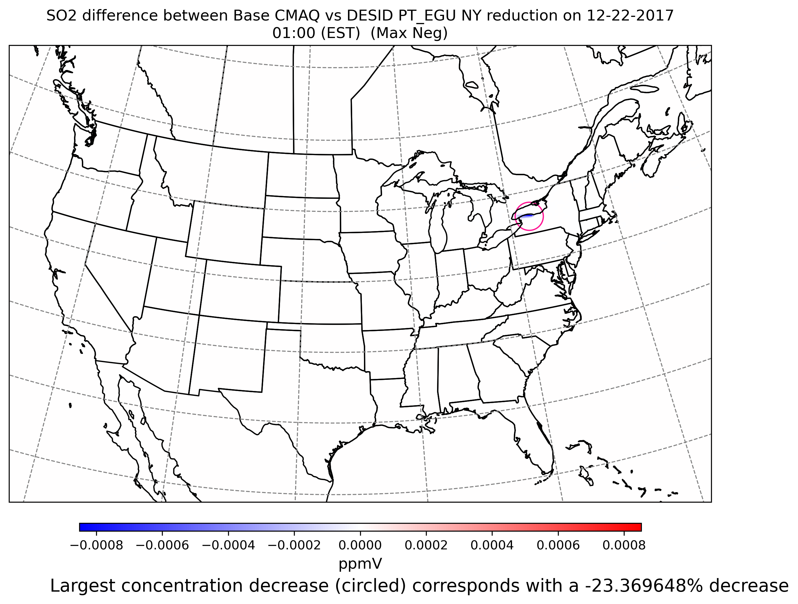
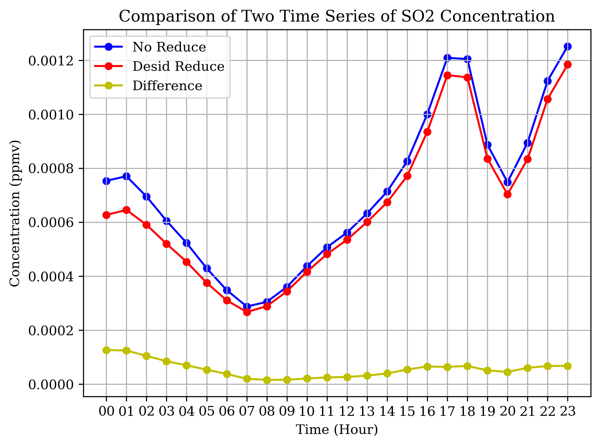
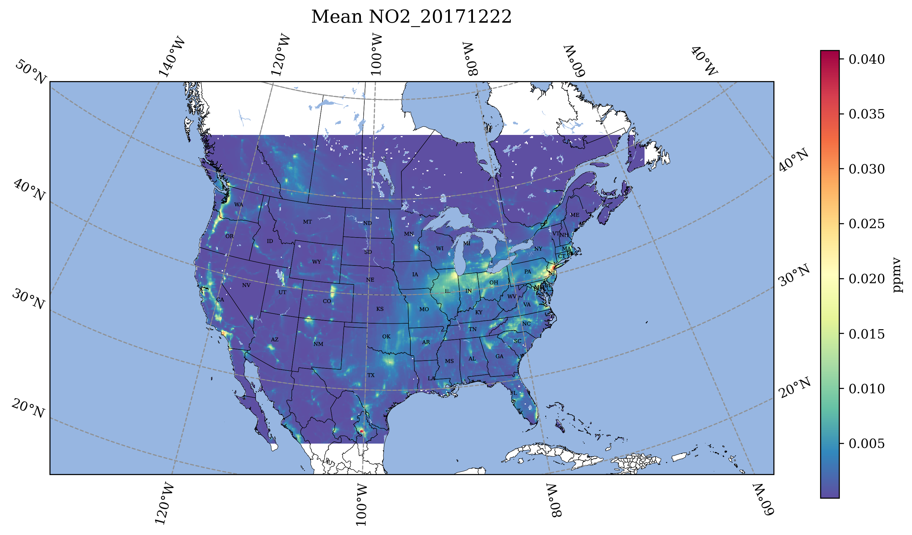

##  Run Jupyter Notebook to analyze difference between with DESID Emissions and the base case (no emission reduction)

1.  Change directories to the location of the Jupyter Notebook

```
cd /shared/pcluster-cmaq/qa_scripts/workshop
```

2. Switch to the .tcsh shell

```

/bin/tcsh
```

3. Run Jupyter Notebook (this may take a few minutes to run and to start the browser)

```
jupyter notebook
```


4. Create Spatial Difference Plot

    a. Double Click on the Spatial_Plots_of_Ave_Conc_Differences.ipynb notebook

    b. In each cell you can use the 'shift return' or 'shift enter' to run each cell

    c. In the section "Set up your Inputs" you will use shift+enter, then enter the value, and then enter to submit the answer.

    d. View the plots within the Jupyter Notebook in cells after the plots have been generated

    e. Plot of Difference of SO2 Base minus SO2 DESID REDUCE CMAQ

 

5. Create Timeseries Plot at Cell where PT_EGU emissions were reduced

    a. Double Click on the desid_timeseries.ipynb notebook

    b. In each cell you can use the 'shift return' or 'shift enter' to run each cell

    c. View the plots within the Jupyter Notebook in cells after the plots have been generated

    d. Plot comparing two time series, one for base case and one for DESID reduce case.

  

6. Create Plot of Daily Average of O3 and NO2. 

    a. Double Click on the cmaq_tutorial.ipynb

    b. In each cell you can use the 'shift return' or 'shift enter' to run each cell

    c. In the section "Set up your Inputs" you will use shift+enter, then enter the value, and then enter to submit the answer.

    d. View the plots within the Jupyter Notebook in cells after the plots have been generated

    e. Plot of Mean Ozone and NO2




7. Create 


This notebook produces a panel of plots per species where the top two plots are averages and then the bottom two are average differences and average percent differences


