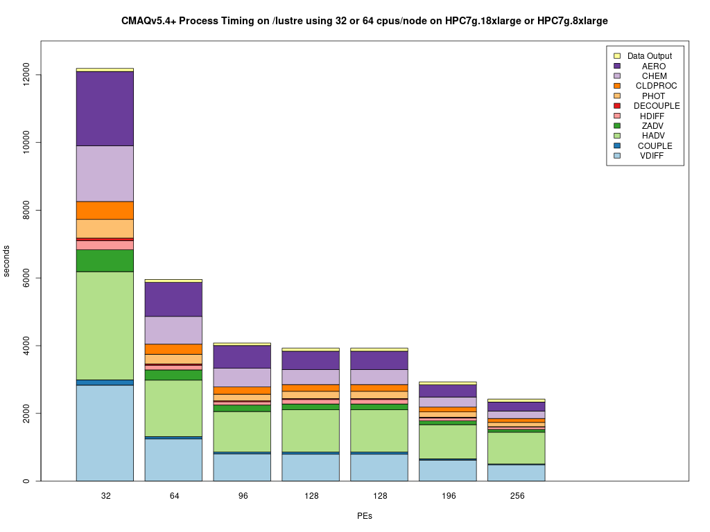

# Parse timings from the log file 

## Compare the timings for the CONUS ParallelCluster Runs

```{note}
ParallelCluster Configurations can impact the model run times.
```

It is up the the user, as to what model run configurations are used to run CMAQ on the ParallelCluster.
The following configurations may impact the run time of the model.

* Using different PE configurations, using DisableSimultaneousMultithreading: true in yaml file, using 36 cpus - no virtual cpus
         
         NPCOL x NPROW  , CPU   , SBATCH Command  
   - [ ] 10x18 , 180  ,    #SBATCH --nodes=5, #SBATCH --ntasks-per-node=36
   - [ ] 16x16,  256  ,    #SBATCH --nodes=8, #SBATCH --ntasks-per-node=32
   - [ ] 16x18,  288  ,    #SBATCH --nodes=8, #SBATCH --ntasks-per-node=36

* Using different compute nodes   

   - [ ] c5n.18xlarge  (72 virtual cpus, 36 cpus) - with Elastic Fabric Adapter
   - [ ] c5n.9xlarge   (36 virtual cpus, 18 cpus) - with Eleastic Fabric Adapter
   - [ ] c5n.4xlarge   (16 virtual cpus, 4 cpus) - without Elastic Fabric Adapter

* With and without SBATCH --exclusive option

* With and without Elastic Fabric and Elastic Network Adapter turned on

* With and without network placement turned on

* Using different local storage options and copying versus importing data to lustre

   - [ ] input data imported from S3 bucket to lustre
   - [ ] input data copied from S3 bucket to lustre
   - [ ] input data copied from S3 bucket to an EBS volume

* Using different yaml settings for slurm  

   - [ ] DisableSimultaneousMultithreading= true
   - [ ] DisableSimultaneousMultithreading= false

## Edit the R script 

First check to see what log files are available:

`ls -lrt /shared/build/openmpi_gcc/CMAQ_v54+/CCTM/scripts/*.log`

Copy the log files to the repo, to save them, as once you log out and delete the cluster you won't have them.
Note, they would need to be saved to your local fork of the repo.


`cp /shared/build/openmpi_gcc/CMAQ_v54+/CCTM/scripts/*.log /shared/pcluster-cmaq/run_scripts/hpc7g.16xlarge/logs/`

`ls -lrt /shared/pcluster-cmaq/run_scripts/hpc7g.16xlarge/logs/`


Modify the name of the log file to match what is avaible on your system.

```
cd /shared/pcluster-cmaq/qa_scripts
vi parse_timing.pes.lustre.cmaqv5.4.r
```

Edit the following section of the script to specify the log file names available on your ParallelCluster

```
sens.dir  <- '/shared/pcluster-cmaq/run_scripts/hpc7g.16xlarge/logs/'
base.dir  <- '/shared/pcluster-cmaq/run_scripts/hpc7g.16xlarge/logs/'
files     <- dir(sens.dir, pattern ='run_cctm5.4p_Bench_2018_12US1_cb6r5_ae6_20200131_MYR.32.4x8pe.2day.20171222start.1x32.log' )
b.files <- dir(base.dir,pattern='run_cctm5.4p_Bench_2018_12US1_cb6r5_ae6_20200131_MYR.64.8x8pe.2day.20171222start.2x32.log')
#Compilers <- c('intel','gcc','pgi')
Compilers <- c('gcc')
# name of the base case timing. I am using the current master branch from the CMAQ_Dev repository.
# The project directory name is used for the sensitivity case.
base.name <- '12x9pe'
sens.name <- '6x18pe'
```


### Run parse_timing.pes.lustre.cmaqv5.4.r script to examine timings of each science process in CMAQ

```
Rscript parse_timing.pes.lustre.cmaqv5.4.r
```

Timing Plot Comparing GCC run on 32, 64, 96, 128, 192, 256


