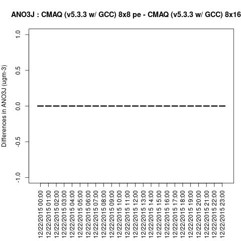
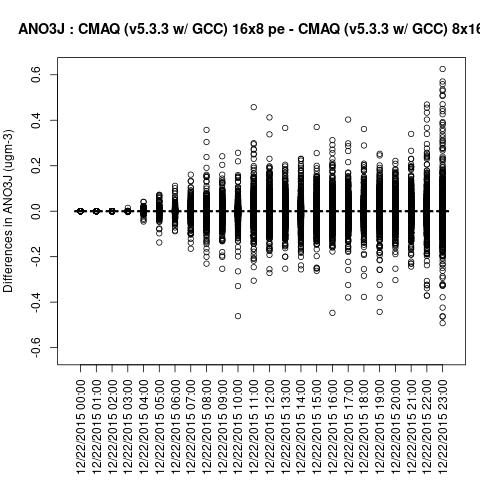
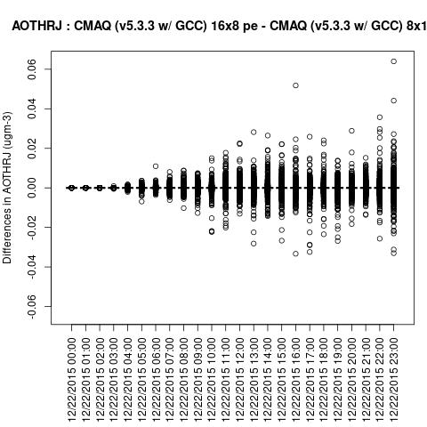
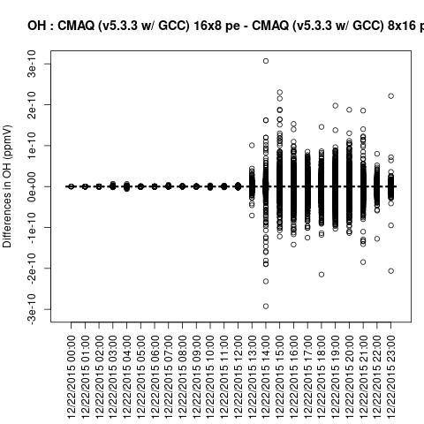
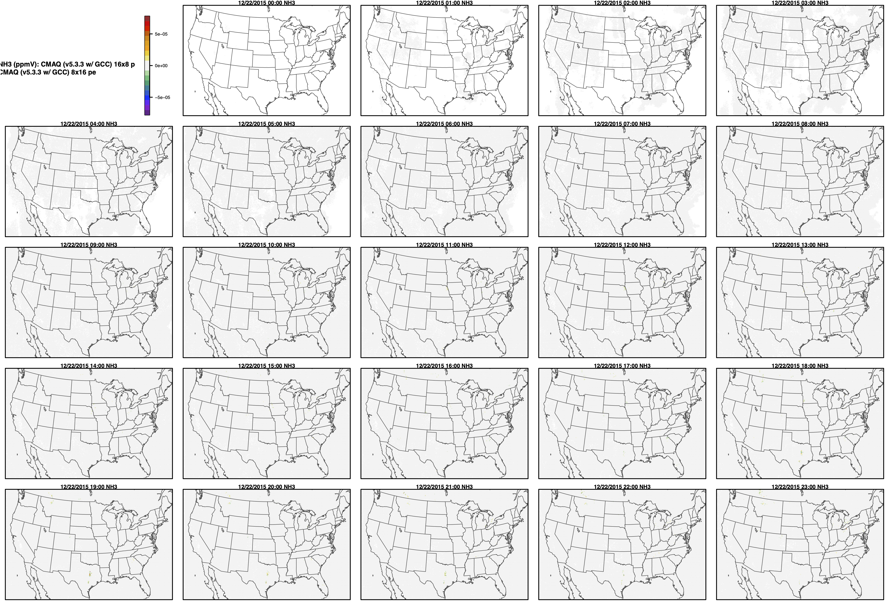

## Quality Assurance 

Instructions on how to to verify a successful CMAQ Run on Parallel Cluster.


## run m3diff to compare the output data for two runs that have different values for NPCOL

```
cd /fsx/data/output
ls */*ACONC*
```
```
setenv AFILE output_CCTM_v533_gcc_2016_CONUS_10x18pe_full/CCTM_ACONC_v533_gcc_2016_CONUS_10x18pe_full_20151222.nc
setenv BFILE output_CCTM_v533_gcc_2016_CONUS_16x18pe_full/CCTM_ACONC_v533_gcc_2016_CONUS_16x18pe_full_20151222.nc
```

```
m3diff
```
hit return several times to accept the default options

```
grep A:B REPORT
```

Should see all zeros. 

Recompiled CMAQ using -march=native compiler option for gcc compiler, but still see differences in answers.
The answers are the same, or the differences are all zeros if the domain decomposition uses the same NPCOL, here, NPCOL differs (10 vs 16)

This behavior is different from what was observed with removing the -march=native compiler option for gcc on the AMD Cyclecloud HBV3 processor.
On cycle cloud, if CMAQ is compiled with -march=native removed from the compiler options, then the answers match if NPCOL differs.


```
NPCOL  =  10; @ NPROW = 18
NPCOL  =  16; @ NPROW = 18
```
`grep A:B REPORT`

output

```
 A:B  4.54485E-07@(316, 27, 1) -3.09199E-07@(318, 25, 1)  1.42188E-11  2.71295E-09
 A:B  4.73112E-07@(274,169, 1) -2.36556E-07@(200,113, 1)  3.53046E-11  3.63506E-09
 A:B  7.37607E-07@(226,151, 1) -2.98955E-07@(274,170, 1)  3.68974E-11  5.29013E-09
 A:B  3.15718E-07@(227,150, 1) -2.07219E-07@(273,170, 1)  2.52149E-11  3.60005E-09
 A:B  2.65893E-07@(299,154, 1) -2.90573E-07@(201,117, 1)  1.78237E-12  4.15726E-09
 A:B  3.11527E-07@(300,156, 1) -7.43195E-07@(202,118, 1) -9.04127E-12  6.38413E-09
 A:B  4.59142E-07@(306,160, 1) -7.46921E-07@(203,119, 1) -2.57731E-11  8.06486E-09
 A:B  5.25266E-07@(316,189, 1) -5.90459E-07@(291,151, 1) -2.67232E-11  9.36312E-09
 A:B  5.31785E-07@(294,156, 1) -6.33299E-07@(339,201, 1)  3.01644E-11  1.12862E-08
 A:B  1.01421E-06@(297,168, 1) -5.08502E-07@(317,190, 1)  9.97206E-11  1.35965E-08
 A:B  1.28523E-06@(297,168, 1) -2.96347E-06@(295,160, 1)  1.57728E-10  1.88143E-08
 A:B  1.69873E-06@(298,169, 1) -6.47269E-07@(343,205, 1)  1.99673E-10  1.96824E-08
 A:B  2.10665E-06@(298,170, 1) -8.53091E-07@(290,133, 1)  2.75009E-10  2.38824E-08
 A:B  2.77534E-06@(298,166, 1) -1.38395E-06@(339,201, 1)  4.32676E-10  3.19499E-08
 A:B  4.05498E-06@(298,166, 1) -2.29478E-06@(292,134, 1)  5.94668E-10  4.56470E-08
 A:B  1.64844E-06@(380,195, 1) -1.24970E-05@(312,119, 1)  2.99392E-10  6.27748E-08
 A:B  2.40747E-06@(350,207, 1) -2.38372E-06@(313,120, 1) -1.23841E-11  4.06153E-08
 A:B  2.54810E-06@(353,207, 1) -1.68476E-06@(258,179, 1)  4.69896E-10  4.00601E-08
 A:B  2.92342E-06@(259,180, 1) -1.84122E-06@(258,180, 1)  3.00556E-10  3.75263E-08
 A:B  4.37256E-06@(259,180, 1) -1.51433E-06@(258,180, 1)  3.44610E-10  4.03537E-08
 A:B  5.51227E-06@(313,160, 1) -1.60793E-06@(312,160, 1)  6.49188E-10  4.60905E-08
 A:B  5.58607E-06@(259,182, 1) -6.47921E-06@(278,186, 1)  3.40245E-11  4.89799E-08
 A:B  3.61912E-06@(259,183, 1) -4.28502E-06@(278,187, 1)  2.10923E-10  4.86613E-08
 A:B  2.02795E-06@(278,185, 1) -3.63495E-06@(278,187, 1)  5.26566E-10  5.32271E-08
 A:B  1.25729E-07@(225,183, 1) -8.38190E-08@(200,114, 1)  2.04043E-12  7.34096E-10
 A:B  9.66247E-08@(225,151, 1) -4.09782E-07@(225,182, 1) -6.33767E-12  1.73157E-09
 A:B  2.10712E-07@(225,151, 1) -2.71946E-07@(200,114, 1) -5.41618E-12  1.65727E-09
 A:B  5.45755E-07@(225,182, 1) -1.04494E-06@(200,115, 1) -1.47753E-11  4.57864E-09
 A:B  4.30271E-07@(200,114, 1) -7.39470E-07@(200,116, 1) -3.24581E-11  5.33182E-09
 A:B  7.71135E-07@(225,181, 1) -7.92556E-07@(201,117, 1) -2.74377E-11  6.31589E-09
 A:B  6.33299E-07@(225,182, 1) -6.53090E-07@(202,118, 1) -2.86715E-11  4.42746E-09
 A:B  6.25849E-07@(225,182, 1) -2.21189E-07@(225,184, 1) -5.32567E-12  2.66906E-09
 A:B  3.64147E-07@(306,158, 1) -3.12924E-07@(175,  2, 1)  3.15538E-12  2.74893E-09
```


Compare CMAQv533 run with -march=native compiler flag removed.

`more REPORT.6x12pe_vs_9x12pe`

```
     FILE A:  AFILE (output_CCTM_v533_gcc_2016_CONUS_6x12pe/CCTM_ACONC_v533_gcc_2016_CONUS_6x12pe_20151222.nc)

     FILE B:  BFILE (output_CCTM_v533_gcc_2016_CONUS_9x12pe/CCTM_ACONC_v533_gcc_2016_CONUS_9x12pe_20151222.nc)


     -----------------------------------------------------------

 Date and time  2015356:000000 (0:00:00   Dec. 22, 2015)
 A:AFILE/NO2  vs  B:BFILE/NO2  vs  (A - B)
      MAX        @(  C,  R, L)  Min        @(  C,  R, L)  Mean         Sigma
 A    5.19842E-02@(127, 62, 1)  1.56425E-05@(258,239, 1)  2.27752E-03  3.47514E-03
 B    5.19842E-02@(127, 62, 1)  1.56425E-05@(258,239, 1)  2.27752E-03  3.47514E-03
 A:B  2.27243E-07@(264,163, 1) -5.42961E-07@(264,165, 1)  9.77191E-12  2.54661E-09


 Date and time  2015356:010000 (1:00:00   Dec. 22, 2015)
 A:AFILE/NO2  vs  B:BFILE/NO2  vs  (A - B)
      MAX        @(  C,  R, L)  Min        @(  C,  R, L)  Mean         Sigma
 A    6.55882E-02@(128, 62, 1)  1.29276E-05@(260,245, 1)  2.56435E-03  4.35617E-03
 B    6.55882E-02@(128, 62, 1)  1.29276E-05@(260,245, 1)  2.56435E-03  4.35617E-03
 A:B  2.76603E-07@(197,102, 1) -2.45869E-07@(264,163, 1)  6.01613E-12  1.72038E-09


 Date and time  2015356:020000 (2:00:00   Dec. 22, 2015)
 A:AFILE/NO2  vs  B:BFILE/NO2  vs  (A - B)
      MAX        @(  C,  R, L)  Min        @(  C,  R, L)  Mean         Sigma
 A    6.86494E-02@(128, 62, 1)  1.03682E-05@(262,243, 1)  2.62483E-03  4.58060E-03
 B    6.86494E-02@(128, 62, 1)  1.03682E-05@(262,243, 1)  2.62483E-03  4.58060E-03
 A:B  3.27826E-07@(197,102, 1) -3.79980E-07@(264,157, 1)  7.99431E-12  2.56835E-09


 Date and time  2015356:030000 (3:00:00   Dec. 22, 2015)
 A:AFILE/NO2  vs  B:BFILE/NO2  vs  (A - B)
      MAX        @(  C,  R, L)  Min        @(  C,  R, L)  Mean         Sigma
 A    6.58664E-02@( 48, 83, 1)  8.24041E-06@(265,241, 1)  2.57739E-03  4.54646E-03
 B    6.58664E-02@( 48, 83, 1)  8.24041E-06@(265,241, 1)  2.57739E-03  4.54646E-03
 A:B  5.47618E-07@(264,156, 1) -3.96743E-07@(264,160, 1)  9.99427E-12  3.22602E-09
```

Reconfirmed that with -march=native flag removed, still get matching answers if NPCOL is the same.

`more REPORT_6x12pe_6x18pe`

```
     FILE A:  AFILE (output_CCTM_v533_gcc_2016_CONUS_6x12pe/CCTM_ACONC_v533_gcc_2016_CONUS_6x12pe_20151222.nc)
     FILE B:  BFILE (output_CCTM_v533_gcc_2016_CONUS_6x18pe/CCTM_ACONC_v533_gcc_2016_CONUS_6x18pe_20151222.nc)
     -----------------------------------------------------------
 Date and time  2015356:000000 (0:00:00   Dec. 22, 2015)
 A:AFILE/NO2  vs  B:BFILE/NO2  vs  (A - B)
      MAX        @(  C,  R, L)  Min        @(  C,  R, L)  Mean         Sigma 
 A    5.19842E-02@(127, 62, 1)  1.56425E-05@(258,239, 1)  2.27752E-03  3.47514E-03
 B    5.19842E-02@(127, 62, 1)  1.56425E-05@(258,239, 1)  2.27752E-03  3.47514E-03
 A:B  0.00000E+00@(  1,  0, 0)  0.00000E+00@(  1,  0, 0)  0.00000E+00  0.00000E+00


 Date and time  2015356:010000 (1:00:00   Dec. 22, 2015)
 A:AFILE/NO2  vs  B:BFILE/NO2  vs  (A - B)
      MAX        @(  C,  R, L)  Min        @(  C,  R, L)  Mean         Sigma 
 A    6.55882E-02@(128, 62, 1)  1.29276E-05@(260,245, 1)  2.56435E-03  4.35617E-03
 B    6.55882E-02@(128, 62, 1)  1.29276E-05@(260,245, 1)  2.56435E-03  4.35617E-03
 A:B  0.00000E+00@(  1,  0, 0)  0.00000E+00@(  1,  0, 0)  0.00000E+00  0.00000E+00


 Date and time  2015356:020000 (2:00:00   Dec. 22, 2015)
 A:AFILE/NO2  vs  B:BFILE/NO2  vs  (A - B)
      MAX        @(  C,  R, L)  Min        @(  C,  R, L)  Mean         Sigma 
 A    6.86494E-02@(128, 62, 1)  1.03682E-05@(262,243, 1)  2.62483E-03  4.58060E-03
 B    6.86494E-02@(128, 62, 1)  1.03682E-05@(262,243, 1)  2.62483E-03  4.58060E-03
 A:B  0.00000E+00@(  1,  0, 0)  0.00000E+00@(  1,  0, 0)  0.00000E+00  0.00000E+00


 Date and time  2015356:030000 (3:00:00   Dec. 22, 2015)
 A:AFILE/NO2  vs  B:BFILE/NO2  vs  (A - B)
      MAX        @(  C,  R, L)  Min        @(  C,  R, L)  Mean         Sigma 
 A    6.58664E-02@( 48, 83, 1)  8.24041E-06@(265,241, 1)  2.57739E-03  4.54646E-03
 B    6.58664E-02@( 48, 83, 1)  8.24041E-06@(265,241, 1)  2.57739E-03  4.54646E-03
 A:B  0.00000E+00@(  1,  0, 0)  0.00000E+00@(  1,  0, 0)  0.00000E+00  0.00000E+00
```

## Use m3diff to compare two runs that have the same NPCOL

```
setenv AFILE /fsx/data/output/output_CCTM_v533_gcc_2016_CONUS_16x16pe/CCTM_ACONC_v533_gcc_2016_CONUS_16x16pe_20151222.nc
setenv BFILE /fsx/data/output/output_CCTM_v533_gcc_2016_CONUS_16x18pe/CCTM_ACONC_v533_gcc_2016_CONUS_16x18pe_20151222.nc
m3diff
```

```
grep A:B REPORT
```

```
NPCOL  =  16; @ NPROW = 16
NPCOL  =  16; @ NPROW = 18
```

NPCOL was the same for both runs

Resulted in zero differences in the output

```
 A:B  0.00000E+00@(  1,  0, 0)  0.00000E+00@(  1,  0, 0)  0.00000E+00  0.00000E+00
 A:B  0.00000E+00@(  1,  0, 0)  0.00000E+00@(  1,  0, 0)  0.00000E+00  0.00000E+00
 A:B  0.00000E+00@(  1,  0, 0)  0.00000E+00@(  1,  0, 0)  0.00000E+00  0.00000E+00
 A:B  0.00000E+00@(  1,  0, 0)  0.00000E+00@(  1,  0, 0)  0.00000E+00  0.00000E+00
 A:B  0.00000E+00@(  1,  0, 0)  0.00000E+00@(  1,  0, 0)  0.00000E+00  0.00000E+00
 A:B  0.00000E+00@(  1,  0, 0)  0.00000E+00@(  1,  0, 0)  0.00000E+00  0.00000E+00
 A:B  0.00000E+00@(  1,  0, 0)  0.00000E+00@(  1,  0, 0)  0.00000E+00  0.00000E+00
 A:B  0.00000E+00@(  1,  0, 0)  0.00000E+00@(  1,  0, 0)  0.00000E+00  0.00000E+00
 A:B  0.00000E+00@(  1,  0, 0)  0.00000E+00@(  1,  0, 0)  0.00000E+00  0.00000E+00
 A:B  0.00000E+00@(  1,  0, 0)  0.00000E+00@(  1,  0, 0)  0.00000E+00  0.00000E+00
 A:B  0.00000E+00@(  1,  0, 0)  0.00000E+00@(  1,  0, 0)  0.00000E+00  0.00000E+00
 A:B  0.00000E+00@(  1,  0, 0)  0.00000E+00@(  1,  0, 0)  0.00000E+00  0.00000E+00
 A:B  0.00000E+00@(  1,  0, 0)  0.00000E+00@(  1,  0, 0)  0.00000E+00  0.00000E+00
 A:B  0.00000E+00@(  1,  0, 0)  0.00000E+00@(  1,  0, 0)  0.00000E+00  0.00000E+00
 A:B  0.00000E+00@(  1,  0, 0)  0.00000E+00@(  1,  0, 0)  0.00000E+00  0.00000E+00
 A:B  0.00000E+00@(  1,  0, 0)  0.00000E+00@(  1,  0, 0)  0.00000E+00  0.00000E+00
 A:B  0.00000E+00@(  1,  0, 0)  0.00000E+00@(  1,  0, 0)  0.00000E+00  0.00000E+00
 A:B  0.00000E+00@(  1,  0, 0)  0.00000E+00@(  1,  0, 0)  0.00000E+00  0.00000E+00
 A:B  0.00000E+00@(  1,  0, 0)  0.00000E+00@(  1,  0, 0)  0.00000E+00  0.00000E+00
```


## Run an R script to create the box plots and spatial plots comparing the output of two runs

Edit the R scripts:

```
cd /shared/pcluster-cmaq/qa_scripts
vi compare_EQUATES_benchmark_output_CMAS_pcluster.r
```


Examine the script to create the box plots and spatial plots and edit to use the output that you have generated in your runs.

First check what output is available on your Parallel Cluster

If your I/O directory is /fsx

`ls -rlt /fsx/data/output/*/*ACONC*`

If your I/O directory is /shared/data

`ls -lrt /shared/data/output/*/*ACONC*`

Then edit the script to use the output filenames available.

vi compare_EQUATES_benchmark_output_CMAS_pcluster.r

```
#Directory, file name, and label for first model simulation (sim1)
sim1.label <- "CMAQ 16x16pe"
sim1.dir <- "/fsx/data/output/output_CCTM_v533_gcc_2016_CONUS_16x16pe/"
sim1.file <- paste0(sim1.dir,"CCTM_ACONC_v533_gcc_2016_CONUS_16x16pe_20151222.nc")

#Directory, file name, and label for second model simulation (sim2)
sim2.label <- "CMAQ 16x18pe"
sim2.dir <- "/fsx/data/output/output_CCTM_v533_gcc_2016_CONUS_16x18pe"
sim2.file <- paste0(sim2.dir,"CCTM_ACONC_v533_gcc_2016_CONUS_16x18pe_20151222.nc")
```

Run the R script

```
cd /shared/pcluster-cmaq/qa_scripts
Rscript compare_EQUATES_benchmark_output_CMAS_pcluster.r
```

Note: your plots will be created based on the setting of the output directory in the script

An example set of scripts are available, but these instructions can be modified to use the output generated in the script above. 

To view the PDF plots use the command:

```
cd /shared/pcluster-cmaq/qa_scripts/qa_plots
gio open O3_MAPS_CMAQ*.pdf
```

To convert the PDF to a jpeg image use the script convert.csh.

cd /shared/pcluster-cmaq/qa_scripts/qa_plots

First examine what the covert.csh script is doing

`more convert.csh`

output:

```
#!/bin/csh

foreach name (`ls *.pdf`) 
  set name2=`basename $name .pdf`
  echo $name
  echo $name2
  pdftoppm -jpeg -r 600 $name $name2
end
```

Change the permissions on the convert.csh script to be executable.

chmod 755 convert.csh

Run the convert script.

`./convert.csh`


When NPCOL is fixed, we are seeing no difference in the answers.

Example comparison using: 8x8 compared to 8x16

```
cd /shared/pcluster-cmaq/docs/qa_plots/box_plots/8x8_vs_8x16/

Use display to view the plots

`display SO2_BOXPLOT_CMAQv5.3.3wGCC8x8pe_vs_CMAQv5.3.3wGCC8x16pe.jpeg`


They are also displayed in the following plots:

```
Box Plot for ANO3J when NPCOL is identical 




Box plot shows no difference between ACONC output for a CMAQv5.3.3 run using different PE configurations as long as NPCOL is fixed (this is true for all species that were plotted (AOTHRJ, CO, NH3, NO2, O3, OH, SO2)

```
cd 16x8_vs_8x16

```

Box plot shows a difference betweeen ACONC output for a CMAQv5.3.3 run using different PE configurations when NPCOL is different

ANO3J



AOTHRJ



CO


NH3


NO2


O3


OH



SO2


```
cd spatial_plots

cd 16x8_vs_8x16
```

Spatial Plot for when NPCOL is different

ANO3J


AOTHRJ


CO


NH3




NO2


O3


OH


SO2

