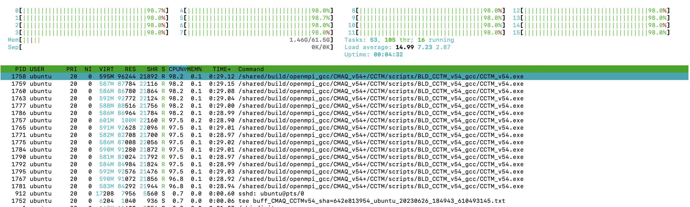
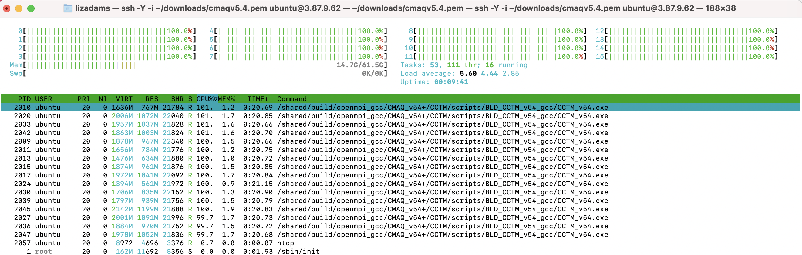

## Run CMAQv5.4 on c6a.8xlarge

### Obtain IP address 

Obtain IP address from AWS Web Console or use the following AWS CLI command to obtain the public IP address of the machine.

`aws ec2 describe-instances --region=us-east-1 --filters "Name=image-id,Values=ami-051ba52c157e4070c" | grep PublicIpAddress`

### Login to the ec2 instance 

(may need to wait 5 minutes for the ec2 instance to initialize and be ready for login)

Note, the following command must be modified to specify your key, and ip address (obtained from the previous command):

`ssh -v -Y -i ~/downloads/your-pem.pem ubuntu@ip.address`


### Login to the ec2 instance again

so that you have two windows logged into the machine.

`ssh -Y -i ~/your-pem.pem ubuntu@your-ip-address` 


### Load the environment modules

`module avail`

`module load ioapi-3.2/gcc-11.3.0-netcdf  mpi/openmpi-4.1.2  netcdf-4.8.1/gcc-11.3 `

### Update the pcluster-cmaq repo using git

`cd /shared/pcluster-cmaq`

`git pull`

### Verify that the input data is available

Input Data for the smallest benchmark

`ls -lrt /shared/data/12US1_LISTOS/*`

Input Data for the 12NE3 benchmark

`ls -lrt /shared/data/2018_12NE3/*`


### Run CMAQv5.4 for 12US1 Listos Training 3 Day benchmark Case on 32 pe

Input data is available for a subdomain of the 12km 12US1 case.

```
GRIDDESC

'2018_12Listos'
'LamCon_40N_97W'   1812000.000    240000.000     12000.000     12000.000   25   25    1
```

### Edit the run script to run on 16 cores 

```
cd /shared/build/openmpi_gcc/CMAQ_v54+/CCTM/scripts
cp run_cctm_2018_12US1_listos_32pe.csh run_cctm_2018_12US1_listos_16pe.csh
```

change NPCOLxNPROW to 4x4


### Use command line to submit the job. 

This single virtual machine does not have a job scheduler such as slurm installed.


```
cd /shared/build/openmpi_gcc/CMAQ_v54+/CCTM/scripts
./run_cctm_2018_12US1_listos_16pe.csh | & tee ./run_cctm_2018_12US1_listos_16pe.c6a.8xlarge.log
```

### Use HTOP to view performance.

`htop`

output




### Successful output

```
==================================
  ***** CMAQ TIMING REPORT *****
==================================
Start Day: 2018-08-05
End Day:   2018-08-07
Number of Simulation Days: 3
Domain Name:               2018_12Listos
Number of Grid Cells:      21875  (ROW x COL x LAY)
Number of Layers:          35
Number of Processes:       16
   All times are in seconds.

Num  Day        Wall Time
01   2018-08-05   67.1
02   2018-08-06   58.9
03   2018-08-07   60.9
     Total Time = 186.90
      Avg. Time = 62.30

```

The c6a.8xlarge also has 16 cpus and larger cache sizes than the c6a.2xlarge (4 cores), which you can see when you compare output of the lscpu command.


### Change to the scripts directory

`cd /shared/build/openmpi_gcc/CMAQ_v54+/CCTM/scripts/`

### Use lscpu to confirm that there are 16 cores on the c6a.8xlarge ec2 instance that was created with hyperthreading turned off.

`lscpu`

Output:

```
Architecture:            x86_64
  CPU op-mode(s):        32-bit, 64-bit
  Address sizes:         48 bits physical, 48 bits virtual
  Byte Order:            Little Endian
CPU(s):                  16
  On-line CPU(s) list:   0-15
Vendor ID:               AuthenticAMD
  Model name:            AMD EPYC 7R13 Processor
    CPU family:          25
    Model:               1
    Thread(s) per core:  1
    Core(s) per socket:  16
    Socket(s):           1
    Stepping:            1
    BogoMIPS:            5299.99
    Flags:               fpu vme de pse tsc msr pae mce cx8 apic sep mtrr pge mca cmov pat pse36 clflush mmx fxsr sse sse2 ht syscall nx mmxext fxsr_opt p
                         dpe1gb rdtscp lm constant_tsc rep_good nopl nonstop_tsc cpuid extd_apicid aperfmperf tsc_known_freq pni pclmulqdq ssse3 fma cx16 
                         pcid sse4_1 sse4_2 x2apic movbe popcnt aes xsave avx f16c rdrand hypervisor lahf_lm cmp_legacy cr8_legacy abm sse4a misalignsse 3
                         dnowprefetch topoext invpcid_single ssbd ibrs ibpb stibp vmmcall fsgsbase bmi1 avx2 smep bmi2 invpcid rdseed adx smap clflushopt 
                         clwb sha_ni xsaveopt xsavec xgetbv1 clzero xsaveerptr rdpru wbnoinvd arat npt nrip_save vaes vpclmulqdq rdpid
Virtualization features: 
  Hypervisor vendor:     KVM
  Virtualization type:   full
Caches (sum of all):     
  L1d:                   512 KiB (16 instances)
  L1i:                   512 KiB (16 instances)
  L2:                    8 MiB (16 instances)
  L3:                    64 MiB (2 instances)
NUMA:                    
  NUMA node(s):          2
  NUMA node0 CPU(s):     0-7
  NUMA node1 CPU(s):     8-15
Vulnerabilities:         
  Itlb multihit:         Not affected
  L1tf:                  Not affected
  Mds:                   Not affected
  Meltdown:              Not affected
  Mmio stale data:       Not affected
  Retbleed:              Not affected
  Spec store bypass:     Mitigation; Speculative Store Bypass disabled via prctl
  Spectre v1:            Mitigation; usercopy/swapgs barriers and __user pointer sanitization
  Spectre v2:            Mitigation; Retpolines, IBPB conditional, IBRS_FW, RSB filling, PBRSB-eIBRS Not affected
  Srbds:                 Not affected
  Tsx async abort:       Not affected

```


### Edit the 12US3 Benchmark run script to use the gcc compiler and to output all species to CONC output file.

`cd /shared/build/openmpi_gcc/CMAQ_v54+/CCTM/scripts/`

`cp  run_cctm_Bench_2018_12NE3.c6a.2xlarge.csh run_cctm_Bench_2018_12NE3.c6a.8xlarge.csh`


Change the NPCOL, NPROW to run on 16 cores

```
   @ NPCOL  =  4; @ NPROW =  4
```


### Run the 12US3 Benchmark case 

```
./run_cctm_Bench_2018_12NE3.c6a.8xlarge.csh |& tee ./run_cctm_Bench_2018_12NE3.c6a.8xlarge.16pe.log
```

### Use HTOP to view performance.

`htop`

output




Note, this 12NE3 Domain uses more memory, and takes longer than the 12LISTOS-Training Domain.
It also takes longer to run using 16 cores on c6a.8xlarge instance than on 32 cores on c6a.48xlarge instance.

### Successful output for 222 variables output in the 3-D CONC file took 16.4 minutes to run 1 day

```
==================================
  ***** CMAQ TIMING REPORT *****
==================================
Start Day: 2018-07-01
End Day:   2018-07-01
Number of Simulation Days: 1
Domain Name:               2018_12NE3
Number of Grid Cells:      367500  (ROW x COL x LAY)
Number of Layers:          35
Number of Processes:       16
   All times are in seconds.

Num  Day        Wall Time
01   2018-07-01   986.60
     Total Time = 986.60
      Avg. Time = 986.60


```

Compared to the timing for running on 32 processors, which took 444.34 seconds, this is a factor of 2.2 scalability of adding 2x as many cores.

### Find the InstanceID using the following command on your local machine.

`aws ec2 describe-instances --region=us-east-1 | grep InstanceId`

Output

i-xxxx

### Stop the instance

`aws ec2 stop-instances --region=us-east-1 --instance-ids i-xxxx`


Get the following error message.

aws ec2 stop-instances --region=us-east-1 --instance-ids i-041a702cc9f7f7b5d

An error occurred (UnsupportedOperation) when calling the StopInstances operation: You can't stop the Spot Instance 'i-041a702cc9f7f7b5d' because it is associated with a one-time Spot Instance request. You can only stop Spot Instances associated with persistent Spot Instance requests.


Note sure how to do a persistent spot instance request .
### Terminate Instance

`aws ec2 terminate-instances --region=us-east-1 --instance-ids i-xxxx`

### Verify that the instance is being shut down.

`aws ec2 describe-instances --region=us-east-1`
