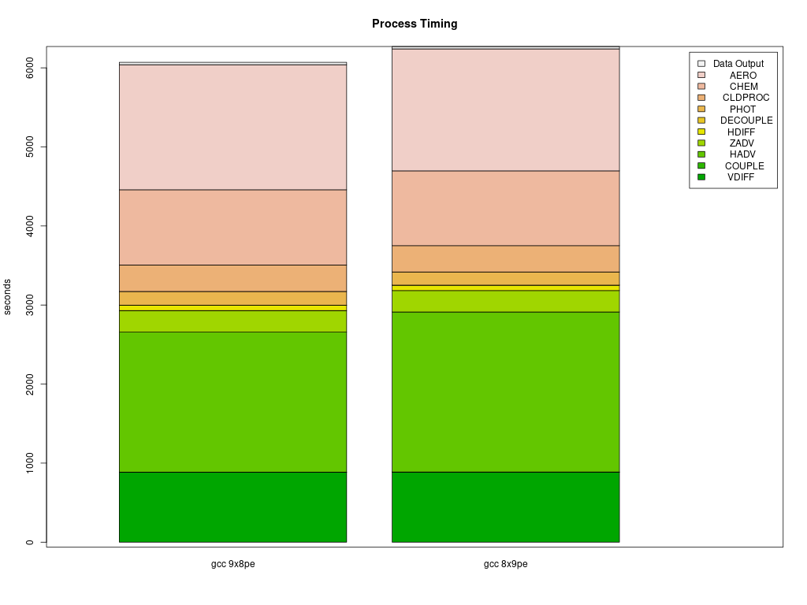

# Parse timings from the log file 

## Compare the timings for the CONUS Parallel Cluster Runs

```{note}
Parallel Cluster Configurations can impact the model run times.
```

It is up the the user, as to what model run configurations are used to run CMAQ on the Parallel Cluster.
The following configurations may impact the run time of the model.

* Using different PE configurations, using DisableSimultaneousMultithreading: true in yaml file, using 36 cpus - no virtual cpus
         
         NPCOL x NPROW  , CPU   , SBATCH Command  
   - [ ] 10x18 , 180  ,    #SBATCH --nodes=5, #SBATCH --ntasks-per-node=36
   - [ ] 16x16,  256  ,    #SBATCH --nodes=8, #SBATCH --ntasks-per-node=32
   - [ ] 16x18,  288  ,    #SBATCH --nodes=8, #SBATCH --ntasks-per-node=36

* Using different compute nodes   

   - [ ] c5n.18xlarge  (72 virtual cpus, 36 cpus) - with Elastic Fabric Adapter
   - [ ] c5n.9xlarge   (36 virtual cpus, 18 cpus) - with Eleastic Fabric Adapter
   - [ ] c5n.4xlarge   (16 virtual cpus, 4 cpus) - without Elastic Fabric Adapter

* With and without SBATCH --exclusive option

* With and without Elastic Fabric and Elastic Network Adapter turned on

* With and without network placement turned on

* Using different local storage options and copying versus importing data to lustre

   - [ ] input data imported from S3 bucket to lustre
   - [ ] input data copied from S3 bucket to lustre
   - [ ] input data copied from S3 bucket to an EBS volume

* Using different yaml settings for slurm  

   - [ ] DisableSimultaneousMultithreading= true
   - [ ] DisableSimultaneousMultithreading= false

## Edit the R script 

First check to see what log files are available:

`ls -lrt /shared/build/openmpi_gcc/CMAQ_v533/CCTM/scripts/*.log`


Modify the name of the log file to match what is avaible on your system.

cd /shared/pcluster-cmaq/qa_scripts
`vi parse_timing_pcluster.r`

Edit the following section of the script to specify the log file names available on your Parallel Cluster

```
sens.dir  <- '/shared/build/openmpi_gcc/CMAQ_v533/CCTM/scripts/'
base.dir  <- '/shared/build/openmpi_gcc/CMAQ_v533/CCTM/scripts/'
files     <- dir(sens.dir, pattern ='run_cctmv5.3.3_Bench_2016_12US2.108.12x9pe.2day.pcluster.log' )
b.files <- dir(base.dir,pattern='run_cctmv5.3.3_Bench_2016_12US2.108.6x18pe.2day.pcluster.log')
#Compilers <- c('intel','gcc','pgi')
Compilers <- c('gcc')
# name of the base case timing. I am using the current master branch from the CMAQ_Dev repository.
# The project directory name is used for the sensitivity case.
base.name <- '12x9pe'
sens.name <- '6x18pe'
```


### Run parse_timing.r script to examine timings of each science process in CMAQ

```
Rscript parse_timing.r
```

Timing Plot Comparing GCC run on 16 x 8 pe versus 8 x 16 pe


Timing Plot Comparing GCC run on 8 x 8 pe versus 8 x 16 pe


Timing Plot Comparing GCC run on 9 x 8 pe versus 8 x 9 pe


